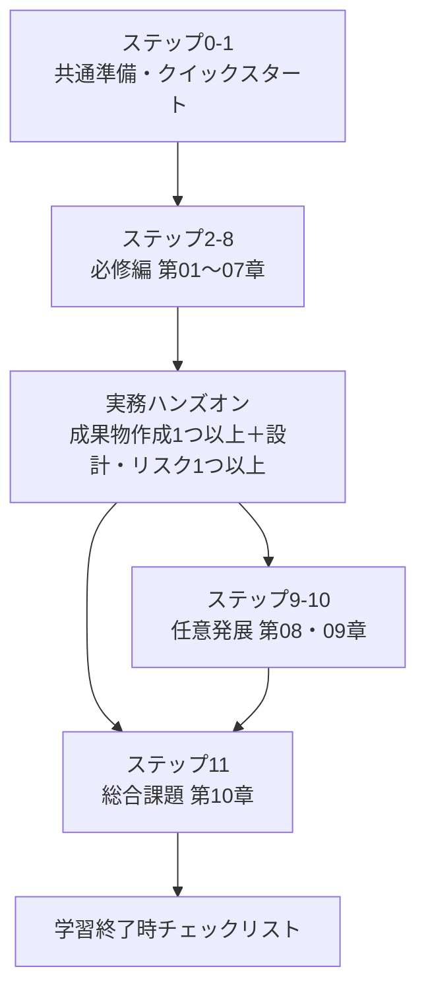

# AI学習リポジトリ

このリポジトリは、日本語の自習用教材 **「AI業務効率化 自習教材」** を管理する作業用リポジトリです。教材の本体は [ai-business-efficiency-instructor-content/](ai-business-efficiency-instructor-content/) 配下にあります。

## 学習を始める人へ

> **[▶ 学習を始める（START_HERE）](ai-business-efficiency-instructor-content/START_HERE.md)**
>
> 学習順序、必要ファイル、完了条件はこの1ページに集約されています。Gitやプログラミングの知識は不要です。

| 目的 | 開くファイル |
|---|---|
| 教材の概要を知る | [教材README](ai-business-efficiency-instructor-content/README.md) |
| 学習順序と完了条件を確認する | [START_HERE](ai-business-efficiency-instructor-content/START_HERE.md) |
| 利用環境を準備する | [セットアップガイド](ai-business-efficiency-instructor-content/setup/README.md) |
| 実務演習を選ぶ | [実務ハンズオン演習ガイド](ai-business-efficiency-instructor-content/exercises/README.md) |
| 用語を調べる | [用語集](ai-business-efficiency-instructor-content/glossary.md) |
| 操作で困った | [トラブル対応](ai-business-efficiency-instructor-content/TROUBLESHOOTING.md) |

> [!CAUTION]
> 演習では、教材に収録した完全な架空データだけを使います。実在する個人情報、機密情報、社内文書、パスワード、APIキー、実際のAI入出力を、AIやGitHubへ入力・投稿しないでください。AI出力の最終確認と利用判断は人が行います。

## 学習の全体像



- **基礎・実務活用**を目指す場合：準備 → 第01〜07章 → 実務ハンズオン → 第10章
- **全編**を目指す場合：上記に第08・09章を追加

各ページの冒頭と末尾には、`学習マップ ｜ 区分 ｜ ステップ N / 11` の形式で現在地と前後リンクを表示しています。迷ったら、そこから [START_HERE](ai-business-efficiency-instructor-content/START_HERE.md) へ戻れます。

## このリポジトリの構成

| パス | 内容 |
|---|---|
| [ai-business-efficiency-instructor-content/](ai-business-efficiency-instructor-content/) | 教材一式（Markdown 105ファイル） |
| `└ 01〜10_*.md` | 本編10章（必修7章＋任意発展2章＋総合課題1章） |
| `└ exercises/` | 実務演習8本 |
| `└ self-check/` | 章・演習に対応する自己点検18本 |
| `└ sample-data/` | 完全な架空の元資料 |
| `└ sample-outputs/` | 誤りを含むAI出力の問題例（比較・誤り発見用） |
| `└ workbooks/` `templates/` | 記入シートとひな形 |
| `└ setup/` | 利用環境の準備ガイド |
| `└ scripts/validate_content.ps1` | 教材の構造・リンク・安全表現を検査するスクリプト |

## 教材の検査を実行する

リンク切れ、見出し階層、表の列数、UTF-8、必須ファイル、章と自己点検の相互リンクなどを一括検査します。

```powershell
powershell.exe -NoProfile -ExecutionPolicy Bypass -File .\ai-business-efficiency-instructor-content\scripts\validate_content.ps1
```

GitHub Actions（[validate-content.yml](ai-business-efficiency-instructor-content/.github/workflows/validate-content.yml)）でも、Windows PowerShell 5.1 と PowerShell 7 の両方で自動実行されます。

## 公開用リポジトリとして切り出す場合

現在、教材はこの作業用リポジトリのサブフォルダーにあります。単独の公開リポジトリにするときは、**教材フォルダーごとではなく、その中身を公開リポジトリの最上位へ置きます**。そうすると GitHub のトップに教材のREADMEが表示され、相対リンクとGitHub Actionsもそのまま機能します。

```bash
# 例：教材の中身だけを新しいリポジトリの最上位へ置く
git clone <このリポジトリ> tmp
cp -r tmp/ai-business-efficiency-instructor-content/. <新リポジトリ>/
```

> [!IMPORTANT]
> 初回の公開・Release・外部利用の前に、著作権者、公開権限、共同著作、勤務先・委託契約、第三者素材、許諾窓口を確認し、必要な法務・知財担当者または専門家の確認を完了してください。詳細は [LICENSE](ai-business-efficiency-instructor-content/LICENSE)、[ライセンス選択ガイド](ai-business-efficiency-instructor-content/LICENSE_GUIDE.md)、[権利・出典に関する注意](ai-business-efficiency-instructor-content/NOTICE.md) を確認してください。

## ライセンス

閲覧、個人の自己学習、限定的な非公開の組織内検討を認め、それ以外の利用には事前許可を求める保守的な条件です。全文は [LICENSE](ai-business-efficiency-instructor-content/LICENSE) を確認してください。
