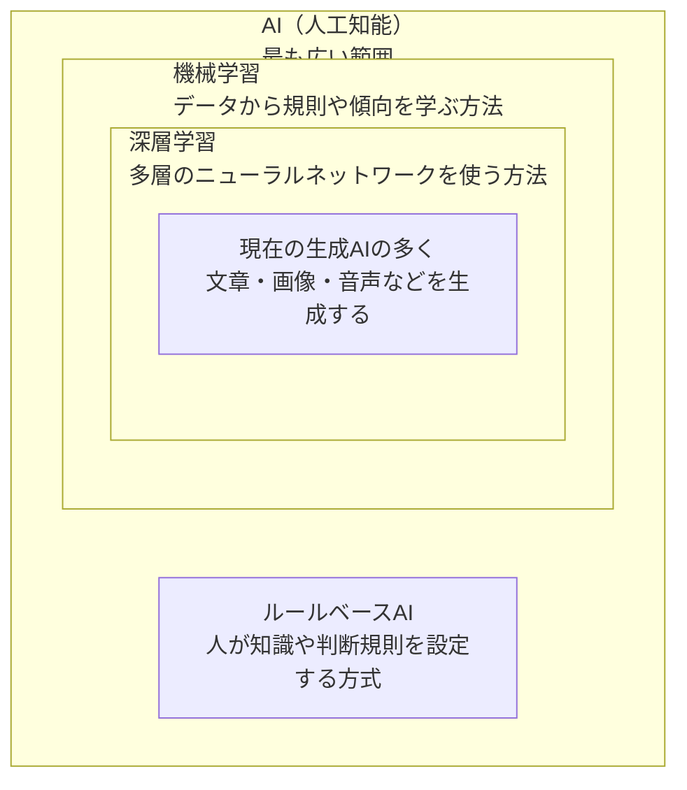
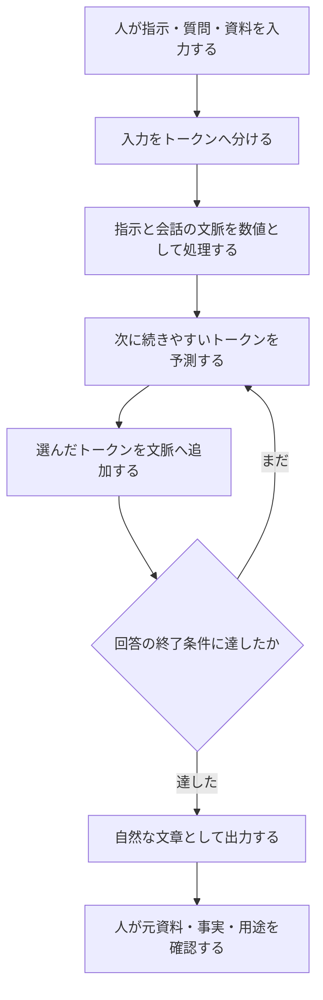
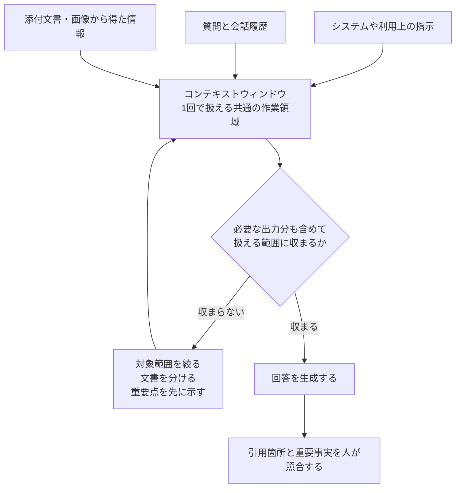
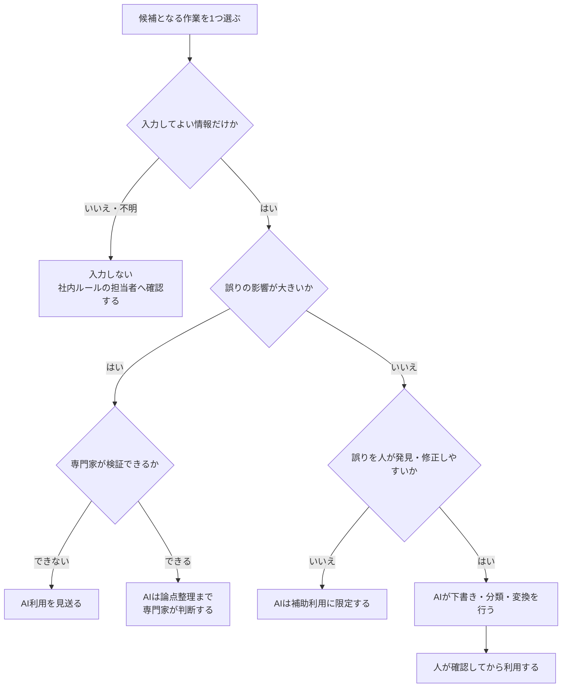
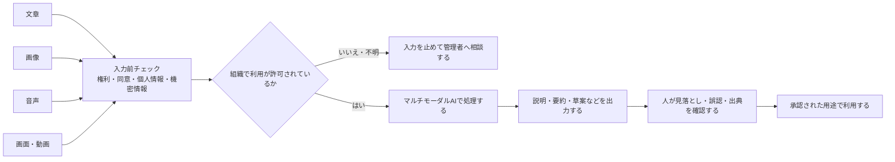

# 01 生成AIの基礎

## 1. この章の目的

生成AIの基本用語と限界を初心者に説明できるようにします。仕組みを知る目的は、技術者になることではなく、過信と過度な恐れを避け、適切な業務を選ぶことです。

## 2. 学習ゴール

- AI、機械学習、深層学習、生成AIの関係を説明できる
- LLM（Large Language Model、大規模言語モデル）、トークン（文章を処理する小さな単位）、コンテキストウィンドウ（1回で参照できる範囲）を日常的な言葉で説明できる
- 得意・苦手を踏まえて、人間レビュー（人が元資料と照合して確認する作業）の必要性を説明できる
- マルチモーダルAI（文章、画像、音声など複数種類の情報を扱うAI）の用途と入力リスクを説明できる

## 3. 本編解説

この章で初めて出てくる用語は、[用語集](glossary.md)の30秒説明も併用してください。本文では、図や演習で使う前に中心語を短く説明します。

### 3.1 AI、機械学習、深層学習、生成AIの違い

| 用語 | 簡単な説明 | 例 | 関係 |
|---|---|---|---|
| AI（Artificial Intelligence、人工知能） | 人の知的作業の一部をコンピューターで実現する広い概念 | 推薦、画像認識、対話 | 最も広い範囲 |
| 機械学習 | データから規則や傾向を学ぶ方法 | 迷惑メール分類、需要予測 | AIを実現する方法の一つ |
| 深層学習 | 多層のニューラルネットワークを使う機械学習 | 音声認識、画像生成 | 機械学習の一種 |
| 生成AI | 学習したパターンを基に新しい文章、画像、音声などを作るAI | メール下書き、画像案 | 深層学習を多く利用 |

**モデル**とは、学習した規則を使って入力から出力を作る仕組みです。数式で表された仕組みを**数理モデル**と呼びます。

**ニューラルネットワーク**は、入力を複数段階で変換しながら特徴や関係を学ぶ計算の仕組みです。人間の脳そのものではなく、脳の仕組みから着想を得た数理モデルです。

包含関係で見ると、AIという最も広い枠の中に機械学習があり、その中に深層学習があります。一方、生成AIは「新しい内容を作る」という用途による分類であり、機械学習や深層学習とは分類の軸が少し異なります。現在の生成AIの多くは深層学習を利用しているため、本教材ではその代表的な関係を図示します。

**ルールベース**とは、人があらかじめ決めた「もしこの条件なら、この処理をする」という規則で動く方式です。

#### 図1-1：AI・機械学習・深層学習・生成AIの関係

**図の見方**：矢印ではなく、枠の入れ子で分類の範囲を表しています。外側の枠ほど広い概念です。機械学習はAIの一部、深層学習は機械学習の一部です。ルールベースAIはAIに含まれますが、機械学習には含まれません。左右や上下の位置は、処理順や優劣を表しません。

**講師向け説明ポイント**：まず外枠から内枠へ指し示し、「枠の中にあるものは、その外側の分類に含まれる」と説明します。生成AIは生成用途による呼び方であり、すべてを深層学習だけで厳密に分類する図ではありません。また、単純な業務上の条件分岐は通常のルール処理・自動化と呼ぶことも多く、すべての「もし〜なら〜」処理をAIと呼ぶわけではないと補足します。「AI＝生成AI」という誤解を解くことを優先します。

### 3.2 LLMとは何か

**LLM（Large Language Model、大規模言語モデル）**は、大量の文章などから言葉の並び方を学び、与えられた文脈に続く内容を生成するモデルです。質問への回答、要約、分類、翻訳、草案作成などに使われます。

LLMは人間のように事実を「理解して保証」しているわけではありません。もっともらしい言葉の並びを作れるため、正しい回答と自然な誤答の両方を生成します。

このように、AIがもっともらしい誤情報や存在しない出典を作ることを**ハルシネーション**と呼びます。詳しい確認方法は[06 ハルシネーションとファクトチェック](06_hallucination_and_fact_checking.md)で扱います。

この図でいう**トークン**とは、AIが文章を処理する小さな単位です。詳しくは次の節で説明します。

#### 図1-2：LLMが回答を組み立てる基本イメージ

**図の見方**：LLMは回答全体を最初から取り出すのではなく、文脈を使って次の小さな単位を順に選び、文章を組み立てます。

**講師向け説明ポイント**：「予測しているから必ず誤る」「理解が一切ない」と単純化せず、業務上重要なのは出力が事実を保証しない点だと説明します。最終ノードの人間確認を省かないでください。

### 3.3 トークンとは何か

**トークン**は、AIが文章を処理するときの小さな単位です。単語、単語の一部、記号などに分かれます。日本語の1文字が常に1トークンになるわけではありません。

| 業務への影響 | 説明 |
|---|---|
| 入出力量 | 長い資料ほど多くのトークンを使う |
| 料金 | API（Application Programming Interface、ソフトウェア同士の接続窓口）などではトークン量が料金に関係する場合がある |
| 制限 | 入力と出力を合計した上限がある |
| 設計 | 不要な全文貼付けより、対象範囲と目的を絞る方が扱いやすい |

正確な数え方や上限はモデルごとに変わるため、最新の公式仕様を確認します。

### 3.4 コンテキストウィンドウとは何か

**コンテキストウィンドウ**は、1回の処理でAIが参照できる入力、会話履歴、添付情報、生成内容などの範囲です。「作業机の広さ」にたとえられます。机が広くても、資料の矛盾、重要箇所の埋没、読み取り誤りは起こります。

長文を扱うときは、文書名、版、対象範囲、質問、引用条件を明示し、重要事項を別途検証します。「入った」ことと「正しく使えた」ことは別です。

#### 図1-3：トークンとコンテキストウィンドウの関係

**図の見方**：質問だけでなく、会話履歴や資料、生成する回答も有限の作業領域を使います。長すぎる場合は、情報を無理に詰め込まず整理し直します。

**講師向け説明ポイント**：上限値は製品・モデル・プランで変わるため暗記させず、最新の公式情報を確認させます。範囲内に収まることは、全情報を正確に使える保証ではありません。

### 3.5 得意なこと、苦手なこと

| 比較的得意 | 条件 | 苦手・危険 | 対策 |
|---|---|---|---|
| 草案、言い換え | 目的と読者が明確 | 事実の保証 | 出典と原文を人が確認 |
| 要約、分類 | 元資料が与えられる | 曖昧な指示の解釈 | 不明点を質問させる |
| アイデア出し | 評価基準がある | 最新情報の網羅 | 公式の一次情報（公式発表や原資料など、発信元に近い情報）で確認 |
| 形式変換 | 項目定義がある | 厳密な計算、件数保証 | 計算ツールと照合 |
| 反復的な文章処理 | 例と基準がある | 法律・医療・金融の最終判断 | 専門家承認を必須にする |

AIに向くのは「失敗しても検出・修正できる下書き作業」です。影響が大きく、誤りを見抜きにくい仕事ほど、人の専門判断を厚くします。

#### 図1-4：AIへ任せる深さを決める判断フロー

**図の見方**：作業名だけで決めず、入力可否、誤りの影響、誤りを見つけられるかの順で、AIの担当範囲を狭めたり広げたりします。

**講師向け説明ポイント**：「AIに向く／向かない」の二択ではなく、下書き・補助・人の判断という段階で考えさせます。法律、医療、金融などの高リスク領域は、組織ルールと専門家確認を必須にします。

### 3.6 マルチモーダルAIとは何か

**マルチモーダルAI**は、文章だけでなく、画像、音声、動画など複数種類の情報を扱うAIです。

**アクセス権**とは、誰がどの情報を閲覧、編集、利用できるかを決める許可です。**FAQ（Frequently Asked Questions、よくある質問と回答）**は、利用者から繰り返し寄せられる質問と回答をまとめたものです。

| 入力 | 活用例 | 注意点 |
|---|---|---|
| 画像 | 図表の説明、デザイン案 | 顔、名札、画面内の個人・機密情報 |
| 音声 | 会議の文字起こし、要約 | 録音同意、話者誤認、保存場所 |
| 文書 | 規程の比較、FAQ案 | 古い版、アクセス権、引用漏れ |
| 画面・動画 | 操作手順案 | パスワードや通知の映り込み |

入力の種類が増えるほど便利になりますが、漏えい経路と誤認の種類も増えます。

#### 図1-5：マルチモーダルAIの入力から利用まで

**図の見方**：どの形式でも、AIへ渡す前の確認と、出力後の人間確認が必要です。画像や音声では、本文以外に映り込んだ情報にも注意します。

**講師向け説明ポイント**：デモでは安全な架空データを使います。録音同意、顔や名札、画面通知、文書の版と共有権限など、形式ごとに異なる確認点を受講者から挙げてもらいます。

### 3.7 企業で注目される理由

**自然言語**とは、日本語や英語など、人が普段の会話や文章で使う言葉です。

- 多くの職種に共通する「読む・書く・整理する」を支援できる
- 専門的な操作を自然言語で依頼でき、試行を始めやすい
- 既存の文書、会議、問い合わせ業務に組み込みやすい
- 個人の時短だけでなく、標準化、検索性、引継ぎ改善につながる可能性がある

ただし、導入効果は自動的には出ません。対象業務、品質基準、データ、責任、測定方法を設計して初めて業務改善になります。

AIツールの仕様は変わるため、導入後も公式情報、契約、設定、出力品質を定期的に再確認します。

## 4. 実務での使いどころ

| 業務 | AIの役割 | 人間の役割 |
|---|---|---|
| メール | 下書き、トーン調整 | 事実、宛先、約束、送信判断 |
| 会議 | 文字起こし、論点整理 | 同意取得、決定事項、担当確認 |
| 報告 | 構成、要約 | 数値、原因、経営判断 |
| 教材 | 説明案、問題案 | 正確性、難易度、権利、安全性 |

## 5. 講師メモ

- 「AIは検索エンジン」「AIは何でも知る人」という誤解を最初に修正します。
- 次の単語を当てる仕組みという説明は入口として使い、実際のモデルは複雑であることも補足します。
- デモでは、同じ質問の出力が変わる例と、自然だが誤った回答例を用意します。
- 製品ごとのトークン上限を暗記させず、「公式仕様を確認する習慣」を観察します。

## 6. 演習

### 演習1：初心者向け言い換え

#### 利用環境の準備確認

- 基本ツールはChatGPTです。[対話AIアカウント準備ガイド](setup/chat_ai_account_setup.md)で利用環境とデータ設定を確認します。
- 企業研修では個人登録を強制せず、管理者が発行・招待した業務用アカウントを使います。利用できない受講者には講師が用意した架空のAI出力を配布します。
- 個人学習では個人アカウントを利用できますが、登録前に公式の利用条件を確認し、入力は教材内の架空データに限定します。

#### ガイド付き練習

講師が「トークン」を例に、難しい説明から「定義・身近な例・注意点」の3文へ言い換えます。その後、ChatGPTへ改善案を出させ、本文の定義と一致する箇所・ずれる箇所を一緒に確認します。

#### 実務演習

LLM、トークン、コンテキストウィンドウ、マルチモーダル、ハルシネーションを、それぞれ「定義・例・注意点」の3文で説明します。専門用語を別の専門用語で説明しないようChatGPTへ制約を伝えます。

#### 人間レビュー

ペアで本文と照合し、「定義が正しいか」「例が日常業務に近いか」「注意点に人間確認があるか」を確認します。AIが加えた仕様値や製品固有情報は、公式情報を確認できなければ削除します。

#### 振り返り

- AI案のどこを人が直しましたか。
- 例えによって誤解が生じそうな箇所はありますか。
- 初心者から質問されたら、どの図を使って補足しますか。

**完成条件**：5用語すべてに平易な定義、身近な例、限界または注意点があり、本文と人が照合していること。

### 演習2：向き・不向き分類

#### 利用環境の準備確認

- ChatGPTと、教材の架空ケースだけを使います。前の演習と別の日に行う場合は、アカウント種別、組織承認、入力禁止情報を改めて確認します。
- 企業研修では管理者発行アカウントを使い、利用できない場合は紙の分類カードへ切り替えます。個人学習では個人アカウントのデータ設定を確認します。

#### ガイド付き練習

「架空の社内イベント案内文」を例に、データの機密性、誤りの影響、検出可能性、人間の責任という判断軸で分類します。ChatGPTには分類候補と理由を出させ、講師が最終判断との違いを示します。

#### 実務演習

次を「AIに下書きを任せる」「補助利用のみ」「原則として人が判断」に分類し、理由、確認者、停止条件を書きます。

1. 架空の社内イベント案内文
2. 未公開決算数値の分析
3. 公開済み製品FAQの分類
4. 患者への治療方針の決定
5. 会議メモから決定事項候補を抽出

#### 人間レビュー

別の受講者が反対の立場からリスクを指摘します。未公開決算、医療、外部公開など高影響のケースは、組織の担当者または専門家へ引き継ぐ境界を確認します。

#### 振り返り

- ChatGPTの分類と自分の分類が違ったケースはどれですか。
- 判断を変えた追加情報は何ですか。
- 「AIを使わない」という選択が適切なケースはどれですか。

**完成条件**：業務名だけで決めず、機密性、影響、検出可能性、確認者、停止条件で説明していること。

### 演習の観察と改善

| 完成条件 | 観察ポイント | 改善ポイント |
|---|---|---|
| AIの説明と人の判断を分けている | AI案を正解として写していないか | 本文・公式情報との照合欄を追加する |
| 架空データだけを使っている | 実在情報へ置き換えていないか | 紙上版や講師配布出力へ切り替える |
| 高影響判断の責任者が明確である | 「人が確認」で止まり、担当が曖昧でないか | 部門・役割・相談条件を具体化する |

## 7. 実務チェックリストと振り返り

この節は採点に使いません。説明や業務判断の準備状況を自分で確かめます。

- [ ] AI、機械学習、深層学習、生成AIの関係を図を使って説明できる
- [ ] LLMの自然な回答が事実保証ではない理由を説明できる
- [ ] トークンとコンテキストウィンドウを、固定の仕様値に頼らず説明できる
- [ ] マルチモーダル入力では、画面への映り込み、録音同意、権利も確認している
- [ ] 高影響判断をAIへ任せず、人の確認者と専門家への相談先を決めている

**振り返り**：初心者が最も誤解しそうな概念を1つ選び、どの例・図・注意点で説明するかを書いてください。

## 8. まとめ

生成AIは、文章などのパターンを基に新しい内容を作る強力な補助技術です。得意なのは草案・整理・変換であり、事実保証や高リスク判断ではありません。講師は便利さと限界を同じ重さで伝えます。
