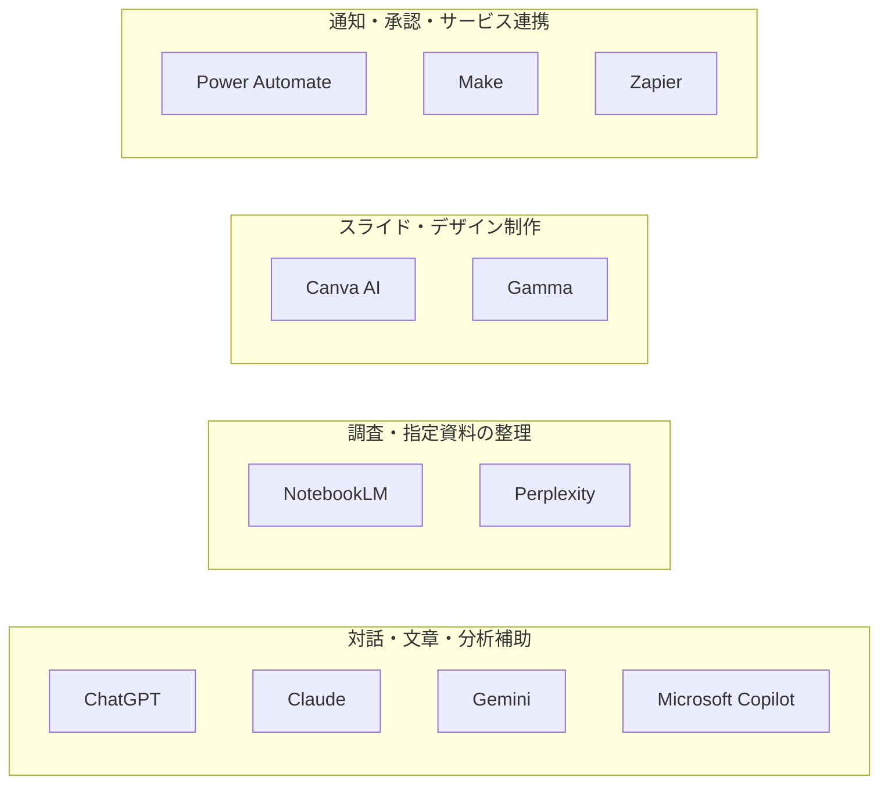

# 02 AIツールの用途と使い分け

## 1. この章の目的

製品名の人気ではなく、業務目的、扱う情報、必要な連携、組織が利用者・権限・承認・記録を管理する条件（**統制条件**）からツール候補を選べるようにします。

## 2. 学習ゴール

- 11種類のAI・自動化ツールの一般的な用途を説明できる
- 会話AI（チャット形式で指示や質問を受け、回答や文章を作るAI）、調査、資料作成、自動化の違いを整理できる
- 業務別に候補を絞り、PoC（Proof of Concept、概念実証：本格導入前に小さな範囲で確かめる検証）の評価軸と停止・見直し条件を作れる
- 契約、設定、データ取扱いを公式情報で確認できる

## 3. 本編解説

専門用語の短い説明は[用語集](glossary.md)でも確認できます。この章では、製品固有の名称と、複数製品に共通する技術用語を区別して説明します。

### 3.1 比較前の注意

以下は選定の入口であり、機能一覧や優劣の固定評価ではありません。**2026年8月2日時点の一般的な製品カテゴリ**を基にしています。名称、プラン、機能、料金、対応地域、データ利用条件は変わるため、研修実施時と導入時に各社の最新公式情報と契約を確認してください。

初心者が11製品の機能を暗記する必要はありません。まず「対話・調査・資料作成・自動化」の4カテゴリと、目的・データ・統制・連携・費用・継続性という選定軸を使えることを目標にします。

#### 図2-1：11ツールを4つの主な用途で捉える



**図の見方**：4つの枠は、11ツールを主な用途で整理した分類です。枠の左右や製品の上下は、選定順、処理順、優劣を表しません。実際には複数用途にまたがる製品もあるため、ここでは代表的な用途の枠へ1回だけ配置しています。

**講師向け説明ポイント**：最初に4つの枠を用途の分類として説明し、矢印がないことを確認させます。その後、受講者の業務目的に近い枠から候補を探します。これは固定的な製品分類ではなく、機能、プラン、名称、データ条件は変わるため、研修や導入の直前に最新の公式情報と契約条件を確認させます。

### 3.2 ツール比較表

比較表に出てくる主な用語を先に確認します。

| 用語 | 初心者向けの意味 |
|---|---|
| **ワークスペース** | 組織やチーム単位で、利用者、設定、データを管理する領域 |
| **データ制御** | 入力や出力を保存、学習利用、共有できる範囲を設定・管理すること |
| **アクセス権** | 誰がどの情報や機能を閲覧、編集、利用できるかを決める許可 |
| **権限継承** | 元のシステムで設定された閲覧・編集の許可が、連携先でも引き継がれること |
| **ソース** | AIに読ませる元資料や、調査結果の出典 |
| **出典の一次性** | 公式発表や原資料など、情報が発信元にどれだけ近いか |
| **資料起点AI** | 利用者が指定した資料を主な根拠として、要約や回答を作るAI |
| **AI検索** | ウェブなどを検索し、AIが結果の整理や回答作成を支援する機能 |
| **ライセンス** | 素材では利用許諾、製品では機能を使う契約上の権利を指す言葉 |
| **ワークフロー** | 条件、処理順、承認者を決めて仕事を流す仕組み |
| **コネクタ** | 自動化ツールとメール、表計算、チャットなどのサービスを接続する部品 |
| **SaaS（Software as a Service、サービスとして提供されるソフトウェア）** | インターネット経由で利用するソフトウェアサービス |
| **データ経路** | データがどのサービスや保存場所を通るかという流れ |
| **エラー処理** | 失敗を検出し、通知、再試行、手動対応などへつなぐ仕組み |
| **ログ** | 誰が、いつ、何を入力、実行、承認したかの記録 |
| **監査** | 記録と実態を照合し、ルールどおりに運用されているか確かめる活動 |

| ツール | 主なカテゴリ | 検討しやすい用途 | 選定時の確認点 |
|---|---|---|---|
| ChatGPT | 汎用対話・生成AI | 文章、分析補助、画像・ファイルを含む対話 | ワークスペース管理、データ制御、利用可能機能 |
| Claude | 汎用対話・生成AI | 文書読解、文章作成、対話型の整理 | 管理機能、連携、利用上限、データ条件 |
| Gemini | 汎用対話・Google連携 | 文章・画像等の支援、Google環境での活用 | Workspace契約、管理設定、地域・機能差 |
| Microsoft Copilot | Microsoft製品連携 | Word、Excel、PowerPoint、Outlook、Teams周辺 | Microsoft 365契約、権限継承、監査設定 |
| NotebookLM | 資料起点の調査・整理 | 指定資料に基づく要約、質問、学習支援 | ソースの権利・機密性、引用精度、利用条件 |
| Perplexity | AI検索・調査 | ウェブ調査、出典候補の収集 | 出典の一次性、網羅性、企業向け管理条件 |
| Canva AI | デザイン制作支援 | バナー、画像、資料のデザイン案 | 素材ライセンス、ブランド管理、商用条件 |
| Gamma | プレゼン・文書生成 | 構成案からプレゼンやページを作る | 出力編集、ブランド適合、権利・共有設定 |
| Power Automate | ワークフロー自動化 | Microsoft環境の承認、通知、データ連携 | コネクタ、ライセンス、実行権限、監査 |
| Make | ビジュアル自動化（画面上で処理の流れを組む自動化） | 複数SaaSの柔軟な連携、分岐・変換 | データ経路、再実行、エラー処理、費用 |
| Zapier | SaaS自動化 | 多様なサービス間の定型連携 | 対応アプリ、実行回数、権限、エラー通知 |

「その製品なら安全」ではなく、**プラン、契約、管理設定、利用方法の組み合わせ**で判断します。

### 3.3 選定の6軸

| 軸 | 質問 | 失敗例 |
|---|---|---|
| 目的 | 何の品質・時間を改善するか | 多機能だから選ぶ |
| データ | 機密度、個人情報、保存要件は | 無料アカウントへ貼り付ける |
| 連携 | どのシステム・ファイルとつなぐか | コピー作業が増える |
| 統制 | 権限、ログ、管理者設定、承認は | 誰が何をしたか追えない |
| 総費用 | 利用料、構築、教育、運用、監査は | 月額だけで比較する |
| 継続性 | 障害時の代替、データ出力、契約終了時の移行は | サービス停止や値上げで業務が止まる |

入力禁止情報を安全に扱えない、必要な監査ログがないなどの条件は、他の長所で相殺できない**必須条件**として扱います。必須条件を満たした候補だけを、同じ架空データによるPoCで比較します。

### 3.4 業務別の候補整理

- **業務スイート**：文書、表計算、メール、会議など複数の業務機能をまとめた製品群
- **RAG（Retrieval-Augmented Generation、検索拡張生成）**：関係する資料を検索し、その抜粋をAIへ渡して回答させる仕組み
- **API（Application Programming Interface、ソフトウェア同士の接続窓口）**：決められた形式で、異なるソフトウェアが情報や機能をやり取りする仕組み

| 業務 | 第一候補のカテゴリ | 併用候補 | 人が必ず確認する点 |
|---|---|---|---|
| メール・文書草案 | 汎用対話AI／業務スイート連携 | テンプレート | 宛先、事実、約束、機密 |
| 社内資料の理解 | 資料起点AI／RAG | 汎用対話AI | 原文、版、アクセス権、引用 |
| 最新情報の調査 | AI検索＋通常検索 | 一次情報サイト | 発行主体、日付、原文 |
| スライド | プレゼン生成／デザインAI | 汎用対話AI | 構成、ブランド、画像権利 |
| 承認・通知 | ワークフロー自動化 | AIで分類・下書き | 実行条件、権限、誤送信 |
| 複数SaaS連携 | Make／Zapier等 | API | 保存先、失敗時処理、ログ |
| Microsoft中心の業務 | Copilot／Power Automate | 組織承認済みAI | 権限と共有範囲 |
| Google中心の業務 | Gemini／Workspace連携 | NotebookLM | 契約と共有範囲 |

### 3.5 選定手順

1. 業務成果を「月10時間削減」「一次回答の表現統一」のように定義する。
2. 入力データを公開・社内・機密・厳秘に分類する。
3. 必須機能、望ましい機能、不要な機能を分ける。
4. 2〜3候補を同じ架空データと観察シートで比較する。
5. セキュリティ・法務・情報システム部門の確認を受ける。
6. 小規模PoCで品質、時間、失敗、運用負荷（継続して使うために必要な手間）を測る。
7. 障害時の手動代替、データ移行（保存データを別の環境へ移すこと）、契約終了時の出口計画（データと業務を別の手段へ安全に移す計画）を確認する。
8. 採用・不採用の理由、停止条件、確認日を記録する。

PoCではAI出力を人が確認し、完成条件を満たした後も対象・権限・件数を限定して導入します。品質低下、規約変更、障害、費用増などを監視し、停止条件に該当したら処理を止めて手動へ戻せるようにします。

### 3.6 PoC（概念実証）とは

**PoC（Proof of Concept、概念実証）**とは、本格導入の前に対象業務、利用者、期間、データを限定し、「期待する効果があるか」「安全に運用できるか」を確かめる小規模な検証です。単にAIツールを触ってみることや、見栄えのよい出力を1件作ることとは異なります。

以下では、**FAQ（Frequently Asked Questions、よくある質問と回答）**の草案作成を例にします。**工数**とは、作業に必要な人の時間や労力です。

PoCでは、開始前に次を決めます。

| 項目 | 決める内容 | FAQ作成での例 |
|---|---|---|
| 検証する仮説 | 何が改善できると考えるか | FAQ草案の作成・確認時間を短縮できる |
| 対象範囲 | 業務、利用者、期間、件数 | 公開済み資料、担当者3名、2週間、架空質問20件 |
| 評価指標 | 時間、品質、安全性、運用負荷 | 引用一致率（回答の引用が元資料と一致した割合）、総作業時間、重大誤り、確認工数 |
| 完成条件 | 採用を検討する前に満たす条件 | 重大誤りがなく、根拠確認と人間レビューが機能する |
| 停止条件 | 直ちに検証を止める条件 | 権限外情報の表示、外部誤送信、入力禁止情報の混入 |
| 判定と責任者 | 誰が何を基に決めるか | 業務責任者と関係部門が採用・条件付き・不採用を判断 |

#### 操作練習・PoC・本番運用の違い

| 段階 | 主な目的 | データと範囲 | 結果の扱い |
|---|---|---|---|
| 操作練習 | 基本操作を覚える | 承認済みツールと完全な架空データ | 実業務へ反映しない |
| PoC | 効果、品質、安全性、運用可能性を検証する | 架空データ、または組織が正式に許可したデータで限定実施 | 人が全件確認し、採用判断の材料にする |
| 本番運用 | 継続的に業務成果を出す | 承認済みの対象・権限・手順 | ログ、監視、承認、停止、手動代替を運用する |

PoCが不採用で終わっても失敗とは限りません。「効果が小さい」「確認工数が増える」「必要な統制を実現できない」と本番導入前に分かること自体が成果です。用語の短い説明は[用語集](glossary.md)でも確認できます。

### 3.7 PoC観察シートの例

**中央値**とは、値を小さい順に並べたとき中央に位置する値です。極端に長い作業時間の影響を受けにくいため、PoCの結果を代表する数値として使う場合があります。

| 評価項目 | 完成条件 | 観察ポイント | 改善ポイント |
|---|---|---|---|
| 正確性 | 根拠資料と一致し、不明事項を作らない | 誤引用、重要条件の欠落、断定の有無 | 根拠列、未回答条件、確認担当を追加 |
| 作業時間 | Before／Afterの総時間と人の修正時間を記録する | 生成だけでなく確認・差戻しに要する手間 | 入力形式、確認表、対象範囲を見直す |
| 安全・統制 | 権限、ログ、保存、契約、停止条件を確認できる | 未承認入力や権限外表示がないか | 管理者設定、承認点、手動代替を追加 |
| 使いやすさ | 初心者が手順を完了し、迷った箇所を説明できる | 操作停止、質問、修正が発生した箇所 | 手順、用語、画面変更時の案内を改善 |
| 連携・運用 | エラーを検出し、人へ通知して復旧できる | 再試行、二重登録、誤送信、担当不明 | 件数上限、例外経路、ロールバックを設計 |
| 費用・継続性 | 導入・教育・運用・監査・移行の費用項目を把握する | 見落とした作業や契約依存 | 手動代替と契約終了時の出口計画を補う |

安全性や入力禁止情報は、他の長所で相殺しない必須条件です。数値による順位付けだけで採用を決めず、観察記録と責任者の判断を残します。

### 3.8 公式情報の確認先

[ChatGPT](https://openai.com/chatgpt/) / [Claude](https://claude.com/product/overview) / [Gemini for Workspace](https://workspace.google.com/solutions/ai/) / [Microsoft 365 Copilot](https://www.microsoft.com/microsoft-365/copilot/business) / [NotebookLM](https://notebooklm.google/) / [Perplexity](https://www.perplexity.ai/) / [Canva AI](https://www.canva.com/magic/) / [Gamma](https://gamma.app/) / [Power Automate](https://www.microsoft.com/power-platform/products/power-automate) / [Make](https://www.make.com/) / [Zapier](https://zapier.com/ai)

確認日：2026年8月2日。公式の製品紹介だけでなく、プライバシー、セキュリティ、利用規約、管理者向け文書も確認します。各製品の画面や機能は変わるため、この表をクリック手順の保証として使用しません。

## 4. 実務での使いどころ

- 部門のツール選定会議で比較表を作る
- 顧客の既存IT環境に合う研修デモを選ぶ
- PoCの完成条件と観察ポイントを事前に合意する
- 「個人向けで試せた」から「企業導入できる」への飛躍を防ぐ

## 5. 講師メモ

- ロゴ当てや人気投票にせず、同じ業務を6軸で比較させます。
- 「無料版対法人版」は安全・危険の二分法ではなく、契約・設定・管理機能の確認事項として扱います。
- 画面は頻繁に変わるため、クリック手順より選定原則を中心に教えます。
- 登壇前にデモ用アカウント、機能提供地域、利用上限を再確認します。

## 6. 演習

### 演習：同じFAQ課題を3つの対話AIで比較する

架空の「青葉サービス社」が、公開用マニュアルから問い合わせFAQ草案を作るケースです。基本ツールのChatGPTに加え、受講者が利用可能な2ツールを選びます。同じ入力、同じプロンプト、同じ人間レビュー基準で比較します。

#### 利用環境の準備確認

- ChatGPTは[対話AIアカウント準備ガイド](setup/chat_ai_account_setup.md)に従って準備します。Microsoft 365 Copilotを選ぶ場合は[Microsoft Copilot準備ガイド](setup/microsoft_copilot_setup.md)も確認します。
- 企業研修では個人登録を強制しません。管理者が発行・招待したアカウントから、ChatGPTと利用可能な2ツールを選びます。
- 個人学習では、本人が登録を判断した個人アカウントから2ツールを選びます。登録前に規約、データ設定、費用を最新公式情報で確認します。
- 利用可能なツールが足りない場合、講師が用意した架空の出力例または紙上比較へ切り替えます。比較のためだけに新規登録させません。
- 製品名、プラン、アカウント種別、確認日を記録します。

#### ガイド付き練習

ChatGPTへ次の架空マニュアルと質問1件を渡し、根拠列付きFAQを作ります。講師と一緒に、入力にある事実、入力にない事実、不明点を色分けします。

```text
【架空公開マニュアル】
- 申込締切は開催日の5営業日前です。
- 定員に達した場合は、締切前でも受付を終了します。
- キャンセルは開催日の2営業日前17時までに研修窓口へ連絡します。

【質問】申込みはいつまでですか。
```

#### 実務演習

1. FAQの完成条件を、根拠一致、未記載事項の扱い、読みやすさ、安全性で定義します。
2. ChatGPTと選んだ2ツールへ、同じ架空マニュアル、質問、プロンプトを渡します。
3. 「申込期限」「定員到達時」「キャンセル期限と方法」のFAQ草案を作ります。
4. 出力、引用または根拠、処理中に迷った点、修正内容を比較表へ記録します。
5. 採用候補、利用条件、停止条件、手動代替を文章でまとめます。

#### 人間レビュー

各回答を架空マニュアルへ1項目ずつ戻って照合します。製品が出典を表示しても、該当箇所、版、適用条件を人が確認します。表現の自然さだけで優劣を決めません。

#### 振り返り

- ツール間で異なったのは、事実、形式、質問の仕方のどれですか。
- 同じ入力でも比較条件がそろわなかった点はありますか。
- 実務採用前に、契約・設定・権限について誰へ確認しますか。

**完成条件**：3ツールを同条件で比較し、根拠照合、アカウント種別、データ条件、人間レビュー、停止条件、代替方法を記録していること。

### 演習の観察と改善

| 完成条件 | 観察ポイント | 改善ポイント |
|---|---|---|
| 同じ架空データと指示を使う | 一部ツールだけ追加資料や追加質問を使っていないか | 入力・対話回数・出力形式をそろえる |
| 製品ではなく業務要件で比較する | 好みや文章の自然さだけで選んでいないか | 目的、データ、統制、連携、費用、継続性へ戻す |
| 人が根拠と条件を確認する | 出典リンクの表示だけで確認済みにしていないか | 該当箇所・版・確認者を記録する |

## 7. 実務チェックリストと振り返り

この節は採点に使いません。ツール選定を実務へ持ち込む前の確認に使います。

- [ ] 業務目的と入力データを決めてからツール候補を選んだ
- [ ] 企業利用では管理者発行アカウントを使い、個人登録を前提にしていない
- [ ] 同じ架空データ、同じ指示、同じ観察ポイントで候補を比較した
- [ ] 契約、保存、学習利用、権限、ログ、連携先を最新公式情報で確認する担当を決めた
- [ ] 人間レビュー、停止条件、障害時の手動代替を設計した

**振り返り**：最も出力が整っていたツールと、企業で採用しやすいツールは同じでしたか。異なる場合は、業務・データ・統制の観点から理由を書いてください。

## 8. まとめ

ツール選定は、業務目的と統制条件に合う候補を小さく検証する活動です。講師は個人的な好みを推奨に置き換えず、目的・データ・連携・統制・総費用という再利用可能な判断軸を渡します。
