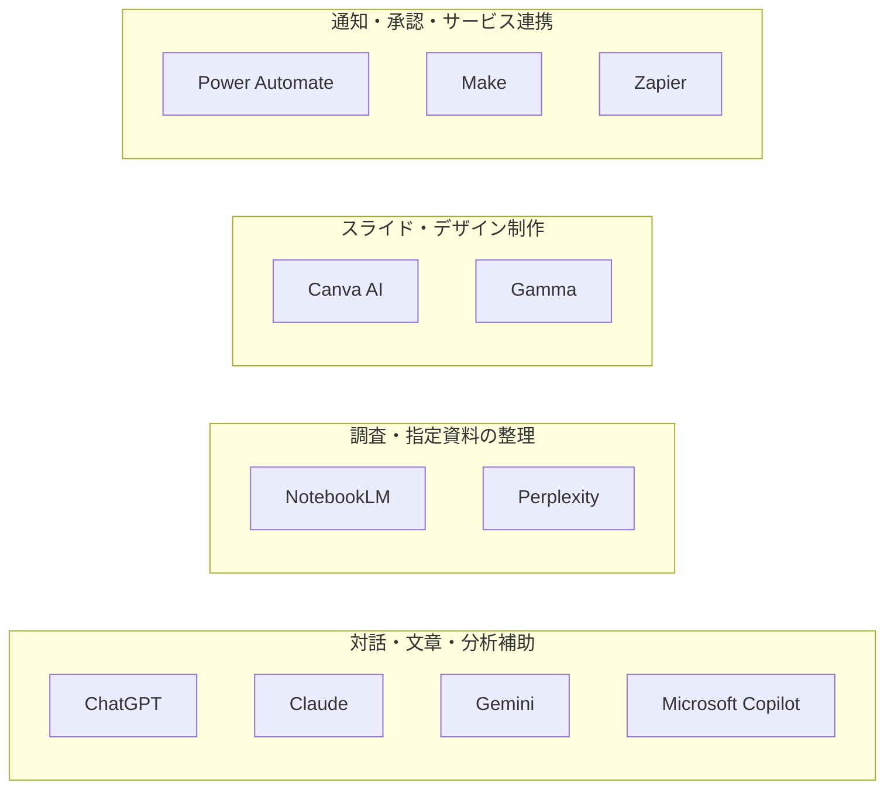

# 02 AIツールの用途と使い分け

## 1. この章の目的

製品名の人気ではなく、業務目的、扱う情報、必要な連携、組織が利用者・権限・承認・記録を管理する条件（**統制条件**）からツール候補を選べるようにします。

## 2. 学習ゴール

- 11種類のAI・自動化ツールの一般的な用途を説明できる
- 会話AI（チャット形式で指示や質問を受け、回答や文章を作るAI）、調査、資料作成、自動化の違いを整理できる
- 業務別に候補を絞り、PoC（Proof of Concept、概念実証：本格導入前に小さな範囲で確かめる検証）の評価軸と停止・見直し条件を作れる
- 契約、設定、データ取扱いを公式情報で確認できる

## 3. 本編解説

専門用語の短い説明は[用語集](glossary.md)でも確認できます。この章では、製品固有の名称と、複数製品に共通する技術用語を区別して説明します。

### 3.1 比較前の注意

以下は選定の入口であり、機能一覧や優劣の固定評価ではありません。**2026年6月23日時点の一般的な製品カテゴリ**を基にしています。名称、プラン、機能、料金、対応地域、データ利用条件は変わるため、導入時に各社の公式情報と契約を確認してください。

初心者が11製品の機能を暗記する必要はありません。まず「対話・調査・資料作成・自動化」の4カテゴリと、目的・データ・統制・連携・費用・継続性という選定軸を使えることを目標にします。

#### 図2-1：11ツールを4つの主な用途で捉える

**図の見方**：4つの枠は、11ツールを主な用途で整理した分類です。枠の左右や製品の上下は、選定順、処理順、優劣を表しません。実際には複数用途にまたがる製品もあるため、ここでは代表的な用途の枠へ1回だけ配置しています。

**講師向け説明ポイント**：最初に4つの枠を用途の分類として説明し、矢印がないことを確認させます。その後、受講者の業務目的に近い枠から候補を探します。これは固定的な製品分類ではなく、機能、プラン、名称、データ条件は変わるため、研修や導入の直前に最新の公式情報と契約条件を確認させます。

### 3.2 ツール比較表

比較表に出てくる主な用語を先に確認します。

| 用語 | 初心者向けの意味 |
|---|---|
| **ワークスペース** | 組織やチーム単位で、利用者、設定、データを管理する領域 |
| **データ制御** | 入力や出力を保存、学習利用、共有できる範囲を設定・管理すること |
| **アクセス権** | 誰がどの情報や機能を閲覧、編集、利用できるかを決める許可 |
| **権限継承** | 元のシステムで設定された閲覧・編集の許可が、連携先でも引き継がれること |
| **ソース** | AIに読ませる元資料や、調査結果の出典 |
| **出典の一次性** | 公式発表や原資料など、情報が発信元にどれだけ近いか |
| **資料起点AI** | 利用者が指定した資料を主な根拠として、要約や回答を作るAI |
| **AI検索** | ウェブなどを検索し、AIが結果の整理や回答作成を支援する機能 |
| **ライセンス** | 素材では利用許諾、製品では機能を使う契約上の権利を指す言葉 |
| **ワークフロー** | 条件、処理順、承認者を決めて仕事を流す仕組み |
| **コネクタ** | 自動化ツールとメール、表計算、チャットなどのサービスを接続する部品 |
| **SaaS（Software as a Service、サービスとして提供されるソフトウェア）** | インターネット経由で利用するソフトウェアサービス |
| **データ経路** | データがどのサービスや保存場所を通るかという流れ |
| **エラー処理** | 失敗を検出し、通知、再試行、手動対応などへつなぐ仕組み |
| **ログ** | 誰が、いつ、何を入力、実行、承認したかの記録 |
| **監査** | 記録と実態を照合し、ルールどおりに運用されているか確かめる活動 |

| ツール | 主なカテゴリ | 検討しやすい用途 | 選定時の確認点 |
|---|---|---|---|
| ChatGPT | 汎用対話・生成AI | 文章、分析補助、画像・ファイルを含む対話 | ワークスペース管理、データ制御、利用可能機能 |
| Claude | 汎用対話・生成AI | 文書読解、文章作成、対話型の整理 | 管理機能、連携、利用上限、データ条件 |
| Gemini | 汎用対話・Google連携 | 文章・画像等の支援、Google環境での活用 | Workspace契約、管理設定、地域・機能差 |
| Microsoft Copilot | Microsoft製品連携 | Word、Excel、PowerPoint、Outlook、Teams周辺 | Microsoft 365契約、権限継承、監査設定 |
| NotebookLM | 資料起点の調査・整理 | 指定資料に基づく要約、質問、学習支援 | ソースの権利・機密性、引用精度、利用条件 |
| Perplexity | AI検索・調査 | ウェブ調査、出典候補の収集 | 出典の一次性、網羅性、企業向け管理条件 |
| Canva AI | デザイン制作支援 | バナー、画像、資料のデザイン案 | 素材ライセンス、ブランド管理、商用条件 |
| Gamma | プレゼン・文書生成 | 構成案からプレゼンやページを作る | 出力編集、ブランド適合、権利・共有設定 |
| Power Automate | ワークフロー自動化 | Microsoft環境の承認、通知、データ連携 | コネクタ、ライセンス、実行権限、監査 |
| Make | ビジュアル自動化（画面上で処理の流れを組む自動化） | 複数SaaSの柔軟な連携、分岐・変換 | データ経路、再実行、エラー処理、費用 |
| Zapier | SaaS自動化 | 多様なサービス間の定型連携 | 対応アプリ、実行回数、権限、エラー通知 |

「その製品なら安全」ではなく、**プラン、契約、管理設定、利用方法の組み合わせ**で判断します。

### 3.3 選定の6軸

| 軸 | 質問 | 失敗例 |
|---|---|---|
| 目的 | 何の品質・時間を改善するか | 多機能だから選ぶ |
| データ | 機密度、個人情報、保存要件は | 無料アカウントへ貼り付ける |
| 連携 | どのシステム・ファイルとつなぐか | コピー作業が増える |
| 統制 | 権限、ログ、管理者設定、承認は | 誰が何をしたか追えない |
| 総費用 | 利用料、構築、教育、運用、監査は | 月額だけで比較する |
| 継続性 | 障害時の代替、データ出力、契約終了時の移行は | サービス停止や値上げで業務が止まる |

入力禁止情報を安全に扱えない、必要な監査ログがないなどの条件は、他の評価が高くても相殺できない**足切り条件**として扱います。必須条件を満たした候補だけを、同じ架空データによるPoCで比較します。

### 3.4 業務別の候補整理

- **業務スイート**：文書、表計算、メール、会議など複数の業務機能をまとめた製品群
- **RAG（Retrieval-Augmented Generation、検索拡張生成）**：関係する資料を検索し、その抜粋をAIへ渡して回答させる仕組み
- **API（Application Programming Interface、ソフトウェア同士の接続窓口）**：決められた形式で、異なるソフトウェアが情報や機能をやり取りする仕組み

| 業務 | 第一候補のカテゴリ | 併用候補 | 人が必ず確認する点 |
|---|---|---|---|
| メール・文書草案 | 汎用対話AI／業務スイート連携 | テンプレート | 宛先、事実、約束、機密 |
| 社内資料の理解 | 資料起点AI／RAG | 汎用対話AI | 原文、版、アクセス権、引用 |
| 最新情報の調査 | AI検索＋通常検索 | 一次情報サイト | 発行主体、日付、原文 |
| スライド | プレゼン生成／デザインAI | 汎用対話AI | 構成、ブランド、画像権利 |
| 承認・通知 | ワークフロー自動化 | AIで分類・下書き | 実行条件、権限、誤送信 |
| 複数SaaS連携 | Make／Zapier等 | API | 保存先、失敗時処理、ログ |
| Microsoft中心の業務 | Copilot／Power Automate | 組織承認済みAI | 権限と共有範囲 |
| Google中心の業務 | Gemini／Workspace連携 | NotebookLM | 契約と共有範囲 |

### 3.5 選定手順

1. 業務成果を「月10時間削減」「一次回答の表現統一」のように定義する。
2. 入力データを公開・社内・機密・厳秘に分類する。
3. 必須機能、望ましい機能、不要な機能を分ける。
4. 2〜3候補を同じ架空データと採点表で比較する。
5. セキュリティ・法務・情報システム部門の確認を受ける。
6. 小規模PoCで品質、時間、失敗、運用負荷（継続して使うために必要な手間）を測る。
7. 障害時の手動代替、データ移行（保存データを別の環境へ移すこと）、契約終了時の出口計画（データと業務を別の手段へ安全に移す計画）を確認する。
8. 採用・不採用の理由、停止条件、確認日を記録する。

PoCではAI出力を人が確認し、合格後も対象・権限・件数を限定して導入します。品質低下、規約変更、障害、費用増などを監視し、停止条件に該当したら処理を止めて手動へ戻せるようにします。

### 3.6 PoC（概念実証）とは

**PoC（Proof of Concept、概念実証）**とは、本格導入の前に対象業務、利用者、期間、データを限定し、「期待する効果があるか」「安全に運用できるか」を確かめる小規模な検証です。単にAIツールを触ってみることや、見栄えのよい出力を1件作ることとは異なります。

以下では、**FAQ（Frequently Asked Questions、よくある質問と回答）**の草案作成を例にします。**工数**とは、作業に必要な人の時間や労力です。

PoCでは、開始前に次を決めます。

| 項目 | 決める内容 | FAQ作成での例 |
|---|---|---|
| 検証する仮説 | 何が改善できると考えるか | FAQ草案の作成・確認時間を短縮できる |
| 対象範囲 | 業務、利用者、期間、件数 | 公開済み資料、担当者3名、2週間、架空質問20件 |
| 評価指標 | 時間、品質、安全性、運用負荷 | 引用一致率（回答の引用が元資料と一致した割合）、総作業時間、重大誤り、確認工数 |
| 成功基準 | 採用を検討できる最低条件 | 重大誤り0件で、品質を保ったまま総時間を削減 |
| 停止条件 | 直ちに検証を止める条件 | 権限外情報の表示、外部誤送信、入力禁止情報の混入 |
| 判定と責任者 | 誰が何を基に決めるか | 業務責任者と関係部門が採用・条件付き・不採用を判断 |

#### 操作練習・PoC・本番運用の違い

| 段階 | 主な目的 | データと範囲 | 結果の扱い |
|---|---|---|---|
| 操作練習 | 基本操作を覚える | 承認済みツールと完全な架空データ | 実業務へ反映しない |
| PoC | 効果、品質、安全性、運用可能性を検証する | 架空データ、または組織が正式に許可したデータで限定実施 | 人が全件確認し、採用判断の材料にする |
| 本番運用 | 継続的に業務成果を出す | 承認済みの対象・権限・手順 | ログ、監視、承認、停止、手動代替を運用する |

PoCが不採用で終わっても失敗とは限りません。「効果が小さい」「確認工数が増える」「必要な統制を実現できない」と本番導入前に分かること自体が成果です。用語の短い説明は[用語集](glossary.md)でも確認できます。

### 3.7 PoC採点表の例

**中央値**とは、値を小さい順に並べたとき中央に位置する値です。極端に長い作業時間の影響を受けにくいため、PoCの結果を代表する数値として使う場合があります。

| 評価項目 | 重み | 測定方法 |
|---|---:|---|
| 正確性 | 30 | 20件を専門担当が採点 |
| 作業時間 | 20 | Before / After（改善前／改善後）の中央値 |
| 安全・統制 | 25 | 権限、ログ、保存、契約をチェック |
| 使いやすさ | 10 | 初心者5名の完了率 |
| 連携・運用 | 10 | エラー処理と管理工数 |
| 費用・継続性 | 5 | 1年の総費用、障害時代替、データ移行 |

重みは業務に合わせて変更します。高リスク業務では、安全性を足切り条件にします。

### 3.8 公式情報の確認先

[ChatGPT](https://openai.com/chatgpt/) / [Claude](https://claude.com/product/overview) / [Gemini for Workspace](https://workspace.google.com/solutions/ai/) / [Microsoft 365 Copilot](https://www.microsoft.com/microsoft-365/copilot/business) / [NotebookLM](https://notebooklm.google/) / [Perplexity](https://www.perplexity.ai/) / [Canva AI](https://www.canva.com/magic/) / [Gamma](https://gamma.app/) / [Power Automate](https://www.microsoft.com/power-platform/products/power-automate) / [Make](https://www.make.com/) / [Zapier](https://zapier.com/ai)

公式の製品紹介だけでなく、プライバシー、セキュリティ、利用規約、管理者向け文書も確認します。

## 4. 実務での使いどころ

- 部門のツール選定会議で比較表を作る
- 顧客の既存IT環境に合う研修デモを選ぶ
- PoCの採点基準を事前に合意する
- 「個人向けで試せた」から「企業導入できる」への飛躍を防ぐ

## 5. 講師メモ

- ロゴ当てや人気投票にせず、同じ業務を6軸で比較させます。
- 「無料版対法人版」は安全・危険の二分法ではなく、契約・設定・管理機能の確認問題として扱います。
- 画面は頻繁に変わるため、クリック手順より選定原則を中心に教えます。
- 登壇前にデモ用アカウント、機能提供地域、利用上限を再確認します。

## 6. 演習

### 演習：問い合わせFAQ作成のツール選定（40分）

架空の「青葉サービス社」が、公開済みマニュアル20件からFAQ草案を作りたいとします。Microsoft 365を利用中で、顧客情報は入力しません。

1. 必須要件を5つ定義します。
2. 候補を3つ選び、6軸で各1〜5点を付けます。
3. 10件の架空質問によるPoC手順を作ります。
4. 採用条件、停止条件、人間レビュー担当を決めます。

**評価基準**：製品名ではなく、要件と採点のつながり、データ条件、停止条件が説明できること。

## 7. 確認問題

1. AIツールを生成品質だけで選んではいけない理由を3つ挙げてください。
2. NotebookLMのような資料起点ツールでも原文確認が必要なのはなぜですか。
3. 自動化ツールの選定で、エラー処理を確認する理由は何ですか。
4. PoCで各候補に同じ架空データを使う理由は何ですか。
5. 製品比較表に確認日が必要なのはなぜですか。
6. PoCを始める前に決めるべき項目を3つ挙げてください。

解答例

1. データ取扱い、組織統制、既存環境との連携、総費用などが導入可否を左右するためです。
2. 資料の読み違い、引用の取り違え、古い版の利用が起こり得るためです。
3. 失敗時の重複実行、欠落、誤送信を検出・復旧できる必要があるためです。
4. 条件をそろえて比較し、印象ではなく結果で判断するためです。
5. 機能、規約、料金、提供範囲が変わるためです。
6. 検証する仮説、対象範囲、評価指標、成功基準、停止条件、判定責任者などです。

## 8. まとめ

ツール選定は、業務目的と統制条件に合う候補を小さく検証する活動です。講師は個人的な好みを推奨に置き換えず、目的・データ・連携・統制・総費用という再利用可能な判断軸を渡します。
