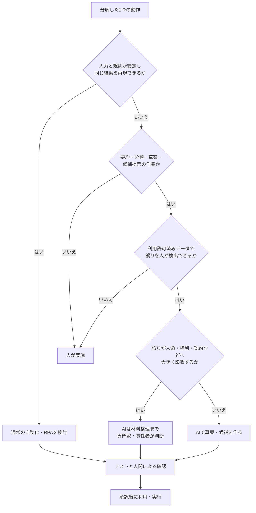
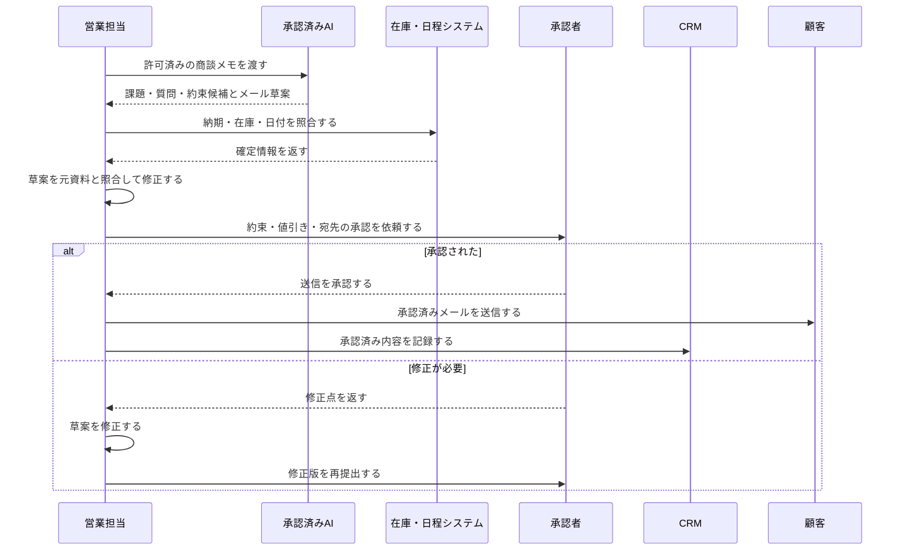

# 03 業務プロセス分析

[前の章：02 セキュリティとプライバシー](02_security_and_privacy.md)｜[学習ガイドへ戻る](START_HERE.md)｜[次の章：04 プロンプトエンジニアリング](04_prompt_engineering.md)

## この章を始める前に

| 項目 | 内容 |
|---|---|
| 前提 | [01 生成AIの基礎](01_generative_ai_basics.md)と[02 セキュリティとプライバシー](02_security_and_privacy.md)を終えていること |
| 使うファイル | [業務分析シート](templates/business_analysis_sheet.md)、[用語集](glossary.md)、[対話AIアカウント準備](setup/chat_ai_account_setup.md) |
| 個人学習 | 本人が利用条件とデータ設定を確認した対話AIで教材の架空業務を分析します。自分の業務は名称と工程だけを一般化し、実データを入力しません |
| 組織利用 | 承認済みAI・業務用アカウント・保存先だけを使い、実データによる試行はこの教材と分離します |
| 成果物 | 業務の境界、1行1動作のBefore、AI・通常自動化・人のAfter、効果指標、停止条件を含む業務分析シート |
| 開始条件 | 承認・利用条件を確認した対話AIを操作でき、完全な架空ケース、保存場所、相談先を確認し、業務の開始と完了を1文ずつ書けること |
| 停止条件 | 対話AIを利用できない、実在データが必要、業務の責任者が不明、AIへ最終判断や外部送信を任せる案になった場合は止めること |

> **修了条件**：業務分析シートを人が作るだけでなく、架空業務を対話AIへ入力し、分解候補を比較・修正する**AIの実操作**が必要です。AIを利用できない場合は環境を準備できるまで演習を停止します。

## 1. この章の目的

AI業務効率化で最も重要な「業務分解」を学びます。製品を先に決めず、現行業務を作業、判断、例外、責任に分け、AIに任せる範囲と人が担う範囲を設計します。

この章で使う専門用語の短い説明は、[用語集](glossary.md)でも確認できます。

## 2. 学習ゴール

- 業務を開始条件から完了条件まで棚卸しできる
- AI、通常の自動化、人間の役割を切り分けられる
- 営業、事務、教育、IT、カスタマーサポートの例を分析できる
- Before / Afterを時間、品質、リスクで比較できる
- 業務改善提案書を作れる

## 3. 本編解説

### 3.1 なぜ業務分解が最重要か

「報告書をAI化する」という単位は大きすぎます。実際には、資料収集、数値確認、構成、下書き、判断、承認、配布があります。このうちAIに向くのは構成や下書きかもしれませんが、数値確定や承認は人が担います。

業務を分けないまま自動化すると、次が起こります。

- 誤った入力を高速に処理する
- 責任者不在のまま外部送信する
- 例外処理で停止し、手作業がかえって増える
- 時短した箇所の後工程で修正工数が増える

### 3.2 業務棚卸しの方法

1. **範囲を決める**：開始条件と完了条件を一文で書く。
2. **観察する**：手順書だけでなく、実際の担当者の操作と例外を確認する。
3. **作業を動詞で分ける**：「受け取る」「確認する」「転記する」「判断する」「承認する」。
4. **入出力を記録する**：情報源、形式、機密度、出力先を書く。
5. **時間と頻度を測る**：平均だけでなく、範囲や繁忙期も記録する。
6. **判断・例外・責任を明示する**：誰が何を根拠に判断するかを書く。
7. **改善候補を評価する**：効果、実現性、リスクの3軸で優先順位を付ける。

| 棚卸し項目 | 質問例 |
|---|---|
| 目的 | この業務がなくなると誰が困るか |
| 開始・完了 | 何を受け取ったら始まり、何が承認されたら終わるか |
| 入力 | どこから、どの形式で、どの機密度の情報が来るか |
| 作業 | クリック、転記、比較、文章化、判断は何か |
| 出力 | 誰に何を渡し、どこへ保存するか |
| 例外 | 欠落、重複、期限超過、苦情時にどうするか |
| 品質 | 正しさ、速さ、一貫性をどう測るか |
| 責任 | 作成、確認、承認、実行は誰か |

### 3.3 作業の分類

**RPA（Robotic Process Automation／ロボティック・プロセス・オートメーション）**とは、人が画面上で行う定型操作を、決めた規則どおりに再現する自動化です。

**RAG（Retrieval-Augmented Generation／検索拡張生成）**とは、質問に関係する資料を検索し、その抜粋をAIへ渡して回答を作る仕組みです。詳しい仕組みと限界は[08 RAGとナレッジマネジメント](08_rag_and_knowledge_management.md)で扱います。

| 分類 | 特徴 | AIの候補 | 注意点 |
|---|---|---|---|
| 繰り返し作業 | 規則と入力が安定 | 通常の自動化、RPA | AI不要の場合が多い |
| 文章作成 | 正解が複数、下書き可能 | 生成AI | 事実、宛先、表現を確認 |
| 情報整理 | 分類、要約、抽出 | 生成AI／ルール処理 | 欠落と取り違えを検証 |
| 調査 | 複数情報源を探す | AI検索／RAG | 一次情報、日付、網羅性 |
| 判断業務 | 影響と責任がある | 判断材料の整理まで | 最終判断・承認は人 |

入力が定型で規則が明確なら、生成AIよりRPAなどの通常の自動化の方が安定します。

### 3.4 AI・自動化・人間の切り分け

**与信**とは、取引相手の支払能力などを審査し、後払いや融資などの信用を与える判断です。人や組織の権利・資産へ大きく影響するため、AIを最終判断者にせず、担当部門・専門家が判断します。

| 判断軸 | AIに任せやすい | 人が担うべき |
|---|---|---|
| 正解 | 複数の許容解がある草案 | 法令・規程上の確定判断 |
| 影響 | 誤りを公開前に直せる | 人命、権利、雇用、与信、契約へ大きく影響 |
| 検出 | 元資料と容易に照合できる | 誤りを専門家でも見抜きにくい |
| データ | 利用許可済みの低機密データ | 入力禁止情報、過剰な個人情報、認証情報 |
| 責任 | 人の承認前の準備 | 承認、送信、支払、削除、アクセス付与 |

切り分けは「AIか人か」の二択ではありません。

- 通常の自動化：定型転記、通知、日付計算
- AI：分類、要約、草案、候補提示
- 人：例外判断、承認、対外責任、専門判断

#### 図3-1：通常の自動化・AI・人間を選ぶ判断フロー



**図の見方**：1つの動作について上から質問に答えます。規則どおりに再現できるなら通常の自動化、文章や整理ならAIが候補です。ただし、データ、誤りの見つけやすさ、影響の大きさで人へ戻します。

**図の要点**：「AIか人か」の二択ではなく、通常の自動化も選択肢です。AIを使う場合も、出力の確認と承認は独立した工程として残します。法律、医療、金融、雇用などの高リスク判断は、担当部門・専門家へ引き継ぎます。

### 3.5 Before / Afterの考え方

改善効果は「生成時間」だけで測りません。

**足切り条件**とは、他の効果が高くても、満たさなければ不採用とする最低限の基準です。品質や安全に関する重大な基準は、時間短縮と相殺せず、独立した足切り条件にします。

| 指標 | Before | After目標 | 測定上の注意 |
|---|---:|---:|---|
| 1件の総作業時間 | 25分 | 15分 | 修正・確認時間も含める |
| 一次提出の差戻し率 | 20% | 10%以下 | 品質を犠牲にしない |
| 重大誤り | 月1件 | 0件 | 件数が少なくても足切り |
| 担当者間のばらつき | 15分 | 5分以内 | 標準化効果を見る |
| 利用率 | なし | 対象者の70% | 強制利用を目的にしない |

**総便益の例**：削減時間 × 人件費相当 − ツール費 − 導入・教育・確認・運用工数。ただし金額化しにくい品質やリスクも別に評価します。

BeforeとAfterは同じ対象・期間・品質基準で比べ、Afterの作業時間にはAIの生成だけでなく、人による確認と修正も含めます。品質と安全は足切り条件とし、重大な誤りが増える場合は、時短できても改善とは判断しません。

少数のPoCで「重大誤り0件」だったとしても、安全が証明されたわけではありません。その少数例で問題が観測されなかっただけの可能性があります。通常例に加えて、基準の境目にある**境界例**、入力不足・矛盾・異常値などの**例外例**を試し、非公開試行から限定利用へ段階的に広げます。導入後も品質、苦情、偏り、事故、費用を監視し、停止条件に達したら元の手順へ戻します。

### 3.6 部門別の業務分解例

**CS（Customer Support／カスタマーサポート）**は顧客対応を担う部門や業務、**FAQ（Frequently Asked Questions／よくある質問）**は、よく寄せられる質問と回答をまとめたものです。

| 部門・業務 | AI候補 | 人間の判断 | 例外・リスク |
|---|---|---|---|
| 営業：商談後フォロー | メモ整理、メール草案、論点抽出 | 約束内容、値引き、送信 | 顧客情報、誤った納期確約 |
| 事務：月次報告 | 文章要約、異常候補の説明 | 元数値確定、原因判断、承認 | 転記ミス、未公開数値 |
| 教育：教材作成 | 構成、例題、実務演習の草案 | 正確性、難易度、権利、採用 | 誤知識、差別的表現 |
| IT：障害一次整理 | ログ要約、類似事例候補 | 影響判定、復旧操作、報告 | 秘密情報、誤操作、古い手順 |
| カスタマーサポート（CS）：問い合わせ一次案 | 分類、FAQ候補、返信草案 | 本人確認、例外対応、送信 | 個人情報、補償確約、感情配慮 |

#### 例：営業フォローの詳細

**CRM（Customer Relationship Management／顧客関係管理）**は、顧客情報、商談、対応履歴、次の行動などを管理する仕組みです。顧客情報を連携するときは、利用権限とデータ取扱いを確認します。

| 手順 | 現状 | 改善案 | 実行／承認 |
|---|---|---|---|
| 1. メモ収集 | 各自形式 | 許可済みテンプレートへ記録 | 人 |
| 2. 要点抽出 | 手作業 | AIが課題・質問・約束候補を抽出 | AI→人確認 |
| 3. 期限確認 | 記憶頼み | 日付と社内在庫を照合 | 通常処理＋人 |
| 4. メール草案 | 手作業 | AIが固定形式で草案 | AI |
| 5. 承認・送信 | 担当者 | 事実と約束を確認して送信 | 人 |
| 6. 記録 | 手入力 | 承認後にCRMへ登録候補 | 自動化→人確認 |

#### 図3-2：営業フォローでAIと人が受け渡す流れ



**図の見方**：上部は担当者やシステム、縦方向は時間の流れです。AIは候補と草案を作りますが、納期確認、内容修正、承認、送信は人が行います。

**図の要点**：AIの出力と社内システムの確定情報を混同せず、対外的な約束の前に承認点を置きます。実運用では、顧客情報の入力可否、アクセス権、ログも自社ルールに合わせて設計します。

### 3.7 業務改善提案書の作り方

**ボトルネック**は業務全体を遅らせる箇所、**データフロー**は情報がどこからどこへ渡るかを示す流れです。**PoC（Proof of Concept／概念実証）**は、本格導入前に対象と期間を限定して効果と安全性を確かめる小規模な検証です。

**責任分界**とは、作成、確認、承認、実行、事故対応を誰が担うか、役割ごとの責任範囲を明確に区切ることです。

| セクション | 書く内容 |
|---|---|
| 1. 要約 | 対象業務、課題、提案、期待効果 |
| 2. 現状 | 手順、時間、品質、データ、関係者 |
| 3. 原因 | ボトルネック、重複、判断待ち、情報不足 |
| 4. 改善後 | AI、自動化、人の役割とデータフロー |
| 5. リスク対策 | 禁止情報、レビュー、権限、ログ、停止条件 |
| 6. PoC | 対象件数、期間、評価方法、成功・中止基準 |
| 7. 効果 | 時間、品質、リスク、費用の指標 |
| 8. 体制 | 責任者、承認者、運用者、相談先 |
| 9. 計画 | 小規模検証、評価、展開、定着 |

テンプレートは [business_analysis_sheet.md](templates/business_analysis_sheet.md) を使います。

ヒアリングから提案までを通して練習する場合は、[業務ヒアリングからAI活用試行提案を作る演習](exercises/business_interview_improvement_proposal_exercises.md)を使います。曖昧な依頼をすぐAI提案へ変えず、質問、事実・仮定・未確認、Before、役割分担、試行範囲の順で整理します。明細データの分類から効果報告までを体験する場合は、[問い合わせ明細からExcel月次報告を作る演習](exercises/inquiry_excel_monthly_report_exercises.md)を使います。

この教材のPoC演習では、完全な架空データだけを使います。実データを使うPoCは学習と分離し、法令、契約、データ所有者、利用権限、保存・削除等を関係部門が審査した正式な業務プロジェクトとして行います。成功基準と停止条件を事前に定め、本格展開は関係部門の承認後に限定範囲から始め、ログ・苦情・品質を継続監視し、基準を外れた場合は再検証または中止します。

## 4. 実務での使いどころ

- 改善検討前のヒアリングと題材選定
- 部門ワークショップで改善候補を比較
- ツール導入前のPoC範囲決定
- 経営層・情報システム・現場間の責任分界の合意
- 対話AIの提案を業務分析シートへ転記し、人間が採用・修正・却下を判断する練習
- 問い合わせ明細の分類候補、Excel集計、人が確定した月次報告を一つの業務として分解する練習
- 現場ヒアリングから、確認済み事実だけを使った承認前の小規模試行提案を作る練習

## 5. つまずきやすい点と確認方法

- ツール名から考え始めたら、「開始・完了・入力・判断・例外は何か」へ戻ります。
- 動作が大きすぎるときは、付箋1枚または表1行に1動作を書き、隠れた転記や待ち時間を探します。
- 削減率だけでなく、確認時間と失敗時の損失も効果表へ追加します。
- 高リスクな最終判断をAIへ移す案になったら、利用を止め、根拠と責任者を明記します。

## 6. 演習

### 演習：対話AIと業務分析シートで月次問い合わせ報告を分解する

架空のサポート部では、毎月300件の問い合わせを担当者が分類し、上位5テーマと改善案を報告しています。実在する顧客・従業員・案件の情報は使いません。

使用物は[業務分析シート](templates/business_analysis_sheet.md)、筆記用具、利用条件を確認した対話AIです。ChatGPTは選択肢の一例です。画面や機能名は変わるため、利用時は最新の公式情報と組織のルールを優先します。

#### 利用環境の準備確認

開始前に[AIツール共通準備](setup/common_preparation.md)と[対話AIアカウント準備](setup/chat_ai_account_setup.md)を確認します。本章では承認・利用条件を確認した対話AIの操作が必須です。

| 学習環境 | 実施方法 |
|---|---|
| 個人学習 | 自分で利用条件とデータ設定を確認できるアカウントだけを使い、完全な架空データだけを入力します。 |
| 組織利用 | 承認済みアカウント、入力ルール、保存・共有設定を確認します。承認済み環境でも、入力は教材に記載された完全な架空データだけに限定します。 |

開始前に、画面共有へ通知や別ファイル名が映らないことも確認します。未承認の環境しかない場合は入力せず、正式窓口へ確認して承認済み環境を準備できるまで演習を停止します。

#### 手順付き練習

まず「問い合わせメールを受け取り、担当部署へ振り分ける」という小さな業務を、開始・入力・動作・判断・出力・例外・完了に分けてシートへ記入します。その後、次のプロンプトを利用する対話AIへ入力します。

```text
あなたは業務分析の補助者です。次の架空業務を、1行1動作になるよう分解してください。
業務：架空の問い合わせメールを受け取り、内容を確認し、担当部署へ振り分ける。
各動作について、入力、出力、通常ルールで処理できる部分、AIが補助できる部分、
人間が判断すべき部分、不明点を表にしてください。
不足情報は推測で埋めず、「要確認」と書いてください。
```

AI案と自分の案を比較し、抜けた例外、勝手に追加された手順、最終責任者が曖昧な箇所へ印を付けます。AI案を正解として写すことが目的ではありません。

#### 実務演習

月次問い合わせ報告を、開始から承認まで観察できる動作へ分けます。

- 入力、出力、担当、頻度、所要時間、待ち時間、例外、機密度をシートへ記録する
- 各動作を「通常の自動化」「AI補助」「人が判断」に分類し、その理由を書く
- 対話AIには架空業務の条件だけを渡し、分解漏れと確認質問の候補を出させる
- Before / Afterを、総作業時間、確認時間、差戻し、重大誤り、費用などで比べる
- 完全な架空データで、通常例・境界例・例外例を含むPoCの範囲、成功条件、停止条件、元へ戻す方法を決める
- PoC後の限定導入、対象拡大の承認条件と、導入後に監視する品質・苦情・偏り・事故・費用を決める

**停止条件例**：個人情報の混入、分類の重大誤り、根拠のない原因断定、承認前の外部送信。

#### 人間レビュー

次の順でシートと対話AIの出力を自分で照合します。学習仲間がいる場合の相互確認は任意です。

- 現行業務に存在しない手順をAIが作っていないか
- 例外、待ち、手戻り、承認が見落とされていないか
- 金額、対外約束、評価、承認などの最終判断が人に残っているか
- Before / Afterへ人間の確認時間と失敗時の影響が含まれているか
- 入力データ、アクセス権、ログ、停止・復旧の担当が明確か

レビューを受けた本人が、指摘を採用するかどうかと理由を記録してシートを更新します。

#### 振り返り

- 対話AIが見つけた有用な観点と、人間が修正した点をそれぞれ記録する
- AIを使わず通常の自動化にした方がよい動作を挙げ、その理由を書く
- 明日実務へ持ち帰れる小さな検証範囲と、着手前の相談先を決める

#### 完成条件・自己点検・改善ポイント

| 区分 | 内容 |
|---|---|
| 完成条件 | 業務分析シートに現状、役割分担、Before / After、リスク、承認、停止条件が記入され、AI案の採否理由が残っている |
| 自己点検 | ツール名から始めず、実際の動作と例外を言葉にできたか。AIへ最終判断を移していないか |
| 改善ポイント | 粒度が粗い場合は「誰が、何を見て、何を変え、どこへ渡すか」で再分解する。効果だけの場合は確認時間と失敗時の損失を追加する |

## 7. 実務チェックリストと振り返り

この節では、実務へ応用する前に、判断過程を自分で点検します。

### 実務チェックリスト

- [ ] 業務名だけでなく、開始・完了・入力・出力を説明できる
- [ ] 例外、待ち時間、手戻り、承認を業務の一部として記録した
- [ ] 通常の自動化、AI補助、人間判断を理由付きで分けた
- [ ] AI出力を元資料や現場担当者と照合する工程を置いた
- [ ] 効果へ確認時間、品質、費用、リスクを含めた
- [ ] この教材では完全な架空データだけを使い、実データPoCは学習外の正式審査へ分離した
- [ ] 通常例・境界例・例外例を試し、少数例の重大誤り0件を安全保証と解釈していない
- [ ] 段階展開の承認条件と、導入後の継続監視を決めた
- [ ] 停止条件、復旧方法、責任者、相談先を決めた

### 振り返りメモ

- 最も分解が難しかった動作：
- AIへ任せないと決めた判断と理由：
- 現場担当者へ追加で聞くこと：
- 次に試す最小範囲：

## 8. まとめ

AI業務効率化は、業務を細かい動作へ分解し、通常の自動化、AI、人間を適材適所に配置する活動です。効果は総時間、品質、リスク、費用で測り、例外・承認・停止条件まで設計します。

## 9. 自己点検と次の章

1. 先に、完成した業務分析シートを自分用の場所へ保存します。
2. [03 業務プロセス分析：自己点検](self-check/chapters/03_business_process_analysis_self_check.md)を開き、まず「段階ヒント」だけで見直します。
3. 「一致必須」「成立する別解」「危険な状態」を確認し、AI案の採否理由を説明します。
4. 最後に、動作の粒度、停止条件、効果指標のいずれか1点を修正して再保存します。

[前の章：02 セキュリティとプライバシー](02_security_and_privacy.md)｜[学習ガイドへ戻る](START_HERE.md)｜[次の章：04 プロンプトエンジニアリング](04_prompt_engineering.md)
