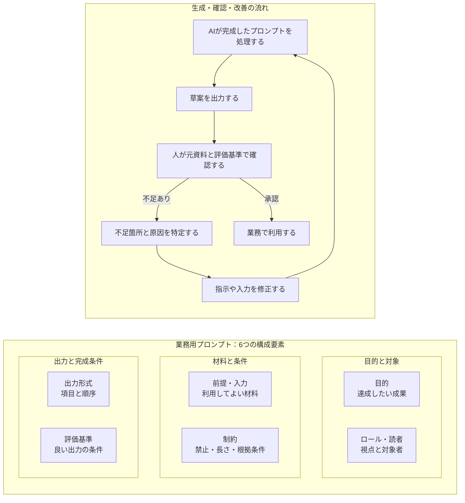
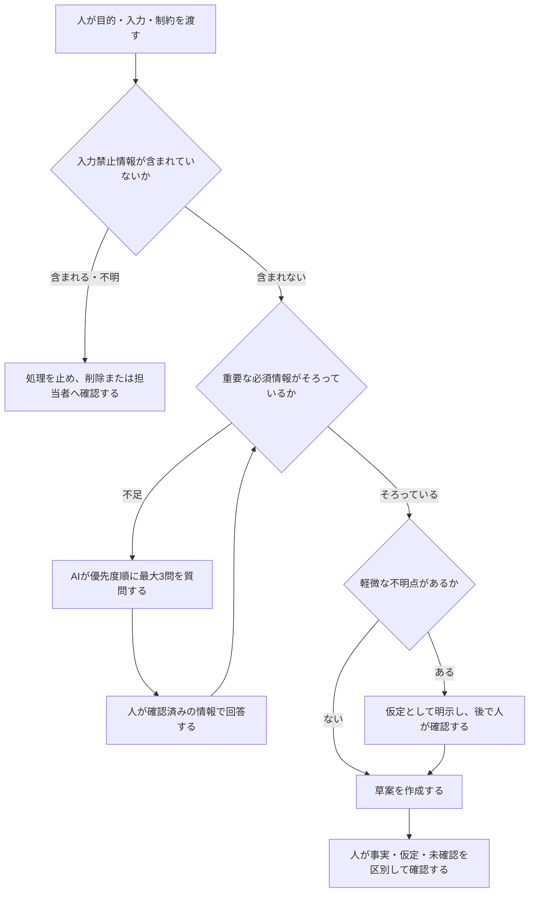
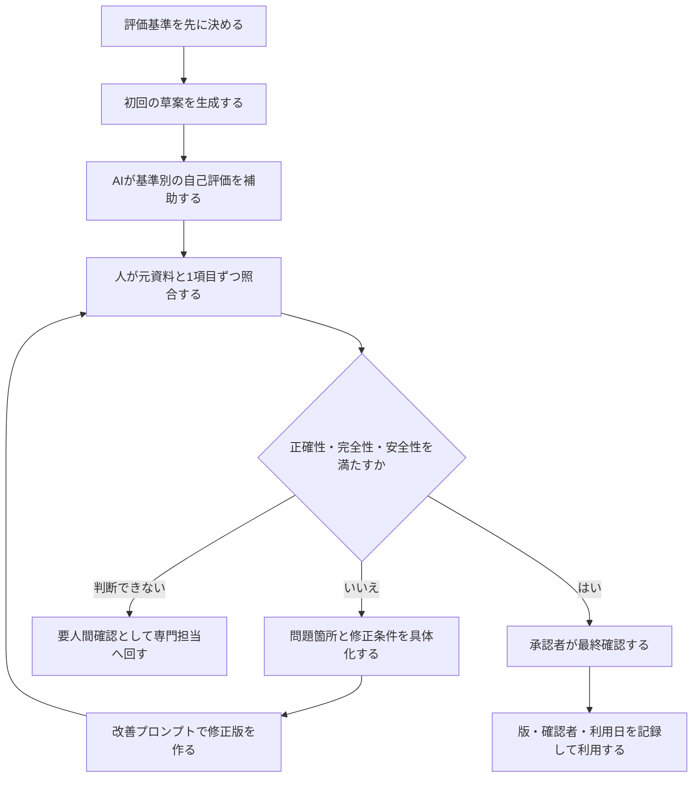
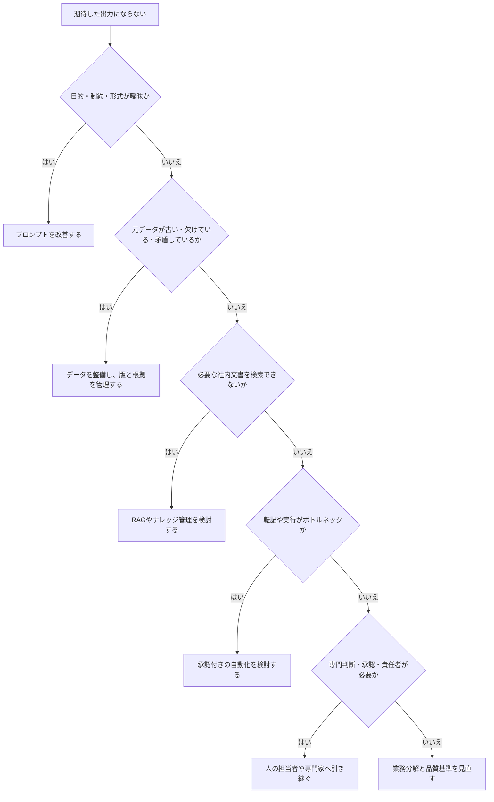

# 03 プロンプトエンジニアリング

## 1. この章の目的

思いつきの指示ではなく、他の人も再利用・評価・改善できる業務用プロンプトを設計します。

**プロンプト**とは、目的や条件をAIへ伝える指示です。**プロンプトエンジニアリング**とは、業務目的に合う指示を設計し、出力を評価・改善する考え方です。

## 2. 学習ゴール

- 目的、前提、制約、入力、出力形式、評価基準を整理できる
- AIに不足情報を質問させ、勝手な補完を減らせる
- 初回出力を完成条件で確認し、改善プロンプトを作れる
- メール、議事録、報告書、提案書、FAQ（Frequently Asked Questions、よくある質問と回答）、教材へ応用できる

## 3. 本編解説

専門用語の短い説明は[用語集](glossary.md)でも確認できます。

業務用のプロンプトは、質問文だけでなく、目的、入力、前提、制約、出力形式、評価基準をまとめた指示です。業務では「小さな仕様書」と考えます。**仕様書**とは、何を、どの条件で、どの形式に仕上げるかを決めた文書です。

### 3.1 基本構造

| 要素 | 役割 | 例 |
|---|---|---|
| 目的 | 何を達成するか | 顧客が次の行動を理解できる返信を作る |
| ロール | 視点・専門性を指定 | あなたは法人営業の文章編集者です |
| 読者 | 誰向けか | ITに詳しくない既存顧客 |
| 前提 | 背景と入力の意味 | 製品停止は30分、復旧済み |
| 制約 | 禁止・長さ・文章の調子（トーン） | 300字以内、補償を確約しない |
| 入力 | AIが処理する材料 | 区切り線内の架空メモ |
| 出力形式 | 見出し・表・JSON（JavaScript Object Notation、JavaScriptオブジェクト表記法：項目名と値を組にするデータ形式）など | 件名、本文、確認事項の順 |
| 評価基準 | 良い出力の条件 | 事実のみ、謝罪、次の行動が明確 |

**基本テンプレート**

```text
目的：{達成したいこと}
役割：あなたは{役割}です。
読者：{対象者}
前提：{背景}
入力：以下の区切り線内だけを材料にしてください。
---
{架空または利用許可済みの情報}
---
制約：{禁止事項、長さ、表現、根拠条件}
出力形式：{項目と順序}
評価基準：{正確性、完全性、読みやすさ等}
不足情報があれば作成前に質問し、推測で補わないでください。
```

#### 図3-1：業務用プロンプトを小さな仕様書として組み立てる



**図の見方**：左の枠はプロンプトを構成する6要素であり、要素間に処理順はないため矢印を使っていません。右の枠にある実線矢印だけが、AI処理、草案、人間確認、改善または承認という実行順を表します。

**講師向け説明ポイント**：先に左枠を指し、長さではなく6要素が必要に応じてそろっていることを確認します。次に右枠の矢印だけをたどり、不足があれば修正して再実行する流れを説明します。実在の機密情報や個人情報は使わず、研修では架空データで各要素の効果を比較します。

### 3.2 ロール指定の使い方

ロールは魔法の専門資格ではなく、出力の視点をそろえる補助です。「世界最高の専門家」より、「社内マニュアルを初心者向けに編集するテクニカルライター」のように、仕事と読者を具体化します。ロールを指定しても資格や正確性は保証されません。

### 3.3 目的・前提・制約

- **目的**は成果で書く：「丁寧に」ではなく「顧客が期限と次の行動を理解できる」。
- **前提**は判断に必要な背景だけを書く。不要な個人情報は入れない。
- **制約**は優先順位を付ける：「事実を追加しない」「確約しない」「200〜300字」。
- 指示同士が矛盾したら、AIに質問させる。

### 3.4 出力形式の指定

**構造化形式**とは、項目名や順序などの規則を決めたデータ形式です。**形式検証**とは、出力がその規則どおりに並び、必要な項目を備えているかを確かめることです。

| 用途 | 向く形式 | 理由 |
|---|---|---|
| 人が読む | 見出し、箇条書き、表 | 確認しやすい |
| 転記する | 固定項目の表 | 欠落を見つけやすい |
| システム連携 | JSON等の構造化形式 | 機械処理しやすいが形式検証が必要 |
| 意思決定 | 選択肢、根拠、リスク、推奨 | 結論だけの暴走を防ぐ |

JSONは、「項目名」と「値」を組にしてシステムが読み取りやすく表します。形が正しくても、内容の事実性や安全性は別途検証します。

### 3.5 追加質問させる方法

```text
作成に必要な情報を確認してください。
重要な不足がある場合は、最大3問を優先度順に質問し、回答を待ってください。
軽微な不足は「仮定」として明示し、事実として補わないでください。
```

AIが質問しない場合もあるため、人が入力チェックリストを使うことが基本です。

#### 図3-2：不足情報を推測で埋めさせない対話フロー



**図の見方**：不足があるときは、AIが勝手に補うのではなく質問します。人が答えられない軽微な点だけを、明示した仮定として扱います。

**講師向け説明ポイント**：「質問させれば安全」とは限らないため、入力チェックリストと人の確認を併用します。重要情報が未確認なら生成を続けない停止条件も、プロンプトと運用手順に含めます。

### 3.6 評価・改善プロンプト

初回出力をそのまま採用せず、完成条件に照らして確認します。

ここでいう**完全性**は必要な項目に抜けがないこと、**明確性**は読み手が複数の意味に取り違えにくいことです。

```text
次の草案を、正確性・完全性・明確性・安全性・読者適合（対象読者の知識と目的に合うか）の観点で
「満たす・一部満たす・満たさない・要人間確認」に分類してください。判断根拠、問題箇所、修正案を表で示してください。
入力にない事実を追加していないかを最優先で確認してください。
評価後、修正版を提示してください。修正できない点は「要人間確認」としてください。
```

AIによる自己評価は補助であり、元資料との照合を置き換えません。

#### 図3-3：生成・評価・改善を繰り返す品質向上ループ



**図の見方**：AIの自己評価の後に、必ず人が元資料と照合します。完成条件を満たすまで修正し、判断できない点は専門担当へ渡します。

**講師向け説明ポイント**：文章の自然さではなく、事前に決めた完成条件で確認させます。法律、医療、金融などの判断は、プロンプトの改善だけで完結させず、必要な専門家確認へつなげます。

### 3.7 比較検討プロンプト

```text
候補A〜Cを、必須条件への適合、期待効果、リスク、導入負荷（準備・教育・運用に必要な手間）、総費用の5軸で比較してください。
事実と仮定を分け、情報不足は「不明」としてください。
結論を1つに固定せず、条件別の推奨と追加確認事項を示してください。
```

### 3.8 業務別プロンプト例

| 業務 | 指示の核 | 人間の確認 |
|---|---|---|
| メール | 読者、目的、事実、トーン、長さ、禁止する約束 | 宛先、日時、金額、確約 |
| 議事録 | 発言メモから決定・未決・担当・期限を分離。不明は不明 | 決定の有無、担当者、期限 |
| 報告書 | 事実、解釈、提案を分け、数値を改変しない | 数値、因果、経営判断 |
| 提案書 | 課題、現状、解決案、効果指標、リスク、次の行動 | 実現性、費用、契約表現 |
| FAQ | 質問の重複統合、根拠文書ID（文書を識別する番号や記号）、未記載は回答しない | 根拠、最新版、公開範囲 |
| 教材 | 対象、前提、到達目標、説明、例、演習、完成条件 | 正確性、難易度、権利、安全性 |

詳細な再利用テンプレートは [prompt_templates.md](templates/prompt_templates.md) を使います。

AI出力は未完成の草案です。表の「人間の確認」を基に、各業務で間違えると困る項目を追加し、人が確認・承認してから利用します。

### 3.9 プロンプトだけで解決しない問題

- 元データが誤っている、古い、欠けている
- 業務の承認者や品質基準が決まっていない
- ツールに必要な文書へのアクセス権（閲覧・編集・利用を許可する設定）がない
- 法的・専門的判断が必要
- 毎回のコピー操作がボトルネック（業務全体の速度を最も妨げる工程）で、自動化設計が必要

**RAG（Retrieval-Augmented Generation、検索拡張生成）**とは、関係する資料を検索し、その抜粋をAIへ渡して回答させる仕組みです。**ナレッジ管理**とは、社内の知識を更新、検索、再利用できる状態に保つ活動です。

この場合は、データ整備、業務設計、RAG、ナレッジ管理、自動化、専門家確認へ進みます。

#### 図3-4：プロンプト改善で解決できない問題の切り分け



**図の見方**：原因が指示文にある場合だけプロンプトを直します。データ、検索、実行、責任の問題は、それぞれ別の仕組みや人へつなぎます。

**講師向け説明ポイント**：「もっと詳しく指示する」を万能策にしないための図です。問題の種類を診断してから、RAG、自動化、専門家確認、業務再設計のどれへ進むかを説明させます。

## 4. 実務での使いどころ

- 部門で共通利用するメール・報告書テンプレートの標準化
- 初心者向けに「入力→処理→出力→確認」を見せるデモ
- AI出力の品質評価表を作る
- 自動化前の処理仕様書としてプロンプトを試す

## 5. 講師メモ

- 呪文集ではなく、仕事の要件定義として教えます。**要件定義**とは、目的、必要な機能、制約、完成条件を実施前に明確にすることです。
- 悪い指示と改善版を同じ入力で比較し、違いの理由を受講者に言わせます。
- 「一発で完成」を評価せず、「不足を質問し、検証して直す」過程を評価します。
- 個人情報を伏せ字にするだけでは、部署、日時、役職などの組合せから本人が分かる**再識別**が起こる場合があるため、原則は架空データです。

## 6. 演習

### 演習：曖昧な指示を業務仕様に変える

#### 利用環境の準備確認

- 基本ツールはChatGPTです。[対話AIアカウント準備ガイド](setup/chat_ai_account_setup.md)でブラウザ、アカウント種別、MFA、データ設定を確認します。
- 企業研修では個人登録を強制せず、管理者が発行・招待した業務用アカウントを使います。利用できない場合は講師配布の架空出力または紙上演習へ切り替えます。
- 個人学習では個人アカウントを利用できますが、登録前に最新の公式条件を確認します。
- 入力する会議メモは、以下の架空データだけです。

#### ガイド付き練習

講師と一緒に、元の指示「会議メモをいい感じに議事録にして」へ、目的、読者、入力範囲、制約、出力形式、完成条件を1項目ずつ追加します。ChatGPTが生成を始める前に、不足情報を質問させる指示も確認します。

#### 実務演習

元の指示：「会議メモをいい感じに議事録にして」

架空メモ：

```text
6/20 新サービス準備会議
田中役：FAQ初稿は6/27までに作れそう
営業資料の公開日は未決。来週もう一度確認。
問い合わせ窓口はサポート部案。ただし部長承認前。
次回 6/28 10:00予定
```

1. 目的、読者、制約、出力形式、完成条件を補います。
2. 「決定」「提案」「未決」を混同しない指示を追加します。
3. AI出力を完成条件で確認し、元メモと1項目ずつ照合します。
4. 誤って確定扱いされた箇所を修正する改善プロンプトを作ります。

#### 人間レビュー

ペアで、決定・提案・未決、担当、期限、次回予定を元メモへ戻って照合します。根拠がない内容は「要確認」へ戻し、外部送信や確定登録は行いません。

#### 振り返り

- 最初の曖昧な指示では、何が推測される危険がありましたか。
- ChatGPTの自己評価と人間レビューで違った点はどこですか。
- プロンプト修正では解決できず、業務ルールや担当者確認が必要な点はありますか。

**成果物**：完成プロンプト、初回出力、元メモ照合表、修正版、人間の承認記録。個人名は架空の役名へ置換済みとします。

**完成条件**：入力外の決定・担当・期限を追加せず、全主張に根拠または「要確認」があり、人間が修正・承認していること。

### 演習の観察と改善

| 完成条件 | 観察ポイント | 改善ポイント |
|---|---|---|
| 目的・入力・制約・出力形式が具体的である | 長いだけで矛盾した指示になっていないか | 優先順位と不足時の質問を追加する |
| 決定・提案・未決を分離している | 自然な文章に引かれて状態を変えていないか | 根拠列と状態列を分ける |
| 人が元メモと照合している | AIの自己評価だけで完了していないか | 確認者、確認日、修正理由を残す |

## 7. 実務チェックリストと振り返り

この節は採点に使いません。プロンプトを実務で再利用する前の確認に使います。

- [ ] 目的、読者、前提、入力、制約、出力形式、完成条件を必要に応じて記載した
- [ ] 不足情報を推測せず、質問または「要確認」にする指示がある
- [ ] 入力禁止情報を除き、利用を承認された環境だけを使っている
- [ ] AIの自己評価とは別に、人が元資料を照合した
- [ ] プロンプトで解決できない問題を、データ整備、RAG、自動化、責任者、専門家へ切り分けた

**振り返り**：今回の改善で最も効果があった要素は何ですか。また、プロンプトをさらに長くするより業務手順を直すべき点はどこですか。

## 8. まとめ

業務用プロンプトは、目的、読者、前提、入力、制約、出力形式、評価基準を持つ小さな仕様書です。良い実務運用は、質問、生成、照合、評価、改善、人間承認の反復で作ります。
