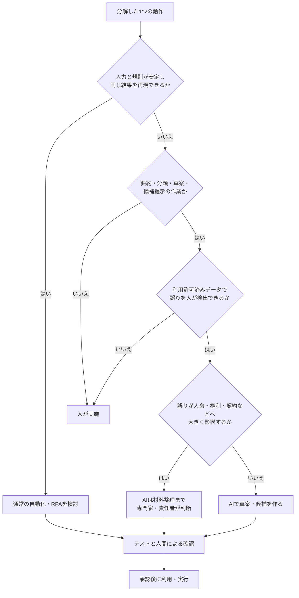
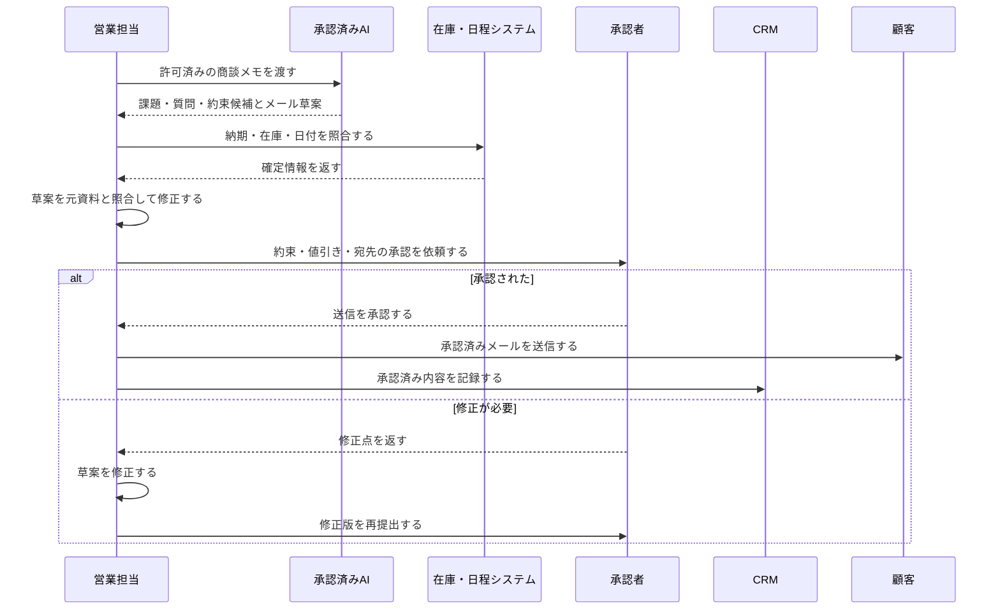

# 04 業務プロセス分析

## 1. この章の目的

AI業務効率化で最も重要な「業務分解」を学びます。製品を先に決めず、現行業務を作業、判断、例外、責任に分け、AIに任せる範囲と人が担う範囲を設計します。

この章で使う専門用語の短い説明は、[用語集](glossary.md)でも確認できます。

## 2. 学習ゴール

- 業務を開始条件から完了条件まで棚卸しできる
- AI、通常の自動化、人間の役割を切り分けられる
- 営業、事務、教育、IT、カスタマーサポートの例を分析できる
- Before / Afterを時間、品質、リスクで比較できる
- 業務改善提案書を作れる

## 3. 本編解説

### 3.1 なぜ業務分解が最重要か

「報告書をAI化する」という単位は大きすぎます。実際には、資料収集、数値確認、構成、下書き、判断、承認、配布があります。このうちAIに向くのは構成や下書きかもしれませんが、数値確定や承認は人が担います。

業務を分けないまま自動化すると、次が起こります。

- 誤った入力を高速に処理する
- 責任者不在のまま外部送信する
- 例外処理で停止し、手作業がかえって増える
- 時短した箇所の後工程で修正工数が増える

### 3.2 業務棚卸しの方法

1. **範囲を決める**：開始条件と完了条件を一文で書く。
2. **観察する**：手順書だけでなく、実際の担当者の操作と例外を確認する。
3. **作業を動詞で分ける**：「受け取る」「確認する」「転記する」「判断する」「承認する」。
4. **入出力を記録する**：情報源、形式、機密度、出力先を書く。
5. **時間と頻度を測る**：平均だけでなく、範囲や繁忙期も記録する。
6. **判断・例外・責任を明示する**：誰が何を根拠に判断するかを書く。
7. **改善候補を評価する**：効果、実現性、リスクの3軸で優先順位を付ける。

| 棚卸し項目 | 質問例 |
|---|---|
| 目的 | この業務がなくなると誰が困るか |
| 開始・完了 | 何を受け取ったら始まり、何が承認されたら終わるか |
| 入力 | どこから、どの形式で、どの機密度の情報が来るか |
| 作業 | クリック、転記、比較、文章化、判断は何か |
| 出力 | 誰に何を渡し、どこへ保存するか |
| 例外 | 欠落、重複、期限超過、苦情時にどうするか |
| 品質 | 正しさ、速さ、一貫性をどう測るか |
| 責任 | 作成、確認、承認、実行は誰か |

### 3.3 作業の分類

**RPA（Robotic Process Automation／ロボティック・プロセス・オートメーション）**とは、人が画面上で行う定型操作を、決めた規則どおりに再現する自動化です。

**RAG（Retrieval-Augmented Generation／検索拡張生成）**とは、質問に関係する資料を検索し、その抜粋をAIへ渡して回答を作る仕組みです。詳しい仕組みと限界は[08 RAGとナレッジ管理](08_rag_and_knowledge_management.md)で扱います。

| 分類 | 特徴 | AIの候補 | 注意点 |
|---|---|---|---|
| 繰り返し作業 | 規則と入力が安定 | 通常の自動化、RPA | AI不要の場合が多い |
| 文章作成 | 正解が複数、下書き可能 | 生成AI | 事実、宛先、表現を確認 |
| 情報整理 | 分類、要約、抽出 | 生成AI／ルール処理 | 欠落と取り違えを検証 |
| 調査 | 複数情報源を探す | AI検索／RAG | 一次情報、日付、網羅性 |
| 判断業務 | 影響と責任がある | 判断材料の整理まで | 最終判断・承認は人 |

入力が定型で規則が明確なら、生成AIよりRPAなどの通常の自動化の方が安定します。

### 3.4 AI・自動化・人間の切り分け

**与信**とは、取引相手の支払能力などを審査し、後払いや融資などの信用を与える判断です。人や組織の権利・資産へ大きく影響するため、AIを最終判断者にせず、担当部門・専門家が判断します。

| 判断軸 | AIに任せやすい | 人が担うべき |
|---|---|---|
| 正解 | 複数の許容解がある草案 | 法令・規程上の確定判断 |
| 影響 | 誤りを公開前に直せる | 人命、権利、雇用、与信、契約へ大きく影響 |
| 検出 | 元資料と容易に照合できる | 誤りを専門家でも見抜きにくい |
| データ | 利用許可済みの低機密データ | 入力禁止情報、過剰な個人情報、認証情報 |
| 責任 | 人の承認前の準備 | 承認、送信、支払、削除、アクセス付与 |

切り分けは「AIか人か」の二択ではありません。

- 通常の自動化：定型転記、通知、日付計算
- AI：分類、要約、草案、候補提示
- 人：例外判断、承認、対外責任、専門判断

#### 図4-1：通常の自動化・AI・人間を選ぶ判断フロー

**図の見方**：1つの動作について上から質問に答えます。規則どおりに再現できるなら通常の自動化、文章や整理ならAIが候補です。ただし、データ、誤りの見つけやすさ、影響の大きさで人へ戻します。

**講師向け説明ポイント**：「AIか人か」の二択ではなく、通常の自動化も選択肢です。また、AIを使う場合も、出力の確認と承認は独立した工程として残します。法律、医療、金融、雇用などの高リスク判断は、担当部門・専門家へ引き継ぎます。

### 3.5 Before / Afterの考え方

改善効果は「生成時間」だけで測りません。

**足切り条件**とは、他の効果が高くても、満たさなければ不採用とする最低限の基準です。品質や安全に関する重大な基準は、時間短縮と相殺せず、独立した足切り条件にします。

| 指標 | Before | After目標 | 測定上の注意 |
|---|---:|---:|---|
| 1件の総作業時間 | 25分 | 15分 | 修正・確認時間も含める |
| 一次提出の差戻し率 | 20% | 10%以下 | 品質を犠牲にしない |
| 重大誤り | 月1件 | 0件 | 件数が少なくても足切り |
| 担当者間のばらつき | 15分 | 5分以内 | 標準化効果を見る |
| 利用率 | なし | 対象者の70% | 強制利用を目的にしない |

**総便益の例**：削減時間 × 人件費相当 − ツール費 − 導入・教育・確認・運用工数。ただし金額化しにくい品質やリスクも別に評価します。

BeforeとAfterは同じ対象・期間・品質基準で比べ、Afterの作業時間にはAIの生成だけでなく、人による確認と修正も含めます。品質と安全は足切り条件とし、重大な誤りが増える場合は、時短できても改善とは判断しません。

### 3.6 部門別の業務分解例

**CS（Customer Support／カスタマーサポート）**は顧客対応を担う部門や業務、**FAQ（Frequently Asked Questions／よくある質問）**は、よく寄せられる質問と回答をまとめたものです。

| 部門・業務 | AI候補 | 人間の判断 | 例外・リスク |
|---|---|---|---|
| 営業：商談後フォロー | メモ整理、メール草案、論点抽出 | 約束内容、値引き、送信 | 顧客情報、誤った納期確約 |
| 事務：月次報告 | 文章要約、異常候補の説明 | 元数値確定、原因判断、承認 | 転記ミス、未公開数値 |
| 教育：教材作成 | 構成、例題、確認問題の草案 | 正確性、難易度、権利、採用 | 誤知識、差別的表現 |
| IT：障害一次整理 | ログ要約、類似事例候補 | 影響判定、復旧操作、報告 | 秘密情報、誤操作、古い手順 |
| カスタマーサポート（CS）：問い合わせ一次案 | 分類、FAQ候補、返信草案 | 本人確認、例外対応、送信 | 個人情報、補償確約、感情配慮 |

#### 例：営業フォローの詳細

**CRM（Customer Relationship Management／顧客関係管理）**は、顧客情報、商談、対応履歴、次の行動などを管理する仕組みです。顧客情報を連携するときは、利用権限とデータ取扱いを確認します。

| 手順 | 現状 | 改善案 | 実行／承認 |
|---|---|---|---|
| 1. メモ収集 | 各自形式 | 許可済みテンプレートへ記録 | 人 |
| 2. 要点抽出 | 手作業 | AIが課題・質問・約束候補を抽出 | AI→人確認 |
| 3. 期限確認 | 記憶頼み | 日付と社内在庫を照合 | 通常処理＋人 |
| 4. メール草案 | 手作業 | AIが固定形式で草案 | AI |
| 5. 承認・送信 | 担当者 | 事実と約束を確認して送信 | 人 |
| 6. 記録 | 手入力 | 承認後にCRMへ登録候補 | 自動化→人確認 |

#### 図4-2：営業フォローでAIと人が受け渡す流れ

**図の見方**：上部は担当者やシステム、縦方向は時間の流れです。AIは候補と草案を作りますが、納期確認、内容修正、承認、送信は人が行います。

**講師向け説明ポイント**：AIの出力と社内システムの確定情報を混同させないこと、対外的な約束の前に承認点を置くことを示します。実運用では、顧客情報の入力可否、アクセス権、ログも自社ルールに合わせて設計します。

### 3.7 業務改善提案書の作り方

**ボトルネック**は業務全体を遅らせる箇所、**データフロー**は情報がどこからどこへ渡るかを示す流れです。**PoC（Proof of Concept／概念実証）**は、本格導入前に対象と期間を限定して効果と安全性を確かめる小規模な検証です。

**責任分界**とは、作成、確認、承認、実行、事故対応を誰が担うか、役割ごとの責任範囲を明確に区切ることです。

| セクション | 書く内容 |
|---|---|
| 1. 要約 | 対象業務、課題、提案、期待効果 |
| 2. 現状 | 手順、時間、品質、データ、関係者 |
| 3. 原因 | ボトルネック、重複、判断待ち、情報不足 |
| 4. 改善後 | AI、自動化、人の役割とデータフロー |
| 5. リスク対策 | 禁止情報、レビュー、権限、ログ、停止条件 |
| 6. PoC | 対象件数、期間、採点、成功・中止基準 |
| 7. 効果 | 時間、品質、リスク、費用の指標 |
| 8. 体制 | 責任者、承認者、運用者、相談先 |
| 9. 計画 | 小規模検証、評価、展開、定着 |

テンプレートは [business_analysis_sheet.md](templates/business_analysis_sheet.md) を使います。

PoCでは架空データまたは明示的に利用を許可されたデータを使い、成功基準と停止条件を事前に定めます。本格展開は関係部門の承認後に限定範囲から始め、ログ・苦情・品質を監視し、基準を外れた場合は再検証または中止します。

## 4. 実務での使いどころ

- 研修前のヒアリングと題材選定
- 部門ワークショップで改善候補を比較
- ツール導入前のPoC範囲決定
- 経営層・情報システム・現場間の責任分界の合意

## 5. 講師メモ

- 受講者がツール名を挙げたら、「開始・完了・入力・判断・例外は何か」と問い返します。
- 付箋1枚に1動作を書かせると、隠れた転記や待ち時間が見えます。
- 削減率だけでなく、確認時間と失敗時の損失を発表させます。
- 高リスクな最終判断をAIへ移す案には、根拠と責任者を必ず尋ねます。

## 6. 演習

### 演習：月次問い合わせ報告を分解する（60分）

架空のサポート部では、毎月300件の問い合わせを担当者が分類し、上位5テーマと改善案を報告しています。

1. 開始から承認までを10〜15の動作に分けます。
2. 入力、出力、担当、時間、例外、機密度を記録します。
3. 各動作を「通常の自動化」「AI補助」「人が判断」に分類します。
4. Before / After指標を最低5つ決めます。
5. 50件の完全な架空データ（実在者の情報を加工したものではない）で行うPoCと停止条件を作ります。

**停止条件例**：個人情報の混入、分類の重大誤り、根拠のない原因断定、承認前の外部送信。

## 7. 確認問題

1. 「報告書作成」をそのままAI化してはいけない理由は何ですか。
2. 定型作業に生成AIより通常の自動化が向く場合を説明してください。
3. Before / Afterで確認時間を含める理由は何ですか。
4. AIに任せる可否を判断する4つの軸を挙げてください。
5. 改善提案に停止条件が必要なのはなぜですか。

解答例

1. 収集、数値確認、草案、判断、承認など、適性と責任が異なる作業が混在するためです。
2. 入力形式と規則が安定し、同じ結果を再現する転記・通知などです。
3. 生成だけ速くても修正が増えれば総時間は減らず、品質低下を見落とすためです。
4. 誤りの影響、誤りの検出可能性、データ機密性、責任・承認などです。
5. 許容できないリスクや品質低下が起きた際、拡大前に中止・是正するためです。

## 8. まとめ

AI業務効率化は、業務を細かい動作へ分解し、通常の自動化、AI、人間を適材適所に配置する活動です。効果は総時間、品質、リスク、費用で測り、例外・承認・停止条件まで設計します。
