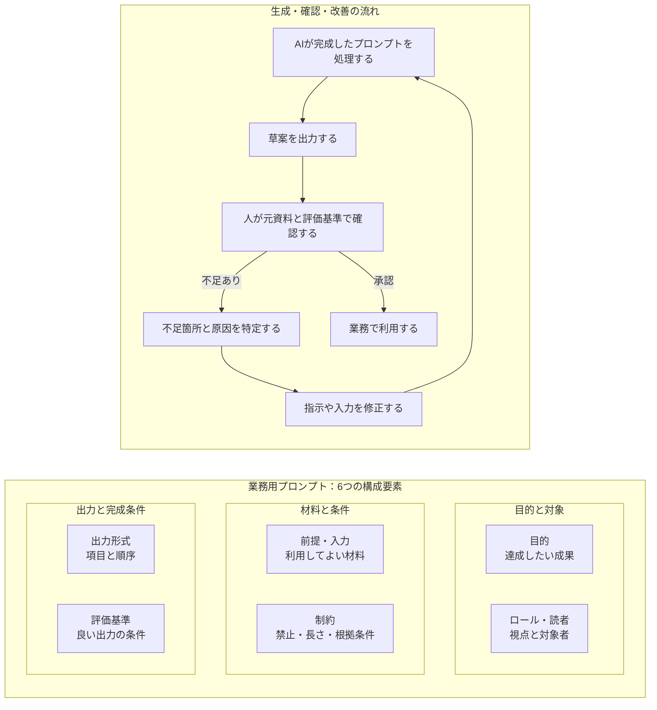
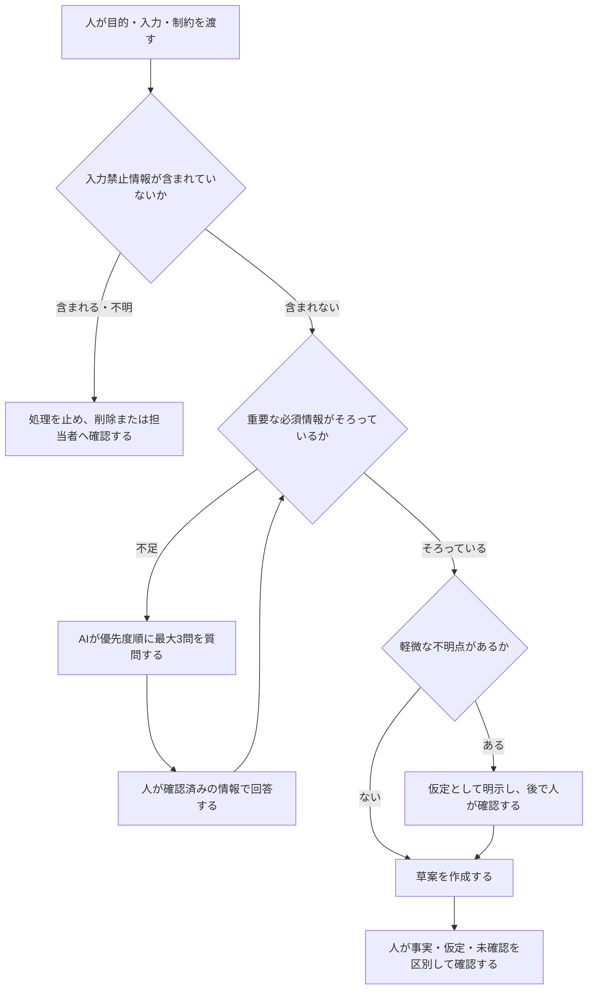
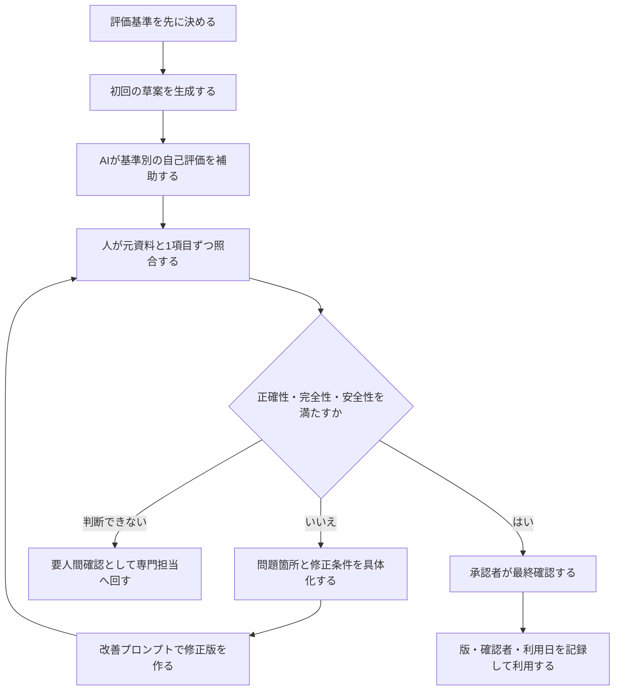
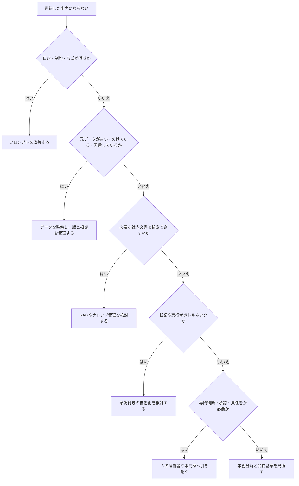

# 04 プロンプトエンジニアリング

[前の章：03 業務プロセス分析](03_business_process_analysis.md)｜[学習ガイドへ戻る](START_HERE.md)｜[次の章：05 ハルシネーションとファクトチェック](05_hallucination_and_fact_checking.md)

## この章を始める前に

| 項目 | 内容 |
|---|---|
| 前提 | [クイックスタート](setup/participant_quickstart.md)を完了し、[03 業務プロセス分析](03_business_process_analysis.md)でAIへ任せる作業を分けていること |
| 使うファイル | [初回演習用の架空会議メモ](sample-data/beginner_meeting_notes.md)、クイックスタートで作った確認済み成果物、[プロンプトテンプレート集](templates/prompt_templates.md) |
| 個人学習 | 利用条件を自分で確認した対話AIを任意で使います。入力は教材の架空会議メモだけにします |
| 組織利用 | 組織が承認したURL・業務用アカウント・保存先だけを使います。未確認ならAIを開きません |
| AIなし | [保存済みの問題出力](sample-outputs/beginner_minutes_saved_output.md)と確認済み成果物のコピーを使い、条件を1点だけ手作業で変えます |
| 成果物 | 6要素を説明したメモ、1点だけ改善した追加指示、改善後の議事録・タスク一覧、再照合記録 |
| 開始条件 | 元資料、変更前の確認済み成果物、変更する1条件、保存場所がそろっていること |
| 停止条件 | 実在情報を入力しそう、複数条件を同時に変更した、元資料と照合できない、外部共有・送信が必要になった場合は止めること |

## この章の見取り図

| 再開したい内容 | ページ内リンク |
|---|---|
| 目的と到達点を確認する | [この章の目的](#1-この章の目的)／[学習ゴール](#2-学習ゴール) |
| プロンプトの構成と改善方法を読む | [本編解説](#3-本編解説) |
| 実務での利用場面と迷いやすい点を確認する | [実務での使いどころ](#4-実務での使いどころ)／[つまずきやすい点](#5-つまずきやすい点と確認方法) |
| 確認済みプロンプトを1点改善する | [演習](#6-演習) |
| 成果物を見直して次へ進む | [実務チェックリスト](#7-実務チェックリストと振り返り)／[まとめ](#8-まとめ) |

## 1. この章の目的

思いつきの指示ではなく、他の人も再利用・評価・改善できる業務用プロンプトを設計します。

**プロンプト**とは、目的や条件をAIへ伝える指示です。**プロンプトエンジニアリング**とは、業務目的に合う指示を設計し、出力を評価・改善する考え方です。

> **進め方**：対話AIは1つだけ使えば十分です。個人学習では利用条件を自分で確認した環境、組織利用では承認済み環境を使います。この教材では完全な架空データだけを入力し、プロンプトが詳しくても人間確認は省略しません。

## 2. 学習ゴール

- 目的、前提、制約、入力、出力形式、評価基準を整理できる
- AIに不足情報を質問させ、勝手な補完を減らせる
- クイックスタートの完成プロンプトが、順不同の走り書きを決定・タスク・未決へ分類する条件を説明できる
- 完成済みの指示へ1条件だけ追加し、変更後の出力を元資料と再照合できる
- メール、議事録、報告書、提案書、FAQ（Frequently Asked Questions、よくある質問と回答）、教材へ応用できる

## 3. 本編解説

専門用語の短い説明は[用語集](glossary.md)でも確認できます。

業務用のプロンプトは、質問文だけでなく、目的、入力、前提、制約、出力形式、評価基準をまとめた指示です。業務では「小さな仕様書」と考えます。**仕様書**とは、何を、どの条件で、どの形式に仕上げるかを決めた文書です。

### 3.1 基本構造

| 要素 | 役割 | 例 |
|---|---|---|
| 目的 | 何を達成するか | 顧客が次の行動を理解できる返信を作る |
| ロール | 視点・専門性を指定 | あなたは法人営業の文章編集者です |
| 読者 | 誰向けか | ITに詳しくない既存顧客 |
| 前提 | 背景と入力の意味 | 製品停止は30分、復旧済み |
| 制約 | 禁止・長さ・文章の調子（トーン） | 300字以内、補償を確約しない |
| 入力 | AIが処理する材料 | 区切り線内の架空メモ |
| 出力形式 | 見出し・表・JSON（JavaScript Object Notation、JavaScriptオブジェクト表記法：項目名と値を組にするデータ形式）など | 件名、本文、確認事項の順 |
| 評価基準 | 良い出力の条件 | 事実のみ、謝罪、次の行動が明確 |

**基本テンプレート**

```text
目的：{達成したいこと}
役割：あなたは{役割}です。
読者：{対象者}
前提：{背景}
入力：以下の区切り線内だけを材料にしてください。
---
{教材演習では完全な架空情報。実務では組織が許可した範囲を別途確認}
---
制約：{禁止事項、長さ、表現、根拠条件}
出力形式：{項目と順序}
評価基準：{正確性、完全性、読みやすさ等}
不足情報があれば作成前に質問し、推測で補わないでください。
```

#### 図4-1：業務用プロンプトを小さな仕様書として組み立てる



**図の見方**：左の枠はプロンプトを構成する6要素であり、要素間に処理順はないため矢印を使っていません。右の枠にある実線矢印だけが、AI処理、草案、人間確認、改善または承認という実行順を表します。

**図の要点**：先に左枠を見て、長さではなく6要素が必要に応じてそろっているか確認します。次に右枠の矢印をたどり、不足があれば修正して再実行します。実在の機密情報や個人情報は使わず、架空データで各要素の効果を比較します。

### 3.2 ロール指定の使い方

ロールは魔法の専門資格ではなく、出力の視点をそろえる補助です。「世界最高の専門家」より、「社内マニュアルを初心者向けに編集するテクニカルライター」のように、仕事と読者を具体化します。ロールを指定しても資格や正確性は保証されません。

### 3.3 目的・前提・制約

- **目的**は成果で書く：「丁寧に」ではなく「顧客が期限と次の行動を理解できる」。
- **前提**は判断に必要な背景だけを書く。不要な個人情報は入れない。
- **制約**は優先順位を付ける：「事実を追加しない」「確約しない」「200〜300字」。
- 指示同士が矛盾したら、AIに質問させる。

### 3.4 出力形式の指定

**構造化形式**とは、項目名や順序などの規則を決めたデータ形式です。**形式検証**とは、出力がその規則どおりに並び、必要な項目を備えているかを確かめることです。

| 用途 | 向く形式 | 理由 |
|---|---|---|
| 人が読む | 見出し、箇条書き、表 | 確認しやすい |
| 転記する | 固定項目の表 | 欠落を見つけやすい |
| システム連携 | JSON等の構造化形式 | 機械処理しやすいが形式検証が必要 |
| 意思決定 | 選択肢、根拠、リスク、推奨 | 結論だけの暴走を防ぐ |

JSONは、「項目名」と「値」を組にしてシステムが読み取りやすく表します。形が正しくても、内容の事実性や安全性は別途検証します。

### 3.5 追加質問させる方法

```text
作成に必要な情報を確認してください。
重要な不足がある場合は、最大3問を優先度順に質問し、回答を待ってください。
軽微な不足は「仮定」として明示し、事実として補わないでください。
```

AIが質問しない場合もあるため、人が入力チェックリストを使うことが基本です。

#### 図4-2：不足情報を推測で埋めさせない対話フロー



**図の見方**：不足があるときは、AIが勝手に補うのではなく質問します。人が答えられない軽微な点だけを、明示した仮定として扱います。

**図の要点**：「質問させれば安全」とは限らないため、入力チェックリストと人の確認を併用します。重要情報が未確認なら生成を続けない停止条件も、プロンプトと運用手順に含めます。

### 3.6 評価・改善プロンプト

初回出力をそのまま採用せず、完成条件に照らして確認します。

ここでいう**完全性**は必要な項目に抜けがないこと、**明確性**は読み手が複数の意味に取り違えにくいことです。

```text
次の草案を、正確性・完全性・明確性・安全性・読者適合（対象読者の知識と目的に合うか）の観点で
「満たす・一部満たす・満たさない・要人間確認」に分類してください。判断根拠、問題箇所、修正案を表で示してください。
入力にない事実を追加していないかを最優先で確認してください。
評価後、修正版を提示してください。修正できない点は「要人間確認」としてください。
```

AIによる自己評価は補助であり、元資料との照合を置き換えません。

#### 図4-3：生成・評価・改善を繰り返す品質向上ループ



**図の見方**：AIの自己評価の後に、必ず人が元資料と照合します。完成条件を満たすまで修正し、判断できない点は専門担当へ渡します。

**図の要点**：文章の自然さではなく、事前に決めた完成条件で確認します。法律、医療、金融などの判断は、プロンプトの改善だけで完結させず、必要な専門家確認へつなげます。

### 3.7 比較検討プロンプト

```text
候補A〜Cを、必須条件への適合、期待効果、リスク、導入負荷（準備・教育・運用に必要な手間）、総費用の5軸で比較してください。
事実と仮定を分け、情報不足は「不明」としてください。
結論を1つに固定せず、条件別の推奨と追加確認事項を示してください。
```

### 3.8 業務別プロンプト例

| 業務 | 指示の核 | 人間の確認 |
|---|---|---|
| メール | 読者、目的、事実、トーン、長さ、禁止する約束 | 宛先、日時、金額、確約 |
| 議事録 | 発言メモから決定・未決・担当・期限を分離。不明は不明 | 決定の有無、担当者、期限 |
| 報告書 | 事実、解釈、提案を分け、数値を改変しない | 数値、因果、経営判断 |
| 提案書 | 課題、現状、解決案、効果指標、リスク、次の行動 | 実現性、費用、契約表現 |
| FAQ | 質問の重複統合、根拠文書ID（文書を識別する番号や記号）、未記載は回答しない | 根拠、最新版、公開範囲 |
| 教材 | 対象、前提、到達目標、説明、例、演習、完成条件 | 正確性、難易度、権利、安全性 |

詳細な再利用テンプレートは [prompt_templates.md](templates/prompt_templates.md) を使います。

実務形式で練習する場合は、[引継ぎメモから業務マニュアルを作る演習](exercises/business_manual_creation_exercises.md)で不足確認と4ケースの紙上実行を行い、次に[プロンプト受入テスト演習](exercises/prompt_acceptance_testing_exercises.md)で通常・境界・例外ケースに対する再現性を確かめます。良い文章が1回出たことと、業務で繰り返し使えることは同じではありません。

AI出力は未完成の草案です。表の「人間の確認」を基に、各業務で間違えると困る項目を追加し、人が確認・承認してから利用します。

テレビ会議の自動文字起こしを材料にする場合は、通常の会議メモより確認項目が増えます。特に、**話者、数字、否定表現、固有語、決定と提案、担当、期限、聞き取り不明**を人が確認します。時刻情報がある場合、タイムスタンプ（発言の位置を示す時刻）は、許可された録画や当事者確認へ戻るための手掛かりにできますが、文字起こしの正しさを証明するものではありません。時刻情報がない場合は、重要発言のおおよその経過時刻を人の補助メモへ残します。

ZoomとMicrosoft Teamsに共通する準備から終了処理までを練習する場合は、[テレビ会議議事録の実践演習](exercises/video_meeting_minutes_exercises.md)へ進みます。基本演習は保存済みの完全な架空文字起こしで完結し、製品アカウントは不要です。実機で文字起こしを試す場合は、まず[02 セキュリティとプライバシー](02_security_and_privacy.md)を学び、組織の承認、参加者への説明、必要な同意、保存・閲覧・削除条件を事前に確認します。架空台本を読み上げても、実機が取得する声、表示名、顔、接続情報は実在参加者のデータとして扱います。

### 3.9 プロンプトだけで解決しない問題

- 元データが誤っている、古い、欠けている
- 業務の承認者や品質基準が決まっていない
- ツールに必要な文書へのアクセス権（閲覧・編集・利用を許可する設定）がない
- 法的・専門的判断が必要
- 毎回のコピー操作がボトルネック（業務全体の速度を最も妨げる工程）で、自動化設計が必要

**RAG（Retrieval-Augmented Generation、検索拡張生成）**とは、関係する資料を検索し、その抜粋をAIへ渡して回答させる仕組みです。**ナレッジ管理**とは、社内の知識を更新、検索、再利用できる状態に保つ活動です。

この場合は、データ整備、業務設計、RAG、ナレッジ管理、自動化、専門家確認へ進みます。

#### 図4-4：プロンプト改善で解決できない問題の切り分け



**図の見方**：原因が指示文にある場合だけプロンプトを直します。データ、検索、実行、責任の問題は、それぞれ別の仕組みや人へつなぎます。

**図の要点**：「もっと詳しく指示する」を万能策にしないための図です。問題の種類を診断してから、RAG、自動化、専門家確認、業務再設計のどれへ進むかを選びます。

## 4. 実務での使いどころ

- 部門で共通利用するメール・報告書テンプレートの標準化
- 自分の業務で「入力→処理→出力→確認」を確かめる操作例
- AI出力の品質評価表を作る
- 自動化前の処理仕様書としてプロンプトを試す
- 同じ通常・境界・例外ケースで改善前後を比較し、利用範囲と停止条件を決める

## 5. つまずきやすい点と確認方法

- プロンプトを呪文集として覚えず、仕事の要件定義として読みます。**要件定義**とは、目的、必要な機能、制約、完成条件を実施前に明確にすることです。
- 悪い指示と改善版は同じ入力で比較し、何が変化の原因かを1文で記録します。
- 「一発で完成」を目指さず、「不足を質問し、検証して直す」過程を残します。
- 個人情報を伏せ字にするだけでは、部署、日時、役職などの組合せから本人が分かる**再識別**が起こる場合があるため、この教材では架空データだけを使います。

## 6. 演習

### 演習：完成プロンプトを1点改善する

この演習では、[クイックスタート](setup/participant_quickstart.md)と同じ完全架空ケースを使います。詳しい画面操作とWord・Excelへの仕上げ方はクイックスタートを参照し、この章では「完成プロンプトの構成」と「変更後の再検証」に集中します。

#### 利用環境の準備確認

- 基本ツールは組織が指定した対話AIです。URL、業務用アカウント、入力禁止情報、相談先、保存先を確認します。
- 組織利用では管理者発行の業務用アカウントを使い、教材にある完全な架空データだけを入力します。
- AIを利用できない場合は、[保存済みの問題出力](sample-outputs/beginner_minutes_saved_output.md)または紙上ワークを使います。外部共有・送信は行いません。

#### 手順付き練習：完成プロンプトの構造を読む

- クイックスタートを完了している人は、そこで使用した完成プロンプトと、確認済みの議事録・タスク一覧を比較用に開きます。
- クイックスタートをまだ行っていない人だけ、先に一度完了してからこの章へ戻ります。

クイックスタートの完成プロンプトを見ながら、各部分の役割を確認します。

| プロンプトの部分 | このケースで指定していること |
|---|---|
| 役割 | 社内会議の記録を整理するアシスタント |
| 目的 | Word用議事録とExcel用タスク一覧を作る |
| 読者 | 会議参加者と研修運営の関係者 |
| 入力 | 区切り線内にある、完全架空で順不同の会議メモ |
| 制約 | 未知の決定、担当、期限などを補わず、法務確認が必要という状態を保つ |
| 出力形式 | 議事録と、タスク・担当・期限の3列をタブで区切った一覧 |

クイックスタートでは、すでに「タスク一覧を期限の早い順へ並べる」という具体的な改善を行いました。この章では同じ並べ替えを繰り返さず、別の1条件を変えて影響を比較します。

#### この章の開始状態を選ぶ

クイックスタートですでに、順不同の走り書きを決定事項、タスク、未決事項へ分類し、元資料との照合まで行っています。この章では同じ生成・分類を最初からやり直しません。

| 現在の状態 | この章での開始方法 |
|---|---|
| クイックスタートのAI会話が残っている | その会話と、確認済みの議事録・タスク一覧を基準にする |
| 確認済み成果物はあるが、AI会話が残っていない | クイックスタートの完成プロンプトを新しい会話へ1回だけ送信し、元資料と照合して基準出力を再現する。同じ指示を繰り返さない |
| AIを利用できない | 確認済み成果物を紙またはMarkdownで開き、選んだ1条件だけを人の手で書き換える |
| クイックスタート自体が未完了 | 先にクイックスタートを完了してから戻る |

照合の正本は[初回演習用の架空会議メモ](sample-data/beginner_meeting_notes.md)です。AIとの過去の会話や完成成果物を正本にはしません。改善後は次の表をもう一度使います。

| 確認項目 | 元資料で確認する値 | 判定・修正 |
|---|---|---|
| 会議情報 | 架空AI研修運営改善会議／2026-07-08 |  |
| 参加役割 | 4役割が過不足なくある |  |
| 決定事項 | 3件が決定として記載されている |  |
| タスク | タスク名・担当・期限の3組が一致する |  |
| 未決事項 | 録画、フォローアップ会、次回会議の3件が未決のまま記載されている |  |
| 次回会議 | 日付、時刻、会場を作っていない |  |
| 入力外の補完 | 未知の決定・担当・期限・日時・会場・人物がない |  |
| Excel用形式 | 見出し1行と3行、3列、タブ区切り |  |

不一致がある場合は、AIに正解を考えさせず、元資料の該当箇所を根拠に修正を指示します。

#### 実務演習：別の1条件を改善する

次のどちらか一つを選びます。一度に複数箇所を変えないことで、どの指示が出力へ影響したかを確認しやすくします。

| 選択 | 追加する指示の例 |
|---|---|
| 読み手 | `Word貼り付け用議事録は、会議へ参加していない引継ぎ担当者にも分かる表現にしてください。略語は使わず、それ以外の事実とExcel貼り付け用タスク一覧は変更しないでください。` |
| 要約 | `Word貼り付け用議事録の先頭に「3行要約」を追加し、決定事項3件だけを1件1行で要約してください。それ以外の事実とExcel貼り付け用タスク一覧は変更しないでください。` |

1. 選んだ追加指示が、完成プロンプトの「読者」または「出力形式」の一つだけを変えるものだと確認します。
2. AI会話を使える場合は、基準出力を作った同じ会話へ追加指示を1回送ります。
3. AIを利用できない場合は、確認済み成果物のコピーへ、同じ条件による変更を人の手で加えます。元の成果物は書き換えません。
4. 指定した1点だけが変わったかを、クイックスタートの確認済み成果物と比較します。
5. 上の照合表を使い、決定3件、タスク3件、未決3件を再照合します。
6. 確認済みの改善版だけを指定保存先へ仕上げます。Officeを使えない場合はMarkdownまたは紙上で同じ構成を作ります。

#### 人間レビュー

元資料と改善後の出力を横に並べ、一項目ずつ見比べます。特に、読み手や要約を変えただけなのに、決定・担当・期限が変わっていないか確認します。録画、フォローアップ会、次回会議の日時・会場・担当・期限はAIに決めさせません。学習仲間がいる場合の相互確認は任意です。

#### 振り返り

- 追加した1行は、出力のどこを変えましたか。
- 変更を指示していない箇所まで変化しましたか。
- なぜ読み手や出力形式の条件を変えた後にも、事実を全件再照合する必要がありますか。

**成果物**：1点を改善する追加指示、確認済みのWord用議事録、Excel用タスク一覧。Officeを使えない場合はMarkdownまたは紙上の同等成果物。

**完成条件**：入力外の決定・担当・期限・日時・会場・人物を追加せず、改善後にも全事実を人が再照合していること。成果物を外部共有・送信していないこと。

### 演習の観察と改善

| 完成条件 | 自己点検 | 改善ポイント |
|---|---|---|
| 完成プロンプトの要素を説明できる | 目的、役割、読者、入力、制約、出力形式、完成条件を区別できるか | 指示の各行が必要な理由を書き添える |
| 改善点を一つに絞っている | 読み手と要約を同時に変えていないか | 一度に一つだけ変更して差を観察する |
| 基準出力を再生成しすぎない | 既存チャットを再利用し、ない場合だけ1回再現したか | 同じ完成プロンプトを何度も送る |
| 決定・タスク・未決を保っている | 未決事項へ未知の担当・期限を補っていないか | 元資料へ戻り、未知の値を「未決」にする |
| 変更後も人が照合している | 改善後の全件を確認したか | 基準出力だけを確認し、改善版は無確認にする |

### 自分の業務への転用メモ

実データをAIへ入力せず、次の穴埋めだけを行います。

| 項目 | 記入欄 |
|---|---|
| 業務名 |  |
| AIへ依頼したい変換・整理 |  |
| 使用する元資料の種類 |  |
| 入力可否を確認する相手 |  |
| 人が照合する項目 |  |
| 誤りが見つかったときの戻り先 |  |
| 停止条件 |  |

このメモは利用許可ではありません。実施前に上司、情報システム、情報セキュリティ等の指定窓口へ相談します。

## 7. 実務チェックリストと振り返り

この節では、プロンプトを実務で再利用する前の状態を自分で確認します。

- [ ] 目的、読者、前提、入力、制約、出力形式、完成条件を必要に応じて記載した
- [ ] 不足情報を推測せず、質問または「要確認」にする指示がある
- [ ] 入力禁止情報を除き、利用を承認された環境だけを使っている
- [ ] AIの自己評価とは別に、人が元資料を照合した
- [ ] プロンプトで解決できない問題を、データ整備、RAG、自動化、責任者、専門家へ切り分けた

**振り返り**：今回の改善で最も効果があった要素は何ですか。また、プロンプトをさらに長くするより業務手順を直すべき点はどこですか。

## 8. まとめ

業務用プロンプトは、目的、読者、前提、入力、制約、出力形式、評価基準を持つ小さな仕様書です。確認済みの基準出力を再利用し、改善は一度に1条件ずつ行います。形式を変えた後にも、変更していない箇所を含めて元資料と再照合します。

## 9. 自己点検と次の章

1. 先に、追加指示、改善後の成果物、再照合記録を自分用の場所へ保存します。
2. [04 プロンプトエンジニアリング：自己点検](self-check/chapters/04_prompt_engineering_self_check.md)を開き、まず「段階ヒント」だけで見直します。
3. 「一致必須」「成果物例」「成立する別解」「危険な状態」を順に確認します。
4. 最後に、追加指示または再照合記録のどちらか1点を修正して再保存します。

[前の章：03 業務プロセス分析](03_business_process_analysis.md)｜[学習ガイドへ戻る](START_HERE.md)｜[次の章：05 ハルシネーションとファクトチェック](05_hallucination_and_fact_checking.md)
