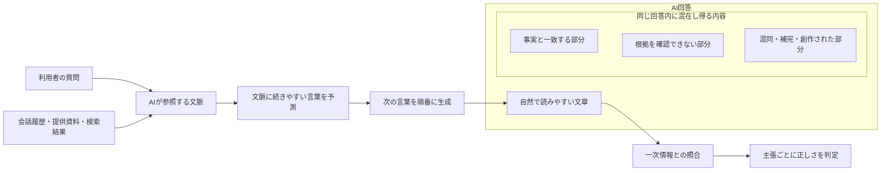
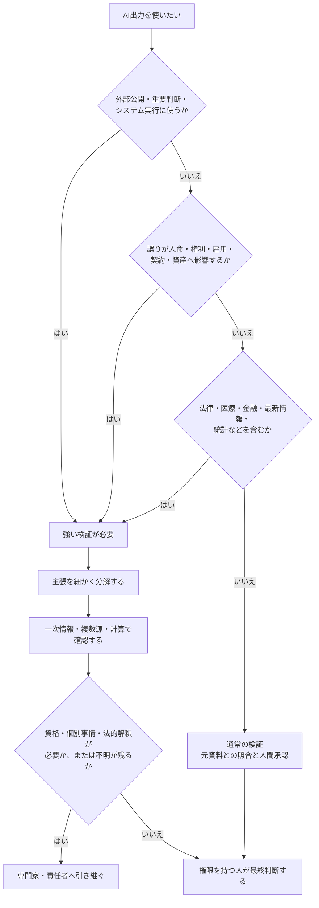
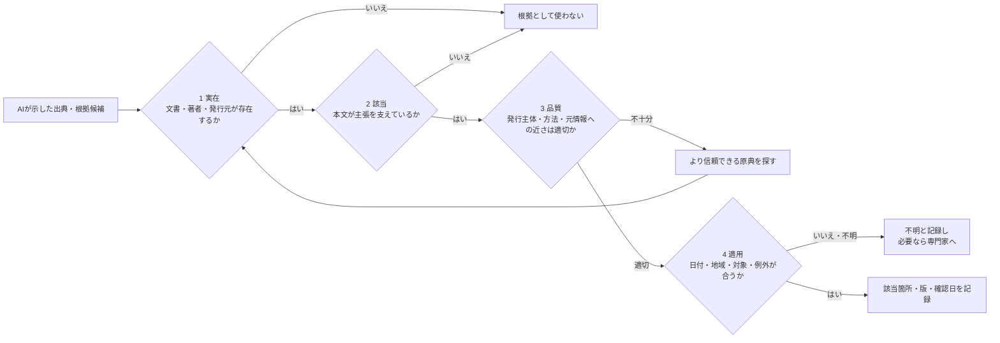
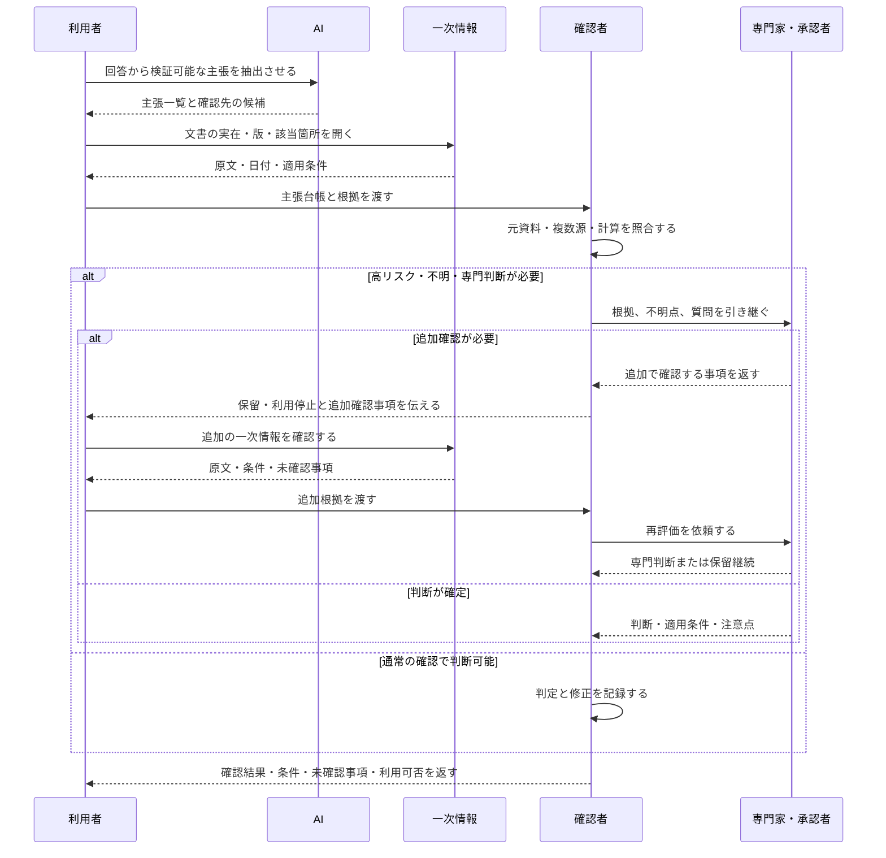

# 05 ハルシネーションとファクトチェック

> **[学習マップ](START_HERE.md) ｜ 必修編 ｜ ステップ 6 / 11**
> [← 前：04 プロンプトエンジニアリング](04_prompt_engineering.md) ・ [次：06 著作権とAIガバナンス →](06_copyright_and_ai_governance.md) ・ [この章の自己点検](self-check/chapters/05_hallucination_and_fact_checking_self_check.md)

> **位置付け：初心者必修**　AIの回答を業務で使う前に、事実と根拠を自分で確かめるための章です。

## この章を始める前に

| 確認項目 | 内容 |
|---|---|
| 前提 | [01 生成AIの基礎](01_generative_ai_basics.md)、[02 セキュリティとプライバシー](02_security_and_privacy.md)、[03 業務プロセス分析](03_business_process_analysis.md)、[04 プロンプトエンジニアリング](04_prompt_engineering.md)を先に学ぶ |
| 使う収録ファイル | AI出力の誤り分析には[架空のテレビ会議文字起こし](sample-data/video_meeting_transcript.md)、[照合用メモ](sample-data/video_meeting_verification_notes.md)、[誤りを含むAI議事録案](sample-outputs/video_meeting_ai_minutes_problem.md)を使える |
| 成果物 | 主張と出典の記録、判定、修正文、確認日をまとめた`05_ファクトチェック記録.md` |
| 開始条件 | 下の2経路から1つを選び、承認・利用条件を確認した対話AI、入力データ、保存場所、確認に使う原文を特定できている |
| 停止条件 | 対話AIを利用できない、実在する非公開情報を入力しそう、一次情報を開けない、対象・日付・適用範囲が不明、高リスクな個別判断が必要 |

### 利用環境を1つ選ぶ

| 経路 | 進め方 |
|---|---|
| 個人学習 | 自分で利用条件とデータ設定を確認した対話AI・検索サービスを使う。公開情報と教材の架空データだけを扱う |
| 組織利用 | 組織が承認したアカウントとブラウザだけを使う。不明な設定や入力可否は正式窓口へ確認し、確認できるまで送信しない |

> **修了条件**：未検証の文章を対話AIで主張に分解し、公式原文と照合する**AIの実操作**が必要です。収録済みAI出力は誤り分析の材料であり、AIを操作しない代替経路ではありません。対話AIまたは一次情報を利用できない場合は、環境を準備できるまで演習を停止します。

## この章の見取り図

| 再開したい内容 | ページ内リンク |
|---|---|
| 目的と到達点を確認する | [この章の目的](#1-この章の目的)／[学習ゴール](#2-学習ゴール) |
| ハルシネーションと確認手順を読む | [本編解説](#3-本編解説) |
| 実務での利用場面と迷いやすい点を確認する | [実務での使いどころ](#4-実務での使いどころ)／[つまずきやすい点](#5-つまずきやすい点と確認方法) |
| 主張・出典・原文を照合する | [手順付き練習](#6-手順付き練習) |
| 成果物を見直して次へ進む | [実務チェックリスト](#7-実務チェックリストと振り返り)／[まとめ](#8-まとめ) |

## 1. この章の目的

自然で自信のあるAI回答を「正しい情報」と誤認せず、主張を分解して一次情報で検証する手順を身につけます。

この章で使う専門用語の短い説明は、[用語集](glossary.md)でも確認できます。

**エスカレーション**とは、自分だけで判断せず、責任者や専門家へ判断を引き継ぐことです。

## 2. 学習ゴール

- ハルシネーションの意味と発生理由を初心者へ説明できる
- 誤りが起きやすい場面と高リスク領域を識別できる
- 出典の実在性、該当箇所、日付、適用範囲を確認できる
- 検証結果を「確認済み・不明・誤り」に分けて記録できる
- 専門家へエスカレーションする条件を決められる

## 3. 本編解説

### 3.1 ハルシネーションとは

**ハルシネーション**は、AIが事実と異なる内容、存在しない出典、入力にない数字などを、もっともらしく生成する現象です。単純な嘘とは異なり、AIが意図してだましていると考える必要はありません。

例：存在しない規程条文を引用する、会議メモにない決定を補う、架空の統計を具体的な数値で示す。

### 3.2 なぜもっともらしい誤情報が出るのか

- LLM（Large Language Model／大規模言語モデル）の基本動作は、文脈に合う言葉を生成することで、事実を保証することではない
- 質問に前提不足や誤りがあっても、回答を続けようとする場合がある
- 学習時点以降の情報、非公開情報、非常に細かい情報を持たない場合がある
- 複数の似た人物、制度、版、数字を混同する場合がある
- 提供資料自体が古い、矛盾、欠落している場合がある

**RAG（Retrieval-Augmented Generation／検索拡張生成）**は、質問に関係する資料を検索し、その抜粋をAIへ渡して回答を作る仕組みです。検索やRAGを組み合わせても、検索漏れ、誤った引用、文脈の取り違え、生成時の誤りは残ります。詳しい仕組みと限界は任意発展の第08章で扱います。

#### 図5-1：もっともらしい回答と事実確認が別である理由



**図の見方**：実線の矢印は、質問と文脈から文章を生成し、完成した回答を一次情報と照合して判定する処理の順番です。「AI回答」枠の内側にある3つの箱は処理の分岐ではなく、正しい部分、未確認の部分、誤った部分が同じ回答内に混在し得ることを示します。枠内の`~~~`は配置だけに使う見えない接続です。

**図の要点**：回答全体を一括して「正しい」「誤り」と見ず、回答内の主張を分けて照合します。「流暢さ」「自信のある言い方」「細かな数字」は正しさの証拠ではありません。検索やRAGを使った場合も、取得した資料と最終回答を人が照合します。

### 3.3 起きやすい場面

| 場面 | 典型的な誤り | 対策 |
|---|---|---|
| 固有名詞・細かな経歴 | 人物・組織の混同 | 公式プロフィールで確認 |
| 日付・件数・割合 | 数字の創作、単位違い | 元表と計算を照合 |
| 出典・URL | 存在しない論文やリンク | 実際に開き、本文を読む |
| 最新情報 | 古い制度・機能 | 発表日と更新日を確認 |
| 長文要約 | 重要条件の欠落 | 原文の該当箇所と比較 |
| 曖昧な会議メモ | 提案を決定扱い | 決定・提案・未決を分離 |
| 専門領域 | 適用条件の省略 | 専門家レビュー |

### 3.4 高リスク領域

金融でいう**適合性**とは、金融商品や提案が顧客の知識、経験、目的、資産状況などに合っているかという確認です。個別の適合性判断はAIへ任せず、担当者や金融・法務の専門家へ確認します。

統計でいう**母集団**とは、調査や統計の結論を当てはめようとしている対象全体です。調査対象の一部だけを見て、母集団全体へ無条件に当てはめないようにします。

| 領域 | 注意する理由 | 最低限の対応 |
|---|---|---|
| 法律 | 地域、時点、契約、個別事情で結論が変わる | 法令原文・公的資料を確認し、法律専門家へ |
| 医療 | 個人差が大きく、人命・健康へ影響 | 医療専門家へ。診断・治療判断を委ねない |
| 金融 | 損失、規制、適合性、最新相場が関係 | 公式開示を確認し、金融・法務専門家へ |
| 最新情報 | 情報が変化し、学習時点に限界 | 日付を明記し、一次情報を複数確認 |
| 統計 | 母集団、期間、定義、単位で意味が変わる | 元データ、調査方法、表番号を確認 |

AIは論点整理や確認項目の作成には使えますが、専門家の最終判断を置き換えません。

**原典**は引用や解説の元になった文書、**原著論文**は研究者が研究結果を最初に報告した論文です。解説だけで結論を確定せず、可能な範囲で原典を確認します。ただし、専門的な解釈が必要な場合は有資格者・担当専門家へ引き継ぎます。

#### 図5-2：用途と影響度から検証の強さを決める



**図の見方**：上から用途と誤りの影響を確認します。高リスク領域や外部公開は検証を厚くし、個別判断や不明点が残る場合は専門家へ引き継ぎます。

**図の要点**：AIを使うかどうかだけでなく、「どこまで補助に使い、誰が最終判断するか」を決める図です。法律、医療、金融などでは一般的な論点整理にとどめ、原典と最新情報を確認したうえで有資格者・担当専門家へつなぎます。

### 3.5 出典確認の4段階

**一次情報**は、法令原文、公的統計、公式発表、原著論文、当事者の記録など、主張の元に近い情報です。ここでいう情報の**一次性**は、その情報が元の出来事、データ、発表にどれだけ近いかという意味です。一次情報でも、古い版、対象外の地域、例外条件があるため、内容まで確認します。

**正規ドメイン**は、その発行主体が公式に使っているWebサイトのアドレス部分です。検索結果に「公式」と表示されても、似た文字の別ドメインや広告の場合があるため、組織の公式トップページ等からたどれるかも確認します。**発行主体**は内容に責任を持って公表した組織・人、**訂正・撤回**は公開後に誤り等を直す、または内容を取り下げることです。

1. **実在**：その文書、URL、著者、発行元が存在するか。
2. **該当**：引用箇所が本当に主張を支えているか。
3. **品質**：一次情報か、責任ある発行主体か、方法が示されているか。
4. **適用**：日付、地域、対象、例外が今回の条件に合うか。

| 情報源 | 一般的な優先度 | 使い方 |
|---|---:|---|
| 法令原文、公的統計、公式発表、原著論文 | 高 | 主張の根拠として本文を確認 |
| 公式マニュアル、契約、社内一次資料 | 高 | 版と適用範囲を確認 |
| 専門機関の解説 | 中 | 原典への導線と解釈の補助 |
| 報道、専門メディア | 中 | 複数確認し一次情報へ戻る |
| ブログ、SNS（ソーシャル・ネットワーキング・サービス）、AI生成文 | 低〜手掛かり | 根拠として確定せず原典を探す |

「出典付きのAI回答」でも、リンクが実在するだけでは不十分です。

#### 図5-3：出典を4つの関門で確認する



**図の見方**：左から4つの関門を順番に通します。URLが開けても「実在」を通過しただけです。本文が主張を支えるか、情報源の品質は十分か、今回の条件に適用できるかまで確認します。

**図の要点**：各関門では実際のページを開き、該当箇所と前後の例外条件を読みます。法令、医療資料、金融情報などの解釈は、原文確認だけで完結させず専門家確認へつなぎます。

### 3.6 そのまま使ってはいけない理由

**説明責任**とは、AI出力をなぜ採用したか、何を根拠に誰が確認・承認したかを説明できる状態にする責任です。

- 誤りが自然な文体に隠れる
- 入力にない断定や数字が追加される
- 差別的・不適切な表現が混ざる可能性がある
- 著作権、個人情報、機密情報など別のリスクもある
- 公開・送信した組織と人が説明責任を負う

### 3.7 ファクトチェックの実践手順

| 手順 | 作業 | 記録すること |
|---:|---|---|
| 1 | 用途と影響度を決める | 社内草案／外部公開、高・中・低リスク |
| 2 | 検証可能な主張へ分解 | 人、日付、数値、因果、引用、規則 |
| 3 | 根拠候補を集める | 発行元、文書名、URL、版、日付 |
| 4 | 原文の該当箇所を読む | ページ、節、表番号、前後条件 |
| 5 | 複数源・計算で照合 | 一致、不一致、定義差 |
| 6 | 結果を分類 | 確認済み／誤り／不明／専門家確認 |
| 7 | 修正・承認・保存 | 修正者、確認者、確認日、残る不確実性 |

**主張台帳**とは、AI回答を検証できる主張へ分け、根拠、判定、対応を1件ずつ記録する表です。

| ID | AIの主張 | 影響 | 判定 |
|---|---|---|---|
| C-01 | FAQは6/27公開 | 中 | 誤り |
| C-02 | 窓口はサポート部 | 中 | 不明 |

| ID | 確認した根拠 | 対応 |
|---|---|---|
| C-01 | 会議メモは「初稿」 | 初稿期限へ修正 |
| C-02 | 部長承認前 | 承認後に確定 |

出典は、主張台帳と別の「出典確認表」にすると横幅を抑えられます。1つの主張に複数の一次情報がある場合は、出典IDを複数ひも付けます。

出典そのものの情報と、鮮度・有効性の確認を分け、同じ出典IDで結びます。

| 出典ID | 公式URL・正規ドメイン | 発行主体 | 文書名・版 |
|---|---|---|---|
| S-01 |  |  |  |

| 出典ID | 公開・更新・適用日 | 訂正・撤回 | 相反する一次情報 | 確認日 |
|---|---|---|---|---|
| S-01 |  | なし／あり／不明 | なし／あり／未調査 | YYYY-MM-DD |

「相反する一次情報」は、別の公式文書が違う内容を示していないかという確認です。相反がある場合は、発行主体、文書の上下関係、新旧の版、適用日、対象範囲を調べ、解釈が必要なら責任者・専門家へ引き継ぎます。訂正・撤回欄が「不明」のままなら、その不確実性も利用判断に残します。

#### 図5-4：AI回答を主張単位で検証・処理する流れ

```mermaid
flowchart TD
    A["AI回答と利用目的を受け取る"] --> B["人名・日付・数値・因果・引用・規則へ分解"]
    B --> C["各主張にIDと影響度を付ける"]
    C --> D["一次情報の該当箇所を確認する"]
    D --> E["必要に応じて複数源・元計算と照合する"]
    E --> F{"主張ごとの判定"}
    F -->|確認済み| G["根拠・版・確認日を記録"]
    F -->|誤り| H["正しい内容へ修正し再確認"]
    F -->|不明| I["断定を外す・追加調査する"]
    F -->|専門家確認| J["資料と質問を添えて引き継ぐ"]
    H --> D
    I --> K{"期限内に確認できたか"}
    K -->|はい| D
    K -->|いいえ| L["利用しない、または不明と明示"]
    G --> M["人間の確認者・承認者が用途別に判断"]
    J --> M
    L --> M
```



**図の見方**：回答全体に一度だけ丸を付けるのではなく、確認できる主張へ分けます。各主張を「確認済み」「誤り」「不明」「専門家確認」に分類し、それぞれ異なる処理をします。

**図の要点**：確認できない主張は、文章の自然さだけで採用しません。外部公開前には、根拠と修正履歴を残し、用途に責任を持つ人が最終承認します。

### 3.8 AIを検証補助に使うとき

```text
次の文章から検証可能な主張を1行1件で抽出してください。
主張の種類（数値・日付・固有名詞・因果・引用・規則）、誤りの影響、
確認すべき一次情報を表にしてください。
真偽は推測せず、不明は不明としてください。
```

これは確認項目の抽出であり、真偽判定そのものではありません。

#### 図5-5：検証でAIに任せる部分と人が担う部分



**図の見方**：AIは主張を抜き出し、確認先の候補を作るところまで補助します。追加確認が必要な間は保留して利用せず、一次情報を追加して専門家へ再評価を依頼します。最後の返答は必ずしも承認ではなく、利用可、条件付き、保留、利用不可を含みます。

**図の要点**：AIに「この回答は正しいですか」と再質問しても独立した検証にはなりません。同じ誤りを繰り返す可能性があるため、AIとは別の一次情報、人間の確認者、必要な専門家を検証経路に入れます。

### 3.9 自動文字起こしとAI議事録を検証する

自動文字起こしは、音声認識による誤りを含む**未確認資料**です。さらにAIで要約すると、文字起こしの誤りを引き継ぐだけでなく、決定・担当・期限を自然な文章で補ってしまう場合があります。そのため、次の順で確認します。

1. 数字、日付、否定表現、固有語、話者、決定、担当、期限、聞き取り不明を抽出する。
2. 時刻情報がある場合はタイムスタンプを手掛かりにし、ない場合は人の補助メモを使って、組織が利用を許可した録画・録音、会議中の人のメモ、当事者・議長の確認へ戻る。
3. 確認できた事実だけを議事録へ反映する。時刻は確認場所であり、それだけでは内容の正しさを証明しない。
4. 情報が食い違う、録画へアクセスできない、発言が不明瞭な場合は、推測せず「要確認」とする。
5. 議長または業務責任者が、決定・タスク・未決事項を承認してから共有する。

録画や文字起こしへアクセスできることと、確認目的で再生・ダウンロード・AI入力してよいことは別です。権限、目的、参加者への説明、必要な同意、保存・削除の条件は第02章と自組織の規程に従います。実践は、実会議を使わずに行える[Zoom・Teams共通のテレビ会議議事録演習](exercises/video_meeting_minutes_exercises.md)を使用してください。

## 4. 実務での使いどころ

- 調査レポートや提案書の公開前レビュー
- 会議メモやテレビ会議の自動文字起こしから作った議事録について、決定事項・担当・期限・根拠時刻を照合
- 社内FAQやRAG回答の評価
- 「自然さと正しさは別」であることを説明する社内共有資料
- 対話AIで主張を分解し、Perplexity等で出典候補を探し、公式サイトの原文で確定する調査演習

## 5. つまずきやすい点と確認方法

- **回答全体を一度に判定する**：人名、数値、日付、条件、因果関係など、1件ずつ確かめられる主張へ分け直します。
- **AIへ聞き直して確認済みにする**：同じ誤りを繰り返す可能性があるため、AIとは別の一次情報を開きます。
- **出典タイトルだけを見る**：本文の該当箇所、前後の例外、版、確認日まで記録します。
- **一般情報を個別助言へ変える**：法律、医療、金融などは一般的な論点整理で止め、担当者または有資格の専門家へ確認します。

## 6. 手順付き練習

### 演習：対話AIの誤答候補を検索サービスと公式原文で検証する

この演習では、対話AIの文章を「未検証の回答候補」として扱います。Perplexity等の検索サービスが示した出典もそのまま信じず、リンク先の公式サイトを開いて該当箇所を人間が読みます。Perplexityを選ぶ場合は[Perplexity演習環境セットアップ](setup/perplexity_setup.md)を参照してください。

#### 利用環境の準備確認

| 学習環境 | 実施方法 |
|---|---|
| 個人学習 | 本人が利用条件とデータ設定を確認した対話AIと、Perplexityまたは利用条件を確認した検索サービスを使います。公開情報と完全な架空データだけを扱います。 |
| 組織利用 | 承認済みの対話AI、検索サービス、ブラウザだけを使います。検索・履歴・共有・ファイル添付の設定は組織の管理者による案内を優先します。 |

Perplexityを利用できない場合は、組織または本人が利用条件を確認した別の検索サービスで公式情報を探します。承認済み対話AIや公式原文を利用できない場合は、保存済み資料だけで完了にせず演習を停止します。法律、医療、金融、個人の権利義務などを題材にした個別助言は行わず、必要な場合は公式原文を確認したうえで有資格者・担当専門家へ引き継ぎます。

#### 手順1：見本で練習する

次は、根拠を示さず断定した「誤答候補」です。ここに書かれた製品仕様を覚えるのではなく、学習日に最新の公式情報を検証する手順を練習します。

```text
PerplexityのWebアプリにはブラウザ上の制限が一切なく、すべての主要ブラウザで同じ機能を利用できます。
この内容は現在も有効な最新版であり、例外や対象プランの違いはありません。
```

まず利用する対話AIへ次のように依頼し、候補文を検証可能な主張へ分解します。

```text
次の文章は未検証で、誤りを含む可能性があります。事実確認はせず、
一つずつ検証できる最小の主張に分解してください。
各主張について、確認すべき対象、必要な日付、望ましい一次情報の発行元を表にしてください。
不明な情報を補わないでください。

【ここに回答候補を貼る】
```

次にPerplexityで「Perplexity Webアプリ 対応ブラウザ 公式」のように検索し、公式ヘルプの出典候補を探します。最後に必ず公式ページを開き、正規ドメイン、発行主体、ページ名・版、更新日、該当箇所、訂正・撤回の有無、読み取れた内容を検証記録へ転記します。公式トップページや公式文書内のリンクから到達できるかも確認します。

横に長くなりすぎないよう、主張情報と出典情報を小さな表に分け、IDで結びます。

| 主張ID | 主張 | 判定 | 出典ID |
|---|---|---|---|
| C-01 |  | 確認済み／誤り／不明 | S-01 |

| 主張ID | 該当見出し・原文の要旨 | 適用条件・不明点 |
|---|---|---|
| C-01 |  |  |

| 出典ID | 公式URL・正規ドメイン | 発行主体 | 文書名・版 |
|---|---|---|---|
| S-01 |  |  |  |

| 出典ID | 公開・更新・適用日 | 訂正・撤回 | 相反する一次情報 | 確認日 |
|---|---|---|---|---|
| S-01 |  | なし／あり／不明 | なし／あり／未調査 | YYYY-MM-DD |

検索結果の要約と公式原文が違う場合は、公式原文を優先し、違いを記録します。公式ページが見つからない主張は「不明」のままにします。

#### 手順2：自分で検証記録を作る

低リスクの公開テーマを1つ選び、同じ流れを一人で実施します。題材例は「公的機関が公開する申請手順」「利用中ツールの対応ブラウザ」「公式ヘルプに記載された共有設定」です。題材を安全に選べない場合は、上記の収録済みテレビ会議資料を使います。

- 質問へ対象地域、基準日、対象製品・プランを入れる
- 対話AIで未検証の回答候補を作るか、[収録済みの問題出力](sample-outputs/video_meeting_ai_minutes_problem.md)を使う
- 対話AIで主張へ分解し、確認すべき一次情報を決める
- Perplexityで出典候補を探し、公式ドメインか確認する
- 公式サイトの原文を開き、発行主体、版、該当性、更新・適用日、条件、例外を読む
- 訂正・撤回情報と、同じ発行主体または別の発行主体が出す相反する一次情報を探す
- 各主張を「確認済み・誤り・不明」に分け、安全な回答へ書き直す

Perplexityが複数のリンクを出しても、リンク数を正しさの根拠にしません。まとめ記事しか見つからない場合は、一次情報を追加で探すか「不明」とします。

#### 手順3：自分で原文へ戻って確認する

AI画面ではなく、公式原文または収録済みの照合用メモと検証記録を横に並べ、自分で1項目ずつ確認します。組織利用で別の確認者が必要な成果物は、自己点検だけで公開せず、正式な承認手続へ回します。

- 主張が一つずつ判定できる大きさに分かれているか
- URLが実在するだけでなく、質問と同じ対象・時点・条件を扱っているか
- 検索結果の抜粋だけで判定せず、リンク先の該当箇所を読んだか
- 公開日、更新日、施行日・適用日を混同していないか
- 正規ドメインと発行主体を確認し、似たドメインや転載ページを公式と誤認していないか
- 文書の版、訂正・撤回、相反する一次情報を確認し、矛盾が残る場合に保留・専門家確認としているか
- 不明を推測で埋めず、回答から除外するか確認先を示したか
- 高リスクな解釈や個別助言を専門家へ引き継いだか

#### 振り返り

- 対話AIの文章で、最初に信じそうになった表現を書く
- Perplexityの出典表示だけでは分からなかった条件を書く
- 公式原文を開いたことで変わった判定を書く
- 今後の業務で、必ず確認日を残す情報を決める

#### 完成条件・自己点検ポイント・改善ポイント

| 区分 | 内容 |
|---|---|
| 完成条件 | 回答候補が主張へ分解され、各主張に判定と出典IDが付き、正規ドメイン、発行主体、文書の版、公開・更新・適用日、訂正・撤回、相反する一次情報、確認日、該当箇所、条件・不明点が記録され、安全な回答案へ修正されている |
| 自己点検ポイント | AIの自然な文章や引用表示に流されず、公式原文を開いたか。不明を不明として残せたか |
| 改善ポイント | 検索結果だけで判断した場合は原文の該当箇所へ戻る。主張が大きすぎる場合は人名、数値、日付、条件、因果関係ごとに分け直す |

## 7. 実務チェックリストと振り返り

この節では、AI回答を業務利用する直前の状態を自分で点検します。

### 実務チェックリスト

- [ ] 質問の対象、地域、基準日、用途を明記した
- [ ] 回答を人名、数値、日付、条件、引用、因果関係などの主張へ分解した
- [ ] Perplexityの引用先を実際に開いた
- [ ] 公式サイト、法令原文、原論文、元統計などの一次情報を優先した
- [ ] 出典の実在、該当、品質、今回への適用を分けて確認した
- [ ] 正規ドメイン、発行主体、文書の版を確認した
- [ ] 公開日、更新日、施行日・適用日を必要に応じて記録した
- [ ] 訂正・撤回と相反する一次情報を確認し、確認日を記録した
- [ ] 確認できない内容を「不明」とし、断定から外した
- [ ] 法律、医療、金融などの個別判断を専門家へつないだ
- [ ] AI出力を人間が確認してから保存・共有・公開する

### 振り返りメモ

- 最も見抜きにくかった主張：
- 公式原文で初めて分かった条件：
- 自分が飛ばしやすい検証工程：
- 次回から記録する出典情報：

## 8. まとめ

AI回答の流暢さ、詳しさ、出典表示は正しさの保証ではありません。主張を分解し、一次情報の実在・該当・品質・適用を確認し、判定と確認日を記録します。高リスク領域は専門家へ引き継ぎます。

## 自己点検と次の学習

1. `05_ファクトチェック記録.md`を先に保存します。
2. [第05章の自己点検ガイド](self-check/chapters/05_hallucination_and_fact_checking_self_check.md)を開き、段階ヒントだけを先に使います。
3. それでも判断できない箇所だけ成果物例と比較します。
4. 差分から1点だけ修正し、元資料との照合をもう一度行います。

---

> **[学習マップ](START_HERE.md) ｜ 必修編 ｜ ステップ 6 / 11**
> [← 前：04 プロンプトエンジニアリング](04_prompt_engineering.md) ・ [次：06 著作権とAIガバナンス →](06_copyright_and_ai_governance.md) ・ [この章の自己点検](self-check/chapters/05_hallucination_and_fact_checking_self_check.md)
