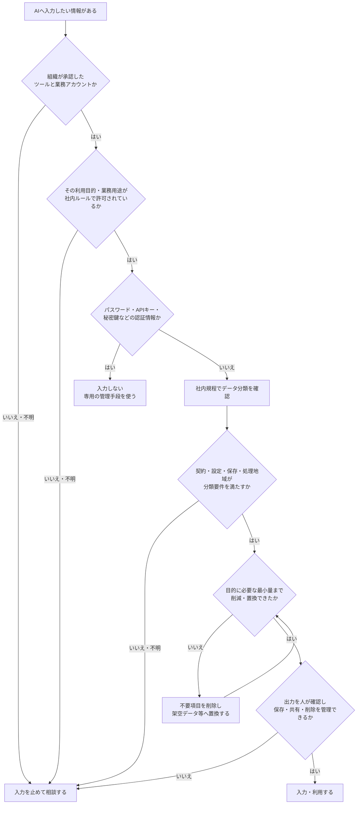
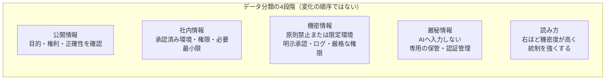
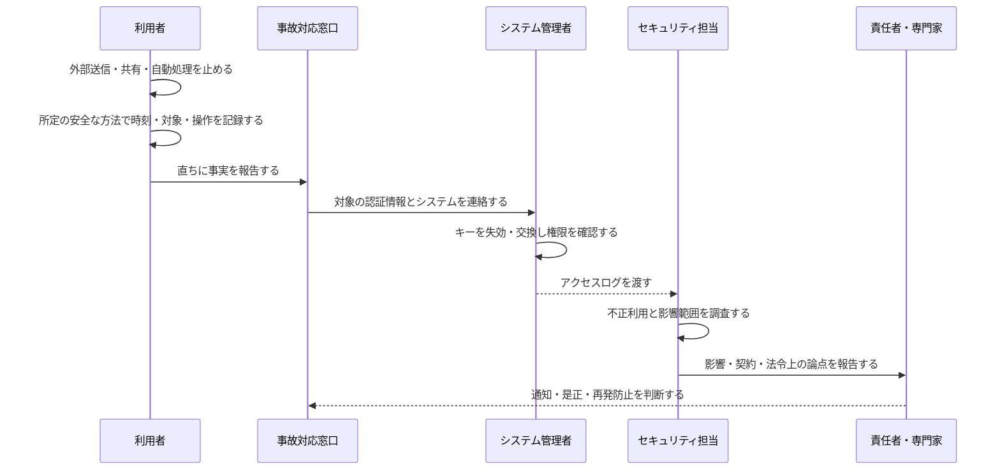
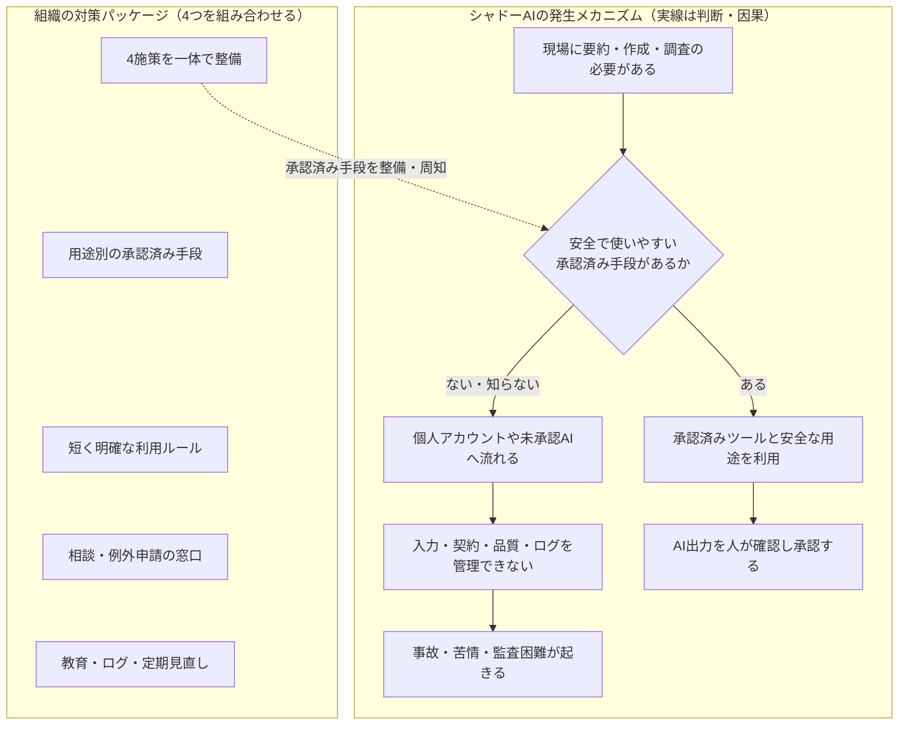
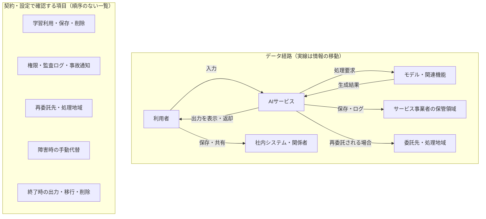
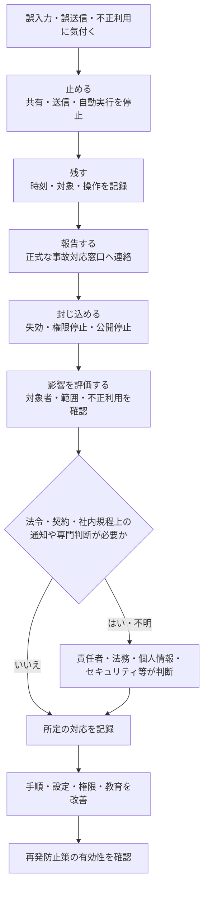

# 05 セキュリティとプライバシー

## 1. この章の目的

AIへ入力する前に情報の種類と利用条件を判断し、機密情報、個人情報、認証情報の漏えいを防ぐ運用を設計します。

この章で使う専門用語の短い説明は、[用語集](glossary.md)でも確認できます。

## 2. 学習ゴール

- 入力可否をデータ分類、契約、設定、目的から判断できる
- 機密情報、個人情報、パスワード・APIキーの違いを説明できる
- 個人向け／無料プランと法人向けプランを断定せず比較できる
- シャドーAIの原因と対策を説明できる
- 外部AIサービスの委託先・継続性・終了時移行を確認できる
- 誤入力や漏えい時の初動を演習できる
- 企業研修で伝えるべき最低限の安全ルールを実演できる

## 3. 本編解説

### 3.1 入力判断の基本

AIへの入力は、外部サービスへの情報提供になり得ます。「便利だから」「名前を消したから」ではなく、次の順で判断します。

**認証情報**とは、利用者やシステムが正当であることを確認するための秘密情報の総称です。パスワード、APIキー、暗号処理に使う**秘密鍵**、ログイン状態を示す一時的な**セッショントークン**などを含み、承認済みAIであっても入力しません。

ここでいう**第三者提供**は情報が別の組織へ渡る扱いに当たるか、**処理地域**はどの国・地域で情報が保存・処理されるかを確認する項目です。法的な該当性や必要な対応は地域・契約・データによって異なるため、法務・個人情報担当者や専門家へ確認します。

1. 組織が利用を承認したツール・アカウントか。
2. 入力予定情報の分類は何か。
3. 契約、設定、保存、学習利用、第三者提供、処理地域などは要件を満たすか。
4. 業務目的に必要な最小量か。
5. 出力の保存・共有・削除と人間レビューを管理できるか。

どれか不明なら入力を止め、社内の情報セキュリティ、法務、個人情報保護担当などへ相談します。

#### 図5-1：AIへ入力する前の判断フロー



**図の見方**：上から順番に質問へ答えます。承認済みツールでも、利用目的や業務用途が許可されているとは限りません。途中で「いいえ」または「不明」になった場合は、便利さを理由に先へ進まず、入力を止めます。認証情報は承認済みAIであっても入力対象にしません。

**講師向け説明ポイント**：「入力可否はツール名だけでは決まらない」と説明します。ツールとアカウント、利用目的、データ分類、契約・設定、必要最小化、出力管理を一組で確認し、法的判断や個人情報の扱いが不明なら担当部門・専門家へつなぎます。

### 3.2 データ分類の例

組織の正式な分類規程を優先します。

**ソースコード**はソフトウェアの動作を記述した設計情報、**脆弱性**は攻撃や誤操作に悪用される可能性がある弱点です。いずれもシステムへの攻撃や不正利用につながり得るため、組織の分類規程に従って扱います。

| 例示区分 | 例 | 一般的な入力判断 |
|---|---|---|
| 公開 | 公開済みWeb、公開パンフレット | 承認済みツールで目的内利用。権利と正確性を確認 |
| 社内 | 社内手順、未公開会議メモ | 組織承認・契約・権限を確認。必要最小限 |
| 機密 | 未公開戦略、契約、顧客情報、ソースコード | 原則禁止または限定環境のみ。明示承認が必要 |
| 厳秘 | パスワード、APIキー、秘密鍵、重大な人事・健康情報 | 入力しない。専用の管理手段を使う |

この章でいう**統制**とは、リスクを抑えるための利用条件、権限、承認、ログ、停止などの仕組みです。

#### 図5-2：データ分類が上がるほど統制を強くする考え方



**図の見方**：4つの箱は処理手順ではなく、情報を分類する段階の例です。左から右へ行くほど一般に機密度が高くなり、利用条件、承認、権限、ログなどの統制を強くします。箱の間に見える矢印はなく、`~~~`は横に並べるためだけの見えない接続です。

**講師向け説明ポイント**：公開情報が社内情報へ変化していく図ではなく、異なる分類を同じ尺度上で比較する図です。これは一般例であり、分類名や入力条件は組織ごとに異なります。研修では自社の正式な分類規程を画面または配布資料で確認させ、教材の分類表をそのまま社内ルールとして使わせないようにします。

### 3.3 機密情報

**機密情報**は、漏えいすると組織、顧客、取引先などに損害を与える非公開情報です。

- 未公開の経営計画、価格、決算、研究開発
- 顧客・取引先との契約、問い合わせ履歴
- 内部システム構成、脆弱性、ソースコード
- 社外秘資料、未発表製品、採用・人事評価

「自社の情報」だけでなく、守秘義務を負う取引先情報も対象です。**守秘義務**とは、契約や法令などに基づき、預かった非公開情報を外部へ漏らさない義務です。対象範囲が不明な場合は法務担当者や専門家へ確認します。

### 3.4 個人情報

**個人情報**は、生存する個人を識別できる情報などを指します。氏名だけでなく、社員番号、メール、顔画像、音声、位置、行動履歴、他情報との組み合わせで識別できる情報も問題になります。法的な該当性や取扱いは地域・状況で異なるため、個人情報保護担当者や専門家に確認してください。

**再識別**とは、氏名を消したデータを、部署、役職、案件、日時などの別情報と組み合わせ、特定の人へ結び付け直すことです。そのため、氏名だけを伏せても安全とは限りません。

| 誤った対策 | 問題 | より安全な方法 |
|---|---|---|
| 氏名だけ伏せ字 | 部署・役職・案件で再識別可能 | 架空データへ置換し、不要項目を削除 |
| 全文を先に入力して要約 | 目的外・過剰入力 | 必要箇所だけを承認済み環境で処理 |
| 会議を無断録音 | 同意・規程・保存の問題 | 事前通知、同意、保存期間、閲覧権限を設定 |

**仮名化**は、氏名などを別の記号へ置き換え、対応情報を別に管理する考え方です。元へ戻せる場合があり、無条件に安全とは言えません。**匿名化**は一般に個人を識別できない状態へ加工する考え方ですが、法的な要件は厳密です。「伏せ字にしたから匿名化済み」と自己判断せず、個人情報保護担当者や専門家へ確認します。

日本での実務は、[個人情報保護委員会の法令・ガイドライン](https://www.ppc.go.jp/personalinfo/legal/)と自社規程を確認し、必要に応じて専門家へ相談します。

### 3.5 パスワード、APIキー、認証情報

**APIキー**は、プログラムが外部サービスを利用するときの秘密の鍵です。パスワード、秘密鍵、セッショントークン、本人確認などに使う認証コードと同様に、チャット、プロンプト、ログ、スクリーンショットへ入力してはいけません。

誤って入力した場合は、単に会話を削除するだけでなく、次を行います。

1. 社内の事故対応窓口へ直ちに報告する。
2. 認証情報を失効・ローテーション（新しい鍵に交換）する。
3. アクセスログと影響範囲を確認する。
4. 所定の手順で記録し、再発防止を行う。

**証拠保全**とは、事故調査に必要な時刻、操作、ログなどを勝手に消したり書き換えたりせず、組織の正式な手順で残すことです。秘密値そのものを新しい資料へ複製せず、事故対応窓口の指示に従います。

#### 図5-3：認証情報を誤入力したときの役割分担



**図の見方**：利用者が一人で解決する図ではありません。利用者は停止・記録・報告を行い、権限を持つ管理者が失効、担当者が調査、責任者・専門家が通知などを判断します。秘密値を別資料へ再転記せず、証拠の保存方法は事故対応窓口の指示に従います。

**講師向け説明ポイント**：会話の削除は初動の代わりになりません。一方で、APIキーや秘密情報をスクリーンショットやメモへ複製すると二次漏えいにつながります。証拠保全は組織の正式手順と窓口の指示を優先し、法令・契約上の報告や本人通知が必要かは、法務、個人情報保護、セキュリティ等の責任者・専門家が判断します。

### 3.6 個人向け／無料プランと法人向けの違い

一般的な確認観点であり、全製品に同じ差があるわけではありません。

**SSO（Single Sign-On／シングルサインオン）**は会社の共通認証で複数サービスへのログインを管理する仕組み、**DPA（Data Processing Agreement／データ処理契約）**は個人データの処理条件を定める契約、**SLA（Service Level Agreement／サービス水準合意）**は稼働率やサポートなどのサービス水準に関する合意です。契約の名称や内容はサービス・地域によって異なります。

| 観点 | 個人向けで要確認 | 法人向けで要確認 |
|---|---|---|
| データ利用 | 学習利用の有無と停止設定 | 契約上のデータ取扱い、既定設定 |
| 管理 | 利用者ごとの個別設定 | 管理者、SSO、アカウント停止 |
| 権限 | 個人共有 | グループ・文書権限の継承 |
| ログ | 利用履歴の範囲 | 監査ログ、保持、出力 |
| 契約 | 一般利用規約 | 組織契約、DPA、SLA等 |
| サポート | 一般窓口 | 管理・セキュリティ支援の範囲 |

「法人版だから自動的に安全」ではなく、各機能、設定、契約が自社の要件に合うかを確認します。

### 3.7 シャドーAIのリスク

**シャドーAI**は、組織が把握・承認していないAIツールや個人アカウントを業務に使うことです。

| リスク | 例 |
|---|---|
| 情報漏えい | 顧客メールを個人アカウントへ入力 |
| 管理不能 | 退職後もデータや会話が個人領域に残る |
| 品質不明 | 誤答の確認方法が統一されない |
| 契約・権利 | 商用条件や第三者素材の扱いが未確認 |
| 監査不能 | 利用者、入力、外部送信を追えない |

禁止だけでは隠れた利用を増やす場合があります。承認済みツール、安全な用途、相談経路、例外申請、教育を合わせます。

#### 図5-4：シャドーAIを減らすための仕組み



**図の見方**：「発生メカニズム」枠の実線は、現場の必要から利用判断と結果へ進む流れです。「対策パッケージ」枠の4項目は手順ではなく、組織が一体で整える構成要素です。枠内の`~~~`は配置だけに使う見えない接続、対策側から判断への破線は、対策パッケージが承認済み手段の整備・周知を支える関係を表します。

**講師向け説明ポイント**：受講者を責める説明ではなく、業務上の必要と組織側の環境を同時に扱います。4施策のどれか一つだけで十分なのではなく、安全な代替手段、ルール、相談経路、教育・監視を組み合わせます。承認済み利用でもAI出力が正しいとは限らないため、元資料との人間確認と重要処理前の承認は残します。

### 3.8 社内AI利用ルール

最低限、次を定めます。

- 利用目的、適用対象、承認済みツール・アカウント
- 入力禁止情報とデータ分類ごとの条件
- 出力の事実確認、権利確認、承認者
- 外部送信・公開・意思決定での人間承認
- ログ、保存期間、アクセス権、事故報告
- 定期見直し、相談先、違反時の対応

ひな形は [ai_usage_policy_template.md](templates/ai_usage_policy_template.md) を利用し、必ず自社規程と専門家レビューに合わせて修正します。

### 3.9 外部サービス・ベンダー・継続性の確認

ここでいう**ベンダー**は、AIツールや外部サービスを提供する事業者です。

**再委託先**とは、AIサービス事業者が処理の一部をさらに任せる別の事業者です。再委託の有無だけでなく、処理内容、保存場所、事故時の責任と通知方法を確認します。

**暗号化**はデータを権限のない人に読まれにくい形へ変えること、**脆弱性対応**は弱点の発見、修正、通知などを行うことです。**監査資料**は、安全対策の実施状況を確認するために事業者が提示する報告書や証明書などを指します。資料名だけで安全と判断せず、自社要件に必要な範囲と内容を担当部門が確認します。

AIサービスは自社外の事業者や再委託先で処理される場合があります。導入時だけでなく、契約更新・機能変更・終了時も確認します。

| 観点 | 確認する質問 |
|---|---|
| データ経路 | どの情報が、どの地域・委託先で処理・保存されるか |
| 契約・規約 | 学習利用、保存、削除、事故通知、責任分担はどう定められるか |
| セキュリティ | 認証、暗号化、脆弱性対応、監査資料は要件を満たすか |
| 変更 | モデル、規約、機能、再委託先の変更をどう把握するか |
| 継続性 | 障害・提供終了時に業務をどう続けるか |
| 出口 | データを取り出せるか、削除を確認できるか、他手段へ移行できるか |

**ベンダーロックイン（vendor lock-in）**は、特定サービスへ依存し、他の手段へ移りにくくなる状態です。重要業務では、手動代替、データ出力、設定・プロンプトの版管理、終了時の移行責任者を決めます。

#### 図5-5：外部AIサービスのデータ経路と確認点



**図の見方**：「データ経路」枠の実線だけが、入力、処理、出力、保存、再委託、社内共有に伴う情報の移動を表します。「契約・設定で確認する項目」枠は順序のないチェックリストであり、データはこの枠へ流れません。項目間の`~~~`は縦に並べるためだけの見えない接続です。

**国外移転**とは、個人データなどが国境を越えて保存、処理、提供されることを指す法務上の確認項目です。何が国外移転に当たるか、どの対応が必要かは地域、契約、データによって異なるため、自己判断で確定しません。

**講師向け説明ポイント**：最初に実際のデータ経路を確認し、その経路全体に対して別枠の契約・設定項目を漏れなく点検します。実際の経路や条件は製品・プラン・契約・時点で変わるため、最新の公式情報と契約文書を確認します。DPA等の解釈、国外移転、法的義務は自社の法務・個人情報担当または専門家へ確認します。

### 3.10 インシデント時の初動

**インシデント**は、情報漏えい、誤送信、不正利用など対応が必要な事故・事象です。研修では次の順を暗記ではなく実演します。

1. **止める**：外部送信、自動実行、共有を可能な範囲で止める。
2. **残す**：時刻、対象、操作、入力、出力を改変せず記録する。
3. **報告する**：所定の事故対応窓口へ直ちに連絡する。
4. **封じ込める**：認証情報の失効、権限停止などを担当者が行う。
5. **評価・通知する**：影響、法令・契約上の対応を責任者・専門家が判断する。
6. **改善する**：原因、手順、設定、教育を見直す。

自己判断で会話だけを削除すると、証拠や対応機会を失う場合があります。組織の正式な事故対応手順を優先します。

#### 図5-6：AI利用インシデントの初動から再発防止まで



**図の見方**：事故を見つけたら、原因追及より先に被害拡大を止め、事実を残し、正式窓口へ報告します。その後の失効、影響評価、通知判断、改善は役割を分けて進めます。

**講師向け説明ポイント**：「隠さない・一人で直し切ろうとしない」を行動目標にします。法律上の通知、個人情報、契約責任などはケースで異なるため断定せず、組織の正式手順と専門家判断を優先します。

### 3.11 企業研修で必ず伝えること

1. 承認済みツールと業務アカウントだけを使う。
2. 機密、個人情報、認証情報を安易に入力しない。
3. 完全な架空データ、または組織が承認した適切に匿名化済みのデータを必要最小限で使う。
4. AI出力は元資料と人が確認する。
5. 外部送信、公開、重要判断、システム実行は人が承認する。
6. 誤入力・誤送信・不審な出力は隠さず直ちに報告する。
7. 外部サービスの障害・終了に備え、手動代替と相談先を知る。

## 4. 実務での使いどころ

- ハンズオン前の入力データ点検
- 新規ツールのセキュリティ・法務レビュー依頼
- 社内AI利用ルールと事故対応フローの作成
- シャドーAI調査と承認済み代替手段の提供
- 外部サービスの契約更新・終了時に行う移行確認

## 5. 講師メモ

- 恐怖だけを与えず、「入力を止める→分類する→相談する」という代替行動を練習させます。
- 実演画面では通知、ブックマーク、ファイル名にも機密が映らないよう確認します。
- 「匿名化」と「仮名化・伏せ字」の違いを厳密に扱う必要がある場面は、法務・個人情報担当へつなぎます。
- 研修当日に、自社ルールと承認済みツールが教材内容より優先することを明示します。
- 事故対応は知識問題だけでなく、参加者が利用者や担当者の役割を演じる**ロールプレイ**で「止める→記録→報告」を練習します。

## 6. 演習

### 演習：紙上で行う入力判断と誤入力対応

この演習は紙上での判断を基本とします。ChatGPTを使う場合も、教材に明記された完全な架空データだけを入力します。実在するメール、スクリーンショット、名簿、会議音声、社内文書、認証情報は使いません。

#### 利用環境の準備確認

紙上実施の場合も、講師は[AIツール共通準備](setup/common_preparation.md)で停止・相談条件を確認します。ChatGPTを任意利用する場合は、[対話AIアカウント準備](setup/chat_ai_account_setup.md)まで確認してから架空ケースだけを使います。

| 学習環境 | 実施方法 |
|---|---|
| 個人学習 | ケースカードを紙またはローカルのメモへ写して判断します。自分の意思でChatGPTを使う場合だけ、利用条件とデータ設定を確認して架空ケースを入力します。 |
| 企業研修 | 自社の情報分類表、AI利用ルール、事故連絡先を研修担当者が用意します。受講者へ個人アカウントの登録を強制しません。 |
| 未承認・登録不可 | ChatGPTを開かず、講師配布の架空出力例と紙のケースカードで全工程を実施します。 |

講師は、紙上代替を選んだ受講者が不利にならないよう、同じ完成条件と観察ポイントを使います。

#### ガイド付き練習

次のケースを全員で「入力可の候補」「条件付き」「入力停止・相談」に分けます。

| ケース | 状況 |
|---|---|
| 公開文 | 架空会社のWebサイトに公開済みの一般説明文 |
| テンプレート | 実在者を元にしていない、完全に架空の問い合わせ文 |
| 苦情 | 氏名、電話番号、購入履歴を含む実在顧客のメール |
| 認証情報 | `DEMO-ONLY-NOT-A-KEY`と表示された教材用の偽キー |

ChatGPTを使える場合は、次の架空ケースだけを入力して「結論」ではなく「確認質問」を作らせます。

```text
次は研修用に一から作った架空ケースです。実在の人・組織・認証情報は含みません。
架空会社「青空企画」が、架空顧客「研修サンプルA」の問い合わせ文をAIで要約したいと考えています。
入力可否を決める前に、人間が確認すべき質問を、データ分類、利用目的、契約・設定、
最小化、保存・共有、出力確認の観点で整理してください。最終判断はせず、不明は不明としてください。
```

AIが「架空だから必ず安全」と断定していないかを紙上の判断と照合します。

#### 実務演習

次の架空例を紙上で分類し、理由、最小化した代替方法、承認者、相談先を書きます。

- 公開済みの一般情報
- 氏名・電話番号を含む顧客苦情メール
- 実在者を元にせず作ったメールテンプレート
- 未公開の価格改定表
- 本物の可能性があるAPIキーを含む画面
- 参加者へ事前通知していない会議音声

続いて、架空の担当者が、エラー画面を承認済みAIへ入力した直後に本物のAPIキーが映っていたと気付いた想定で、初動カードを並べます。

- 利用と共有を止める
- 画面を閉じる前に、時刻、入力先、入力内容、操作を必要な範囲で記録する
- 組織が定めた窓口へ報告する
- 権限を持つ担当者がキーを失効・交換する
- アクセスログと影響範囲を確認する
- 会話削除の可否と証跡保全を担当者が判断する
- 画面、手順、教育の再発防止を決める

順番と担当を決め、会話削除だけで完了にしない理由を説明します。製品名だけで安全性を決めず、データ分類、契約、設定、目的、最小化、出力管理で判断します。

#### 人間レビュー

利用者役、上司役、情報システム役、個人情報・法務担当役に分かれ、紙上で「止める→記録する→報告する→封じ込める→影響を確認する」を読み合わせます。

- 入力前の判断と、誤入力後の事故対応を混同していないか
- 氏名を消しただけで匿名化できたと決めつけていないか
- APIキーの無効化を権限のある担当者へつないでいるか
- 保存期間、学習利用、共有範囲、国外移転など不明な契約条件を相談事項にしたか
- 法律、個人情報、契約上の個別判断を専門家へ渡しているか

#### 振り返り

- 迷ったケースと、判断に足りなかった情報を書く
- 入力を止めた後に取れる安全な代替方法を書く
- 自組織で事故時に連絡する窓口を確認する。分からない場合は「要確認」として持ち帰る

#### 完成条件・観察ポイント・改善ポイント

| 区分 | 内容 |
|---|---|
| 完成条件 | 各ケースに判定理由、代替方法、承認者、相談先があり、誤入力時の停止・記録・報告・失効・影響確認が役割付きで並んでいる |
| 観察ポイント | 受講者が入力前に立ち止まり、不明を推測せず相談へつなげるか。ツールの会話削除だけで事故対応を終えていないか |
| 改善ポイント | 製品名だけで判定した場合は、データ、目的、契約・設定、最小化、出力管理へ戻る。恐怖で全件禁止にした場合は安全な代替方法も考える |

## 7. 実務チェックリストと振り返り

この節は知識を採点するテストではありません。入力前と事故時に取る行動を自分で点検します。法律、個人情報、契約上の個別判断は、法務・個人情報保護・情報セキュリティの担当者または専門家へ確認してください。

### 実務チェックリスト

- [ ] 承認済みツールか、対象プランとアカウントを確認した
- [ ] 情報の所有者、分類、利用目的、必要最小限性を確認した
- [ ] 学習利用、保存、共有、連携、ログの設定・契約を確認した
- [ ] パスワード、APIキー、トークンなどの認証情報を入力しない
- [ ] 伏せ字でも再識別できる可能性を考えた
- [ ] 判断できない場合は入力せず、相談先へつなぐ
- [ ] 誤入力時は隠さず、停止・記録・報告・封じ込めを行う
- [ ] AI出力を人間が確認してから保存・共有・利用する

### 振り返りメモ

- 自分が見落としやすい入力リスク：
- 入力せずに目的を達成する代替方法：
- 自組織で確認が必要な設定・契約：
- 事故時の相談先と連絡方法：

## 8. まとめ

入力可否は製品名ではなく、組織承認、データ分類、契約・設定、目的、最小化、出力管理で判断します。不明な場合は入力を止めて相談し、事故時は隠さず認証失効・影響確認を行います。
