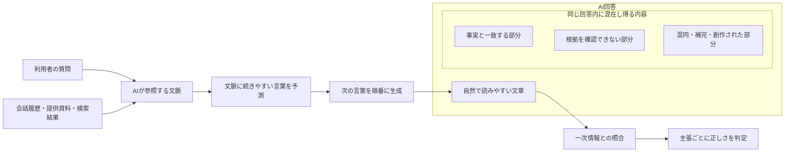
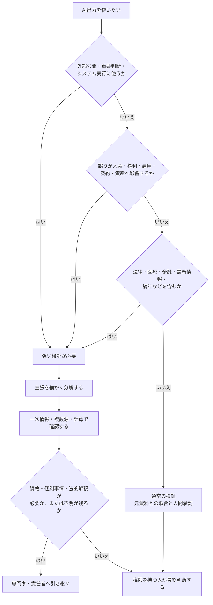
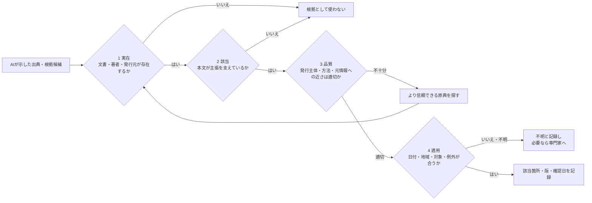
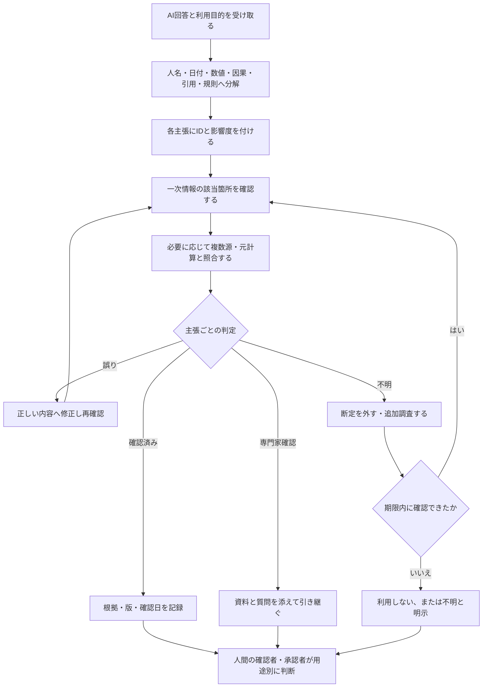
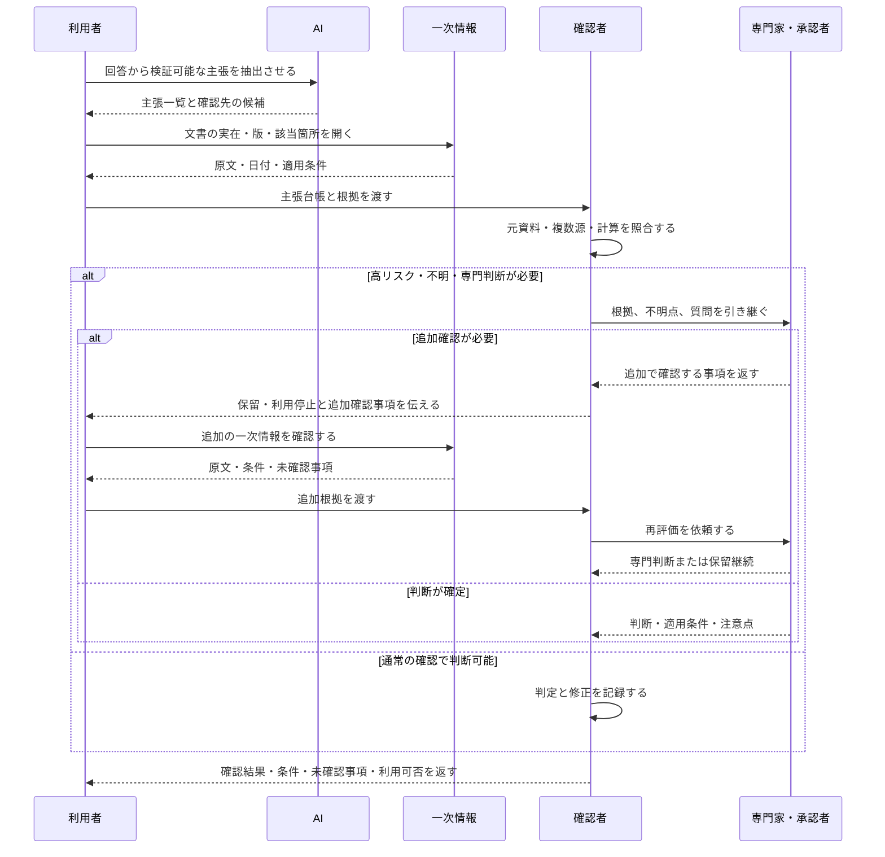

# 06 ハルシネーションとファクトチェック

## 1. この章の目的

自然で自信のあるAI回答を「正しい情報」と誤認せず、主張を分解して一次情報で検証する手順を身につけます。

この章で使う専門用語の短い説明は、[用語集](glossary.md)でも確認できます。

**エスカレーション**とは、自分だけで判断せず、責任者や専門家へ判断を引き継ぐことです。

## 2. 学習ゴール

- ハルシネーションの意味と発生理由を初心者へ説明できる
- 誤りが起きやすい場面と高リスク領域を識別できる
- 出典の実在性、該当箇所、日付、適用範囲を確認できる
- 検証結果を「確認済み・不明・誤り」に分けて記録できる
- 専門家へエスカレーションする条件を決められる

## 3. 本編解説

### 3.1 ハルシネーションとは

**ハルシネーション**は、AIが事実と異なる内容、存在しない出典、入力にない数字などを、もっともらしく生成する現象です。単純な嘘とは異なり、AIが意図してだましていると考える必要はありません。

例：存在しない規程条文を引用する、会議メモにない決定を補う、架空の統計を具体的な数値で示す。

### 3.2 なぜもっともらしい誤情報が出るのか

- LLM（Large Language Model／大規模言語モデル）の基本動作は、文脈に合う言葉を生成することで、事実を保証することではない
- 質問に前提不足や誤りがあっても、回答を続けようとする場合がある
- 学習時点以降の情報、非公開情報、非常に細かい情報を持たない場合がある
- 複数の似た人物、制度、版、数字を混同する場合がある
- 提供資料自体が古い、矛盾、欠落している場合がある

**RAG（Retrieval-Augmented Generation／検索拡張生成）**は、質問に関係する資料を検索し、その抜粋をAIへ渡して回答を作る仕組みです。検索やRAGを組み合わせても、検索漏れ、誤った引用、文脈の取り違え、生成時の誤りは残ります。詳しい仕組みと限界は[08 RAGとナレッジ管理](08_rag_and_knowledge_management.md)で扱います。

#### 図6-1：もっともらしい回答と事実確認が別である理由



**図の見方**：実線の矢印は、質問と文脈から文章を生成し、完成した回答を一次情報と照合して判定する処理の順番です。「AI回答」枠の内側にある3つの箱は処理の分岐ではなく、正しい部分、未確認の部分、誤った部分が同じ回答内に混在し得ることを示します。枠内の`~~~`は配置だけに使う見えない接続です。

**講師向け説明ポイント**：回答全体を一括して「正しい」「誤り」と見るのではなく、回答内の主張を分けて照合します。「流暢さ」「自信のある言い方」「細かな数字」は正しさの証拠ではありません。検索やRAGを使った場合も、取得した資料と最終回答を人が照合する必要があると説明します。

### 3.3 起きやすい場面

| 場面 | 典型的な誤り | 対策 |
|---|---|---|
| 固有名詞・細かな経歴 | 人物・組織の混同 | 公式プロフィールで確認 |
| 日付・件数・割合 | 数字の創作、単位違い | 元表と計算を照合 |
| 出典・URL | 存在しない論文やリンク | 実際に開き、本文を読む |
| 最新情報 | 古い制度・機能 | 発表日と更新日を確認 |
| 長文要約 | 重要条件の欠落 | 原文の該当箇所と比較 |
| 曖昧な会議メモ | 提案を決定扱い | 決定・提案・未決を分離 |
| 専門領域 | 適用条件の省略 | 専門家レビュー |

### 3.4 高リスク領域

金融でいう**適合性**とは、金融商品や提案が顧客の知識、経験、目的、資産状況などに合っているかという確認です。個別の適合性判断はAIへ任せず、担当者や金融・法務の専門家へ確認します。

統計でいう**母集団**とは、調査や統計の結論を当てはめようとしている対象全体です。調査対象の一部だけを見て、母集団全体へ無条件に当てはめないようにします。

| 領域 | 注意する理由 | 最低限の対応 |
|---|---|---|
| 法律 | 地域、時点、契約、個別事情で結論が変わる | 法令原文・公的資料を確認し、法律専門家へ |
| 医療 | 個人差が大きく、人命・健康へ影響 | 医療専門家へ。診断・治療判断を委ねない |
| 金融 | 損失、規制、適合性、最新相場が関係 | 公式開示を確認し、金融・法務専門家へ |
| 最新情報 | 情報が変化し、学習時点に限界 | 日付を明記し、一次情報を複数確認 |
| 統計 | 母集団、期間、定義、単位で意味が変わる | 元データ、調査方法、表番号を確認 |

AIは論点整理や確認項目の作成には使えますが、専門家の最終判断を置き換えません。

**原典**は引用や解説の元になった文書、**原著論文**は研究者が研究結果を最初に報告した論文です。解説だけで結論を確定せず、可能な範囲で原典を確認します。ただし、専門的な解釈が必要な場合は有資格者・担当専門家へ引き継ぎます。

#### 図6-2：用途と影響度から検証の強さを決める



**図の見方**：上から用途と誤りの影響を確認します。高リスク領域や外部公開は検証を厚くし、個別判断や不明点が残る場合は専門家へ引き継ぎます。

**講師向け説明ポイント**：AIの使用可否だけでなく、「どこまで補助に使い、誰が最終判断するか」を決める図です。法律、医療、金融などでは一般的な論点整理にとどめ、原典と最新情報を確認したうえで有資格者・担当専門家へつなぎます。

### 3.5 出典確認の4段階

**一次情報**は、法令原文、公的統計、公式発表、原著論文、当事者の記録など、主張の元に近い情報です。ここでいう情報の**一次性**は、その情報が元の出来事、データ、発表にどれだけ近いかという意味です。一次情報でも、古い版、対象外の地域、例外条件があるため、内容まで確認します。

1. **実在**：その文書、URL、著者、発行元が存在するか。
2. **該当**：引用箇所が本当に主張を支えているか。
3. **品質**：一次情報か、責任ある発行主体か、方法が示されているか。
4. **適用**：日付、地域、対象、例外が今回の条件に合うか。

| 情報源 | 一般的な優先度 | 使い方 |
|---|---:|---|
| 法令原文、公的統計、公式発表、原著論文 | 高 | 主張の根拠として本文を確認 |
| 公式マニュアル、契約、社内一次資料 | 高 | 版と適用範囲を確認 |
| 専門機関の解説 | 中 | 原典への導線と解釈の補助 |
| 報道、専門メディア | 中 | 複数確認し一次情報へ戻る |
| ブログ、SNS（ソーシャル・ネットワーキング・サービス）、AI生成文 | 低〜手掛かり | 根拠として確定せず原典を探す |

「出典付きのAI回答」でも、リンクが実在するだけでは不十分です。

#### 図6-3：出典を4つの関門で確認する



**図の見方**：左から4つの関門を順番に通します。URLが開けても「実在」を通過しただけです。本文が主張を支えるか、情報源の品質は十分か、今回の条件に適用できるかまで確認します。

**講師向け説明ポイント**：各関門で実際のページを開き、該当箇所と前後の例外条件を読む実演を行います。法令、医療資料、金融情報などの解釈は、原文確認だけで完結させず専門家確認へつなぎます。

### 3.6 そのまま使ってはいけない理由

**説明責任**とは、AI出力をなぜ採用したか、何を根拠に誰が確認・承認したかを説明できる状態にする責任です。

- 誤りが自然な文体に隠れる
- 入力にない断定や数字が追加される
- 差別的・不適切な表現が混ざる可能性がある
- 著作権、個人情報、機密情報など別のリスクもある
- 公開・送信した組織と人が説明責任を負う

### 3.7 ファクトチェックの実践手順

| 手順 | 作業 | 記録すること |
|---:|---|---|
| 1 | 用途と影響度を決める | 社内草案／外部公開、高・中・低リスク |
| 2 | 検証可能な主張へ分解 | 人、日付、数値、因果、引用、規則 |
| 3 | 根拠候補を集める | 発行元、文書名、URL、版、日付 |
| 4 | 原文の該当箇所を読む | ページ、節、表番号、前後条件 |
| 5 | 複数源・計算で照合 | 一致、不一致、定義差 |
| 6 | 結果を分類 | 確認済み／誤り／不明／専門家確認 |
| 7 | 修正・承認・保存 | 修正者、確認者、確認日、残る不確実性 |

**主張台帳**とは、AI回答を検証できる主張へ分け、根拠、判定、対応を1件ずつ記録する表です。

| ID | AIの主張 | 影響 | 根拠 | 判定 | 対応 |
|---|---|---|---|---|---|
| C-01 | FAQは6/27公開 | 中 | 会議メモは「初稿」 | 誤り | 初稿期限へ修正 |
| C-02 | 窓口はサポート部 | 中 | 部長承認前 | 不明 | 承認後に確定 |

#### 図6-4：AI回答を主張単位で検証・処理する流れ



**図の見方**：回答全体に一度だけ丸を付けるのではなく、確認できる主張へ分けます。各主張を「確認済み」「誤り」「不明」「専門家確認」に分類し、それぞれ異なる処理をします。

**講師向け説明ポイント**：確認できない主張を、文章の自然さだけで採用しないことを強調します。外部公開前には、根拠と修正履歴を残し、用途に責任を持つ人が最終承認します。

### 3.8 AIを検証補助に使うとき

```text
次の文章から検証可能な主張を1行1件で抽出してください。
主張の種類（数値・日付・固有名詞・因果・引用・規則）、誤りの影響、
確認すべき一次情報を表にしてください。
真偽は推測せず、不明は不明としてください。
```

これは確認項目の抽出であり、真偽判定そのものではありません。

#### 図6-5：検証でAIに任せる部分と人が担う部分



**図の見方**：AIは主張を抜き出し、確認先の候補を作るところまで補助します。追加確認が必要な間は保留して利用せず、一次情報を追加して専門家へ再評価を依頼します。最後の返答は必ずしも承認ではなく、利用可、条件付き、保留、利用不可を含みます。

**講師向け説明ポイント**：AIに「この回答は正しいですか」と再質問しても独立した検証にはなりません。同じ誤りを繰り返す可能性があるため、AIとは別の一次情報、人間の確認者、必要な専門家を検証経路に入れます。

## 4. 実務での使いどころ

- 調査レポートや提案書の公開前レビュー
- 会議議事録の決定事項・担当・期限の照合
- 社内FAQやRAG回答の評価
- 研修デモで「自然さと正しさは別」を体験させる
- ChatGPTで主張を分解し、Perplexityで出典候補を探し、公式サイトの原文で確定する調査演習

## 5. 講師メモ

- わざと誤りを含む教材を使い、正解数より検証手順を評価します。
- 「AIにもう一度聞いた」は独立した確認にならないと伝えます。
- 出典のタイトルだけでなく、該当箇所を開く実演をします。
- 高リスク領域では、講師自身も一般論と個別助言を明確に分けます。

## 6. 演習

### 演習：ChatGPTの誤答候補をPerplexityと公式原文で検証する

この演習では、ChatGPTの文章を「未検証の回答候補」として扱います。Perplexityが示した出典もそのまま信じず、リンク先の公式サイトを開いて該当箇所を人間が読みます。手順は[Perplexity演習環境セットアップ](setup/perplexity_setup.md)を参照してください。

#### 利用環境の準備確認

| 学習環境 | 実施方法 |
|---|---|
| 個人学習 | 自分で利用条件とデータ設定を確認したChatGPTとPerplexityを使います。公開情報と完全な架空データだけを扱います。 |
| 企業研修 | 承認済みアカウントとブラウザだけを使います。受講者へ個人アカウントの登録を強制しません。検索・履歴・共有・ファイル添付の設定は管理者が事前確認します。 |
| 未承認・登録不可 | 講師が保存したChatGPT回答候補とPerplexity検索例、URL・確認日・該当見出しを付けた公式ページの印刷物を使い、紙上で同じ照合を行います。 |

ネットワーク障害時も紙上代替へ切り替えます。法律、医療、金融、個人の権利義務などを題材にした個別助言は行わず、必要な場合は公式原文を確認したうえで有資格者・担当専門家へ引き継ぎます。

#### ガイド付き練習

次は、教材作成時点の公式情報と意図的に食い違わせた「誤答候補」です。ここに書かれた製品仕様を覚えるのではなく、変わり得る情報を検証する手順を練習します。

```text
PerplexityのWebアプリはChrome 120以降とSafari 15以降だけに対応しています。
FirefoxとMicrosoft Edgeは非対応です。情報は2026年に更新されています。
```

まずChatGPTへ次のように依頼し、候補文を検証可能な主張へ分解します。

```text
次の文章は未検証で、誤りを含む可能性があります。事実確認はせず、
一つずつ検証できる最小の主張に分解してください。
各主張について、確認すべき対象、必要な日付、望ましい一次情報の発行元を表にしてください。
不明な情報を補わないでください。

【ここに回答候補を貼る】
```

次にPerplexityで「Perplexity Webアプリ 対応ブラウザ 公式」のように検索し、公式ヘルプの出典候補を探します。最後に必ず公式ページを開き、ページ名、更新日、該当箇所、読み取れた内容を検証記録へ転記します。

| 主張 | 判定 | 公式URL | ページ更新日 | 該当見出し・原文の要旨 | 適用条件・不明点 |
|---|---|---|---|---|---|
|  | 確認済み／誤り／不明 |  |  |  |  |

検索結果の要約と公式原文が違う場合は、公式原文を優先し、違いを記録します。公式ページが見つからない主張は「不明」のままにします。

#### 実務演習

講師が指定した低リスクの業務テーマについて、同じ流れを一人で実施します。題材例は「公的機関が公開する申請手順」「利用中ツールの対応ブラウザ」「公式ヘルプに記載された共有設定」です。

- 質問へ対象地域、基準日、対象製品・プランを入れる
- ChatGPTで未検証の回答候補を作るか、講師配布の候補を使う
- ChatGPTで主張へ分解し、確認すべき一次情報を決める
- Perplexityで出典候補を探し、公式ドメインか確認する
- 公式サイトの原文を開き、該当性、更新日、条件、例外を読む
- 各主張を「確認済み・誤り・不明」に分け、安全な回答へ書き直す

Perplexityが複数のリンクを出しても、リンク数を正しさの根拠にしません。まとめ記事しか見つからない場合は、一次情報を追加で探すか「不明」とします。

#### 人間レビュー

別の受講者または講師が、AI画面ではなく公式原文と検証記録を並べて確認します。

- 主張が一つずつ判定できる大きさに分かれているか
- URLが実在するだけでなく、質問と同じ対象・時点・条件を扱っているか
- 検索結果の抜粋だけで判定せず、リンク先の該当箇所を読んだか
- 公開日、更新日、施行日・適用日を混同していないか
- 不明を推測で埋めず、回答から除外するか確認先を示したか
- 高リスクな解釈や個別助言を専門家へ引き継いだか

#### 振り返り

- ChatGPTの文章で、最初に信じそうになった表現を書く
- Perplexityの出典表示だけでは分からなかった条件を書く
- 公式原文を開いたことで変わった判定を書く
- 今後の業務で、必ず確認日を残す情報を決める

#### 完成条件・観察ポイント・改善ポイント

| 区分 | 内容 |
|---|---|
| 完成条件 | 回答候補が主張へ分解され、各主張に判定、公式URL、確認日、該当箇所、条件・不明点が記録され、安全な回答案へ修正されている |
| 観察ポイント | 受講者がAIの自然な文章や引用表示に流されず、公式原文を開けるか。不明を不明として残せるか |
| 改善ポイント | 検索結果だけで判断した場合は原文の該当箇所へ戻る。主張が大きすぎる場合は人名、数値、日付、条件、因果関係ごとに分け直す |

## 7. 実務チェックリストと振り返り

この節は知識を採点するテストではありません。AI回答を業務利用する直前の点検に使います。

### 実務チェックリスト

- [ ] 質問の対象、地域、基準日、用途を明記した
- [ ] 回答を人名、数値、日付、条件、引用、因果関係などの主張へ分解した
- [ ] Perplexityの引用先を実際に開いた
- [ ] 公式サイト、法令原文、原論文、元統計などの一次情報を優先した
- [ ] 出典の実在、該当、品質、今回への適用を分けて確認した
- [ ] 公開日、更新日、施行日・適用日を必要に応じて記録した
- [ ] 確認できない内容を「不明」とし、断定から外した
- [ ] 法律、医療、金融などの個別判断を専門家へつないだ
- [ ] AI出力を人間が確認してから保存・共有・公開する

### 振り返りメモ

- 最も見抜きにくかった主張：
- 公式原文で初めて分かった条件：
- 自分が飛ばしやすい検証工程：
- 次回から記録する出典情報：

## 8. まとめ

AI回答の流暢さ、詳しさ、出典表示は正しさの保証ではありません。主張を分解し、一次情報の実在・該当・品質・適用を確認し、判定と確認日を記録します。高リスク領域は専門家へ引き継ぎます。
