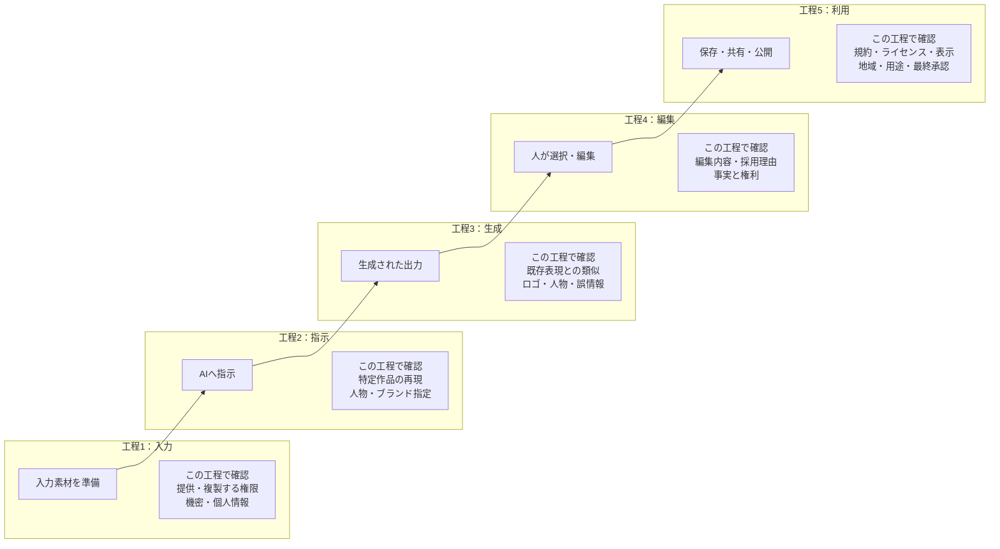
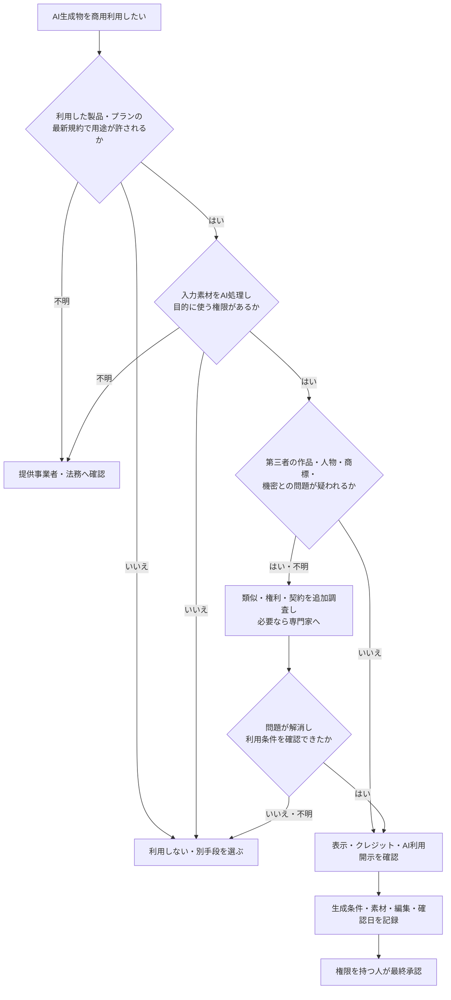
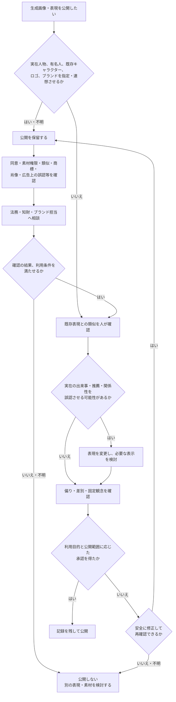
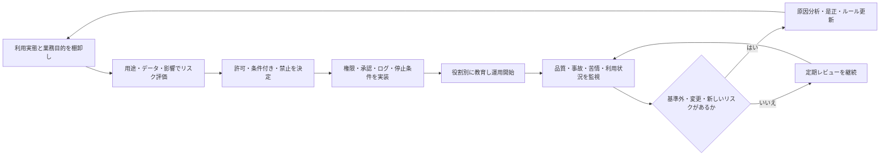
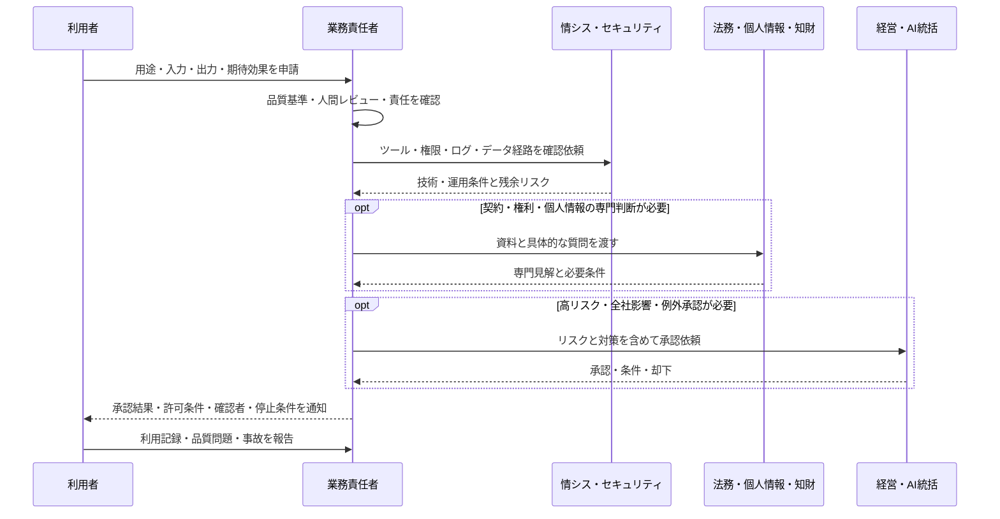
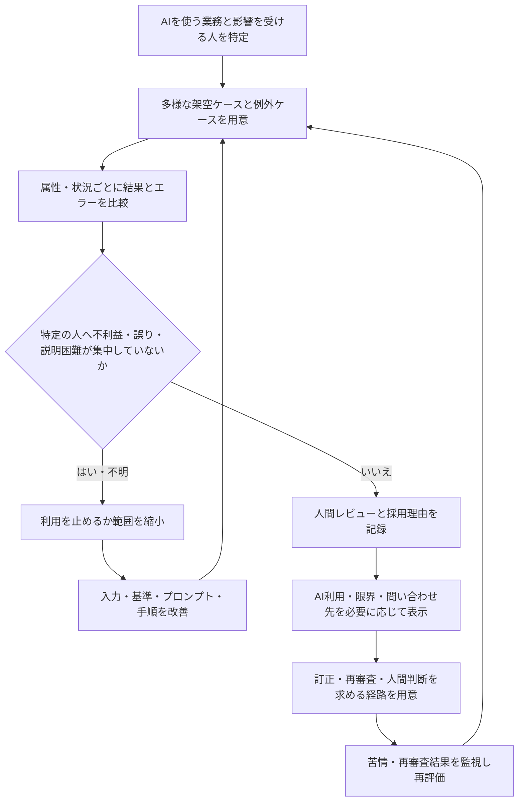
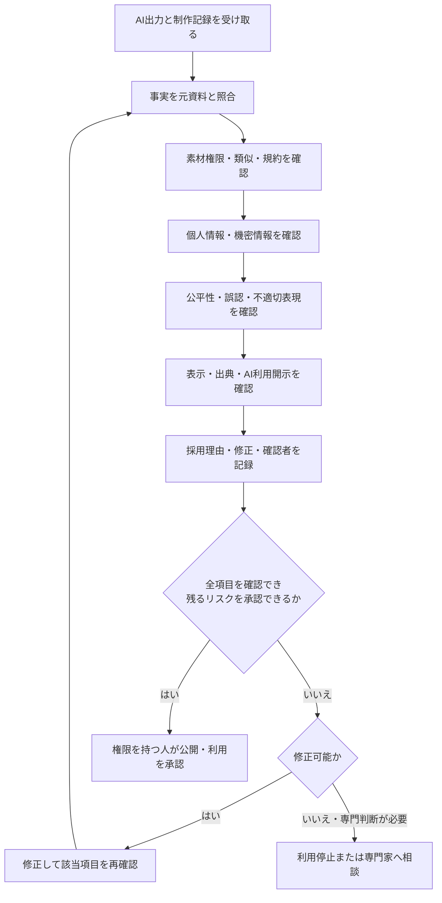

# 07 著作権とAIガバナンス

## 1. この章の目的

AI生成物を業務利用するときの権利・契約・責任の確認項目を理解し、人間レビューと組織ルールを含むガバナンスを設計します。

この章で使う専門用語の短い説明は、[用語集](glossary.md)でも確認できます。

**著作権**とは、文章、画像、音楽などの創作的な表現について、作者などの権利者が利用を管理できる権利の総称です。具体的な保護範囲や例外は国・地域や事情で異なるため、個別判断は専門家へ確認します。

**AIガバナンス**とは、AIを組織の目的と価値観に沿って安全に使うためのルール、責任、手続、監視、改善の仕組みです。

**商用利用**とは、販売物や広告だけでなく、企業活動や収益につながる業務で利用することを広く指す場合があります。具体的な範囲は製品規約、素材の利用条件、契約を確認します。

## 2. 学習ゴール

- 入力、生成、編集、公開の各段階で権利リスクを洗い出せる
- 商用利用、画像、キャラクター、有名人、ブランド表現の注意点を説明できる
- AI利用ガイドラインの構成を作れる
- 作成者、確認者、承認者、システム管理者の責任を分けられる
- バイアス、公平性、透明性、説明責任を業務影響と結び付けられる
- 法的判断を専門家へ確認すべき条件を示せる

## 3. 本編解説

### 3.1 最初に押さえること

著作権などの法的判断は、国・地域、利用目的、入力物、生成過程、出力の表現、契約、公開方法で変わります。本章は一般的なリスク整理であり、法的助言ではありません。商用利用や紛争可能性がある場合は、最新の法令、**裁判例**（過去の裁判所が個別事案について示した判断）、公式資料を確認し、法務担当者や弁護士などの専門家へ相談してください。

日本での公的な確認先の一つは、[文化庁「AIと著作権」](https://www.bunka.go.jp/seisaku/chosakuken/aiandcopyright.html)です。

### 3.2 AI生成物と著作権の基本的な注意

「AIが作ったから自由に使える」「少し変えれば問題ない」「利用規約で商用可だから第三者権利も問題ない」という断定は避けます。

**ライセンス**は、素材や生成物をどの条件で利用できるかを定めた許諾です。**権利の帰属**は、その権利を誰が持つかという意味です。**クレジット**は作者名や出典などの表示、**AI利用開示**は制作にAIを利用した事実や範囲を関係者へ示すことです。必要な条件は製品、素材、契約、用途によって異なります。

| 段階 | 確認すること | 例 |
|---|---|---|
| 入力 | 素材をAIへ提供・複製する権限があるか | 購入画像、他社資料、受託物 |
| 指示 | 特定作品の再現を狙っていないか | 固有キャラクターをそのまま指定 |
| 生成 | 既存表現との類似、依拠を疑う事情がないか | ロゴ、文章、構図、歌詞に酷似 |
| 編集 | 人がどのように選択・修正したか | 構成、表現、素材の独自編集 |
| 公開 | 利用規約、ライセンス、表示、地域要件を満たすか | 商用広告、配布教材、社外公開 |

AI出力に著作権が成立するか、誰に帰属するかは個別事情に左右されます。権利が成立しない可能性と、他者の権利を侵害する可能性は別の問題です。

**依拠**は、既存作品に接して、それを基に表現を作ったと評価されることです。**パブリシティ**は、氏名や肖像などが持つ顧客を引き付ける力に関する利益の考え方です。いずれも個別事情や地域により法的評価が変わるため、用語だけで結論を出さず専門家へ確認します。

#### 図7-1：AI生成物を入力から公開まで段階別に確認する



**図の見方**：5つの枠は、それぞれ1つの工程と、その工程で確認する項目をまとめたものです。枠をまたぐ実線の矢印だけが「入力→指示→生成→編集→利用」という工程順を表します。各枠内の確認項目は次工程や生成結果ではなく、同じ工程で行う点検です。枠内の`~~~`は配置だけに使う見えない接続です。

**講師向け説明ポイント**：実線は制作工程の順番、枠は工程と確認項目の所属関係を表すと最初に説明します。権利確認を公開直前だけに置かず、入力素材をAIへ渡す時点から各工程で行います。「AIが作ったので自由」「人が少し直したので安全」と一括判断せず、重要な商用利用は最新情報と法務・知的財産（知財）の専門家確認へつなぎます。

### 3.3 商用利用時の確認事項

**商標**は、商品やサービスの提供元を見分けるために使われる名称、ロゴなどの目印です。**肖像**は人の顔や姿を表した画像などを指し、その利用では本人の同意、契約、地域ごとの権利などを確認します。**不正競争**は、他者の商品表示と混同させる行為など、公正な競争を損なう行為に関する法的論点です。個別案件は著作権と一括りにせず、法務・知財担当者や専門家へ確認します。

**再委託**は、業務を請け負った事業者が、その一部をさらに別の事業者へ任せることです。**成果物保証**は、納品物の品質や権利問題について誰がどこまで責任を負うかという契約上の条件です。実際の責任範囲は契約ごとに確認します。

- 利用した製品・プランの最新規約で商用利用が認められるか
- 出力に第三者の著作物、商標、人物、機密が含まれないか
- 入力素材のライセンスがAI処理と目的の利用を認めるか
- 顧客契約や委託契約でAI利用・再委託・成果物保証に制限がないか
- 必要な表示、クレジット、AI利用開示があるか
- 生成日時、ツール、指示、入力素材、編集、レビューを記録するか

製品規約は変更され得るため、確認日と該当条項を保存します。

#### 図7-2：商用利用前の確認ゲート



**図の見方**：上から各ゲートを通過します。「規約で商用利用可」は最初の一項目であり、素材の権限や第三者の権利、表示、承認を別に確認します。調査しても問題が解消しない、または判断できない場合は利用しません。

**講師向け説明ポイント**：利用規約と第三者権利を混同させないことが中心です。条項や権利関係が不明なときは推測で進めず、確認日と質問を整理して提供事業者、法務・知財、弁護士等へ確認します。専門家へ相談した事実だけを通過条件にせず、利用条件を確認できたかで判断させます。

### 3.4 画像生成AIの注意

| リスク | 例 | 対策 |
|---|---|---|
| 既存作品との類似 | 特徴的な構図・キャラクター | 画像検索・権利確認、別案、法務相談 |
| 実在人物 | 本人と誤認する画像 | 同意、用途表示、肖像・パブリシティ等を確認 |
| ロゴ・商標 | 架空商品の画像に実在ロゴ | ロゴを除去しブランド確認 |
| 素材規約 | 生成後の編集・配布条件 | 製品と素材の最新ライセンスを読む |
| 誤認・偽情報 | 実在イベント風の画像 | AI生成表示、文脈説明、公開承認 |
| 偏り | 職業や属性の固定観念 | 多様性・差別表現レビュー |

### 3.5 既存キャラクター、有名人、ブランド表現

- 「○○そのもの」「○○風」を安全の証明にしない
- 特徴的な外見、名称、台詞、ロゴ、商品外観の類似を確認する
- 著作権だけでなく、商標、肖像、パブリシティ、不正競争、契約、広告表示など別の論点もあり得る
- パロディや教育目的なら常に問題ない、とは断定しない
- 公開範囲と商用性が上がるほど、事前の専門家確認を厚くする

研修では、実在のキャラクターや有名人を生成させず、架空のブランド設定を使います。

#### 図7-3：画像・人物・キャラクター・ブランド表現の公開判断



**図の見方**：実在人物や既存ブランド等が関係する時点で、いったん公開を保留します。確認しても利用条件を満たせない、判断できない、または安全に修正できない場合は公開しません。権利だけでなく、誤認、偏りも確認し、最後に承認を得ます。

**講師向け説明ポイント**：「○○風」という言い換えだけで安全になるとは説明しません。著作権、商標、肖像、パブリシティ、広告表示など複数の論点があり得るため、実在対象を教材で生成せず、個別案件は専門家へ確認します。

### 3.6 AIガバナンスとは

AIガバナンスは、ガイドラインという文書だけでは機能しません。責任者、具体的な手続、技術設定、教育、監視、見直しを一体として運用します。

この章でいう**統制**とは、リスクを抑えるための権限、承認、ログ、テスト、監視、停止などの仕組みです。

| 要素 | 決めること |
|---|---|
| 目的・原則 | 何のために使い、何を優先するか |
| 利用範囲 | 承認済みツール、禁止・条件付き用途 |
| リスク評価 | 影響、データ、正確性、権利、説明可能性 |
| 責任 | 作成、確認、承認、運用、事故対応 |
| 統制 | 権限、ログ、承認、テスト、監視、停止 |
| 教育 | 初回研修、役割別研修、更新周知 |
| 改善 | 事故・苦情・品質指標から見直す |

### 3.7 利用ガイドラインの作り方

**情シス**は、社内システム、アカウント、ネットワークなどを管理する情報システム部門の略称です。組織によって部門名と担当範囲は異なります。

1. 業務とAI利用の実態を棚卸しする。
2. 禁止だけでなく、許可・条件付き・禁止の例を示す。
3. データ分類とツール承認を結び付ける。
4. 外部公開、重要判断、自動実行の承認条件を決める。
5. 出力確認、権利確認、ログ、保存、事故報告を定める。
6. 現場、情報システム部門（情シス）、セキュリティ、法務、人事、経営がレビューする。
7. 施行日、責任者、見直し周期を決める。

#### 図7-4：AIガバナンスを継続運用する循環



**図の見方**：左から運用を始め、監視後は最初へ戻る循環です。ガイドラインを一度作って終わるのではなく、製品変更、事故、苦情、品質指標を材料に更新します。

**講師向け説明ポイント**：文書だけをガバナンスと呼ばず、責任、技術的統制、教育、監視、改善まで含めます。法令、規約、機能は変わるため、最新版の公式情報と専門家レビューを定期見直しに組み込みます。

### 3.8 責任の所在

**責任分界**とは、作成、確認、承認、運用、事故対応などを誰が担うか、役割ごとの責任範囲を明確に区切ることです。**リスク許容度**は、組織が目的を達成するうえで、どの程度のリスクまで受け入れるかという判断基準です。

| 役割 | 主な責任 |
|---|---|
| 利用者 | 許可された入力、出力の一次確認、利用記録 |
| 業務責任者 | 用途承認、品質基準、最終判断、対外責任 |
| システム管理者 | アカウント、権限、ログ、設定、停止 |
| セキュリティ・個人情報担当 | リスク評価、事故対応、データ統制 |
| 法務・知財 | 契約、著作権等の法的論点、紛争対応 |
| 経営・AI統括 | リスク許容度、資源配分、全社方針 |

ベンダーがAIを提供しても、自社の業務利用に関する責任まで自動的に引き受けるわけではありません。契約上の分担も確認します。

**残余リスク**とは、対策を行った後にも残るリスクです。承認者は、対策前のリスクだけでなく、残余リスクの内容と影響を確認して利用可否を判断します。

#### 図7-5：AI利用を申請して承認・監視する役割の流れ



**図の見方**：利用者から始まり、業務、技術、法務等、経営の役割へ必要な場合だけ確認を広げます。承認後も利用記録や問題を業務責任者へ戻します。

**講師向け説明ポイント**：全件を一部署へ丸投げする図ではなく、判断内容に応じて責任を分ける図です。最終的な業務利用と対外説明の責任者を明示し、ベンダーやAIそのものを承認者にしない点を強調します。

### 3.9 バイアス、公平性、透明性、説明責任

**バイアス**は、データ、設計、入力、評価方法などにより結果が特定方向へ偏ることです。業務では「回答が失礼か」だけでなく、誰が不利益を受けるかを確認します。

**公平性**は特定の属性や立場へ不当な不利益が生じないかを確認する考え方、**透明性**はAIをどこでどのように使ったかを関係者が理解・確認できる状態、**説明責任**は出力を採用した理由、根拠、責任者を説明できることです。

**代表性**は、テスト例が実際の利用者や状況を偏りなく含む度合いです。**異議申立て**は、影響を受けた人が訂正や人間による再判断を求められる仕組みです。**与信**は、支払能力などを審査し、後払いや融資などの信用を与える判断を指します。採用、人事評価、与信などの高影響判断はAIへ委ねず、担当部門と専門家が判断します。

| 観点 | 確認する質問 | 対策例 |
|---|---|---|
| 代表性 | テスト例は対象者の属性・状況を十分含むか | 多様な架空ケースで比較する |
| 公平性 | 特定の属性・立場へ不当な差が出ないか | 属性別のエラー率と理由を確認する |
| 透明性 | AI利用を誰に、どこまで知らせる必要があるか | 用途、限界、問い合わせ先を表示する |
| 説明責任 | 出力を採用した理由と責任者を説明できるか | 根拠、修正、承認、版を記録する |
| 異議申立て | 影響を受ける人が訂正・人間判断を求められるか | 相談・再審査経路を用意する |

何を「公平」とするかは、業務目的、法令、関係者への影響により異なります。特に採用、人事評価、与信、教育評価、医療などでは、AIを最終判断者にせず、担当部門と専門家が影響評価を行います。

#### 図7-6：公平性と異議申立てを運用へ組み込む



**図の見方**：テストで差が見つかったら、無理に公開せず改善へ戻ります。運用開始後も、影響を受ける人が人間による再審査を求められる経路を設け、その結果を次のテストへ反映します。

**講師向け説明ポイント**：全体平均だけで利用可否を決めず、誰にどの不利益が出るかを確認します。採用、雇用、与信、教育評価、医療などの高影響用途ではAIを最終判断者にせず、担当部門と法務・倫理・各領域の専門家による影響評価を求めます。

### 3.10 人間レビューの重要性

レビューは「ざっと読む」ではなく、用途別のチェックリストで行います。

**証跡**とは、後から確認や承認の事実を確かめられる記録です。入力素材、出力、修正内容、根拠、確認者、承認日時などを、社内規程で定めた範囲と期間で残します。

| 観点 | 確認例 |
|---|---|
| 事実 | 元資料と数字・名称・日付が一致 |
| 権利 | 入力素材の許可、類似、ライセンス |
| 個人・機密 | 不要な情報が入出力に残っていない |
| 公平性 | 差別、排除、固定観念がない |
| 表示 | AI利用や出典の開示が必要か |
| 説明 | なぜ採用したか、誰が承認したか記録可能 |

レビュー担当者には時間、専門性、元資料へのアクセス、修正・停止権限が必要です。

#### 図7-7：人間レビューを公開前の実効的なゲートにする



**図の見方**：公開前にチェック項目を順番に通り、確認できない項目があれば修正、専門家相談、利用停止のいずれかへ進みます。単に文章を読み直すだけではありません。

**講師向け説明ポイント**：レビュー担当者に元資料、時間、専門性、停止権限がなければ、承認印だけの形式的な作業になります。AI出力は必ず人が確認し、権利や法的評価が不明な場合は法務・知財等の専門家へ引き継ぎます。

## 4. 実務での使いどころ

- 広告、教材、提案書、Web画像の公開前確認
- 委託業務でAIを使う前の契約確認
- AI利用ガイドライン、承認フロー、記録様式の策定
- 管理職向けに責任分界を合意するワークショップ
- ChatGPTで原稿案、Canva AIでデザイン案を作り、生成から公開前までのリスクを人間が確認する演習

## 5. 講師メモ

- 「合法／違法」を即答させず、確認すべき事実と相談先を挙げさせます。
- 著作権、商標、肖像等を混同しないよう、権利名より「誰のどんな利益に影響するか」から説明します。
- 利用規約の画面を見せる場合は確認日を表示し、条文解釈は法務へつなぎます。
- 人間レビューを精神論にせず、チェック項目、担当、証跡、停止権限まで決めます。

## 6. 演習

### 演習：ChatGPTとCanva AIで架空の研修チラシを作り、公開前リスクを確認する

実在する企業、人物、商品、キャラクター、ロゴ、顧客データ、未公開情報は使いません。完成物は研修内の非公開下書きとし、外部公開、SNS投稿、印刷発注、広告配信は行いません。Canvaの機能名や利用範囲は変わるため、[Canva・Gamma演習環境セットアップ](setup/canva_gamma_setup.md)と最新の公式情報を確認します。

#### 利用環境の準備確認

| 学習環境 | 実施方法 |
|---|---|
| 個人学習 | 自分で利用条件、AI・プライバシー設定、素材ライセンスを確認したChatGPTとCanvaだけを使います。完全な架空情報だけを入力します。 |
| 企業研修 | 承認済みの組織アカウントとワークスペースを使い、AI機能、素材、共有、ダウンロードの権限を管理者が事前確認します。個人アカウントの登録を強制しません。 |
| 未承認・登録不可 | チャットAIの架空出力例、Canva画面例、紙のチラシ台紙を配布し、文章・画像の指示案と公開前レビューを紙上で行います。 |

Canva AIまたはMagic Studioの表示名、利用上限、対応言語、利用可能な機能はプラン・地域・管理者設定等で変わります。指定機能が見当たらない場合は、利用可能な同等機能または紙上代替へ切り替えます。

#### ガイド付き練習

次の完全な架空設定を使います。

```text
主催：青空ラーニングスタジオ（架空）
講座名：初めての業務AI整理講座（架空）
開催日：20XX年10月15日
会場：みらい会議室（架空）
対象：生成AIを初めて業務で試す人
目的：安全な入力判断と人間レビューを体験する
```

ChatGPTには、原稿の事実を増やさず、不足を「要確認」とするよう指示します。

```text
あなたは研修チラシ原稿の編集補助者です。上の架空設定だけを使い、
見出し、短い説明、対象者、当日の内容、注意書きの下書きを作ってください。
実績、推薦、効果、料金、定員、講師経歴など、与えられていない事実は作らず「要確認」としてください。
実在の人物、企業、商品、キャラクター、ブランドを連想させる表現は使わないでください。
```

文章を人が修正してから、Canvaでチラシの下書きを作ります。AI画像を使える場合は、次のように固有名詞や人物を避けた指示を使います。

```text
架空の社内研修案内に使う、青と白を基調とした抽象的な幾何学模様。
人物、文字、ロゴ、商品、キャラクター、ブランドを含めない。落ち着いた業務向け。
```

生成画像は安全や権利を保証された素材ではありません。似ている対象がないか、固定観念を強める表現がないかを人が確認します。

#### 実務演習

ガイド付き練習とは異なる架空テーマで、非公開のチラシ案と公開前確認記録を作ります。

- ChatGPTで原稿案を作り、元設定にない実績、推薦、統計、効果を削除する
- Canva AIまたは利用可能な同等機能で、固有の人物・ブランドを含まない画像案を作る
- 使用したプロンプト、生成日時、機能名、選んだ素材、編集内容を記録する
- Canvaライブラリ素材を使う場合は、素材情報と現在のライセンス条件を確認する
- 入力、生成、編集、公開の段階ごとに停止条件と承認者を決める
- 誤認、アクセシビリティ、偏り、対象者への不利益も確認する

法律、著作権、商標、肖像、パブリシティ、個人情報、広告表示の個別判断は、法務・知的財産・個人情報保護等の担当者または専門家へ確認します。

#### 人間レビュー

レビュー担当者は、チラシだけでなく、入力、プロンプト、素材情報、生成物、編集履歴を確認します。

| 確認段階 | 人間が確認すること | 停止する例 |
|---|---|---|
| 入力 | 入力する権利、機密・個人情報、利用目的 | 権利不明の画像、実在顧客情報、未公開資料がある |
| 生成 | 既存表現との類似、人物・ブランド、偏り | 有名なキャラクターや人物に似ている、差別的表現がある |
| 編集 | 未確認の統計・推薦・実績、素材ライセンス | AIが作った数字を根拠なく掲載している |
| 公開前 | 規約、契約、表示、承認、共有範囲 | 専門確認や責任者承認が未完了である |

指摘を受けた作成者が、修正、差替え、利用中止、専門家相談のいずれにするかを理由付きで記録します。AIやツール提供者を最終承認者にはしません。

#### 振り返り

- ChatGPTが追加した未確認情報と、その処理を書く
- Canvaの生成物で、公開前に迷った類似・権利・偏りの観点を書く
- 「人が少し直したから安全」とは言えない理由を自分の言葉でまとめる
- 実務で必要な承認者、証跡、相談先を決める

#### 完成条件・観察ポイント・改善ポイント

| 区分 | 内容 |
|---|---|
| 完成条件 | 完全な架空情報から非公開チラシ案が作られ、入力・プロンプト・素材・生成・編集の記録、公開停止条件、人間の承認者がそろっている |
| 観察ポイント | 受講者が見た目の良さだけで採用せず、第三者の権利、事実、誤認、偏り、共有範囲を確認できるか |
| 改善ポイント | 「AI生成だから自由」と判断した場合は入力から公開までを再点検する。判断材料が足りない場合は公開せず、素材差替えまたは専門家相談へ進む |

## 7. 実務チェックリストと振り返り

この節は知識を採点するテストではありません。生成物を共有・公開する前のセルフレビューとして使います。法律、著作権、個人情報等の結論は地域、用途、契約、事実関係で変わるため、必要に応じて専門家へ確認してください。

### 実務チェックリスト

- [ ] 入力素材をAIへ渡す権利と目的を確認した
- [ ] 実在人物、既存キャラクター、ブランド、ロゴとの関係を確認した
- [ ] AIが追加した数字、推薦、実績、引用を一次情報で確認した
- [ ] CanvaのAI利用条件と、使用した素材のライセンス条件を確認した
- [ ] 生成物が既存表現に似すぎていないか人が確認した
- [ ] 誤認、差別、固定観念、アクセシビリティ上の問題を確認した
- [ ] AI利用の表示や来歴記録が必要か、組織ルールと規約で確認した
- [ ] 共有範囲を必要最小限にし、公開前の責任者承認を得た
- [ ] 判断できない権利・法令・個人情報の論点を専門家へ渡した
- [ ] AI出力を人間が確認してから利用する

### 振り返りメモ

- 公開を止めるべきだと感じた箇所：
- 修正だけでなく差替え・利用中止を選ぶ条件：
- 実務で残すべき証跡：
- 専門家へ確認する質問：

## 8. まとめ

AI生成物は自動的に権利問題から自由になるわけではありません。入力から公開までを分け、規約、素材権利、類似、人物・ブランド、表示を確認します。組織は公平性、透明性、異議申立ても含め、責任分界、承認、ログ、人間レビュー、専門家相談をガバナンスとして運用します。
