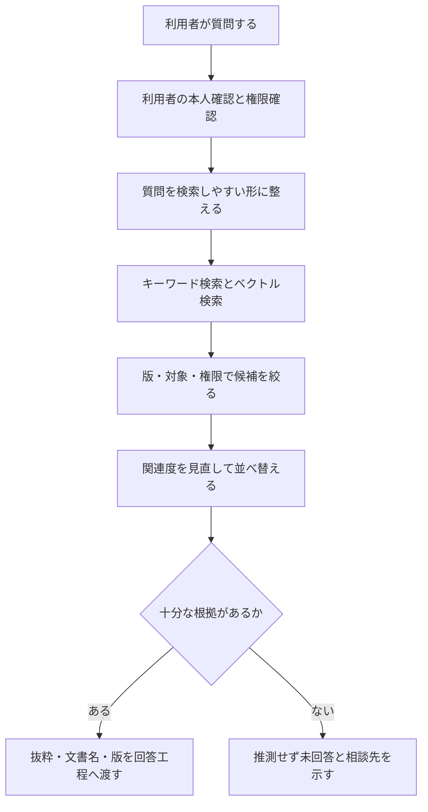
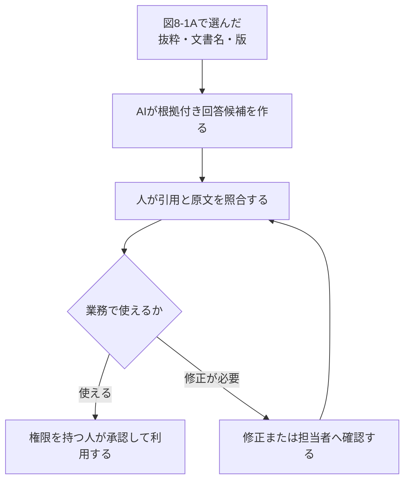
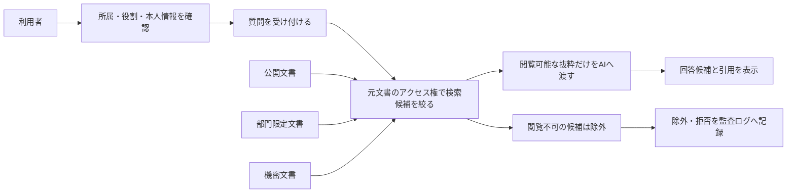
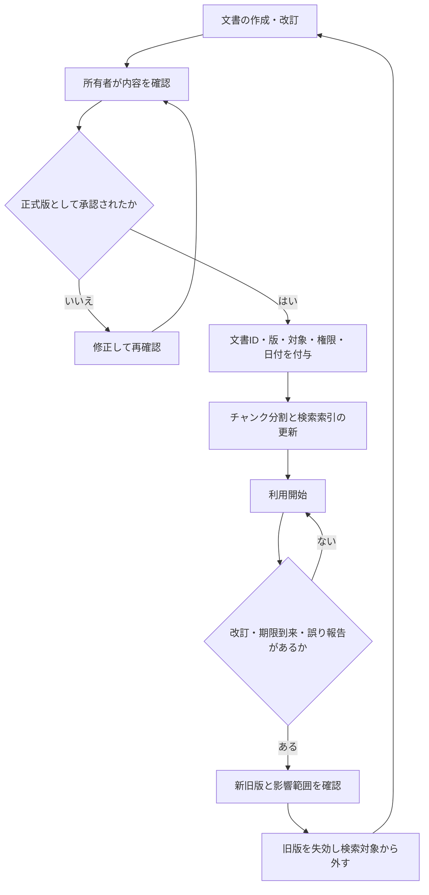
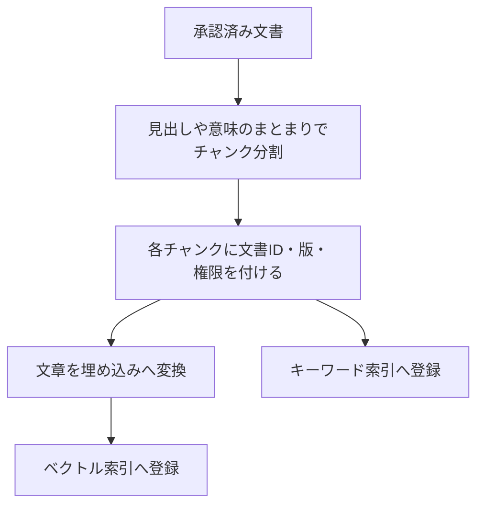
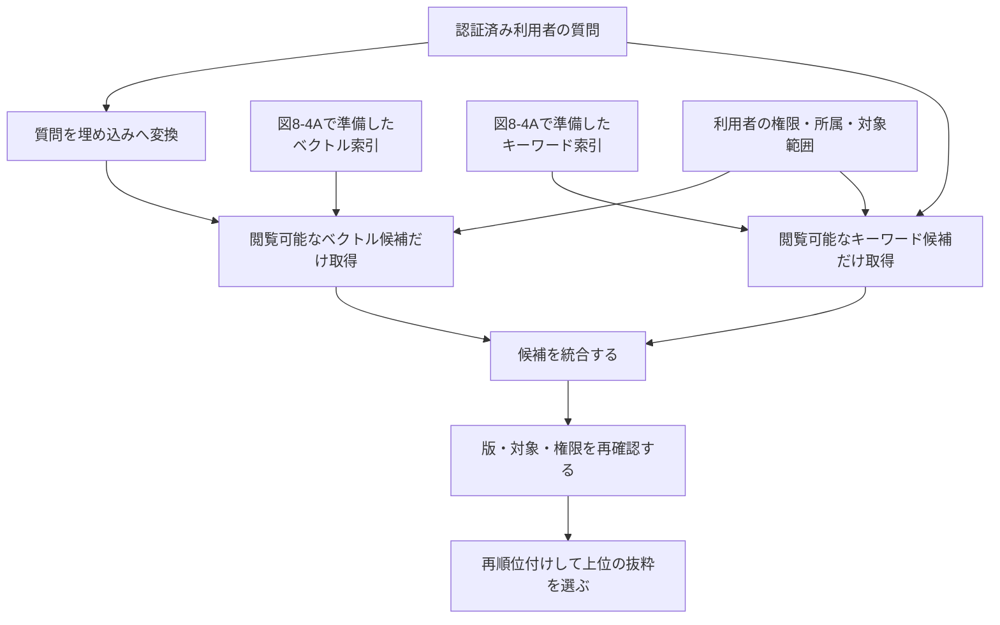
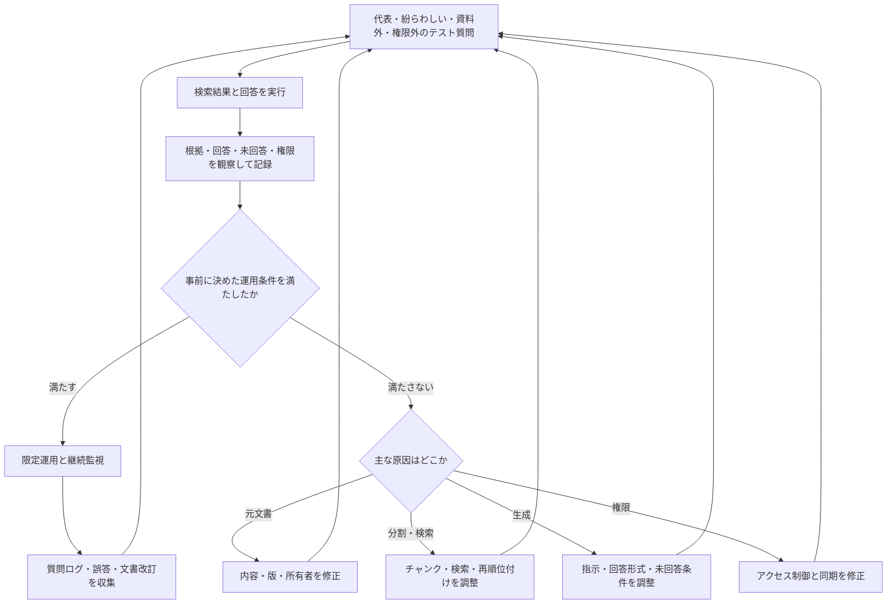

# 08 RAG（検索拡張生成）とナレッジマネジメント

> **位置付け：任意発展**　社内文書検索やFAQ整備を担当する人が、基礎・安全・業務分解を学んだ後に進む章です。実際の社内文書を使うPoCはこの自習と分け、正式な承認、検証環境、担当部門の監督を整えてから行います。

## この章を始める前に

| 確認項目 | 内容 |
|---|---|
| 前提 | 初心者必修の[01 生成AIの基礎](01_generative_ai_basics.md)から[07 AIツールの用途と使い分け](07_ai_tools_overview.md)までを順に学ぶ |
| 使う収録ファイル | [現行版の架空規程](sample-data/rag_training_rules_current.md)、[旧版の架空規程](sample-data/rag_training_rules_old.md)、[RAG質問・資料カード](sample-data/rag_question_cards.md)、[保存済み回答](sample-outputs/notebooklm_saved_answers.md) |
| 成果物 | 質問・回答・根拠・版・適用対象・判定をまとめた`08_RAG検証記録.md` |
| 開始条件 | 下の3経路から1つを選び、4つの収録ファイルを開ける |
| 停止条件 | 実在する社内文書を追加しそう、閲覧権限が不明、現行版を特定できない、資料外の回答を断定している |

### 利用環境を1つ選ぶ

| 経路 | 進め方 |
|---|---|
| 個人学習 | 本人が利用条件とデータ設定を確認したNotebookLMを使い、収録済みの架空規程だけを追加する |
| 組織利用 | 組織が承認した業務アカウント、機能、ブラウザだけを使い、収録済みの架空規程だけを追加する |
| AIなし | 質問・資料カードと保存済み回答を使い、検索、根拠確認、版確認を紙上またはMarkdownで行う |

用語に迷ったときは、[用語集](glossary.md)も参照してください。

## この章の見取り図

| 再開したい内容 | ページ内リンク |
|---|---|
| 目的と到達点を確認する | [この章の目的](#1-この章の目的)／[学習ゴール](#2-学習ゴール) |
| RAGの仕組み・版・権限・限界を読む | [本編解説](#3-本編解説) |
| 実務での利用場面と迷いやすい点を確認する | [実務での使いどころ](#4-実務での使いどころ)／[つまずきやすい点](#5-つまずきやすい点と確認方法) |
| 架空規程から根拠付き回答を作る | [手順付き練習](#6-手順付き練習) |
| 成果物を見直して次へ進む | [実務チェックリスト](#7-実務チェックリストと振り返り)／[まとめ](#8-まとめ) |

## 1. この章の目的

**ナレッジマネジメント**とは、組織の知識を集め、整理し、共有・更新して、仕事で再利用できる状態を保つ活動です。本章では、社内文書をAIに活用させる代表的な考え方であるRAG（Retrieval-Augmented Generation／検索拡張生成）を、非エンジニアにも説明できるようにします。仕組みだけでなく、文書品質、権限、根拠表示、評価、限界を扱います。

### 本章の主要用語

| 用語 | 初心者向けの意味 |
|---|---|
| RAG | 質問に関係する資料を検索し、その抜粋をAIへ渡して回答候補を作る方法 |
| ナレッジベース | 組織の知識を検索・更新・再利用できる形で整理した情報の集まり |
| チャンク | 検索しやすい意味のまとまりへ分けた文書の断片 |
| 埋め込み | 文章の意味的な特徴を、コンピューターが比較しやすい数値へ変える処理 |
| ベクトル検索 | 埋め込みが近い文章を、意味が近い候補として探す検索 |
| メタデータ | 文書名、版、所有者、日付など、文書本体を説明する情報 |
| アクセス制御 | 誰がどの情報を閲覧・変更できるかを決め、権限外の利用を防ぐ仕組み |
| PoC（Proof of Concept／概念実証） | 本格導入前に対象を限定し、効果と安全性を確かめる小規模な検証 |
| NotebookLM | 指定した資料を基に、要約や質問回答などを支援するツール |
| Dify | 知識データ、モデル、指示、外部ツールなどを組み合わせてAIアプリを構成する基盤の一例 |

## 2. 学習ゴール

- RAGと通常のチャットAIの違いを説明できる
- ナレッジベース、チャンク、埋め込み、ベクトル検索を平易に説明できる
- 根拠表示とアクセス制御を含む回答フローを設計できる
- NotebookLMを使う基本演習と、任意で行うDifyの発展演習を説明できる
- RAGの限界を踏まえたPoCの確認項目を作れる

## 3. 本編解説

### この章の学び方

| レベル | 到達点 |
|---|---|
| 初心者 | 「資料を検索→根拠を渡す→回答→原文確認」の流れを説明できる |
| 説明・企画をする人 | チャンク、検索、版、権限、評価が品質へ影響すると説明できる |
| 構築担当 | 自習とは別のプロジェクトで、承認済みの検証データを使って埋め込みモデルや検索設定を評価する。詳細設計は本章の範囲外 |

初心者は数式や実装を学ぶ必要はありません。まず紙の資料カードを探す例で仕組みを理解します。

### 3.1 RAGとは何か

**RAG（Retrieval-Augmented Generation、検索拡張生成）**は、質問に関係する文書を先に検索し、その抜粋をAIへ渡して回答を作る方法です。

#### 図8-1A：RAGが回答材料を検索するまで



**図の見方**：質問を受けたら、最初に利用者の権限を確認します。検索結果を版・対象・権限で絞り、十分な根拠がある場合だけ回答工程へ渡します。根拠がなければ、無理に回答しません。

#### 図8-1B：検索した根拠から回答を利用するまで



**図の見方**：AIが作った回答は完成品ではありません。人が引用箇所と原文を照合し、必要なら修正して再確認します。業務で使えると判断した場合だけ、権限を持つ人が承認します。

図8-1A・8-1Bを文章で追うと、次の6段階です。

1. 利用者と閲覧権限を確認する。
2. 質問に関係する文書を検索する。
3. 版・対象・権限が正しい候補へ絞る。
4. 十分な根拠がある場合だけ、AIへ抜粋と出典情報を渡す。
5. 人がAI回答の引用と原文を照合し、必要なら修正する。
6. 権限を持つ人が利用可否を決める。根拠不足なら未回答にする。

**図の要点**：図8-1Aの「検索」と図8-1Bの「回答生成・人間確認」は別の工程です。最後の人間確認までがRAGの業務フローであり、RAGを導入しても最終判断が自動的にAIへ移るわけではありません。

**再学習**とは、追加データを使ってモデル内部のパラメーター（回答傾向を決める多数の数値）を改めて調整することです。RAGはモデルを社内文書で再学習させることと同じではありません。RAGは、質問のたびに必要な文書を探して回答材料として渡します。初心者には「教科書の内容を頭へ覚え直すのが再学習、質問のたびに教科書を開いて該当ページを渡すのがRAG」と説明できます。

### 3.2 社内文書活用の前提

AIへ文書を入れる前に、次を整えます。

| 確認 | 質問 |
|---|---|
| 利用権限 | この文書をそのサービスで処理してよいか |
| アクセス | 質問者が元文書を閲覧できるか |
| 品質 | 正式版か、内容は正しいか、重複・矛盾はないか |
| 更新 | 所有者、版、施行日、失効日があるか |
| 構造 | 見出し、表、文書ID、メタデータが付いているか |
| 保存 | 保存先、保持期間、削除、バックアップは適切か |

RAGの品質は、モデルだけでなく元文書の品質に強く左右されます。

#### 図8-2：閲覧権限を回答まで引き継ぐ流れ



**図の見方**：利用者が直接ファイルを開けるかだけでなく、検索時と回答生成時にも同じ権限を適用します。閲覧できない文書はAIへ渡さず、回答にも引用にも出しません。

**図の要点**：回答画面だけを制限するのでは不十分です。検索候補を作る段階で権限を適用し、異動・退職・一時権限の変更も元システムと同期する必要があります。

### 3.3 ナレッジベースとは

**ナレッジベース**は、組織の知識を検索・再利用できる形で整理した情報の集まりです。単なる共有フォルダではなく、所有者、版、分類、アクセス権、更新日、失効ルールを持たせます。

| メタデータ | 例 |
|---|---|
| 文書ID | HR-REMOTE-003 |
| タイトル | 在宅勤務規程 |
| 版・施行日 | 第3版・2026-04-01 |
| 所有者 | 人事企画部 |
| 機密区分 | 社内限定 |
| 対象 | 国内正社員 |
| 失効 | 第2版は検索対象外 |

**メタデータ**は、文書本体を説明する情報です。版や対象を検索条件に使うことで、古い規程の混入を減らせます。

**検索索引（インデックス）**は、文書を毎回最初から読む代わりに、必要な情報を素早く探せるよう事前に作る検索用の一覧・構造です。**キーワード索引**は語句や文書IDなどで探すための索引、**ベクトル索引**は埋め込みの近さで意味の似た文章を探すための索引です。

#### 図8-3：文書の登録・更新・失効を管理する循環



**図の見方**：文書を一度登録して終わりではありません。承認済みの版だけを検索対象にし、改訂や期限到来があれば旧版を外して索引を作り直します。

**図の要点**：RAGの誤回答はモデルだけの問題ではありません。「所有者がいない文書」「新旧版が同時に有効」「索引の更新漏れ」も原因になるため、文書管理の責任者を決めます。

### 3.4 チャンク分割

**チャンク**は、検索しやすい大きさに分けた文書の断片です。文書全体が長い場合、見出しや意味のまとまりで分けます。

| 分け方 | 利点 | 失敗例 |
|---|---|---|
| 固定文字数 | 実装が簡単 | 表や条件文の途中で切れる |
| 見出し単位 | 意味がまとまりやすい | 章が長すぎる場合がある |
| 段落・意味単位 | 質問との対応がよい | 分割設計・評価に手間 |
| 重なり付き | 境界の情報を保ちやすい | 重複が増え、別条件が混ざることも |

最適な大きさは文書と質問で変わります。規程の「原則」と「例外」を別々に切りすぎると、誤回答につながります。

### 3.5 埋め込みとベクトル検索

**埋め込み（embedding）**は、文章の意味的な特徴を数値の並びへ変換する処理です。数値の位置が近い文章を探す方法が**ベクトル検索**です。

たとえば「交通費の精算期限」という質問に対し、「出張費は翌月5日までに申請」のように、同じ単語がなくても意味が近い文を候補にできます。ただし「近い」ことは「正解」を意味しません。

| 検索 | 強み | 弱み |
|---|---|---|
| キーワード検索 | 固有名詞、文書番号、完全一致 | 言い換えに弱い |
| ベクトル検索 | 意味の近い表現、自然文質問 | 数字・否定・微妙な条件を誤ることがある |
| ハイブリッド検索 | 両方を組み合わせる | 設計・調整・評価が必要 |

**再順位付け（reranking）**は、取得した検索候補を質問との関連度で並べ直す処理です。候補の中に正しい根拠がなければ、並べ直しても正解にはなりません。

#### 図8-4A：文書を検索できるように準備する工程



**図の見方**：最初に文書を意味のまとまりへ分け、文書ID・版・権限という札を付けます。その後、意味で探す索引と、語句で探す索引の二つを準備します。

#### 図8-4B：利用者が質問したときの検索工程



**図の見方**：質問時は次の順で進みます。

1. 利用者の権限を確認する。
2. ベクトル検索とキーワード検索で、閲覧可能な候補だけを探す。
3. 候補を統合し、版・対象・権限をもう一度確認する。
4. 質問に近い候補を並べ直して、回答材料を選ぶ。

検索前と候補統合後の二か所で権限を確認することが重要です。

**図の要点**：埋め込みは「意味の特徴を数値にした検索用の札」と捉えます。「意味が近い＝正しい」ではないため、数字・否定・例外はキーワード検索や原文確認でも補います。検索候補を作る段階から閲覧権限を適用し、権限外の文書名や抜粋をログ・画面へ出さない設計が必要です。

### 3.6 回答根拠の表示

良いRAG回答には、結論だけでなく次を表示します。

- 文書名、文書ID、版、更新日
- 引用箇所または該当節
- 原文を開くリンク
- 回答できない場合の明示
- 適用対象と例外

```text
回答：原則として希望日の3営業日前までに申請します。
根拠：在宅勤務規程 第3版（HR-REMOTE-003）第4節
注意：緊急時の例外は人事部へ確認してください。
確認日：2026-06-23
```

引用が表示されても、引用が結論を支えるかは人が確認します。

### 3.7 NotebookLMを使った簡易例

本章のツール利用経路ではNotebookLMを使います。NotebookLMは、自分が指定した資料を基に質問し、回答と引用箇所を照合する流れを体験しやすいツールです。ただし、引用が表示されても回答の正しさが保証されるわけではありません。

機能や利用条件は変わるため、[NotebookLMの準備ガイド](setup/notebooklm_setup.md)、[公式ヘルプ](https://support.google.com/notebooklm/answer/16164461)と組織の契約・管理設定を確認します。組織利用では管理者が許可した業務アカウントだけを使い、完全な架空資料だけを追加します。未承認・利用可否不明・登録できない場合は、[RAG質問・資料カード](sample-data/rag_question_cards.md)と[NotebookLM演習の保存済み回答](sample-outputs/notebooklm_saved_answers.md)を使う紙上演習へ切り替えます。

**完全な架空教材での手順例**

1. [現行版の架空研修運営規程](sample-data/rag_training_rules_current.md)、[旧版の架空研修運営規程](sample-data/rag_training_rules_old.md)、[RAG質問・資料カード](sample-data/rag_question_cards.md)を用意する。
2. 文書名、版、日付をファイル内に明記する。
3. 承認済みの環境へ資料を追加する。
4. 「申込期限は。根拠文書と該当箇所も示して」と質問する。
5. 回答と引用を原文で照合する。
6. 資料にない質問をし、「不明」と答えられるか試す。
7. 古い版と新しい版を混在させ、矛盾時の挙動を記録する。

これは簡易検証であり、全社RAGの権限管理や運用品質を保証しません。

### 3.8 Difyによるチャットボット化の任意発展

Difyのような**AIアプリ構築基盤**では、知識データ、モデル、指示、会話フロー、外部ツールなどを組み合わせてチャットボットを構成できます。AIアプリ構築基盤とは、プログラムを一から書かずに、AIへ渡す情報や処理の順序を画面上で組み立てるための土台です。

Difyは発展学習の選択肢であり、本章の修了条件にはしません。実行には、Dify内でAIモデルを呼び出すための利用枠である**AIクレジット**、またはAIモデルを提供する外部サービスである**モデル提供者**の設定・認証情報が必要になる場合があります。APIキーをチャット欄、教材、画面共有へ貼り付けてはいけません。利用前に[Difyの任意発展準備](setup/dify_setup_optional.md)と[公式ドキュメント](https://docs.dify.ai/en/home)を確認します。承認済み環境や認証情報がない場合は、登録もAPIキーも不要な紙上設計で同じ考え方を学びます。

| 設計項目 | 決めること |
|---|---|
| 対象質問 | 何に答え、何に答えないか |
| 文書 | 所有者、版、更新、削除、権利 |
| 検索 | チャンク、件数、キーワード併用、再順位付け |
| 指示 | 根拠外回答の禁止、不明時の案内 |
| 権限 | 利用者と元文書の閲覧権限を一致 |
| 表示 | 引用、注意、問い合わせ先 |
| 運用 | ログ、評価、誤答修正、費用、障害対応 |

簡易ツールで回答できたことは、業務利用に適する証明ではありません。業務用チャットボットでは、権限、ログ、未回答、文書更新、費用、停止条件を含む小規模な検証が必要です。製品の機能・利用条件は変わるため、最新の公式情報と組織の承認を確認します。

### 3.9 RAGの限界

**版フィルター**とは、版番号、施行日、失効状態などを条件に、現行版など必要な版だけを検索対象へ残す絞り込みです。

| 限界 | 何が起こるか | 対策 |
|---|---|---|
| 元文書の誤り | 誤情報を根拠付きで回答 | 文書の所有・承認・更新 |
| 検索漏れ | 正しい文書がAIへ渡らない | 検索評価と質問ログ分析 |
| 文脈切断 | 原則と例外が別チャンク | 分割改善、周辺文脈を渡す |
| 版の混在 | 古い規程で回答 | 失効管理、版フィルター |
| 権限不備 | 閲覧不可文書が回答に出る | 文書単位のアクセス制御 |
| プロンプト注入 | 文書内の悪意ある指示に従う | 文書を命令として扱わない設計、検査 |
| 生成誤り | 引用と異なる結論 | 原文確認、回答テスト、人承認 |
| 未回答の失敗 | 資料外を推測 | 回答拒否と相談先を設計 |

**プロンプト注入**は、入力文書や外部データに紛れた指示でAIの動作を不正に変えようとする攻撃です。

### 3.10 評価方法

**テストセット**とは、品質と安全性を同じ条件で繰り返し評価するために用意した質問・入力例の集まりです。代表質問、紛らわしい質問、資料外質問、権限違い、古い版、攻撃的入力を含めます。

| 観察項目 | 確認すること |
|---|---|
| 検索の取りこぼし | 必要な根拠が検索候補へ含まれたか |
| 根拠との関連 | 引用が質問と関係しているか |
| 回答の正確さ | 回答が原文と一致しているか |
| 根拠への忠実さ | 回答が引用にない内容を足していないか |
| 適切な未回答 | 資料外で推測せず、相談先を案内できたか |
| 権限の順守 | 閲覧できない情報が候補・回答・ログへ出ていないか。出た場合は運用を止める |

#### 図8-5：RAGを評価し、原因別に改善する循環



**図の見方**：条件を満たさない結果を一括して「AIの精度が悪い」とせず、元文書、検索、回答生成、権限のどこで問題が起きたかを分けます。修正後は同じテスト質問で再確認します。

**図の要点**：回答の正確さだけでなく、「資料外で止まれたか」と「権限違反が起きなかったか」を別々に確認します。運用開始後も文書や質問傾向が変わるため、この循環を継続します。

## 4. 実務での使いどころ

- 社内規程、製品マニュアル、研修資料の検索支援
- カスタマーサポート担当者向け回答候補
- 複数文書の改訂差分・論点整理
- 引継ぎや新人教育の質問窓口

## 5. つまずきやすい点と確認方法

- **RAGを正解装置だと思う**：「根拠候補を探して回答材料にする仕組み」と言い換え、回答を原文へ戻します。
- **チャンクや埋め込みが抽象的**：紙の資料カードをチャンク、質問に近いカード探しを検索に見立てます。
- **成功例だけを試す**：資料外質問、古い版、権限外質問を必ず1件ずつ試します。
- **自分の社内文書で試したくなる**：この章では収録済みの架空規程だけを使います。

## 6. 手順付き練習

### 演習：NotebookLMで架空規程を根拠付きで確認する

[現行版の架空研修運営規程](sample-data/rag_training_rules_current.md)と[旧版](sample-data/rag_training_rules_old.md)を使い、資料にある質問・ない質問・版が競合する質問を試します。質問例と紙上カードは[RAG質問・資料カード](sample-data/rag_question_cards.md)、ツールを使えない場合の比較用出力は[NotebookLM演習の保存済み回答](sample-outputs/notebooklm_saved_answers.md)にあります。Difyは任意の追加練習であり、両方を使う必要はありません。

#### 1. 利用環境の準備確認

最初に[NotebookLMの準備ガイド](setup/notebooklm_setup.md)を開き、次のどれで進めるか決めます。

| 状況 | 進め方 |
|---|---|
| 個人学習 | 本人が管理するアカウントを使い、教材の完全な架空資料だけを追加する |
| 組織利用 | 管理者が許可した業務アカウント・機能・ブラウザを使う。不明なら登録・アップロードしない |
| 未承認・利用不可 | 登録やアップロードをせず、[文書カード](sample-data/rag_question_cards.md)と[保存済み回答例](sample-outputs/notebooklm_saved_answers.md)で紙上演習を行う |

実在の社内文書、個人情報、機密情報、認証情報は使いません。

#### 2. 収録資料で手順を練習する

1. [現行版規程](sample-data/rag_training_rules_current.md)と[旧版規程](sample-data/rag_training_rules_old.md)で、文書ID、版、所有者、対象、施行日を確認します。
2. NotebookLMへ追加できる環境では、「申込期限は何ですか。根拠文書と該当箇所を示してください」と質問します。
3. 紙上の場合は、質問に関係する資料カードを選び、回答・根拠・注意・相談先を書きます。
4. 回答の引用箇所を原文と照合し、入力にない条件が足されていないか確認します。

#### 3. 自分で質問セットと検証記録を作る

- 資料に答えがある質問、資料外の質問、古い版と新しい版で答えが違う質問を作ります。
- 原則と例外が同時に必要な箇所をチャンクに分け、切り方による誤解を考えます。
- 回答形式を「回答、根拠、適用対象、注意、相談先」にそろえます。
- Difyを試す場合だけ、[Difyの任意発展準備](setup/dify_setup_optional.md)に従います。承認済み環境やモデル設定がない場合は、検索、回答、権限、人間確認の箱を紙へ描くAPIキー不要の代替演習にします。

#### 4. 原文へ戻って自分で確認する

- 引用は本当に結論を支えているか
- 現行版と対象者を取り違えていないか
- 資料外で推測せず止まったか
- 閲覧権限外の情報が候補・回答・ログへ出ない設計か
- AI出力を業務へ使う前に、文書所有者または担当者が確認する流れがあるか

一つでも重大な問題があれば、その回答を利用せず、原因と修正内容を記録します。

#### 5. 振り返り

- 検索で見つからなかったのか、見つかった根拠をAIが誤って使ったのかを区別できたか。
- 人が原文を確認しなければ見逃した点は何か。
- 実務導入前に、文書所有者・利用者・管理者の誰と何を合意する必要があるか。
- 次に改善する文書、質問、チャンク、権限、回答形式のうち一つを決める。
- この章で確認できたのは完全な架空資料での挙動だけです。実際の文書を使うPoCへ進む場合は、自習とは分けて、承認手続、検証環境、データ管理責任者、停止条件を改めて決めます。

## 7. 実務チェックリストと振り返り

この節では、自分が説明・操作できるかを確認し、不明な項目を次の学習課題にします。

- [ ] RAGを「検索して根拠を渡し、回答候補を作る仕組み」と説明できる
- [ ] 再学習との違いを、初心者向けの例で説明できる
- [ ] チャンク、埋め込み、ベクトル検索を一言と例で説明できる
- [ ] 根拠表示があっても原文確認が必要な理由を説明できる
- [ ] 版、対象者、閲覧権限を回答まで引き継ぐ設計を示せる
- [ ] 資料外では推測を止め、相談先を案内する例を示せる
- [ ] NotebookLM、Dify、紙上代替の使い分けを説明できる

**振り返り**：最も説明しにくかった用語は何でしたか。その用語を「一言の意味→身近な例→限界」の順で言い換えてください。実務でRAGを試すなら、最初に誰の承認を得て、どの完全な架空データで安全性を確かめますか。

## 8. まとめ

RAGは、関連文書を検索してから回答する仕組みです。品質を決めるのは、モデルだけでなく文書管理、チャンク、検索、版、権限、引用、評価です。資料外では止まり、根拠を人が確認する運用まで設計します。

## 自己点検と次の学習

1. `08_RAG検証記録.md`を先に保存します。
2. [第08章の自己点検ガイド](self-check/chapters/08_rag_and_knowledge_management_self_check.md)を開き、段階ヒントだけを先に使います。
3. 必要な箇所だけ成果物例と比較し、回答、根拠、版、適用対象の差を記録します。
4. 1点だけ修正し、資料外質問を含む同じ質問セットで再確認します。

[← 07 AIツールの用途と使い分け](07_ai_tools_overview.md)｜[学習の入口](README.md)｜[次へ：09 AI自動化とAIエージェント（任意発展）→](09_ai_automation_and_agents.md)
