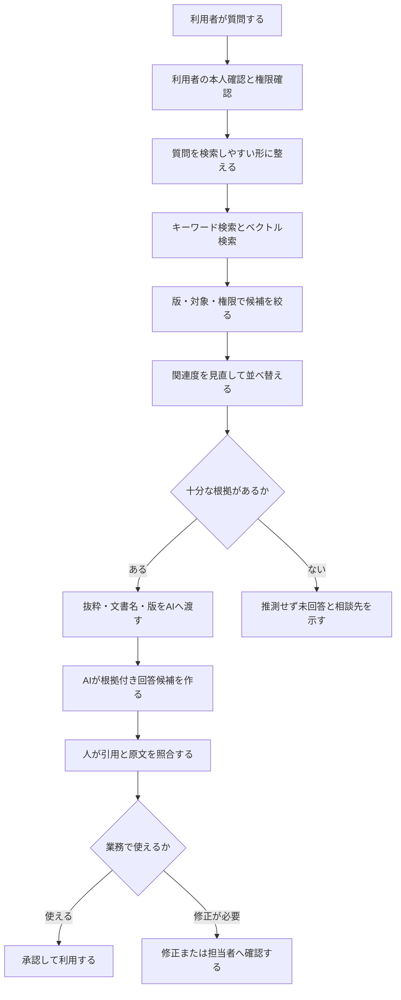
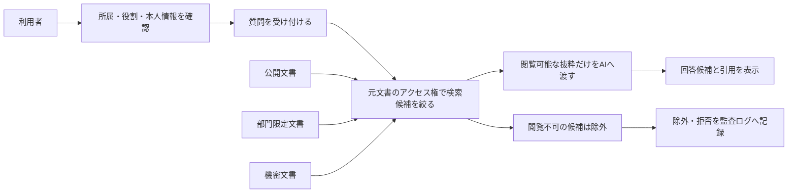
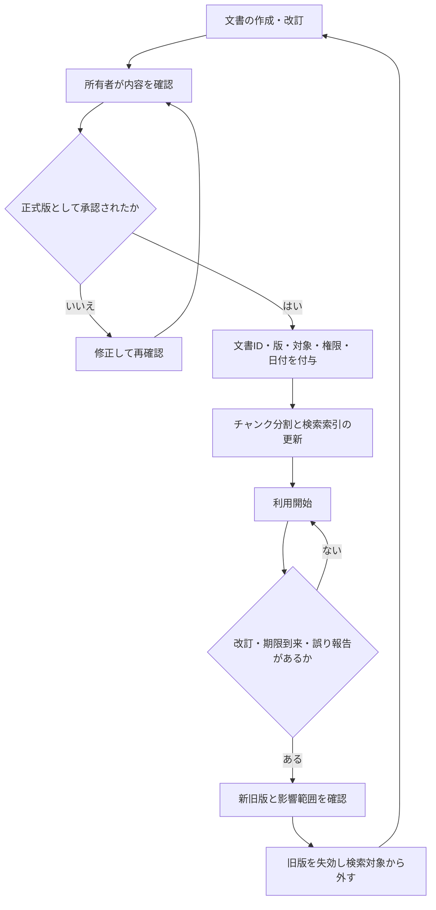
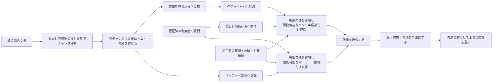
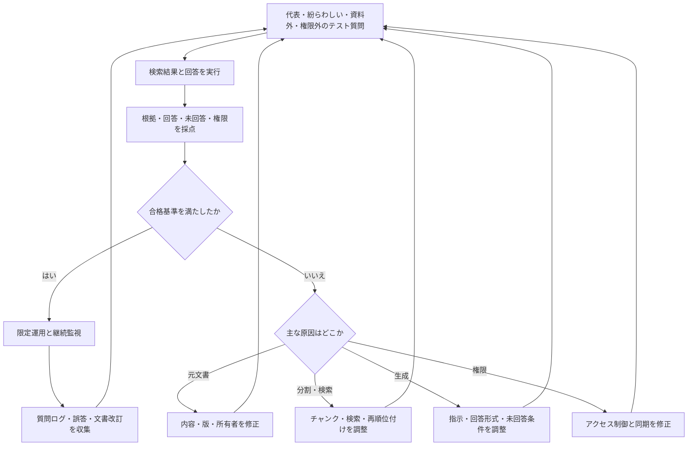

# 08 RAG（検索拡張生成）とナレッジマネジメント

> 用語に迷ったときは、[用語集](glossary.md)も参照してください。

## 1. この章の目的

**ナレッジマネジメント**とは、組織の知識を集め、整理し、共有・更新して、仕事で再利用できる状態を保つ活動です。本章では、社内文書をAIに活用させる代表的な考え方であるRAG（Retrieval-Augmented Generation／検索拡張生成）を、非エンジニアにも説明できるようにします。仕組みだけでなく、文書品質、権限、根拠表示、評価、限界を扱います。

### 本章の主要用語

| 用語 | 初心者向けの意味 |
|---|---|
| RAG | 質問に関係する資料を検索し、その抜粋をAIへ渡して回答候補を作る方法 |
| ナレッジベース | 組織の知識を検索・更新・再利用できる形で整理した情報の集まり |
| チャンク | 検索しやすい意味のまとまりへ分けた文書の断片 |
| 埋め込み | 文章の意味的な特徴を、コンピューターが比較しやすい数値へ変える処理 |
| ベクトル検索 | 埋め込みが近い文章を、意味が近い候補として探す検索 |
| メタデータ | 文書名、版、所有者、日付など、文書本体を説明する情報 |
| アクセス制御 | 誰がどの情報を閲覧・変更できるかを決め、権限外の利用を防ぐ仕組み |
| PoC（Proof of Concept／概念実証） | 本格導入前に対象を限定し、効果と安全性を確かめる小規模な検証 |
| NotebookLM | 指定した資料を基に、要約や質問回答などを支援するツール |
| Dify | 知識データ、モデル、指示、外部ツールなどを組み合わせてAIアプリを構成する基盤の一例 |

## 2. 学習ゴール

- RAGと通常のチャットAIの違いを説明できる
- ナレッジベース、チャンク、埋め込み、ベクトル検索を平易に説明できる
- 根拠表示とアクセス制御を含む回答フローを設計できる
- NotebookLMを使う簡易例とDify等によるチャットボット化の概要を説明できる
- RAGの限界を踏まえたPoC評価を作れる

## 3. 本編解説

### この章の学び方

| レベル | 到達点 |
|---|---|
| 初心者 | 「資料を検索→根拠を渡す→回答→原文確認」の流れを説明できる |
| 講師 | チャンク、検索、版、権限、評価が品質へ影響すると説明できる |
| 構築担当 | 埋め込みモデルや検索設定を実データで検証する。詳細設計は本章の範囲外 |

初心者は数式や実装を学ぶ必要はありません。まず紙の資料カードを探す例で仕組みを理解します。

### 3.1 RAGとは何か

**RAG（Retrieval-Augmented Generation、検索拡張生成）**は、質問に関係する文書を先に検索し、その抜粋をAIへ渡して回答を作る方法です。

#### 図8-1：RAGで質問から回答候補を作る流れ



**図の見方**：上から順に追います。RAGはAIがいきなり答える仕組みではなく、権限を確認し、文書を検索し、根拠を渡し、最後に人が原文を確かめる仕組みです。「十分な根拠がない」場合は、無理に回答せず止まります。

**講師向け説明ポイント**：「検索」と「回答生成」を別の工程として指差しながら説明します。最後の人間確認までをRAGの業務フローに含め、RAGを導入しても最終判断が自動的にAIへ移るわけではないと強調します。

RAGはモデルを社内文書で「再学習」させることと同じではありません。必要な文書をその都度探して、回答材料として渡す考え方です。

### 3.2 社内文書活用の前提

AIへ文書を入れる前に、次を整えます。

| 確認 | 質問 |
|---|---|
| 利用権限 | この文書をそのサービスで処理してよいか |
| アクセス | 質問者が元文書を閲覧できるか |
| 品質 | 正式版か、内容は正しいか、重複・矛盾はないか |
| 更新 | 所有者、版、施行日、失効日があるか |
| 構造 | 見出し、表、文書ID、メタデータが付いているか |
| 保存 | 保存先、保持期間、削除、バックアップは適切か |

RAGの品質は、モデルだけでなく元文書の品質に強く左右されます。

#### 図8-2：閲覧権限を回答まで引き継ぐ流れ



**図の見方**：利用者が直接ファイルを開けるかだけでなく、検索時と回答生成時にも同じ権限を適用します。閲覧できない文書はAIへ渡さず、回答にも引用にも出しません。

**講師向け説明ポイント**：「回答画面を制限するだけでは遅い」と説明します。検索候補を作る段階で権限を適用し、異動・退職・一時権限の変更も元システムと同期する必要があることを補足します。

### 3.3 ナレッジベースとは

**ナレッジベース**は、組織の知識を検索・再利用できる形で整理した情報の集まりです。単なる共有フォルダではなく、所有者、版、分類、アクセス権、更新日、失効ルールを持たせます。

| メタデータ | 例 |
|---|---|
| 文書ID | HR-REMOTE-003 |
| タイトル | 在宅勤務規程 |
| 版・施行日 | 第3版・2026-04-01 |
| 所有者 | 人事企画部 |
| 機密区分 | 社内限定 |
| 対象 | 国内正社員 |
| 失効 | 第2版は検索対象外 |

**メタデータ**は、文書本体を説明する情報です。版や対象を検索条件に使うことで、古い規程の混入を減らせます。

**検索索引（インデックス）**は、文書を毎回最初から読む代わりに、必要な情報を素早く探せるよう事前に作る検索用の一覧・構造です。**キーワード索引**は語句や文書IDなどで探すための索引、**ベクトル索引**は埋め込みの近さで意味の似た文章を探すための索引です。

#### 図8-3：文書の登録・更新・失効を管理する循環



**図の見方**：文書を一度登録して終わりではありません。承認済みの版だけを検索対象にし、改訂や期限到来があれば旧版を外して索引を作り直します。

**講師向け説明ポイント**：RAGの誤回答をモデルの問題だけにしないための図です。「所有者がいない文書」「新旧版が同時に有効」「索引の更新漏れ」という三つの事故例を挙げ、文書管理の責任者を決める重要性を説明します。

### 3.4 チャンク分割

**チャンク**は、検索しやすい大きさに分けた文書の断片です。文書全体が長い場合、見出しや意味のまとまりで分けます。

| 分け方 | 利点 | 失敗例 |
|---|---|---|
| 固定文字数 | 実装が簡単 | 表や条件文の途中で切れる |
| 見出し単位 | 意味がまとまりやすい | 章が長すぎる場合がある |
| 段落・意味単位 | 質問との対応がよい | 分割設計・評価に手間 |
| 重なり付き | 境界の情報を保ちやすい | 重複が増え、別条件が混ざることも |

最適な大きさは文書と質問で変わります。規程の「原則」と「例外」を別々に切りすぎると、誤回答につながります。

### 3.5 埋め込みとベクトル検索

**埋め込み（embedding）**は、文章の意味的な特徴を数値の並びへ変換する処理です。数値の位置が近い文章を探す方法が**ベクトル検索**です。

たとえば「交通費の精算期限」という質問に対し、「出張費は翌月5日までに申請」のように、同じ単語がなくても意味が近い文を候補にできます。ただし「近い」ことは「正解」を意味しません。

| 検索 | 強み | 弱み |
|---|---|---|
| キーワード検索 | 固有名詞、文書番号、完全一致 | 言い換えに弱い |
| ベクトル検索 | 意味の近い表現、自然文質問 | 数字・否定・微妙な条件を誤ることがある |
| ハイブリッド検索 | 両方を組み合わせる | 設計・調整・評価が必要 |

**再順位付け（reranking）**は、取得した検索候補を質問との関連度で並べ直す処理です。候補の中に正しい根拠がなければ、並べ直しても正解にはなりません。

#### 図8-4：チャンク・埋め込み・ハイブリッド検索の関係



**図の見方**：左側は文書を検索できるように準備する工程、右下は質問時の工程です。どちらの検索も候補を取得する時点で利用者の権限を適用し、統合後にも版・対象・権限を再確認する二重のゲートにします。

**講師向け説明ポイント**：埋め込みを「意味の特徴を数値にした検索用の札」と言い換えます。「意味が近い＝正しい」ではないため、数字・否定・例外はキーワード検索や原文確認でも補います。また、検索後に隠すだけでなく、検索候補を作る段階から閲覧権限を適用し、権限外の文書名や抜粋をログ・画面へ出さない設計を強調します。

### 3.6 回答根拠の表示

良いRAG回答には、結論だけでなく次を表示します。

- 文書名、文書ID、版、更新日
- 引用箇所または該当節
- 原文を開くリンク
- 回答できない場合の明示
- 適用対象と例外

```text
回答：原則として希望日の3営業日前までに申請します。
根拠：在宅勤務規程 第3版（HR-REMOTE-003）第4節
注意：緊急時の例外は人事部へ確認してください。
確認日：2026-06-23
```

引用が表示されても、引用が結論を支えるかは人が確認します。

### 3.7 NotebookLMを使った簡易例

NotebookLMの機能や利用条件は変わるため、[公式ページ](https://notebooklm.google/)と組織の契約・管理設定を確認します。特定の社内文書に利用できるかは、自社の承認なしに判断しません。

**架空・公開可能な教材での手順例**

1. 架空の「研修運営規程」「FAQ」「日程表」を用意する。
2. 文書名、版、日付をファイル内に明記する。
3. 承認済みの環境へ資料を追加する。
4. 「申込期限は。根拠文書と該当箇所も示して」と質問する。
5. 回答と引用を原文で照合する。
6. 資料にない質問をし、「不明」と答えられるか試す。
7. 古い版と新しい版を混在させ、矛盾時の挙動を記録する。

これは簡易検証であり、全社RAGの権限管理や運用品質を保証しません。

### 3.8 Difyなどでのチャットボット化の概要

Difyのようなアプリ構築基盤では、知識データ、モデル、指示、会話フロー、外部ツールなどを組み合わせてチャットボットを構成できます。実際の画面・機能は[公式情報](https://dify.ai/)で確認します。

| 設計項目 | 決めること |
|---|---|
| 対象質問 | 何に答え、何に答えないか |
| 文書 | 所有者、版、更新、削除、権利 |
| 検索 | チャンク、件数、キーワード併用、再順位付け |
| 指示 | 根拠外回答の禁止、不明時の案内 |
| 権限 | 利用者と元文書の閲覧権限を一致 |
| 表示 | 引用、注意、問い合わせ先 |
| 運用 | ログ、評価、誤答修正、費用、障害対応 |

簡易ツールで回答できたことは、業務利用に適する証明ではありません。業務用チャットボットでは、権限、ログ、未回答、文書更新、費用、停止条件を含む小規模な検証が必要です。製品の機能・利用条件は変わるため、最新の公式情報と組織の承認を確認します。

### 3.9 RAGの限界

**版フィルター**とは、版番号、施行日、失効状態などを条件に、現行版など必要な版だけを検索対象へ残す絞り込みです。

| 限界 | 何が起こるか | 対策 |
|---|---|---|
| 元文書の誤り | 誤情報を根拠付きで回答 | 文書の所有・承認・更新 |
| 検索漏れ | 正しい文書がAIへ渡らない | 検索評価と質問ログ分析 |
| 文脈切断 | 原則と例外が別チャンク | 分割改善、周辺文脈を渡す |
| 版の混在 | 古い規程で回答 | 失効管理、版フィルター |
| 権限不備 | 閲覧不可文書が回答に出る | 文書単位のアクセス制御 |
| プロンプト注入 | 文書内の悪意ある指示に従う | 文書を命令として扱わない設計、検査 |
| 生成誤り | 引用と異なる結論 | 原文確認、回答テスト、人承認 |
| 未回答の失敗 | 資料外を推測 | 回答拒否と相談先を設計 |

**プロンプト注入**は、入力文書や外部データに紛れた指示でAIの動作を不正に変えようとする攻撃です。

### 3.10 評価方法

**テストセット**とは、品質と安全性を同じ条件で繰り返し評価するために用意した質問・入力例の集まりです。代表質問、紛らわしい質問、資料外質問、権限違い、古い版、攻撃的入力を含めます。

| 指標 | 意味 |
|---|---|
| 検索再現率 | 必要な根拠を候補に含められた割合 |
| 根拠適合 | 引用が質問に関係する割合 |
| 回答正確性 | 回答が原文と一致する割合 |
| 根拠忠実性 | 回答が引用の範囲を越えていないか |
| 適切な未回答 | 資料外で推測せず止まれた割合 |
| 権限違反 | 閲覧不可情報を出した件数。原則0 |

#### 図8-5：RAGを評価し、原因別に改善する循環



**図の見方**：不合格を一括して「AIの精度が悪い」とせず、元文書、検索、回答生成、権限のどこで失敗したかを分けます。修正後は同じテスト質問で再確認します。

**講師向け説明ポイント**：正答率だけでなく、「資料外で止まれたか」と「権限違反がゼロか」を別指標として扱います。本番後も文書や質問傾向が変わるため、この循環を継続する必要があると説明します。

## 4. 実務での使いどころ

- 社内規程、製品マニュアル、研修資料の検索支援
- カスタマーサポート担当者向け回答候補
- 複数文書の改訂差分・論点整理
- 引継ぎや新人教育の質問窓口

## 5. 講師メモ

- RAGを「正解装置」ではなく「根拠候補を探して回答材料にする仕組み」と説明します。
- 紙のカードをチャンクに見立て、質問に近いカードを選ぶ実演が初心者に有効です。
- デモでは成功例だけでなく、資料外質問、古い版、権限外質問を必ず試します。
- 機密文書を教材へ使わず、完全な架空文書セットを準備します。

## 6. 演習

### 演習：紙上RAG設計（60分）

架空の「研修運営規程」を、申込み、キャンセル、当日対応、受講証明の4章で作ったとします。

1. 文書ID、版、所有者、対象、失効日を付けます。
2. 各章を意味のまとまりでチャンクに分け、原則と例外の関係を示します。
3. 代表・紛らわしい・資料外・古い版の質問を各2問作ります。
4. 回答形式を「回答、根拠、注意、相談先」に固定します。
5. 上の6指標で合格条件を決めます。

## 7. 確認問題

1. RAGとモデルの再学習は同じですか。
2. チャンクを小さくしすぎる問題を説明してください。
3. ベクトル検索で近い文書が正解とは限らない理由は何ですか。
4. 根拠表示があっても人の確認が必要なのはなぜですか。
5. RAGでアクセス権を元文書と一致させる理由は何ですか。

<details><summary>解答例</summary>

1. 同じではありません。RAGは質問時に関連文書を検索してモデルへ渡します。
2. 原則と例外、主語と条件などの文脈が切れ、誤解した検索・回答につながります。
3. 意味的な近さを数値化した候補であり、版、対象、否定、細かな条件の正しさを保証しないためです。
4. 引用の取り違えや、引用範囲を越えた生成が起こり得るためです。
5. 検索・回答を経由して、本来見られない情報が漏れるのを防ぐためです。

</details>

## 8. まとめ

RAGは、関連文書を検索してから回答する仕組みです。品質を決めるのは、モデルだけでなく文書管理、チャンク、検索、版、権限、引用、評価です。資料外では止まり、根拠を人が確認する運用まで設計します。
