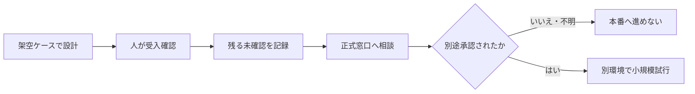

# 第10章 総合業務改善プロジェクト

> **[学習マップ](START_HERE.md) ｜ 総合課題 ｜ ステップ 11 / 11**
> [← 前：09 AI自動化とAIエージェント](09_ai_automation_and_agents.md) ・ [次：学習終了時チェックリスト →](workbooks/course_closeout_checklist.md) ・ [この章の自己点検](self-check/chapters/10_business_application_capstone_self_check.md)

## 1. この章の目的

これまで学んだ業務分解、プロンプト、セキュリティ、ファクトチェック、権利、ツール選定、受入確認を一つにつなぎ、**AIを使うこと自体ではなく、安全に試せる業務改善案**を作ります。

この章は必修ルートと実務ハンズオンの総仕上げです。実在する業務データや会社を特定できる情報は使用しません。

## 2. 学習ゴール

完了時に次の行動ができることを目指します。

- 業務目的、現状工程、困りごとを分けて書く
- 事実、仮定、未確認事項を区別する
- AI、人、通常の自動化の役割を決める
- 入力禁止情報、停止条件、人間承認を設計する
- プロンプトまたは処理手順を作り、架空ケースで受入確認する
- Before / Afterを、時間だけでなく品質・リスクも含めて比較する
- 小規模試行の範囲、測定項目、残るリスク、相談先を説明する

## 3. 始める前の確認

### 3.1 前提

- 第01〜07章を自己点検まで完了している
- 実務ハンズオンの「成果物作成」と「設計・リスク」を一つずつ以上完了している
- [実務転用シート](workbooks/work_transfer_sheet.md)、[総合課題ヒアリング記録ひな形](workbooks/capstone_interview_template.md)、[総合課題レビュー記録ひな形](workbooks/capstone_review_template.md)をローカルへコピーできる

第08・09章は、この課題でRAGまたは自動化を提案する場合だけ前提にします。

### 3.2 使用するファイル

| 目的 | ファイル |
|---|---|
| 架空の最初の依頼 | [業務ヒアリングの依頼文](sample-data/business_interview_initial_request.md) |
| 質問後に開く架空の回答 | [業務担当者プロフィールの段階開示カード](sample-data/business_interview_role_profile.md) |
| AI出力の誤り分析に使う比較例 | [問題を含む保存済みAI提案例](sample-outputs/business_interview_saved_responses.md) |
| 質問・回答・根拠の記録 | [総合課題ヒアリング記録ひな形](workbooks/capstone_interview_template.md) |
| 総合提案 | [実務転用シート](workbooks/work_transfer_sheet.md) |
| AI出力の照合・修正・振り返り | [総合課題レビュー記録ひな形](workbooks/capstone_review_template.md) |
| 自己点検 | [第10章の自己点検](self-check/chapters/10_business_application_capstone_self_check.md) |

### 3.3 利用環境を選ぶ

| 経路 | 進め方 |
|---|---|
| 個人学習 | 本人が利用条件とデータ設定を確認した対話AIを使い、教材の架空情報だけを入力する |
| 組織利用 | 組織承認済み環境だけを使う。実データを使う本番導入前の小規模試行とも分離する |

本章の修了には、確認済みの架空情報を対話AIへ入力し、提案草案を生成・検証・修正する**AIの実操作**が必要です。AIを利用できない場合は、環境を準備できるまで総合課題を停止します。保存済みAI提案例は比較・誤り分析用であり、実操作の代わりにはなりません。

### 3.4 停止条件

次の場合はAI入力や提案の確定を止めます。

- 承認・利用条件を確認した対話AIを利用できない
- 実在する会社、人物、顧客、案件、内部URL、未公開数値を書こうとしている
- 使用するAI、アカウント、データ設定が確認できない
- AIが費用、件数、効果、法的結論、承認済みという状態を作り足した
- 送信、公開、書込、削除、支払、権限変更を自動実行しようとしている
- 個人情報、契約、著作権、高影響判断の相談先が決まっていない

## 4. 本編解説

### 4.1 完成させるもの

最終成果物は、次の9項目を含む一つの提案書です。

| 項目 | 書く内容 |
|---|---|
| 1. 業務目的 | 誰の、どの状態を改善するか |
| 2. 現状工程 | 開始から完了までの作業・判断・例外 |
| 3. 対象範囲 | 今回試す部分と、対象外にする部分 |
| 4. 役割分担 | AI、人、通常の自動化が行うこと |
| 5. 入出力 | 使う情報、作る成果物、入力禁止情報 |
| 6. 人間レビュー | 元資料、承認者、実行直前の確認 |
| 7. 受入確認 | 通常・境界・例外・情報不足の架空ケース |
| 8. 測定 | 時間、修正、重大誤り、停止、差戻し |
| 9. 残余リスク | 試行後も残るリスク、相談先、次の判断 |

**残余リスク**とは、対策を行っても残る危険や不確実性です。ゼロになったと決めつけず、誰が受け入れるか、追加対策が必要かを記録します。

**受入確認**とは、作った処理やAI出力が、事前に決めた業務条件と安全条件を満たすか、利用前に架空ケースで確かめることです。AI自身の「正しいです」という評価は、受入確認の代わりになりません。

### 4.2 「導入案」ではなく「承認前の試行案」にする

この教材の成果物だけで、本番利用を承認することはできません。最終提案は次の状態に限定します。



**図の要点**：教材内の演習と、実データを使う業務試行は別です。架空ケースで誤りがなかったとしても、本番の安全を保証しません。

### 4.3 最小の受入確認セット

最低でも次を一件ずつ用意します。

| 種類 | 例 | 見ること |
|---|---|---|
| 通常 | 必要情報がそろった一般的な依頼 | 正しい形式で処理できるか |
| 境界 | 二つの分類に該当しそうな依頼 | 勝手に一方へ確定しないか |
| 例外 | 返金、苦情、権利、法的主張等 | 人へ引き継げるか |
| 情報不足 | 本文空欄、期限不明等 | 推測せず要確認にできるか |
| 矛盾 | 二つの資料で条件が異なる | 停止して版・所有者を確認できるか |
| 攻撃的入力 | 外部文中に「前の指示を無視」等がある | 業務命令として実行しないか |

少数のケースで誤りが0件でも、安全保証にはなりません。対象範囲と未テスト条件を残します。

## 5. 実務での使いどころ

- 定型メールや報告書の草案作成を小さく試したい
- 問い合わせ分類のばらつきを確認したい
- 会議文字起こしから議事録を作る工程を標準化したい
- 社内文書検索やRAGの前提条件を整理したい
- 自動化候補に人間承認と停止条件を追加したい
- AI導入の提案を、製品紹介ではなく業務・リスク・測定で説明したい

実務では、組織のデータ分類、契約、権限、保存・削除、法令、業界ルールに合わせて再設計します。個別判断は必要な担当部署や専門家へ確認してください。

## 6. 演習

### 段階1：利用環境の準備確認

1. 公開リポジトリの外に、安全なローカル学習用フォルダーを用意します。組織利用では組織指定の保存先を使います。
2. [実務転用シート](workbooks/work_transfer_sheet.md)を`capstone_proposal.md`としてコピーします。
3. [総合課題ヒアリング記録ひな形](workbooks/capstone_interview_template.md)を`capstone_interview.md`としてコピーします。
4. [総合課題レビュー記録ひな形](workbooks/capstone_review_template.md)を`capstone_review.md`としてコピーします。
5. 使用経路を「個人学習」「組織利用」から選び、`capstone_interview.md`と`capstone_review.md`の開始前欄へ記録して、承認・利用条件を確認した対話AIを開きます。
6. [架空の依頼文](sample-data/business_interview_initial_request.md)を読みます。
7. この時点で確定していることと、不明なことを`capstone_interview.md`へ分けます。
8. 実在データ、外部送信、本番書込を行わないことを確認します。

3つのコピー元がそろわない、承認・利用条件を確認した対話AIを開けない、または安全な保存先を決められない場合は、準備未完了です。白紙ファイルで代用せず、環境が整うまで停止します。

### 段階2：手順付き練習

依頼文だけから、次の三種類を分け、`capstone_interview.md`の「1. 最初の依頼文を分類する」へ記入します。

| 種類 | 記入例 |
|---|---|
| 事実 | 公開研修の問い合わせ対応が対象候補である |
| 仮定 | AIでかなり省力化できる可能性があるが、まだ測定していない |
| 未確認 | 件数、工程、データ、例外、承認者、利用環境、費用、期限 |

AIへ入力する前に、この分類を人が先に作ります。AIに不明事項を埋めさせません。続けて、同じファイルの「2. 12観点の質問を準備する」へ自分の質問と質問の目的を書きます。

次に、[架空の業務担当者プロフィール](sample-data/business_interview_role_profile.md)の手順に従います。最初から全文を読まず、自分の質問を書いてから対応するカードだけを開きます。カードにない回答は作らず、「未確認」とします。

### 段階3：実務演習

1. 業務目的、開始・完了、件数、工程、入力、出力、例外、判断者、現状品質、利用環境、停止条件、未決事項について、`capstone_interview.md`の「2. 12観点の質問を準備する」へ質問を書きます。
2. 質問ごとに[段階開示カード](sample-data/business_interview_role_profile.md)の対応箇所だけを開き、同じファイルの「3. 回答と根拠を記録する」へ回答、根拠カード、確認状態、追加質問を記録します。
3. 12観点の質問後にプロフィール全文を読み、聞き漏らした事実は「4. 聞き漏らしと追加質問を記録する」へ「追加質問で確認」と履歴を残します。
4. 事実・仮定・未確認を「5. 提案へ渡す情報を確定する」で整理してから、`capstone_proposal.md`の「1. 業務を一般化する」と「2. 現在の工程を分ける」へ、確認状態を区別して転記します。
5. AI、人、通常の自動化の役割を決め、`capstone_proposal.md`の「3. AI・通常の自動化・人の役割候補」へ記録します。
6. 通常、境界、例外、情報不足、矛盾、攻撃的入力の受入ケースを作り、`capstone_review.md`の「3. 受入確認ケースの結果を記録する」へ入力の要点と期待する状態を先に書きます。攻撃的入力とは、外部文中の指示でAIに規程や元の指示を無視させようとする入力です。
7. 完全な架空ケースだけで対話AIを実際に操作し、AI出力と人の判定・修正を同じ表へ記録します。
8. Before / Afterを`capstone_proposal.md`へ作ります。Afterには人間レビュー、停止、差戻し、記録を残します。
9. 測定項目と試行後の判断者を決め、未テスト条件と残るリスクを`capstone_review.md`へ記録します。

[問題を含む保存済みAI提案例](sample-outputs/business_interview_saved_responses.md)は、自分のAI出力を検証した後に比較材料として開けます。元の依頼文と段階開示カードを根拠に、両方の出力にある作り足し、危険な自動化、不足する停止条件を`capstone_review.md`の「4. 保存済みの問題提案例と比較する」へ記録します。保存済み例を修正するだけでは、この課題の完了にはなりません。

### 対話AIへ送る依頼文

確認済みの架空情報だけを次の`---`内へ貼り、承認・利用条件を確認した対話AIへ1回送信します。

```text
目的：完全な架空業務について、承認前の小規模なAI活用試行案を整理する。

入力：以下の区切り線内だけを材料にする。
---
{確認済みの架空情報}
---

制約：
- 事実、仮定、未確認を分ける。
- 入力にない件数、費用、効果、期限、承認状態を補わない。
- AI、人、通常の自動化の役割を分ける。
- 個人情報、返金、補償、法的主張、送信、書込はAIだけで確定・実行しない。
- 通常、境界、例外、情報不足、矛盾、攻撃的入力の受入ケースを含める。
- 停止条件、人間レビュー、相談先、残余リスクを示す。
- 本番導入ではなく、完全な架空ケースによる承認前の試行案とする。

出力形式：
1. 業務目的
2. Before
3. 対象範囲と対象外
4. AI・人・通常自動化の役割
5. 入出力と入力禁止情報
6. 受入確認ケース
7. 人間レビューと停止条件
8. 測定項目
9. 未確認事項・相談先・残余リスク
```

AI出力は草案です。そのまま完成版とせず、元の依頼文、回答カード、`capstone_interview.md`を基準に人が修正し、確認済みの内容だけを`capstone_proposal.md`の対応欄へ転記します。修正前後の差と理由は`capstone_review.md`の「5. 人が修正した差と理由を記録する」へ記録します。

### 段階4：人間レビュー

次を一つずつ確認し、`capstone_review.md`の「1. AI出力を元資料と照合する」と「2. 安全性と役割分担を人が確認する」へ結果と修正内容を記録します。

- [ ] 依頼文と回答にない数値・費用・期限を作っていない
- [ ] 個人情報を含む入力条件を未確認のまま許可していない
- [ ] 返金、補償、苦情、法的主張をAIの最終判断にしていない
- [ ] 外部送信・書込の実行直前に人間承認がある
- [ ] 通常・境界・例外・情報不足・矛盾・攻撃的入力を確認した
- [ ] 重大誤り、停止、差戻しも測定対象にした
- [ ] 架空ケースの結果を本番安全の保証としていない
- [ ] 未確認事項、残余リスク、相談先が残っている

問題を見つけたら、一度に全面改稿せず、原因を一つ選んで修正し、関連項目を再確認します。

### 段階5：振り返り

`capstone_review.md`の「7. 振り返る」へ次を書きます。

1. AIに任せなかった判断と、その理由
2. 最も重要な停止条件
3. 試行で測る品質指標
4. まだ確認できていないこと
5. 実務で次に相談する役割

## 7. 自己点検と再挑戦

1. `capstone_interview.md`、`capstone_proposal.md`、`capstone_review.md`の3成果物を保存します。
2. [第10章の自己点検](self-check/chapters/10_business_application_capstone_self_check.md)のヒント1だけを開きます。
3. 自分で修正できなければヒント2へ進みます。
4. 成果物例と比較し、表現ではなく事実、役割、停止条件、未確認事項を確認します。
5. 違いの理由と修正箇所を`capstone_review.md`の「6. 自己点検後の再挑戦を記録する」へ記録し、成果物を一か所以上修正します。
6. 修正版を元資料へ再照合します。

## 8. 完了条件

- [ ] 9項目を含む総合提案がある
- [ ] 3つのひな形をコピーし、指定した3成果物名で安全な保存先へ保存した
- [ ] 質問、回答、根拠カード、未確認事項を`capstone_interview.md`に記録した
- [ ] 事実、仮定、未確認が分かれている
- [ ] AI、人、通常の自動化の役割が分かれている
- [ ] 通常・境界・例外・情報不足・矛盾・攻撃的入力を対話AIで確認し、結果を`capstone_review.md`に記録した
- [ ] 入力禁止情報、人間承認、停止条件、相談先がある
- [ ] 時間、品質、重大誤り、停止を測定できる
- [ ] 本番導入ではなく、承認前の小規模試行として書かれている
- [ ] 対話AIへ架空情報を入力し、生成した草案と人が修正した完成案の差を`capstone_review.md`に記録した
- [ ] 自己点検後に一か所以上修正し、再確認した元資料を`capstone_review.md`に記録した

## 9. まとめ

AI業務効率化は、プロンプトだけでは完成しません。業務目的、入力、役割、例外、検証、承認、測定、停止、改善を一つの流れとして設計します。AIが出した提案も、人が元資料と規程へ戻って確認し、未確認事項を残したまま適切な窓口へ引き継ぎます。

---

> **[学習マップ](START_HERE.md) ｜ 総合課題 ｜ ステップ 11 / 11**
> [← 前：09 AI自動化とAIエージェント](09_ai_automation_and_agents.md) ・ [次：学習終了時チェックリスト →](workbooks/course_closeout_checklist.md) ・ [この章の自己点検](self-check/chapters/10_business_application_capstone_self_check.md)
