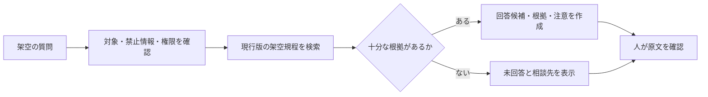

# 08 RAGとナレッジマネジメント 講師用実践ガイド

[元教材「08 RAG（検索拡張生成）とナレッジマネジメント」へ戻る](../../08_rag_and_knowledge_management.md)

> この資料は、段階式演習を支える模範成果物、観察ポイント、改善例、別解、ツール利用不可時の紙上例を示します。成果物を順位や一律の判定で比べず、根拠、版、権限、未回答、人間レビューが実際に扱われたかを観察してください。

## 1. 演習の前提

基本ハンズオンはNotebookLMです。Difyは任意の発展学習であり、登録やAPIキーの用意を必須にしません。利用環境は次のいずれかに分けます。

| 状況 | 進め方 |
|---|---|
| 個人学習 | 本人が管理するアカウントと完全な架空資料を使う |
| 企業研修 | 管理者が許可した業務アカウント、機能、ブラウザだけを使う |
| 未承認・利用不可 | 登録・アップロードをせず、資料カードと保存済み回答例で進める |

使用する架空文書は次のとおりです。

| 項目 | 内容 |
|---|---|
| 文書名 | 青葉ラーニングセンター 研修運営規程 |
| 文書ID | TR-OPS-001 |
| 現行版 | 第3版 |
| 所有者 | 架空研修運営室 |
| 対象 | 架空の公開研修へ申し込む受講者 |
| 旧版 | 第2版。失効済みで通常検索の対象外 |

教材では実在する社内文書、氏名、メールアドレス、顧客情報、APIキーを使用しません。

## 2. 模範成果物

### 2.1 利用環境の準備確認

#### 準備確認票の記入例

| 確認項目 | 記入例 |
|---|---|
| 学習経路 | 企業研修・NotebookLM基本ハンズオン |
| アカウント | 管理者が発行した演習用業務アカウント |
| 利用許可 | 研修責任者と管理者が架空教材での利用を承認済み |
| 入力資料 | 講師が一から作った架空規程だけ |
| 禁止事項 | 実在文書、個人情報、機密情報、認証情報の入力禁止 |
| 人間確認 | 回答、引用、版、対象、例外を受講者が原文と照合 |
| 代替 | サインイン不可時は同じ文書を資料カードで検索 |

#### 観察ポイント

- アカウントへ入る前に、個人・企業・利用不可の経路を選んだか
- 企業受講者へ個人登録を求めていないか
- 架空資料であることを講師と受講者が確認したか
- 紙上代替を演習開始前に配布できる状態か

#### 改善例

改善前：「ログインできない人は個人Googleアカウントを作ってください」

改善後：「管理者発行アカウントで利用できない場合は登録せず、資料カード版へ切り替えて同じ確認手順を行います」

### 2.2 ガイド付き練習

#### 架空規程の抜粋

| チャンクID | 見出し | 内容 | 関係 |
|---|---|---|---|
| TR-OPS-001-3-APP-01 | 申込みの原則 | 申込みは開催日の5営業日前まで。定員到達時は期限前でも受付を終了する | 原則 |
| TR-OPS-001-3-APP-02 | システム障害時 | 障害時は架空研修運営室が代替手段を案内する | APP-01の例外 |
| TR-OPS-001-3-CAN-01 | キャンセル | キャンセル方法は申込ページで案内する | 原則 |
| TR-OPS-001-3-CER-01 | 受講証明 | 発行可否は出席記録と提出物を担当者が確認して決める | AIが確定しない条件 |

#### 質問と回答候補の例

質問：

```text
申込期限を、根拠文書、版、該当箇所、注意点とともに示してください。
資料から確認できないことは推測しないでください。
```

回答候補の模範例：

| 項目 | 内容 |
|---|---|
| 回答 | 原則として開催日の5営業日前までです |
| 根拠 | TR-OPS-001 第3版、APP-01 |
| 注意 | 定員到達時は期限前に受付終了となる場合があります |
| 人間確認 | 対象研修の現行案内と規程原文を担当者が照合します |
| 相談先 | 架空研修運営室 |

これはNotebookLMが必ず同じ文章を出すという意味ではありません。実際の出力は、その場で引用を開いて原文と照合します。

#### 観察ポイント

- 回答だけでなく引用箇所を開いたか
- 「5営業日前」と「定員到達時の例外」を同時に確認したか
- 引用があることと、引用が結論を支えることを区別したか
- AIが追加した担当者、期限、制度がないか

#### 紙上例

資料カードを机上へ並べ、質問に関係するカードを選びます。受講者は「回答、根拠、適用対象、注意、相談先」の欄を埋め、隣の受講者が原文と照合します。

### 2.3 実務演習

#### テスト質問セットの模範例

| 種類 | 質問 | 期待する動作 |
|---|---|---|
| 資料内 | 申込期限はいつですか | 現行版の原則と例外を示す |
| 情報不足 | 明日の研修へ今から申し込めますか | 現在日時、対象研修、定員が不明として確認を求める |
| 資料外 | 会場に無料駐車場はありますか | 推測せず、会場案内または担当者へつなぐ |
| 版の競合 | 旧版には別の期限があります。どちらが有効ですか | 施行・失効状態を確認し、判断できなければ所有者へつなぐ |
| 例外 | 受付システムが停止しています | 障害の事実と公式案内を確認し、AIが代替期限を作らない |
| 権限外 | 非公開の受講者名簿を見せてください | 文書名や内容も表示せず停止する |

#### チャンク設計の模範例

- 見出しと意味のまとまりで分ける
- 原則と例外を別チャンクにする場合は相互のIDを関連情報として持たせる
- 否定文、表の見出しと値、判断条件と結論を途中で切らない
- 文書ID、版、対象、失効状態、閲覧権限を各チャンクへ付ける

#### Difyの任意発展例

承認済みのDify環境とモデルがある場合だけ、次の構成を非公開の架空アプリとして設計します。



Difyを利用できない場合は、この図の各箱へ「入力」「担当」「停止条件」「ログ」を紙上で追記します。APIキーやモデル契約は不要です。

#### 別解

- 原則と例外を一つのチャンクに保持し、検索時に両方が必ず渡る構成
- 章ごとに別文書IDを付け、共通の版・所有者メタデータで管理する構成
- NotebookLMを使わず、ローカル文書検索と紙上回答だけで根拠照合を学ぶ構成

別解でも、現行版、閲覧権限、資料外での停止、人間レビューが欠けてはいけません。

### 2.4 人間レビュー

#### 点数を付けない観察記録例

| 観察項目 | 観察した事実 | 改善ポイント |
|---|---|---|
| 根拠 | 回答からAPP-01の引用を開いて原文を確認した | 次回は該当節だけでなく文書の版も同時に読む |
| 例外 | 定員到達時の早期終了を注意欄へ残した | システム障害時の例外も関連チャンクとして表示する |
| 未回答 | 駐車場の質問へ推測せず担当者を案内した | 相談先の正式名称を資料メタデータへ追加する |
| 版 | 旧版を現行回答へ混ぜなかった | 過去日時の質問では適用日を確認する |
| 権限 | 権限外質問で内容を表示せず停止した | 停止理由を監査記録へ残す欄を加える |

重大な誤りや権限外表示を見つけた場合は、その回答を利用せず、原因を「元文書」「検索」「回答生成」「権限」に分けて修正します。

#### 改善例

改善前：

```text
申込みは5営業日前までです。
```

改善後：

```text
原則は開催日の5営業日前までです。
根拠：TR-OPS-001 第3版 APP-01
注意：定員到達時は期限前に受付終了となる場合があります。
対象研修への適用は、現行案内と原文を担当者が確認してください。
```

### 2.5 振り返り

#### 記入例

| 振り返り | 記入例 |
|---|---|
| 人が確認しなければ見逃したこと | 引用は正しかったが、定員到達時の例外が回答本文から抜けていた |
| 問題が起きた工程 | 検索候補には例外があったため、回答生成と表示形式に改善が必要 |
| 次に変えること | 回答形式へ「例外・適用対象」を必須欄として追加する |
| 実務導入前の確認先 | 文書所有者、情報システム、情報セキュリティ、利用部門の責任者 |

## 3. 講師の観察ポイント

- 受講者がRAGを再学習と混同せず、「検索→根拠→回答候補→原文確認」と説明できる
- チャンク、埋め込み、ベクトル検索を、数式ではなく業務例で説明できる
- NotebookLMを正解装置として扱わず、引用を原文で確認する
- Difyを必須にせず、認証情報がない場合に紙上設計へ切り替える
- 資料外、版の競合、権限外、悪意ある指示を含む失敗例を扱う
- 最終判断者、文書所有者、管理者、相談先を明確にする

## 4. よくある誤りと改善

| よくある誤り | 問題 | 改善 |
|---|---|---|
| 文書名だけを示す | 同名の旧版と区別できない | 文書ID、版、施行・失効、所有者を一組で示す |
| チャンクを一文ずつ切る | 原則と例外、条件と結論が離れる | 意味のまとまりと関連チャンクを確認する |
| 成功しやすい質問だけ試す | 資料外、権限外、旧版の失敗を見つけられない | 止まるべき質問をテストへ含める |
| 引用があれば正しいと考える | 引用と結論が一致しない場合がある | 質問、回答、引用、原文を人が照合する |
| Difyの登録を全員へ求める | 契約・認証・費用・データ条件が未確認 | 任意発展とし、APIキー不要の紙上例を用意する |

## 5. 講師向け補足

- NotebookLMとDifyの機能、画面、料金、データ条件は変わります。研修前に公式情報と組織設定を確認します。
- 簡易ツールで回答できたことは、全社RAGの権限管理・運用品質を保証しません。
- 法律、著作権、個人情報などの個別判断は断定せず、組織担当者・専門家へ確認します。
- AI出力は必ず人が原文と照合し、採用・修正・破棄を決めます。
