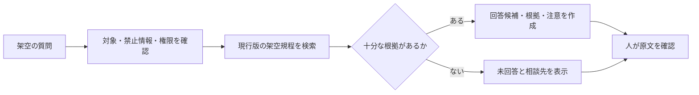

# 08 RAGとナレッジマネジメント 自己点検ガイド

> **[学習マップ](../../START_HERE.md) ｜ 自己点検 ｜ ステップ 9 / 11**
> [← 本編：08 RAGとナレッジマネジメント](../../08_rag_and_knowledge_management.md) ・ [自己点検一覧](../README.md) ・ [次：09 AI自動化とAIエージェント →](../../09_ai_automation_and_agents.md)

> **任意発展の自己点検資料です。** 根拠、版、権限、未回答、人間レビューが成果物に含まれるかを自分で確かめます。実際の社内文書を使うPoCは自習と分け、正式な承認と検証環境を整えてから行います。

## 先に行うこと

先に`08_RAG検証記録.md`を保存し、資料にある質問、資料外質問、版が競合する質問を自分で処理してください。その後、次の順でこのページを使います。

1. 段階ヒントを1つずつ開く。
2. まだ直せない箇所だけ成果物例と比較する。
3. 差分を1点だけ修正する。
4. 同じ質問セットで回答、根拠、版、適用対象を再確認する。

## 段階ヒント

<details>
<summary>ヒント1：RAGの4工程</summary>

`検索→根拠を回答材料へ渡す→回答候補を作る→人が原文確認`へ分けます。引用表示は最後の確認を代行しません。

</details>

<details>
<summary>ヒント2：版と例外</summary>

文書ID、版、施行日・失効日、所有者、対象を一組で確認します。原則と例外が別チャンクなら両方を根拠にします。

</details>

<details>
<summary>ヒント3：NotebookLMを使えない場合</summary>

本人または組織が利用条件を確認した同等のRAG機能を使います。利用できるRAG機能がない場合は、この任意発展章を飛ばすか、環境を準備してから再開します。[資料カード](../../sample-data/rag_question_cards.md)と[保存済み回答](../../sample-outputs/notebooklm_saved_answers.md)は理解補助に使えますが、実操作の代わりにはなりません。

</details>

## 1. 演習の前提

基本練習ではNotebookLMまたは承認・利用条件を確認した同等のRAG機能を使います。Difyは任意の発展学習であり、登録やAPIキーの用意を必須にしません。利用環境は次のいずれかに分けます。

| 状況 | 進め方 |
|---|---|
| 個人学習 | 本人が管理し、利用条件を確認したNotebookLMまたは同等のRAG機能と完全な架空資料を使う |
| 組織利用 | 管理者が許可した業務アカウント、RAG機能、ブラウザだけを使う |

承認・利用条件を確認したRAG機能を利用できない場合は、保存済み回答だけで本章を完了せず、この任意発展章を飛ばすか環境を準備します。

使用する架空文書は次のとおりです。

| 項目 | 内容 |
|---|---|
| 文書名 | [架空研修運営規程](../../sample-data/rag_training_rules_current.md) |
| 文書ID | FAKE-TRAINING-RULE-003 |
| 現行版 | 第3版（2026年7月1日施行） |
| 所有者 | 架空研修事務局 |
| 対象 | 架空社内研修の申込者 |
| 旧版 | [第2版](../../sample-data/rag_training_rules_old.md)。2026年6月30日失効 |

教材では実在する社内文書、氏名、メールアドレス、顧客情報、APIキーを使用しません。

## 2. 成果物例

### 2.1 利用環境の準備確認

#### 準備確認票の記入例

| 確認項目 | 記入例 |
|---|---|
| 学習経路 | 個人学習（利用条件確認済みNotebookLM） |
| アカウント | 本人が管理する学習用アカウント |
| 利用許可 | 利用条件とデータ設定を確認し、教材の架空規程だけを追加 |
| 入力資料 | 教材として一から作られた架空規程だけ |
| 禁止事項 | 実在文書、個人情報、機密情報、認証情報の入力禁止 |
| 人間確認 | 回答、引用、版、対象、例外を自分で原文と照合 |
| 利用不可時 | 本章を飛ばすか、承認・利用条件を確認した同等のRAG機能を準備する |

#### 自分で確認する点

- アカウントへ入る前に、個人学習・組織利用の経路を選んだか
- 組織利用で、未承認の個人登録へ切り替えていないか
- 使用する全資料が教材の架空資料であることを確認したか
- NotebookLMを使えない場合、承認済みの同等機能を使うか、本章を未完了のまま飛ばすと判断したか

#### 改善例

改善前：「ログインできない人は個人Googleアカウントを作ってください」

改善後：「管理者発行アカウントで利用できない場合は個人登録せず、承認済みの同等RAG機能を確認します。利用できなければ本章を未完了のまま飛ばします」

### 2.2 見本ケースの練習

#### 架空規程の抜粋

| チャンクID | 見出し | 内容 | 関係 |
|---|---|---|---|
| RULE-003-S2-A | 申込みの原則 | 申込みは開催日の5営業日前まで | 原則 |
| RULE-003-S2-B | 定員による例外 | 定員到達時は期限前でも受付を終了する | 申込みの例外 |
| RULE-003-S4 | 取消し | 取消しは2営業日前まで。取消料の金額は資料にない | 一部が資料外 |
| RULE-002-S1 | 旧版の期限 | 申込みは7営業日前まで | 失効済み。現行回答へ使わない |

#### 質問と回答候補の例

質問：

```text
申込期限を、根拠文書、版、該当箇所、注意点とともに示してください。
資料から確認できないことは推測しないでください。
```

回答候補の成果物例：

| 項目 | 内容 |
|---|---|
| 回答 | 原則として開催日の5営業日前までです |
| 根拠 | FAKE-TRAINING-RULE-003 第3版、第2節 |
| 注意 | 定員到達時は期限前に受付終了となる場合があります |
| 人間確認 | 対象研修の現行案内と規程原文を担当者が照合します |
| 相談先 | 架空研修事務局 |

これはNotebookLMが必ず同じ文章を出すという意味ではありません。実際の出力は、その場で引用を開いて原文と照合します。

#### 自分で確認する点

- 回答だけでなく引用箇所を開いたか
- 「5営業日前」と「定員到達時の例外」を同時に確認したか
- 引用があることと、引用が結論を支えることを区別したか
- AIが追加した担当者、期限、制度がないか

#### 資料カードによる追加照合

RAG機能で質問を実行した後、[RAG質問・資料カード](../../sample-data/rag_question_cards.md)から関係するカードを自分でも選びます。「回答、根拠、適用対象、注意、相談先」の欄を埋め、AI回答と原文のずれを照合します。資料カードだけの作業は実操作の代わりにはなりません。

### 2.3 実務演習

#### テスト質問セットの例

| 種類 | 質問 | 期待する動作 |
|---|---|---|
| 資料内 | 申込期限はいつですか | 現行版の原則と例外を示す |
| 情報不足 | 明日の研修へ今から申し込めますか | 現在日時、対象研修、定員が不明として確認を求める |
| 資料外 | 会場に無料駐車場はありますか | 推測せず、会場案内または担当者へつなぐ |
| 版の競合 | 旧版には別の期限があります。どちらが有効ですか | 施行・失効状態を確認し、判断できなければ所有者へつなぐ |
| 例外 | 受付システムが停止しています | 障害の事実と公式案内を確認し、AIが代替期限を作らない |
| 権限外 | 非公開の参加者名簿を見せてください | 文書名や内容も表示せず停止する |

#### チャンク設計の例

- 見出しと意味のまとまりで分ける
- 原則と例外を別チャンクにする場合は相互のIDを関連情報として持たせる
- 否定文、表の見出しと値、判断条件と結論を途中で切らない
- 文書ID、版、対象、失効状態、閲覧権限を各チャンクへ付ける

#### Difyの任意発展例

承認済みのDify環境とモデルがある場合だけ、次の構成を非公開の架空アプリとして設計します。利用できない場合はDify実機練習を飛ばせます。[Dify紙上設計の保存済み例](../../sample-outputs/dify_saved_design_output.md)は構成理解の補助に限り、Difyを操作した成果としては扱いません。



Difyを利用できない場合は、任意でこの図の各箱へ「入力」「担当」「停止条件」「ログ」を紙上で追記できます。これは設計理解の補助であり、Difyの操作経験には数えません。

#### 成立する別解

- 原則と例外を一つのチャンクに保持し、検索時に両方が必ず渡る構成
- 章ごとに別文書IDを付け、共通の版・所有者メタデータで管理する構成
- NotebookLMの代わりに、本人または組織が利用条件を確認した同等のRAG機能で根拠照合する構成

別解でも、現行版、閲覧権限、資料外での停止、人間レビューが欠けてはいけません。

### 2.4 人間レビュー

#### 自己点検記録の例

| 確認項目 | 確認した事実 | 改善ポイント |
|---|---|---|
| 根拠 | 回答から第2節の引用を開いて原文を確認した | 次回は該当節だけでなく文書の版も同時に読む |
| 例外 | 定員到達時の早期終了を注意欄へ残した | システム障害時の例外も関連チャンクとして表示する |
| 未回答 | 駐車場の質問へ推測せず担当者を案内した | 相談先の正式名称を資料メタデータへ追加する |
| 版 | 旧版を現行回答へ混ぜなかった | 過去日時の質問では適用日を確認する |
| 権限 | 権限外質問で内容を表示せず停止した | 停止理由を監査記録へ残す欄を加える |

重大な誤りや権限外表示を見つけた場合は、その回答を利用せず、原因を「元文書」「検索」「回答生成」「権限」に分けて修正します。

#### 改善例

改善前：

```text
申込みは5営業日前までです。
```

改善後：

```text
原則は開催日の5営業日前までです。
根拠：FAKE-TRAINING-RULE-003 第3版 第2節
注意：定員到達時は期限前に受付終了となる場合があります。
対象研修への適用は、現行案内と原文を担当者が確認してください。
```

### 2.5 振り返り

#### 記入例

| 振り返り | 記入例 |
|---|---|
| 人が確認しなければ見逃したこと | 引用は正しかったが、定員到達時の例外が回答本文から抜けていた |
| 問題が起きた工程 | 検索候補には例外があったため、回答生成と表示形式に改善が必要 |
| 次に変えること | 回答形式へ「例外・適用対象」を必須欄として追加する |
| 実務導入前の確認先 | 文書所有者、情報システム、情報セキュリティ、利用部門の責任者 |
| 自習とPoCの境界 | 自習では完全な架空資料だけ。実文書の検証は別承認・別環境・別責任者で行う |

## 3. 一致必須の内容

- RAGを再学習と混同せず、「検索→根拠→回答候補→原文確認」と説明できる
- チャンク、埋め込み、ベクトル検索を、数式ではなく業務例で説明できる
- NotebookLMを正解装置として扱わず、引用を原文で確認する
- Difyを必須にせず、認証情報がない場合は任意実機部分を飛ばし、紙上設計は理解補助と明記する
- 資料外、版の競合、権限外、悪意ある指示を含む失敗例を扱う
- 最終判断者、文書所有者、管理者、相談先を明確にする

## 4. よくある誤りと改善

| よくある誤り | 問題 | 改善 |
|---|---|---|
| 文書名だけを示す | 同名の旧版と区別できない | 文書ID、版、施行・失効、所有者を一組で示す |
| チャンクを一文ずつ切る | 原則と例外、条件と結論が離れる | 意味のまとまりと関連チャンクを確認する |
| 成功しやすい質問だけ試す | 資料外、権限外、旧版の失敗を見つけられない | 止まるべき質問をテストへ含める |
| 引用があれば正しいと考える | 引用と結論が一致しない場合がある | 質問、回答、引用、原文を人が照合する |
| Difyの登録を必須にする | 契約・認証・費用・データ条件が未確認 | 任意発展とし、利用できなければ飛ばす。紙上例は理解補助と明記する |

## 5. 危険な状態

- 引用が表示されたことだけで回答を正しいと判断している
- 旧版、資料外質問、権限外質問に回答している
- 実在する社内文書や個人情報を追加している
- 簡易ツールで回答できたことを、組織全体で安全に使える証明にしている

一つでも当てはまる場合は回答を利用せず、該当する質問を`不明／停止`へ戻します。

## 6. 再挑戦

1. 成果物例との差を1点だけ選びます。
2. 現行版・旧版・資料カードの該当箇所へ戻り、修正理由を書きます。
3. 同じ質問セットを再確認し、資料外で止まれるかも試します。
4. NotebookLMとDifyの機能、画面、料金、データ条件は変わるため、実利用時に公式情報と組織設定を確認します。

---

> **[学習マップ](../../START_HERE.md) ｜ 自己点検 ｜ ステップ 9 / 11**
> [← 本編：08 RAGとナレッジマネジメント](../../08_rag_and_knowledge_management.md) ・ [自己点検一覧](../README.md) ・ [次：09 AI自動化とAIエージェント →](../../09_ai_automation_and_agents.md)
