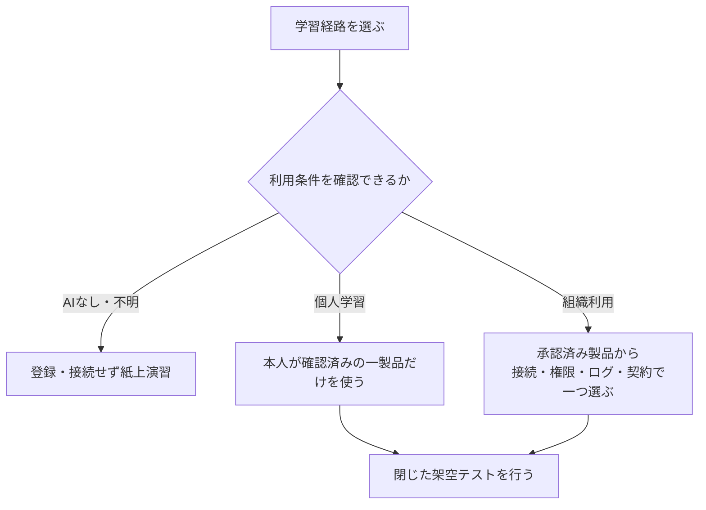

# 自動化ツールの選択と準備ガイド

最終確認日：2026年8月2日

このガイドは、[09 AI自動化とAIエージェント](../09_ai_automation_and_agents.md)のハンズオンで使用するツールを一つ選び、安全に準備するためのものです。Power Automate、Make、Zapierのすべてへ登録する必要はありません。

組織利用では、教材として一から作った完全な架空データだけを使い、実メール、実カレンダー、実ファイル、実データベースへ接続しません。実業務のPoCは教材演習後の別プロジェクトです。

## このガイドで使う用語

| 用語 | 初心者向けの意味 |
|---|---|
| クラウドフロー | ブラウザ上で作り、オンラインサービスのきっかけと処理をつなぐPower Automateの自動化 |
| デスクトップフロー | パソコン上の画面操作などを自動化するPower Automateの機能 |
| シナリオ | Makeで、開始条件と複数の処理をつないだ一連の自動化 |
| Zap | Zapierで、開始条件と処理をつないだ自動化 |
| コネクタ／アプリ接続 | メールや表計算など、別のサービスへ認証してデータや機能を使う接続部品 |
| SSO | 組織の共通認証で複数サービスへサインインする仕組み |
| MFA・2FA | パスワードに加えて認証アプリなども使い、本人か確かめる仕組み |
| MSI | Windows用ソフトウェアを配布・導入する形式の一つ。企業では通常、管理者の手順に従う |
| OS | Windowsなど、パソコンの基本的な動作を管理するソフトウェア |

## 1. 最初に選ぶもの



| 状況 | 基本演習で使うもの | 補足 |
|---|---|---|
| 組織が一製品を指定 | 指定されたPower Automate、Make、Zapierのいずれか | 発行済みアカウント、許可された機能、閉じた演習環境だけを使う |
| 複数製品が組織承認済み | 管理者と選んだ一製品 | 接続先、データ分類、権限、ログ、契約、運用担当から選ぶ |
| 個人学習 | 本人が既に利用できる一製品 | 規約・料金・データ条件を確認し、実サービスへ接続しない |
| 指定なし・未承認・利用不可 | 紙上フロー | 登録・接続・送信なしで設計を学ぶ |

製品の優劣で決めるのではなく、既存環境、接続先、データ分類、権限、ログ、契約、運用担当で選びます。

## 2. ブラウザとインストール

| ツール | 基本演習 | インストールが関係する場合 |
|---|---|---|
| Power Automate | ブラウザでクラウドフローを扱う | 画面操作を自動化するデスクトップフローは別製品部分で、インストールとシステム要件の確認が必要。本演習では不要 |
| Make | ブラウザで利用 | 本演習ではデスクトップアプリや非公式拡張機能を追加しない |
| Zapier | ブラウザで利用 | 本演習ではデスクトップアプリや非公式拡張機能を追加しない |

Power Automate for desktopを将来使う場合は、[Microsoft公式のインストール手順](https://learn.microsoft.com/en-us/power-automate/desktop-flows/install)と[システム要件](https://learn.microsoft.com/en-us/power-automate/desktop-flows/requirements)を確認します。Microsoft Store版とMSI版では管理者権限・更新方法等が異なり、両方を同時に入れる運用は避けます。企業端末ではIT管理者の承認・配布手順を優先します。

ブラウザ、OS、ネットワーク、提供地域の条件は変わるため、利用前に各社の最新公式情報を確認してください。

## 3. 個人学習・組織利用・利用不可の分岐

| 確認項目 | 個人学習 | 組織利用 | 未承認・利用不可 |
|---|---|---|---|
| 登録 | 本人が公式サイト、規約、料金を確認して判断 | 管理者が発行・招待した業務アカウントを使用 | 登録しない |
| メール | 本人が管理するメール | 組織指定の業務メール | 不要 |
| 契約・試用 | 課金開始、更新、解約条件を本人が確認 | 購買・管理者が契約とライセンスを確認 | 紙上代替 |
| 接続先 | 架空データだけ。実在業務サービスへ接続しない | 外部サービスへ接続しない閉じたテスト環境。実在の宛先・ファイル・予定・データベースは使わない | 接続しない |
| 認証 | 強いパスワードと利用可能なMFA | 組織指定のSSO・MFA | 不要 |
| 演習結果 | 画面内のテスト結果だけ | 承認済みテスト環境の履歴だけ | フロー図と観察記録 |

組織利用では、自己サービス登録が画面に表示されても、管理者承認前に進めません。Power Automateでは組織が自己登録を無効にしている場合があります。その場合は個人メールへ切り替えず、IT管理者へ連絡するか紙上演習へ進みます。

## 4. 登録・契約前の共通チェック

- [ ] 演習目的と、選んだツールが一つに決まっている
- [ ] 企業ではサービス、プラン、機能、アカウント、接続先が承認済みである
- [ ] 無料プラン、試用、有料機能、自動更新、実行上限の最新条件を公式ページで確認した
- [ ] データ保存、ログ、外部移転、共有、削除、サポート条件を確認した
- [ ] 使用するコネクタと、それが要求する読取・書込権限を確認した
- [ ] MFAまたは組織指定の認証を設定した
- [ ] 完全な架空データと、登録不要の紙上代替を用意した
- [ ] 実メール送信、カレンダー登録、ファイル共有、支払、削除を行わない構成にした

無料・有料の名称、試用期間、含まれるコネクタ、実行回数、管理機能は変更されます。本教材は無料利用や特定機能の提供を保証しません。

### 4.1 製品に共通する演習手順

画面上のボタン名が変わっても、次の順序は変えません。

1. 組織が指定した製品、アカウント、演習環境を確認する。
2. 手動開始の新規テストを作り、完全な架空入力だけを置く。
3. 外部接続を追加せず、入力の保持・整形・分類候補だけを確認する。
4. 外部状態を変える操作の直前に、人の承認を置く設計を図示する。
5. 実行結果、停止理由、エラーを最小限の架空ログとして確認する。
6. フローを無効化し、共有・保存・接続・契約を終了チェックする。

### 4.2 製品別の事前確認

機能の有無を教材の記述だけで判断せず、利用前に公式情報と組織設定で確認します。

| 製品 | 管理者と確認すること | 演習で行わないこと |
|---|---|---|
| Power Automate | 割当ライセンス、環境、利用可能コネクタ、データポリシー、実行履歴、フロー停止方法 | 個人アカウントへの切替、実メール・SharePoint等への接続、デスクトップフロー導入 |
| Make | 組織・チーム、認証方法、接続権限、履歴、シナリオ停止、料金・実行上限 | 個人ワークスペースへの業務接続、実サービスへの接続、試用の無断開始 |
| Zapier | チーム管理、認証方法、アプリ接続権限、履歴、Zap停止、料金・実行上限 | 個人ワークスペースへの業務接続、実サービスへの接続、基本演習だけの追加登録 |

製品固有の確認を終えても、完全な架空データ、外部送信禁止、人の実行前承認という共通ルールは省略しません。

## 5. ツール別の登録と認証

### 5.1 Power Automateを選んだ場合

1. 企業ではMicrosoft 365管理者へ、Power Automateの利用可否と割り当て済みライセンスを確認します。
2. 組織から指定された職場・学校アカウントで[Power Automate](https://make.powerautomate.com/)へサインインします。
3. サインインできない、または自己登録が無効という表示が出たら、別の個人アカウントを作らずIT管理者へ連絡します。
4. 組織指定のMicrosoft Entra ID（Microsoftの組織向けID・認証管理サービス）のMFAを使用します。個人Microsoftアカウントを使う別用途では、[Microsoft公式の2段階認証ガイド](https://support.microsoft.com/en-US/accounts-billing/security/how-to-use-two-step-verification-with-your-microsoft-account)を確認します。
5. コネクタへ接続する前に、表示されるアクセス権限を管理者と確認します。

登録、プラン、試用、ライセンスの条件は[Microsoft公式のサインアップ・サインイン案内](https://learn.microsoft.com/en-us/power-automate/sign-up-sign-in)と組織契約で最新情報を確認します。

### 5.2 Makeを選んだ場合

1. 個人学習では[Make公式登録ページ](https://www.make.com/en/register)から、規約・プライバシー・料金を確認して本人が登録します。
2. 企業では、組織管理者が指定した登録・招待・SSO手順を使います。個人ワークスペースを業務用に作りません。
3. ネイティブのメール・パスワード認証を使う場合は、[Make公式2FAガイド](https://help.make.com/two-factor-authentication)を確認して2FA（2要素認証）を設定し、回復用コードを安全に保管します。
4. 組織で2FA強制やSSOを使う場合は、契約プランと管理者設定を[Make公式ヘルプ](https://help.make.com/two-factor-authentication-enforcement)で確認します。
5. 接続を追加する前に、対象サービス、権限、保存データ、接続解除方法を確認します。

### 5.3 Zapierを比較・追加で使う場合

1. 基本演習のためだけに登録しません。既存の承認済み環境がある場合、または明確な比較目的がある場合だけ使います。
2. 個人学習では[Zapier公式登録ページ](https://zapier.com/sign-up)から、規約・プライバシー・料金を確認して本人が登録します。
3. 企業では組織の招待・管理手順を使用し、個人ワークスペースへ業務サービスを接続しません。
4. [Zapier公式2FAガイド](https://help.zapier.com/hc/en-us/articles/8496305453069-Set-up-two-factor-authentication-for-your-Zapier-account)に従い、利用可能な場合は2FAを設定して回復コードを安全に保管します。
5. [アプリ接続の公式ガイド](https://help.zapier.com/hc/en-us/articles/8496258785421-Connect-your-app-accounts-to-Zapier)を読み、接続が対象アプリへ与えるアクセスを確認します。

## 6. 完全な架空データで動作確認する

選んだ一つのツールだけで実施します。画面名称は変わるため、特定のボタン位置ではなく「開始→文字列を保持→結果を確認」という流れを確認します。

### 架空入力

基本入力は[架空問い合わせケース](../sample-data/automation_inquiry_cases.md)を使います。以下は最小例です。

```text
問い合わせID：FAKE-001
種別：一般質問
本文：架空AI研修の申込期限を教えてください。
禁止事項：外部メールを送らない。実在の宛先を使わない。
```

### 動作確認の流れ

1. 手動で開始できる新しいテスト用フローまたはシナリオを作ります。
2. 外部アカウントへ接続しない組込みの文字列保持・整形処理が利用できる場合、上の架空入力を設定します。
3. 結果として「人間確認待ち」という架空の状態を表示・記録します。
4. テスト実行し、入力、出力、実行履歴、停止方法を確認します。
5. メール送信、チャット投稿、カレンダー登録、ファイル共有、データベース更新は追加しません。
6. 組込み処理だけでは試せない場合や、外部接続を要求された場合は保存せず、紙上代替へ切り替えます。

Power Automateではクラウドフローを作成・テストし実行履歴を確認できます。画面や機能は[クラウドフロー作成の公式ガイド](https://learn.microsoft.com/en-us/power-automate/get-started-logic-flow)を参照します。MakeとZapierも、現在のプラン・画面で安全な手動テストが可能か最新公式情報を確認してください。

ツールを利用できない場合や画面が変わっている場合は、[自動化フローカード](../sample-data/automation_flow_cards.md)と[保存済みテスト出力](../sample-outputs/automation_saved_test_output.md)へ切り替えます。保存済み出力は現在の製品画面を再現するものではなく、安全設計を検討するための固定教材です。

## 7. 人が確認すること

- トリガーは手動または安全なテスト条件か
- 実在の業務データや宛先が含まれていないか
- 接続は必要最小限か。読取と書込を分けられるか
- 外部送信・書込・削除の直前に人間承認を置けるか
- 入力、AI案、承認者、修正差分、実行結果、エラーを記録できるか
- ログは必要最小限で、パスワード、APIキー、認証コード、不要な本文を記録しないか
- ログの閲覧者、保持期間、削除責任者、改ざん防止を決めたか
- 重複、再試行、上限超過、サービス停止で安全に止められるか
- フローを無効化し、手動手順へ戻せるか

AIや自動化のテスト結果は、必ず人が元入力と期待結果へ照合します。

## 8. 登録できない場合の紙上代替

1. [自動化フローカード](../sample-data/automation_flow_cards.md)の「手動開始」「入力確認」「禁止情報判定」「AI草案」「人間承認」「実行」「ログ」を並べます。
2. 架空入力を流し、各カードで誰が何を確認するか書きます。
3. 「個人情報を含む」「根拠がない」「外部文章に転送命令がある」「同じ処理が再実行された」という例外カードを追加します。
4. 停止、通知、差戻し、手動対応のどれへ進むか決めます。
5. Power Automate、Make、Zapierの公式情報カードを使い、既存環境・接続・統制・契約の観点だけ比較します。

この代替では、アカウント、契約、APIキー、実サービス接続は不要です。

## 9. 中止・相談する条件

- サービス・アカウント・プラン・コネクタの承認が不明
- 課金、試用、自動更新、実行上限を確認できない
- 実在の個人情報、機密情報、認証情報を使おうとしている
- 接続が過剰な権限を要求し、制限できない
- 実メール送信、公開、支払、削除など取り消しにくい操作が有効
- ログ、停止、接続解除、手動復旧の方法が分からない

不明な場合はフローを無効化し、管理者、情報セキュリティ、法務、購買、業務責任者へ確認します。

## 10. 演習終了時の後片付け

- [ ] 作成したフロー、シナリオ、Zapを無効化した
- [ ] 共有リンク、共同編集者、公開設定を解除した
- [ ] 演習用入力、出力、実行履歴の保存先を確認し、組織手順に従って削除または保管した
- [ ] 共用・貸与端末からサインアウトした
- [ ] 本演習のために始めた試用、有料機能、自動更新がないか本人または契約責任者が確認した
- [ ] コネクタ、外部アプリ権限、APIキーを追加していないことを確認した。追加していた場合は管理者手順で解除・無効化した
- [ ] 誤送信、誤共有、権限外表示、意図しない実行、課金等の事故や疑いがないか確認した

事故の疑いがある場合は、秘密値そのものをスクリーンショットや事故票へ複製せず、フローを止めて正式窓口へ報告します。

## 11. 公式情報

### Power Automate

- [Power Automate公式製品ページ](https://www.microsoft.com/power-platform/products/power-automate)
- [サインアップ・サインイン](https://learn.microsoft.com/en-us/power-automate/sign-up-sign-in)
- [クラウドフローの作成](https://learn.microsoft.com/en-us/power-automate/get-started-logic-flow)
- [Power Automate for desktopのインストール](https://learn.microsoft.com/en-us/power-automate/desktop-flows/install)
- [Power Automate for desktopの要件](https://learn.microsoft.com/en-us/power-automate/desktop-flows/requirements)
- [Microsoftアカウントの2段階認証](https://support.microsoft.com/en-US/accounts-billing/security/how-to-use-two-step-verification-with-your-microsoft-account)

### Make

- [Make公式サイト](https://www.make.com/)
- [Make公式登録ページ](https://www.make.com/en/register)
- [Makeの2要素認証](https://help.make.com/two-factor-authentication)
- [組織による2要素認証の強制](https://help.make.com/two-factor-authentication-enforcement)
- [MakeのSSO](https://help.make.com/single-sign-on)

### Zapier

- [Zapier公式サイト](https://zapier.com/)
- [Zapier公式登録ページ](https://zapier.com/sign-up)
- [Zapierアカウントの概要](https://help.zapier.com/hc/en-us/articles/22234171213325-Understand-your-Zapier-account)
- [Zapierの2要素認証](https://help.zapier.com/hc/en-us/articles/8496305453069-Set-up-two-factor-authentication-for-your-Zapier-account)
- [アプリ接続の管理](https://help.zapier.com/hc/en-us/articles/8496258785421-Connect-your-app-accounts-to-Zapier)
- [ZapierのFreeプラン](https://help.zapier.com/hc/en-us/articles/32337438839565-What-s-included-in-Zapier-s-Free-plan)

登録方法、契約、料金、試用、含まれる機能、コネクタ、認証、実行上限、データ取扱いは変わる可能性があります。本資料の数値や画面を固定仕様とせず、必ず最新の公式情報と組織の契約・規程を確認してください。
