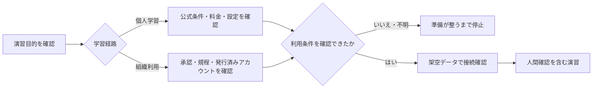

# AIツール共通準備と安全確認

個別ツールへ登録する前に、利用目的、学習経路、入力データ、保存先、停止時の相談方法を決めます。本教材では、条件を確認した対話AIによるAIの実操作が必須です。最初の実務演習は[クイックスタート](participant_quickstart.md)から始められます。

## 1. 用語

| 用語 | 簡単な説明 | 本教材での扱い |
|---|---|---|
| ブラウザ利用 | Webサイトを開いて使う | 基本。アプリのインストールは通常不要 |
| アカウント登録 | メールアドレス等で利用者情報を登録する | 個人は本人判断、組織は正式手順を優先 |
| サインイン | 作成済みアカウントで本人確認する | 公式URLとアカウント種別を確認する |
| MFA | パスワード以外も使う本人確認 | コードや回復情報をAI・教材へ載せない |
| API | システム同士が情報を交換する仕組み | 基本演習では設定しない。APIキーを貼らない |
| コネクタ | メール等の別サービスを接続する機能 | 基本演習では接続しない |

## 2. 準備の順序



**図の要点**：先にアカウントを作るのではなく、何の演習に必要かを確認します。利用条件を確認できない状態や接続できない状態では、無理に登録せず、準備が整うまで学習を停止します。

## 3. 共通環境チェック

- [ ] 本人または組織が管理する端末を使用している
- [ ] 正規の公式URLを確認した
- [ ] 使用するアカウント種別が決まっている
- [ ] 有料登録・試用条件を確認した
- [ ] データ利用、履歴、共有、保存、削除の設定を確認した
- [ ] 共有端末や投影画面へ個人情報・通知が表示されない
- [ ] サインアウトと一時ファイル処理を確認した
- [ ] AIへ接続でき、完全な架空データで応答を確認できる

## 4. 登録前に確認すること

| 領域 | 確認する質問 |
|---|---|
| 目的 | どの演習で、何を作るために使うか |
| 利用権限 | 本人または組織が、このサービスと機能を利用できるか |
| 契約・料金 | 無料、有料、試用のどれか。誰が同意できるか |
| データ | 入力、添付、履歴、学習利用、保存、削除はどう扱われるか |
| 共有・連携 | 回答リンク、ファイル、メール、カレンダー等へ接続されるか |
| 対象条件 | 年齢、地域、対応ブラウザ等の公式条件を満たすか |
| 停止時の対応 | 利用できない場合に、個人は別の承認可能なAIを確認し、組織はどの窓口へ相談するか |

## 5. 個人学習の場合

1. 実施する演習と必要なツールを確認します。
2. 検索広告ではなく、本教材の製品別ガイドから公式サイトを開きます。
3. 利用条件、プライバシー、料金、試用終了後の扱いを確認します。
4. 登録する場合は、本人が管理できるメールアドレスを使います。
5. 強いパスワードと、利用できる場合はMFAを設定します。
6. 教材の完全な架空データだけで動作確認します。
7. 条件を確認できない場合は登録せず、別の利用可能な対話AIを確認します。どの対話AIも準備できない場合は、準備が整うまで学習を停止します。

無料枠や試用枠の提供は保証されません。課金が発生する可能性がある操作を、内容を確認せず進めません。

演習中に無料枠・利用回数の上限と明示されて生成できなくなった場合は、同じ指示を繰り返し送らず、[無料枠・利用回数の上限に達した場合の対応](../TROUBLESHOOTING.md#無料枠利用回数の上限に達した)を確認します。有料登録を急いで選ぶ必要はありません。AIを実際に操作できる状態へ戻るまでは、演習を未完了として停止します。

## 6. 組織利用の場合

1. 組織が承認したサービス、URL、アカウント、機能を確認します。
2. SSOやMFAなど、組織が指定した認証方法を使います。
3. 入力禁止情報、保存先、ログ、共有、事故報告先を確認します。
4. 教材の完全な架空データだけで接続確認します。
5. アカウントがない、承認が不明、ログインできない場合は個人登録せず正式窓口へ相談し、準備が整うまで学習を停止します。

匿名化・加工した実データも基本演習には使いません。実データによる試行は、教材演習とは別の承認・環境・検証として扱います。

## 7. 接続確認

次は対話AIが応答するかだけを確かめる完全な架空文です。成果物として保存する必要はありません。

```text
次の完全な架空メモを、決定事項、未決事項、要確認事項に分けてください。

- 架空の説明会では、学習案内から用語集へリンクする方針は決定した。
- 演習を追加する案が出たが、実施可否は未決である。
- 次回候補日は参加者へ未確認である。

入力にない担当者や期限を作らず、表形式で出力してください。
```

人が次を確認します。

- 決定と未決が混ざっていない
- 入力にない担当者・期限・制度を追加していない
- 外部送信や共有が行われていない
- 使用したサービス、アカウント種別、確認日を記録できる

AIが成果物ではなく確認質問だけを返した場合や、短い前置きを付けた場合は、入力へ新しい事実を足さず、[確認質問・前置きへの対応](../TROUBLESHOOTING.md#aiが確認質問だけを返すまたは前置きを付ける)を確認します。安全、権限、規約、アカウントに関する警告は押し切りません。

## 8. 利用できない場合

対話AIを操作できない状態では、実践学習を完了できません。次の順で対応します。

1. 入力や送信を止め、原因がアカウント、承認、接続、利用上限、料金、設定のどれかを確認する
2. 個人学習では、本人が条件を確認できる別の対話AIがあるかを公式情報で確認する
3. 組織利用では、個人アカウントへ切り替えず正式窓口へ相談する
4. 個人学習では本人が条件を確認した対話AI、組織利用では組織承認済み対話AIを準備し、架空データで接続確認をやり直す
5. 接続確認に成功してから演習を再開する

[無料枠・利用回数の上限](../TROUBLESHOOTING.md#無料枠利用回数の上限に達した)と明示された場合は、再開時刻が表示されていれば確認します。再開を保証されたものと考えず、表示が曖昧なら最新の公式情報を確認してください。個人学習では時間を置くか、本人が料金・規約・データ設定を確認した別の対話AIを検討します。組織利用では、独断で課金や別製品への切替を行わず正式窓口へ確認します。

[保存済み出力一覧](../sample-outputs/README.md)は、障害原因の切り分けやAIの誤りを見つける追加分析にだけ使用します。保存済み出力の修正だけでは、AIを指示し、結果を比較して改善するAIの実操作を経験できないため、演習の代替や完了条件にはしません。

## 9. 中止・相談条件

- サービス、アカウント、料金、設定を確認できない
- 実在の個人情報、機密情報、認証情報を入力しようとしている
- 不審なURL、非公式アプリ、無許可の拡張機能が表示された
- ファイル添付、外部共有、メール・カレンダー接続が意図せず有効になっている
- AI出力を人が確認せず、送信・公開・状態変更しようとしている
- 法律、医療、金融、人事などの高影響判断をAIだけで確定しようとしている

個人学習では操作を止め、別の利用可能な対話AIを確認します。組織利用では、秘密情報を別メモへ複製せず正式窓口へ相談します。いずれも準備完了までは演習を再開しません。

## 10. 終了時

- 人が確認した最終成果物だけを学習用または組織指定の保存先へ置く
- 不要な共有リンクや外部連携を作っていないことを確認する
- 共有端末では正式手順でサインアウトする
- 試用契約と保存済みファイルを確認する
- 誤入力・誤共有があれば自己判断で隠さず、正式手順に従う

[セットアップ一覧](README.md) ｜ [クイックスタート](participant_quickstart.md) ｜ [終了時チェック](../workbooks/course_closeout_checklist.md)

最終確認日：2026年8月10日。製品固有の条件は各ガイドの公式リンクで確認してください。
