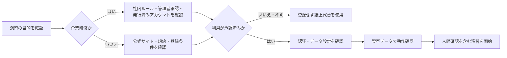

# AIツール共通準備と安全確認

この資料は、個別ツールの登録前に確認する共通手順です。先にアカウントを作るのではなく、利用目的、組織の許可、入力データ、代替方法を決めます。

## 1. 「インストール」と「アカウント登録」の違い

| 用語 | 簡単な説明 | 本教材での扱い |
|---|---|---|
| ブラウザ利用 | Webサイトを開いて使う | 基本。アプリのインストールは通常不要 |
| アカウント登録 | メールアドレス等で利用者情報を登録する | 個人学習だけ本人登録。企業では管理者手順を優先 |
| サインイン | 作成済みアカウントで本人確認して利用する | MFAなど組織指定の認証を使用 |
| アプリのインストール | パソコンやスマートフォンへソフトを追加する | 本教材では任意。企業端末では無断実施しない |
| API設定 | システム同士を接続するための認証情報を設定する | 基本演習では扱わない。APIキーを教材やチャットへ貼らない |

## 2. 準備の順序



**図の見方**：企業研修では、個人登録より組織の承認確認が先です。不明な状態は「登録してよい」という意味ではありません。利用できなくても演習目標を達成できるよう、紙上代替を準備します。

## 3. 共通環境チェック

- [ ] 組織または本人が管理する端末を使用している
- [ ] OSとブラウザがサポート対象か公式情報で確認した
- [ ] 組織のネットワーク、プロキシ、ドメイン制限に対応している
- [ ] 使用するメールアドレスとアカウント種別が決まっている
- [ ] パスワードを使い回さず、可能ならパスワード管理手段を使用する
- [ ] MFA（多要素認証）など、利用可能な追加認証を設定する
- [ ] 共有端末や投影画面へ個人情報・履歴・通知が表示されないようにする
- [ ] ログアウト方法と、利用後のセッション管理を確認した

## 4. 登録前に確認すること

| 確認領域 | 確認する質問 |
|---|---|
| 利用目的 | どの演習で、何を作るために使うか |
| 承認 | 組織がサービス、アカウント、機能を承認しているか |
| 契約 | 無料・有料・法人契約のどれか。利用者が同意してよいか |
| データ | 入力、添付、履歴、学習利用、保存、削除はどう扱われるか |
| 権限 | 誰がアカウント、共有、外部連携、ログを管理するか |
| 対象地域・年齢等 | 公式の利用条件を満たすか |
| 代替 | 登録できない場合に、保存済み出力や紙上で進められるか |

## 5. 個人学習の場合

1. 教材から、使用するツールと演習を確認します。
2. 検索結果の広告ではなく、ツール別ガイドに掲載した公式サイトを開きます。
3. 利用条件、データ取扱い、料金が発生する操作を確認します。
4. 本人が管理できるメールアドレスで登録します。
5. 強いパスワードと、利用できる場合はMFAを設定します。
6. データ利用、履歴、共有などの設定を確認します。
7. 教材の架空データで動作確認します。

無料枠・試用枠の有無や条件は変わります。本教材は無料利用を保証しません。有料登録や試用開始が必要な画面では、内容を確認せず進めません。

## 6. 企業研修の場合

1. 研修責任者が、必須ツールと代替演習を決めます。
2. IT・情報セキュリティ・法務・購買など、組織が定めた窓口へ確認します。
3. 管理者が発行・招待した業務アカウントと指定URLを受講者へ案内します。
4. SSO（組織の共通認証）やMFAなど、組織の認証手順でサインインします。
5. 利用可能な機能、禁止データ、共有範囲、保存・ログのルールを説明します。
6. 架空データだけで接続確認します。
7. サインインできない受講者は、個人登録させず紙上代替へ切り替えます。

## 7. 動作確認用の架空データ

次の文章は、基本的な対話AIの接続確認に使用できます。

```text
次の完全な架空メモを、決定事項、未決事項、要確認事項に分けてください。

- 架空の研修で用語集を配布する方針は決定した。
- 演習を追加する案が出たが、実施可否は未決である。
- 次回候補日は参加者へ未確認である。

入力にない担当者や期限を作らず、表形式で出力してください。
```

### 人が確認すること

- 決定と未決が混ざっていないか
- 入力にない担当者・期限・制度を追加していないか
- 外部送信や共有が行われていないか
- 利用したツール、アカウント種別、確認日を記録できるか

## 8. 登録・利用できない場合

ツールを使えないことは、学習を中止する理由にはなりません。次の順に代替します。

1. 講師が事前保存した架空のAI出力を配布する。
2. 受講者がAI役と確認者役に分かれ、紙上で出力候補を作る。
3. プロンプト、根拠照合、業務分解、承認設計だけを行う。
4. ツール固有の操作ではなく、判断理由と人間確認を振り返る。

## 9. 中止・相談条件

次の場合は入力や登録を止めます。

- 利用するサービス、アカウント、設定が組織で承認済みか分からない
- 実在の個人情報、機密情報、認証情報を入力しようとしている
- 有料契約、試用後の課金、外部共有の条件を確認できない
- 不審なURL、非公式アプリ、無許可のブラウザ拡張機能が案内された
- 投影画面へ履歴、メール、個人情報、秘密情報が表示される可能性がある
- AI出力を人が確認せず、送信・公開・状態変更しようとしている

最終確認日：2026年8月2日。個別ツールの最新条件は、各ガイドの公式リンクで確認してください。
