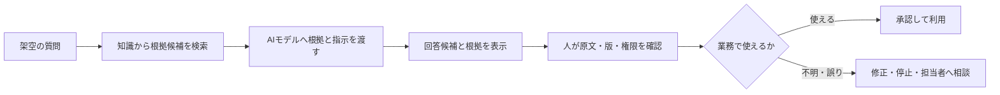

# Difyの任意発展準備ガイド

最終確認日：2026年8月2日

Difyは、[08 RAGとナレッジマネジメント](../08_rag_and_knowledge_management.md)の任意発展演習です。NotebookLMの基本演習を終えれば本章の学習は進められます。Difyへの登録、APIキーの取得、モデル契約は必須ではありません。

組織利用では、このリポジトリにある完全な架空資料だけを使用します。実際の社内文書や実システムを使うPoCは教材演習中に行わず、教材演習後に別の承認手続と検証環境で実施します。

## 1. Difyで学ぶこと

Difyでは、知識データ、AIモデル、指示、画面、処理の流れを組み合わせてAIアプリを構成できます。**ワークスペース**は、メンバー、アプリ、モデル設定などをまとめて管理する作業領域です。本教材では、次の設計関係を理解することが目的です。



画面操作を覚えることや、公開チャットボットを完成させることは必須ではありません。

## 2. Cloud版とセルフホスト版

| 方式 | ブラウザ・インストール | 本教材での扱い |
|---|---|---|
| Dify Cloud | Dify側が運用するオンライン版。基本的にブラウザで利用し、手元のパソコンへのDify本体のインストールは不要 | 組織または本人が利用を承認できる場合だけ任意で使用 |
| セルフホスト | サーバー、Docker、OS（WindowsやLinuxなど機器を動かす基本ソフト）・メモリ等の要件、更新、バックアップ、監視が必要 | 初心者向け演習の範囲外。情シス・インフラ担当が別プロジェクトとして検討 |
| AIなしの紙上代替 | ブラウザ登録、インストール、APIキーが不要 | 推奨代替。誰でもこのリポジトリだけで実施可能 |

**セルフホスト**は、自組織が用意したサーバーでソフトウェアを動かし、運用も担当する方式です。**Docker**はアプリと必要な部品を隔離した単位で動かす技術、**Docker Compose**は複数の単位をまとめて起動・管理するための仕組みです。「自分のパソコンへ入れれば安全」という意味ではありません。**脆弱性**（攻撃や不正利用につながり得るシステム上の弱点）への対応、秘密情報、公開範囲、バックアップ、障害対応まで組織が管理する必要があります。

## 3. 利用環境を選ぶ

| 状況 | 進め方 |
|---|---|
| 個人学習 | 本人が公式の規約・料金・データ条件を確認し、完全な架空データだけでCloud版を試す |
| 組織利用 | 管理者が承認したワークスペース、アカウント、モデル、データ範囲だけを使う |
| Cloud版は承認済みだがモデルが未設定 | 無断でAPIキーや有料モデルを追加せず、管理者へ確認する |
| 利用可否不明・登録不可・認証情報なし | APIキー不要の紙上代替へ切り替える |

組織利用では、個人アカウント作成、クレジット購入、試用開始、外部モデル契約を学習条件にしません。個人学習でも、料金・契約・APIキーが必要な場合は紙上設計を選べます。

## 4. モデルとAPIキーの考え方

**モデル提供者**は、文章生成や埋め込みを行うAIモデルを提供するサービスです。**AIクレジット**は、Dify内で対象モデルを呼び出すための利用枠です。**APIキー**は、そのサービスをプログラムから使う際の秘密の認証情報です。

Dify Cloudでは、時点や契約によってDify側のAIクレジットで利用できるモデルがあり、自分のAPIキーが不要な場合があります。一方、利用するモデルや上限によっては、モデル提供者のアカウントやAPIキーが必要です。利用可能モデル、クレジット、料金、上限は変更されるため、[公式のモデル提供者ガイド](https://docs.dify.ai/en/cloud/use-dify/workspace/model-providers)と[公式料金ページ](https://dify.ai/pricing)をその都度確認します。

- APIキーをプロンプト、チャット、教材、ソース文書、画面共有へ貼らない
- 企業ではワークスペース管理者だけが、承認済みの保管・設定手順で登録する
- 個人でも他サービスと同じキーを使い回さず、利用額上限・失効・削除方法を確認する
- 演習のためだけに有料契約や外部モデル契約を開始しない
- キーや請求先の管理者が不明なら、実行せず紙上代替へ切り替える

## 5. 登録・認証前の確認

- [ ] Difyの利用、ワークスペース、入力データ、モデル提供者が組織で承認済みである
- [ ] 最新の利用規約、プライバシー、料金、提供地域、年齢等の条件を確認した
- [ ] 個人学習か組織利用かを明確にし、アカウントを混用しない
- [ ] SSO（組織の共通認証）やMFA（多要素認証）の利用可否を最新の公式情報と管理者設定で確認した
- [ ] Googleなどサインイン時の本人確認を担う外部サービス（ID提供者）を使う場合は、そのアカウント側のMFAを有効にした
- [ ] 回復コード、APIキー、パスワードを安全に保管し、投影しない
- [ ] 完全な架空FAQと紙上代替を用意した

認証方式やSSOの提供条件は契約・版によって変わる可能性があります。利用画面にない機能があると決めつけず、組織管理者とDifyの最新公式ドキュメントへ確認してください。

## 6. 承認済み環境での架空動作確認

実行環境とモデルが組織または本人により承認済みの場合だけ行います。

1. [Dify Cloud](https://cloud.dify.ai/)または組織指定のDify URLへサインインします。
2. 新しい公開アプリではなく、演習用の非公開アプリを作ります。
3. [現行版の架空研修運営規程](../sample-data/rag_training_rules_current.md)と[RAG質問・資料カード](../sample-data/rag_question_cards.md)だけを知識データとして登録します。
4. 資料内質問と資料外質問を試し、検索結果、回答、ログを確認します。
5. 外部公開、外部ツール接続、メール送信、データベース書込みは行いません。

```text
文書ID：FAKE-TRAINING-001
名称：架空AI研修FAQ
版：第1版

Q：申込期限はいつですか。
A：架空の開催日の5営業日前です。

Q：期限後の申込みはできますか。
A：資料だけでは判断できません。架空研修事務局へ確認してください。
```

### 人が確認すること

- 質問に合う根拠が検索されたか
- 回答が根拠にない情報を追加していないか
- 資料外で推測せず止まるか
- 文書名・版・根拠を表示できるか
- アプリ、知識、ログを誰が閲覧できるか
- ログを必要最小限にし、秘密値を記録せず、保持・削除・改ざん防止を決めたか
- 誤答時に停止・修正・再テストできるか

## 7. APIキー不要の紙上代替

紙またはMarkdownへ、次の箱と矢印を描きます。登録もAPIキーも不要です。

1. 入力：架空の利用者質問
2. 検査：対象範囲、禁止情報、利用者権限
3. 検索：どの架空文書・チャンクを候補にするか
4. モデル：どの根拠と指示を渡すか
5. 出力：回答、根拠、適用対象、注意、相談先
6. 人間レビュー：誰が原文と照合し、採用・修正・破棄を決めるか
7. 運用：ログ、文書更新、誤答修正、停止条件

その後、資料内質問、資料外質問、旧版質問、権限外質問、文書内の悪意ある指示をカードで流し、どこで止めるか確認します。

画面を利用できない場合は、[Dify紙上設計の保存済み例](../sample-outputs/dify_saved_design_output.md)と比較します。この保存例は製品の現在の画面や機能を再現するものではなく、入力、検索、回答、権限、人間レビュー、運用の関係を学ぶ固定教材です。

## 8. 中止・相談する条件

- 組織の承認、契約、データ保存先、モデル提供者が不明
- APIキーや請求先を誰が管理するか不明
- 実在の個人情報、機密情報、認証情報を使おうとしている
- 外部公開や外部ツール接続が意図せず有効になっている
- 回答根拠、権限、ログ、停止方法を確認できない

不明な場合は設定や入力を止め、情報システム、情報セキュリティ、法務、購買など組織の担当者へ確認します。

## 9. 演習終了時の後片付け

- [ ] アプリ、知識データ、共有リンク、公開設定、共同編集権限を解除・無効化した
- [ ] 演習用入力、回答、ログを、組織の保存・削除手順どおりに扱った
- [ ] 共用・貸与端末からサインアウトした
- [ ] 本演習のために開始した試用、有料機能、AIクレジット、自動更新がないか本人または契約責任者が確認した
- [ ] 外部ツール接続、モデル提供者の認証情報、APIキーを追加していないことを確認した。追加していた場合は管理者手順で解除・失効した
- [ ] 誤共有、権限外表示、秘密情報露出、意図しない実行・課金等の事故や疑いを確認した

事故の疑いがある場合は、APIキー等の秘密値をスクリーンショット・事故票へ複製せず、アプリを停止して正式窓口へ報告します。

## 10. 公式情報

- [Dify公式ドキュメント](https://docs.dify.ai/en/home)
- [Dify Cloud](https://cloud.dify.ai/)
- [モデル提供者と認証情報の設定](https://docs.dify.ai/en/cloud/use-dify/workspace/model-providers)
- [Dify公式料金ページ](https://dify.ai/pricing)
- [Docker Composeによるセルフホスト要件](https://docs.dify.ai/en/self-host/deploy/quick-start/docker-compose)

登録方法、認証方式、モデル、AIクレジット、料金、上限、共有・ログ機能は変わる可能性があります。本資料より最新の公式情報と組織の契約・規程を優先してください。
