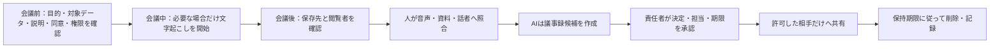

# Microsoft Teams会議の文字起こし・議事録作成ガイド

## 1. このガイドの目的

Microsoft Teamsの会議から文字起こしを安全に取得し、内容を人が確認してから議事録とタスク一覧へ仕上げる手順を説明します。対象は、PCの基本操作はできるものの、Teamsの文字起こしやAI要約を初めて使う人です。

> **基本学習ではTeamsを操作しません。** 教材に保存済みの完全な架空文字起こしを、条件を確認した承認済み対話AIへ入力して議事録を生成・改善します。Teamsのアカウント、ライセンス、録画、実在参加者の音声は不要ですが、AIの実操作は必須です。実際のTeams会議を使う操作は、組織の承認、管理者設定、主催権限、参加者への事前説明、必要な同意をすべて満たした場合だけ行う任意発展です。

Teamsの画面、製品名、ライセンス、対応環境、保存場所、権限は変更されます。このガイドの公式情報確認日は**2026年8月9日**です。実機操作の直前に、[Microsoftのライブ文字起こし案内](https://support.microsoft.com/en-US/teams/meetings/start-stop-and-download-live-transcripts-in-microsoft-teams-meetings)、組織の契約、Teams管理センターの設定を確認してください。

### 読む範囲を先に選ぶ

| 読む人 | 先に読む範囲 | 次に行うこと |
|---|---|---|
| 基本演習を行う人 | 1〜4、10、13 | [保存済み架空文字起こしの演習](../exercises/video_meeting_minutes_exercises.md)を承認済み対話AIで行う。Teams実機は操作しない |
| 承認済み任意実機の主催者・管理者 | 1〜12、14〜17、20 | 組織の実環境で開始・停止・権限・終了処理まで事前検証する |
| 組織で任意実機を承認・管理する担当者 | 1〜5、13、17〜20 | 任意実機を行うかを担当部門と判断する |

基本演習では、Teamsのライセンスや管理者画面を理解する必要はありません。保存済み文字起こしを対話AIで処理し、誤変換の検証、修正指示、人間レビューへ集中します。任意実機は、個人学習では本人が条件を確認し、組織利用では担当部門が承認した場合だけ行います。

## 2. 最初に覚える4つの違い

同じ会議画面に似た機能が並びますが、作られるデータと目的は異なります。

| 機能 | 初心者向けの説明 | 会議後に残るか | 主な注意点 |
|---|---|---|---|
| 録画 | 音声、映像、画面共有などを動画として記録する | 原則として残る | 映像や共有画面まで含むため、必要性と保存範囲を別に判断する |
| 文字起こし | 会話を話者名と時刻付きの文章へ変換する | 原則として残る | 誤変換、話者違い、否定語の欠落があり得る |
| ライブキャプション（字幕） | 会議中に読みやすくするため、その場で発言を文字表示する | Teamsの字幕は保存されない | 保存用の記録が必要なら文字起こしを使う。字幕と文字起こしを同一視しない |
| AI要約 | 文字起こし等を基に、要点やタスクの候補をAIが作る | 契約、設定、保持方針による | 原文ではない。誤り、不足、不適切な内容があり得るため人が確認する |

Teamsはライブキャプションを保存しないと案内しています。会議後に文書として確認する必要がある場合は、組織が許可した文字起こしを使用します。[ライブキャプションの公式説明](https://support.microsoft.com/en-US/teams/meetings/use-live-captions-in-microsoft-teams-meetings)

### 2.1 この教材での用語

| 用語 | 簡単な説明 |
|---|---|
| 主催者 | Teams会議を作成した人。英語表記では`Organizer` |
| 共同開催者 | 主催者を補助する役割。英語表記では`Co-organizer` |
| 発表者 | 画面共有等ができる会議役割。英語表記では`Presenter` |
| 管理者ポリシー | 情報システム部門等が組織単位で決めるTeamsの利用設定 |
| Recap | 会議後に録画、文字起こし、資料等を確認する「まとめ」画面 |
| タイムスタンプ | 発言が会議開始から何分何秒付近にあったかを示す時刻 |
| `.docx` | Microsoft Wordで開きやすい文書ファイル形式 |
| `.vtt` | 発言時刻を含む字幕・文字起こし用のテキスト形式 |
| OneDrive for Business | 組織向けMicrosoft 365の個人用クラウド保存領域。本書では「OneDrive for work or school」と同じ範囲を指す |
| テナント | 会社や学校ごとに管理されるMicrosoft 365の組織環境 |

## 3. どのルートで進むか

最初に、次の表で進み方を決めます。

| ルート | 使用するもの | Teamsアカウント | 実在参加者の音声 | 推奨場面 |
|---|---|---:|---:|---|
| A：基本演習（個人学習・組織利用） | 架空文字起こし、照合資料、承認済み対話AI | Teamsは不要 | 使用しない | **すべての人の必須演習** |
| B：統制された実機確認 | 組織承認済みTeams会議、架空の台本 | 必要 | 承認済みテスト参加者だけ | 管理者と担当部門による事前検証 |
| C：教材演習外の実務導入 | 実在の会議、業務アカウント | 必要 | 使用する | 組織が別手続で運用を承認した後の実務。教材演習中は行わない |
| D：AI機能の任意発展 | Intelligent recapまたはMicrosoft 365 Copilot | 対象ライセンス等が必要 | 設計による | 基本手順を習得した後の比較 |

組織利用ではAから始めます。BとDは任意であり、自動的に許可されません。Cは教材演習とは分離した実務導入です。それぞれについて別の承認とデータ条件を確認します。

Bで読む会話内容は架空でも、Teamsが取得する声、表示名、顔、接続情報は実在するテスト参加者のデータであり、架空データではありません。[第02章 セキュリティとプライバシー](../02_security_and_privacy.md)の学習後、担当部門が別途承認した環境で、指定された主催者・参加者・端末だけを使います。

## 4. 安全な全体手順



**図の見方**：文字起こしやAI要約は途中の材料です。AIが出した時点で議事録が完成するのではなく、根拠照合、責任者の承認、共有・削除の管理まで行って初めて業務手順になります。

## 5. 実機を使う前の利用条件

次のどれかが不明なら、文字起こしを開始せず、[保存済み教材を使う手順](#13-teamsを使わない基本演習)へ切り替えます。

### 5.1 アカウント、権限、設定

- 組織が発行した仕事・学校用アカウントを使う。
- 組織がTeamsの文字起こしを承認していることを確認する。
- 管理者が文字起こしを許可するポリシーを対象者へ適用していることを確認する。
- 誰が主催者、共同開催者、発表者で、誰が開始・停止・閲覧・ダウンロードできるかを確認する。
- 使用する会議種別が、通常会議、チャネル会議、臨時会議、ウェビナー等のどれかを記録する。
- Teams PremiumやMicrosoft 365 Copilotを前提にせず、基本の文字起こしだけで運用できるかを確認する。
- 個人アカウントへの切替え、無許可アプリ、ブラウザ拡張機能、外部文字起こしボットで制限を回避しない。

開始・停止等の可否は、会議役割だけでなく管理者ポリシーや会議オプションにも左右されます。[管理者向けの録画・文字起こし概要](https://learn.microsoft.com/en-us/microsoftteams/recording-transcription-overview)

### 5.2 事前説明と必要な同意

会議招待または事前案内に、少なくとも次を記載します。

| 説明項目 | 記載する内容の例 |
|---|---|
| 目的 | 議事録作成と決定事項の確認のため |
| 取得するもの | 音声から生成する文字起こし。録画も行う場合は映像、画面共有等も明記 |
| 取得しないもの | 例：今回は録画を行わない |
| 利用者・閲覧者 | 主催者、議事録担当、承認者など、必要最小限の役割 |
| 保存先 | 組織のTeams／OneDrive／SharePoint環境 |
| 保持・削除 | 組織規程に基づく期限、削除担当、例外手続 |
| AI利用 | AI要約の有無、利用ツール、入力範囲、人間による確認 |
| 外部共有 | 行うか。行う場合は対象と方法 |
| 参加しにくい場合 | 相談先と、文字起こしを伴わない代替参加方法 |

Teamsは文字起こし開始時に参加者へ通知します。また管理者は、明示的な同意を求めるポリシーや、通知文・プライバシーURLを設定できます。[カスタム通知の公式説明](https://learn.microsoft.com/en-us/microsoftteams/recording-transcription-custom-message)、[録画・文字起こしポリシーの公式説明](https://learn.microsoft.com/en-gb/MicrosoftTeams/meeting-recording)

明示的同意のポリシーが有効な会議では、録画または文字起こしの開始時に参加者のマイク、カメラ、画面共有が制限され、参加者がマイク解除等をしようとしたときに同意画面が表示される動作があります。同意しない参加者は閲覧中心の参加になる場合があります。電話参加者にはダイヤルパッドを使う別の仕組みが関係することもあるため、管理者が参加方法ごとに事前検証します。

ただし、**画面の通知、参加の継続、Teams上の「同意」操作だけで、すべての法域、契約、就業規則、労務、個人情報保護上の要件を満たすとは限りません**。録音・録画・音声データの扱いは地域や会議内容によって異なります。法務、個人情報保護、情報セキュリティ、人事・労務等の専門部署へ確認してください。

### 5.3 開始時に読み上げる例

次はひな形です。実際には組織の承認済み文面へ置き換えます。

```text
本会議では、決定事項と担当タスクを確認する目的で文字起こしを行います。
今回は録画は行いません。文字起こしは指定された議事録担当と承認者だけが確認し、
組織の保持・削除ルールに従います。AIを使う場合も承認済み環境で草案作成だけに使用し、
配布前に人が確認します。参加方法について懸念がある方は、開始前に主催者へお知らせください。
```

読み上げた事実を、日時、説明者、参加者への案内方法とともに運用記録へ残します。読み上げ自体を法的同意の代わりにはしません。

### 5.4 データ最小化

**データ最小化**とは、目的に必要な情報だけを取得する考え方です。

- 議事録に映像が不要なら、文字起こしだけで目的を満たせないか検討する。
- 健康、評価、懲戒、採用、顧客の個人情報、未公表の経営情報、認証情報等を扱う会議では、通常会議と同じ判断をしない。
- 文字起こし対象外の話題へ移る前に停止し、再開条件を決める。
- 会議名や参加者表示名にも機密・個人情報が含まれ得ると考える。
- 録画、文字起こし、チャット、共有ファイルは別データとして、必要性と保持をそれぞれ決める。

## 6. 会議前の設定と確認

### 6.1 主催者・管理者が確認すること

1. Teams管理者が、対象の会議ポリシーで文字起こしを許可しているか確認します。
2. 会議オプションで、録画・文字起こしを開始できる役割を必要最小限にします。
3. 会議後の録画・文字起こし・AI recapへのアクセス対象を確認します。細かなアクセス指定はTeams PremiumまたはCopilot等のライセンスや保存ポリシーに依存し、チャネル会議や臨時会議では使えない場合があります。[アクセス範囲の公式説明](https://support.microsoft.com/en-US/teams/meetings/customize-who-can-access-a-recording-or-transcript-in-microsoft-teams)
4. OneDrive／SharePointの既存共有権限、外部共有、ダウンロード、保持、監査の設定を確認します。
5. 外部、匿名、電話、会議室端末、Cloud Video Interop（CVI）から参加する人を把握します。
6. AI機能や第三者アプリを使用するかを明示し、不要な機能は使いません。
7. 障害時に人がメモする担当と、文字起こしを中止する条件を決めます。

### 6.2 認識精度を上げる準備

精度を上げても、人間確認は省略できません。

- 発言する言語とTeamsの「会議の話し言葉」を合わせる。
- 参加者へ、一人ずつ話し、決定事項を短く言い直すよう案内する。
- 部署名、製品名、略語などの用語集を議事録担当へ渡す。
- マイク、ネットワーク、会議室の反響、雑音を事前テストする。
- 「決定です」「未決です」「担当は○○、期限は○月○日です」と口頭で区切る。
- 電話番号、パスワード、APIキー等を会議で読み上げない。

### 6.3 開始前チェックリスト

- [ ] 会議の目的と、文字起こしが必要な理由を記録した
- [ ] 録画の有無を文字起こしと分けて決めた
- [ ] 組織承認、管理者ポリシー、契約、対応機能を確認した
- [ ] 主催者と開始・停止担当を決めた
- [ ] 閲覧者、ダウンロード可能者、承認者を決めた
- [ ] 保存先、保持期間、削除担当、例外処理を決めた
- [ ] 全参加形態に届く事前説明を行い、必要な同意を確認した
- [ ] 外部・匿名・電話・会議室端末・CVI参加者を確認した
- [ ] 話し言葉、用語集、マイクを確認した
- [ ] 失敗時の手動メモ担当と停止手順を用意した

## 7. 会議中に文字起こしを開始する

ここでは、2026年8月9日にMicrosoft公式ページで確認したデスクトップ版の代表的な操作名を使います。組織の画面と異なる場合は、似たボタンを推測して押さず、組織の管理者または正式窓口へ確認してください。

### 7.1 文字起こしだけを始める

1. 組織指定のTeamsアプリまたは対応ブラウザで会議へ参加します。
2. 参加者、外部参加者、電話参加者を確認します。
3. 承認済みの説明文を読み上げ、開始条件を満たしたことを確認します。
4. 会議コントロールの`その他の操作`（`…`）を選びます。
5. `録画と文字起こし`から`文字起こしの開始`を選びます。
6. 実際に話す言語を選択または確認します。
7. `確認`を選びます。
8. 全参加者へ文字起こしの通知が表示されたこと、文字起こしペインに話者名とタイムスタンプが出たことを確認します。
9. 運用記録へ開始時刻と開始者を記入します。

Microsoftの現在の説明では、ライブ文字起こしには話者名とタイムスタンプが表示され、開始すると参加者へ通知されます。[開始・停止手順の公式説明](https://support.microsoft.com/en-US/teams/meetings/start-stop-and-download-live-transcripts-in-microsoft-teams-meetings)

> **録画は別判断です。** 現在のTeamsでは録画を開始すると文字起こしも開始される動作があります。映像や画面共有を保存する承認がないのに、議事録作成だけを理由として`録画の開始`を選ばないでください。

### 7.2 開始直後に確認すること

| 確認 | 正常な状態 | 異常時の対応 |
|---|---|---|
| 通知 | 対象参加者へ文字起こし中と表示される | 発言を始めず、参加形態と管理者設定を確認する |
| 言語 | 実際の会話言語と一致する | 設定変更の影響を確認し、必要なら一度停止して設定する |
| 話者 | 発言者と表示名が概ね一致する | 話者違いの時刻をメモし、会議後に確認する |
| 文字 | 発言が遅れてでも表示される | マイク、回線、権限、サービス状態を確認する |
| 録画 | 承認どおりのオン・オフになっている | 意図しない録画なら直ちに停止し、責任者へ報告する |

### 7.3 会議中の進め方

- 決定時は進行役が内容、担当、期限を読み返す。
- 提案と決定を言葉で区別する。
- 聞き取れない箇所、重要な数字、否定表現、話者違いのタイムスタンプを人がメモする。
- 文字起こしに表示されたから正しいとは判断しない。
- 途中参加者へ必要な説明を行う。通知が見えたと推測しない。
- 対象外の話題へ移る前に文字起こしを停止する。
- 参加者から懸念や停止の申出があった場合は、組織の手順に従って停止・相談する。

## 8. 文字起こしを停止する

1. 対象範囲の終了を進行役が宣言します。
2. `その他の操作`（`…`）から`録画と文字起こし`を開きます。
3. 文字起こしだけを止める場合は`文字起こしの停止`を選びます。
4. 録画も行っていた場合は、承認済みの手順に従って`録画の停止`を選びます。録画を停止すると文字起こしも停止するため、両方の状態を確認します。
5. 文字起こし中の表示が消えたことを確認します。
6. 終了時刻、停止者、途中停止・再開の有無を運用記録へ記入します。
7. 会議を終了し、処理が完了するまで待ちます。

退出しただけ、開始者が抜けただけで、安全に停止・保存できたとは判断しません。Microsoftは、全参加者が退出すると文字起こしが自動停止すると説明していますが、担当者が画面上で終了状態を確認します。[停止手順の公式説明](https://support.microsoft.com/en-US/teams/meetings/start-stop-and-download-live-transcripts-in-microsoft-teams-meetings)

## 9. 会議後に文字起こしを確認する

### 9.1 Recapを開く

1. Teamsの`チャット`を開きます。
2. 終了した会議のチャットを開きます。定例会議では対象の開催日時を確認します。
3. `Recap`を選びます。
4. `文字起こし`を開きます。
5. 会議名、開催日時、参加者、文字起こしの開始・終了範囲を確認します。

Recapには、録画または文字起こしを行った会議の文字起こし、共有資料、ノート等が表示されます。会議種別や契約によって表示項目は異なります。[Recapの公式説明](https://support.microsoft.com/en-US/teams/meetings/recap-in-microsoft-teams)

### 9.2 必要な場合だけダウンロードする

Microsoftの現在の説明では、会議後、既定では主催者と共同開催者が文字起こしを`.docx`または`.vtt`としてダウンロードできます。他の人の可否は管理者ポリシーや権限に依存します。[ダウンロード手順の公式説明](https://support.microsoft.com/en-US/teams/meetings/start-stop-and-download-live-transcripts-in-microsoft-teams-meetings)

1. ダウンロードが業務上必要かを確認します。Recap上の確認だけで足りるならコピーを増やしません。
2. 組織が許可した端末と保存先で操作します。
3. `Recap`の`文字起こし`からダウンロード操作を選び、指定された形式を選びます。
4. ファイル名、保存先、閲覧権限、保持期限を確認します。
5. 個人のダウンロードフォルダーへ残った一時ファイルを、組織ルールに従って移動または削除します。

クラウド側の文字起こしを削除しても、ダウンロードしたファイル、メール添付、チャットへの再アップロード、AIへ貼り付けた内容までは自動削除されません。**ローカルコピーは別の管理対象**です。

### 9.3 保存場所とアクセスを確認する

Teamsの録画と文字起こしは、会議種別やポリシーに応じてOneDrive for work or school／OneDrive for BusinessまたはSharePointへ保存されます。通常の会議とチャネル会議では所有者や保存先が異なる場合があります。[保存と権限の公式説明](https://learn.microsoft.com/en-us/microsoftteams/tmr-meeting-recording-change)

次を画面上で確認し、推測で記録しません。

- 実際の所有者と保存場所
- 閲覧、編集、ダウンロードできる人
- 外部共有リンクとアクセス要求の有無
- 会議チャット、Recap、OneDrive／SharePointからの導線
- 自動失効日、保持ラベル、訴訟・監査等による保全の有無
- 第三者アプリや連携機能が参照できる範囲

## 10. 文字起こしから議事録を作る

### 10.1 文字起こしは「証拠の場所を探す索引」

タイムスタンプは、発言箇所を探す手掛かりです。文字起こし自体が正しいことの証明ではありません。重要事項は、組織が閲覧を許可した録画・音声、会議資料、進行役メモ、発言者への確認など、適切な根拠へ照合します。録画を行っていない場合、聞き取れない内容を推測で補わず`要確認`にします。

### 10.2 最低限確認する誤り

| 誤りの種類 | 例 | 確認方法 |
|---|---|---|
| 話者違い | 情報システム担当の発言が進行役になっている | タイムスタンプと話者へ確認 |
| 数字・日付 | 10件が19件、8月11日が8月17日 | 資料、音声、担当者へ照合 |
| 否定語の欠落 | 「自動送信しない」が「自動送信する」 | 前後の発言と責任者へ照合 |
| 固有名詞・略語 | 部署名、製品名、専門語の誤変換 | 承認済み用語集へ照合 |
| 決定と提案の混同 | 「検討する」が「実施する」に変わる | 進行役の確認発言と決定者へ照合 |
| 担当・期限の創作 | 発言にない担当者や期限が入る | 根拠がなければ未決または要確認 |
| 聞き取り不能 | 雑音部分をAIが自然な文章に補う | 推測せず、確認できない状態を残す |

### 10.3 議事録へ変換する順序

1. 文字起こしの対象範囲を確認します。
2. 決定、タスク、未決、要確認の候補へ印を付けます。
3. 重要箇所を許可された根拠へ照合します。
4. 修正内容、修正理由、確認者、根拠タイムスタンプを残します。
5. 組織承認済みのAIを使う場合だけ、許可された範囲を入力して草案を作ります。
6. Word用議事録とExcel用タスク一覧を作ります。
7. 会議責任者が、決定、担当、期限、未決、配布先を確認します。
8. 承認済み版だけを指定先へ保存・共有します。

AIへ入力するときも、文字起こしを無条件に外部サービスへアップロードしません。組織のデータ分類、AI利用規程、サービス契約、保存・学習利用、アクセス権を確認します。

## 11. 共有、保持、修正、削除

### 11.1 共有前

- 会議招待者全員に共有してよいとは限らないため、目的に必要な閲覧者を確認する。
- 外部参加者へ自動で見える、または見えないと推測しない。
- 共有リンクの種類、期限、ダウンロード可否、再共有可否を確認する。
- 議事録には必要な決定とタスクだけを載せ、不要な発言全文を複製しない。
- AI要約をメール送信する前に、内容と宛先を人が確認する。

### 11.2 修正と削除

会議主催者は、権限と保存形態が対応していれば、Microsoft 365のプレイヤー等から文字起こしを編集できます。主催者または共同開催者はRecapから文字起こしを削除できます。ただし、操作場所によって削除対象となる保存コピーが異なる場合があるため、管理者と確認します。[編集・削除の公式説明](https://support.microsoft.com/en-us/teams/meetings/edit-or-delete-a-meeting-transcript-in-microsoft-teams)

削除時は次を区別します。

| 対象 | 確認すること |
|---|---|
| Teams／Recap上の文字起こし | 削除権限、対象会議、対象言語、復元可否 |
| OneDrive／SharePoint | 元ファイル、共有リンク、保持ラベル、ごみ箱、保全要件 |
| ローカルファイル | ダウンロード、印刷、USB、同期フォルダー、一時ファイル |
| AI・外部連携 | 入力履歴、保持、削除依頼、監査ログ、第三者アプリ |
| 作成済み議事録 | 正式記録として残す範囲と保持期間 |

保持や削除は、個人判断で早めたり延ばしたりしません。法的保全、監査、契約上の保存義務が関係する場合は、法務・記録管理等の専門部署へ確認します。

### 11.3 終了時の端末確認

- [ ] 正式な保存先とファイル名を確認した
- [ ] ダウンロードフォルダー、デスクトップ、クリップボード、一時ファイルを確認した
- [ ] 不要な共有リンクやアクセス要求を処理した
- [ ] ブラウザの別アカウントへ誤保存していない
- [ ] 共有PCではTeams、Microsoft 365、AIツールからサインアウトした
- [ ] 同期完了と、組織の削除・保持ルールを確認した

## 12. デスクトップ、Web、モバイルの考え方

本書は、画面が最も確認しやすい**組織指定のデスクトップ環境を任意実機の基準**にします。

| 環境 | 任意実機での扱い | 確認点 |
|---|---|---|
| Windows／macOSデスクトップ | 実際に使う環境で代表操作を事前確認する | アプリ版、更新状態、会議ポリシー、開始・停止・Recap・ダウンロードの表示 |
| Webブラウザ | 組織が許可し、機能を事前確認できた場合のみ使用 | 対応ブラウザ、ポップアップ、Cookie、複数アカウント、メニュー差、ダウンロード制御 |
| iOS／Android | 補助参加または会議後確認として扱い、必須操作にしない | 文字起こしの開始・閲覧範囲、通知表示、ダウンロード、共有先、アプリ版 |
| 電話参加 | 画面を前提とする操作を求めない | 通知・同意の代替手段、文字起こしを閲覧できないことへの対応 |
| Teams会議室端末／CVI | 管理者が別途検証 | 通知の到達、表示名、マイク、保存主体、ベンダー仕様 |

Microsoftの同じ公式ページ内でも、デスクトップとモバイルで案内される操作や表示が異なります。更新展開の時差もあるため、「Teamsなら全端末で同じ」と判断しません。任意実機では実施テナント、使用端末、アプリ版で開始から終了まで確認します。使えない場合は保存済み教材へ切り替えます。[ライブ文字起こしの環境別公式案内](https://support.microsoft.com/en-US/teams/meetings/start-stop-and-download-live-transcripts-in-microsoft-teams-meetings)

## 13. Teamsを使わない基本演習

この演習では実在会議を開かず、次の完全な架空資料だけを使います。

1. [架空のテレビ会議文字起こし](../sample-data/video_meeting_transcript.md)を開きます。
2. [人が確認した照合メモ](../sample-data/video_meeting_verification_notes.md)を開きます。
3. [テレビ会議議事録レビューシート](../workbooks/video_meeting_review_sheet.md)へ、誤変換、話者違い、重要な未確認事項を記入します。
4. [テレビ会議から議事録を作る演習](../exercises/video_meeting_minutes_exercises.md)の手順で、Word用議事録とExcel用タスク一覧を作ります。
5. 個人学習では本人が条件を確認した対話AI、組織利用では組織指定の承認済み対話AIへ架空文字起こしを入力し、生成、照合、修正指示、再確認を行います。

[保存済みの問題出力](../sample-outputs/video_meeting_ai_minutes_problem.md)は、誤り分析やトラブルの切り分けにだけ使用します。保存済み出力のレビューだけでは、指示と改善というAIの実操作を経験できないため、基本演習の代替や完了条件にはしません。対話AIを利用できない場合は、アカウント、承認、接続等の準備が整うまで基本演習を停止します。

このルートで学べるのは、Teamsのボタン操作ではなく、実務で重要な次の判断です。

- 文字起こしと正しい事実を区別する
- 話者、数字、日付、否定表現を照合する
- 決定、タスク、未決、要確認を分ける
- タイムスタンプを根拠箇所の手掛かりとして残す
- AI草案を人が承認できる成果物へ直す

## 14. Intelligent recapとMicrosoft 365 Copilotは任意発展

### 14.1 Intelligent recap

**Intelligent recap**は、文字起こし等を基にAIがノート、タスク、話者やトピックの手掛かりを表示する機能です。Teams PremiumまたはMicrosoft 365 Copilot等の対象ライセンス、対応言語、管理者設定、会議条件に依存します。Microsoft自身も、AI生成内容が不正確、不完全、不適切になる場合があると注意しています。[Intelligent recapの公式説明](https://support.microsoft.com/en-US/teams/meetings/recap-in-microsoft-teams)

### 14.2 Microsoft 365 Copilot in Teams

対象のライセンスと設定がある場合、Copilotへ会議内容の質問をしたり、タスク表の候補を作らせたりできます。会議後に発言内容を扱うには文字起こしが必要で、会議オプションによって保持される情報も異なります。[会議でのCopilotの公式説明](https://support.microsoft.com/en-us/teams/copilot/catch-up-on-meetings-with-microsoft-365-copilot-in-teams)

### 14.3 使用する場合のルール

- 基本の文字起こし確認を習得する前にAI要約だけへ切り替えない。
- AI要約を正式議事録、決裁記録、本人発言の証明として扱わない。
- 決定、担当、期限、数値、否定表現を原資料と人へ照合する。
- AIが作ったタスクを、確認なしにPlanner、メール、チャット等へ登録・送信しない。
- AIへの入力、出力、履歴、保持、監査、共有のルールを確認する。
- Word／Excelへの出力が表示されても、機密ラベルやコピー制限を回避しない。

## 15. 参加形態ごとの注意

Microsoftの現在の権限表では、同一組織、別テナント、匿名、電話参加者で、ライブ表示、会議後の閲覧、ダウンロード可否が異なります。具体的な可否は役割、ポリシー、ライセンスで変わるため、会議ごとに確認します。[参加形態別権限の公式説明](https://support.microsoft.com/en-US/teams/meetings/start-stop-and-download-live-transcripts-in-microsoft-teams-meetings)

| 参加形態 | 主なリスク | 主催者の対応 |
|---|---|---|
| 同じ組織 | 既定の共有範囲が必要以上に広い | 招待者、出席者、閲覧者を区別し、実際の権限を確認 |
| 別組織・ゲスト | 会議後のアクセス不可または別途共有が必要 | 必要な成果物だけを承認済み経路で共有。生の文字起こしを安易に渡さない |
| 匿名参加 | 通知や文字起こし表示、本人確認が限定される | 匿名参加を許可するか事前判断し、口頭・文面で別途説明 |
| 電話参加 | 画面通知や文字起こし表示を見られない | 音声案内と必要な同意方法を準備。表示操作を要求しない |
| CVI／会議室機器 | 通知、表示名、操作がベンダーや機器に依存 | 管理者が事前テストし、必要なら提供元へ通知到達を確認 |

参加者が通知を見られない可能性があるときに、「Teamsが通知するから説明不要」と判断しません。

## 16. トラブル時の分岐

| 状況 | その場の対応 | 会議後の対応 |
|---|---|---|
| `文字起こしの開始`がない | 会話を止めずに設定をいじり続けない。人のメモへ切替え | 主催者役割、管理者ポリシー、会議種別、ライセンス、アプリ更新を管理者へ確認 |
| 開始権限がない | 個人アカウントや外部サービスへ切り替えない | 正式な主催者・管理者へ確認 |
| 言語を誤った | 重要発言を進めず、主催者が設定変更または停止・再開を判断 | 誤設定の範囲を記録し、該当箇所を重点確認 |
| 通知が届かない参加者がいる | 文字起こしを開始・継続せず、参加形態と説明方法を確認 | 管理者、必要に応じてCVI提供元へ確認 |
| 音声が文字にならない | マイクと回線を確認し、人のメモへ切替え | 未記録区間を明示し、発言者へ確認 |
| 話者が入れ替わる | タイムスタンプを人がメモ | 音声・参加者へ照合し、修正履歴を残す |
| 数字・否定語が怪しい | 進行役が口頭で復唱 | `要確認`のまま責任者へ確認。推測しない |
| Recapがない | 同じ会議回を開いているかだけ確認し、無断共有や再録をしない | 処理待ち、会議種別、権限、ポリシー、保存障害を管理者へ確認 |
| ダウンロードできない | 制限を回避しない | Recap上で確認するか、所有者・管理者へ必要性を説明 |
| 意図しない録画が始まった | 直ちに停止し、参加者と責任者へ説明 | 保存データ、共有、削除、事故報告を組織手順で処理 |
| 誤った相手へ共有した | リンクを無効化できる権限者へ直ちに連絡 | アクセスログ、二次コピー、報告、通知要否を専門部署と判断 |
| AI要約が誤っている | 自動送信・登録を止める | 文字起こしと根拠へ戻り、人が修正・承認 |

## 17. 操作前・開始中・終了チェックリスト

### 操作前

- [ ] 保存済み架空資料だけで学べない目的か確認した
- [ ] 組織承認、管理者設定、主催権限を確認した
- [ ] 録画と文字起こしを別々に判断した
- [ ] 参加者へ目的、取得データ、閲覧者、保持、AI利用を説明した
- [ ] 必要な同意と、参加しにくい場合の代替手段を確認した
- [ ] 外部・匿名・電話・会議室機器を含む全参加形態を確認した
- [ ] 閲覧、ダウンロード、共有、削除の担当を決めた
- [ ] 架空会議で同じ端末・アカウント・会議種別をテストした

### 開始中

- [ ] 承認済み文面を読み上げ、途中参加者にも対応した
- [ ] 文字起こしの通知と動作表示を確認した
- [ ] 録画が承認どおりの状態か確認した
- [ ] 会話言語、話者、文字表示を確認した
- [ ] 開始時刻、開始者、停止・再開を記録した
- [ ] 決定、担当、期限を進行役が復唱した
- [ ] 重要な誤変換候補のタイムスタンプを人がメモした
- [ ] 対象外の話題、懸念、事故があれば停止した

### 終了後

- [ ] 文字起こしと録画の停止状態を確認した
- [ ] 正しい会議回のRecapを開いた
- [ ] 保存場所、所有者、閲覧・編集・ダウンロード権限を確認した
- [ ] 話者、数字、日付、否定、決定、担当、期限を照合した
- [ ] AI出力を人が修正し、会議責任者が承認した
- [ ] 承認済み版だけを必要な相手へ共有した
- [ ] クラウドとローカルのコピーを別々に管理した
- [ ] 保持・削除・監査・事故報告を組織ルールどおり処理した
- [ ] 共有端末からサインアウトした

## 18. 任意実機の開始前確認

実機操作を始める前に、個人学習では本人、組織利用では承認・管理する担当者が次を確認します。

1. **架空台本でリハーサルする**：不特定の人を一括で録音・文字起こしせず、条件を確認した指定テスト参加者だけが架空台本を読み、開始、停止、Recap、権限、削除まで通します。声、表示名等は実在参加者データとして管理します。
2. **学習中の録音を既定にしない**：学習会場の発言や画面を、演習だからという理由で一括記録しません。
3. **画面差を記録する**：デスクトップ／Web、アプリ版、言語、会議種別、ライセンス、管理者ポリシーを記録します。
4. **外部参加を検証する**：外部・匿名・電話・会議室端末から通知とアクセスがどう見えるかを、許可されたテスト環境で確認します。
5. **誤操作時の連絡先を用意する**：主催者、Teams管理者、情報セキュリティ、個人情報、法務、人事・労務、事故窓口を整理します。
6. **Teams障害時の基本演習を確認する**：Teamsのアカウントや機能がなくても、承認済み対話AIで[保存済み教材](#13-teamsを使わない基本演習)を処理できることを確認します。対話AIが使えない場合は環境準備まで停止します。
7. **終了まで検証する**：録画・文字起こしを始められることだけでなく、共有解除、ローカルコピー処理、削除、サインアウトまで確認します。

## 19. 実機利用で必ず確認するポイント

- Teamsの通知は大切な機能だが、組織に必要な説明・同意・専門部署確認の代わりではない。
- 録画、文字起こし、字幕、AI要約は別機能であり、データ範囲も違う。
- タイムスタンプは確認箇所を探す目印であり、誤変換を正しい事実に変えるものではない。
- AI要約は議事録の候補であり、決定、担当、期限を確定する権限を持たない。
- 「機能が使える」と「その会議で使ってよい」は別問題である。
- 会議後のダウンロード、コピー、共有、保持、削除までが議事録作成業務である。
- 実務導入は、完全な架空データ、小さな統制テスト、承認済み業務の順に進める。

## 20. 公式情報

確認日：**2026年8月9日**。以下はすべてMicrosoftの公式情報です。製品画面、ライセンス、ポリシー、対応環境は変わるため、任意実機の直前に再確認してください。

- [Teams会議でライブ文字起こしを開始・停止・ダウンロードする](https://support.microsoft.com/en-US/teams/meetings/start-stop-and-download-live-transcripts-in-microsoft-teams-meetings)
- [Teams会議のRecap](https://support.microsoft.com/en-US/teams/meetings/recap-in-microsoft-teams)
- [Teams会議でライブキャプションを使う](https://support.microsoft.com/en-US/teams/meetings/use-live-captions-in-microsoft-teams-meetings)
- [録画または文字起こしへアクセスできる人を設定する](https://support.microsoft.com/en-US/teams/meetings/customize-who-can-access-a-recording-or-transcript-in-microsoft-teams)
- [Teams会議の文字起こしを編集・削除する](https://support.microsoft.com/en-us/teams/meetings/edit-or-delete-a-meeting-transcript-in-microsoft-teams)
- [Teams会議の録画を開始・停止・確認する](https://support.microsoft.com/en-US/teams/meetings/start-stop-and-find-meeting-recordings-in-microsoft-teams)
- [録画・文字起こしの管理者向け全体像](https://learn.microsoft.com/en-us/microsoftteams/recording-transcription-overview)
- [Teamsの録画・文字起こしポリシーを管理する](https://learn.microsoft.com/en-gb/MicrosoftTeams/meeting-recording)
- [録画・文字起こしのカスタム通知](https://learn.microsoft.com/en-us/microsoftteams/recording-transcription-custom-message)
- [録画・文字起こしのOneDrive／SharePoint保存と権限](https://learn.microsoft.com/en-us/microsoftteams/tmr-meeting-recording-change)
- [Teams会議でMicrosoft 365 Copilotを使う](https://support.microsoft.com/en-us/teams/copilot/catch-up-on-meetings-with-microsoft-365-copilot-in-teams)

法律、個人情報、労務、契約、保存義務に関する最終判断は、この教材やMicrosoftの機能説明だけで行わず、対象地域と組織事情を踏まえて専門家・専門部署へ確認してください。
